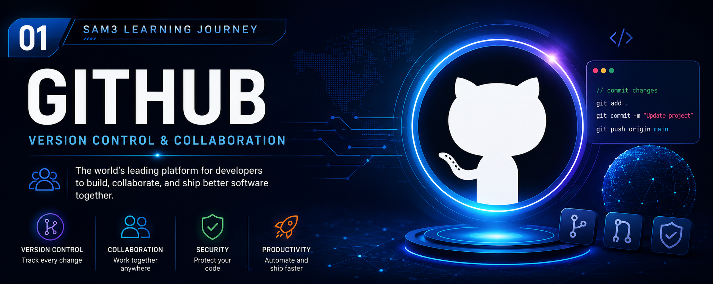

<p align="center">
  
</p>

<h1 align="center">🐙 GitHub</h1>

<p align="center">
  <strong>The Complete Beginner's Guide to GitHub</strong><br>
  Version Control • Collaboration • Open Source • Portfolio Development
</p>

---

# 📚 Table of Contents

- [What is GitHub?](#-what-is-github)
- [History of GitHub](#-history-of-github)
- [Why GitHub Was Created](#-why-github-was-created)
- [How GitHub Works](#-how-github-works)
- [Git vs GitHub](#-git-vs-github)
- [Repositories](#-repositories)
- [Branches](#-branches)
- [Commits](#-commits)
- [Pull Requests](#-pull-requests)
- [Issues](#-issues)
- [GitHub Actions](#-github-actions)
- [Forks](#-forks)
- [GitHub Pages](#-github-pages)
- [Markdown](#-markdown)
- [Open Source](#-open-source)
- [Why GitHub Matters for SAM3](#-why-github-matters-for-sam3)
- [Best Practices](#-best-practices)
- [Summary](#-summary)

---
# 🐙 GitHub

> **The Complete Beginner's Guide to GitHub**
>
> Learn what GitHub is, how it works, why it has become the industry standard for software development, and how it will be used throughout the **SAM3 Learning Journey**.

---

# ✨ Overview

GitHub is the world's leading platform for software development and collaboration. Built on top of **Git**, it allows developers to store source code, track changes, collaborate with teams, manage projects, and publish documentation from anywhere in the world.

Whether you are building a personal project, contributing to open-source software, or working within a multinational company, GitHub provides the tools necessary to organize development efficiently and professionally.

Today, GitHub hosts hundreds of millions of repositories and is trusted by students, researchers, startups, universities, and many of the world's largest technology companies.

---

# 🐙 What is GitHub?

GitHub is a cloud-based development platform that uses **Git**, a distributed version control system, to help developers manage software projects.

Unlike traditional file storage services, GitHub records every change made to a project, allowing developers to return to previous versions, compare modifications, collaborate safely, and maintain a complete history of their work.

GitHub is not limited to software development. It is also widely used for:

- Technical documentation
- Artificial Intelligence projects
- Machine Learning research
- Computer Vision experiments
- Data Science notebooks
- Academic research
- Open-source collaboration
- Personal portfolios

For millions of developers, GitHub has become the central workspace for learning, building, and sharing technology.

---

## 🌍 Why GitHub Is Important

Modern software is rarely developed by a single person. Projects often involve dozens, hundreds, or even thousands of contributors working simultaneously.

GitHub solves this challenge by providing tools that allow teams to:

- Store projects securely in the cloud.
- Track every modification made to the code.
- Restore previous versions at any time.
- Collaborate safely without overwriting each other's work.
- Review changes before they become part of the project.
- Manage bugs, improvements, and new features.
- Automate testing and deployment.
- Publish documentation alongside the source code.
- Showcase projects as a professional portfolio.

Because of these capabilities, GitHub has become the industry standard for collaborative software development.

---

## 🚀 Core Features

| Feature | Purpose |
|---------|---------|
| 📁 Repositories | Store source code, documentation, datasets, and project files. |
| 🌿 Branches | Develop new features independently without affecting the main project. |
| 💾 Commits | Record every project modification with a permanent history. |
| 🔀 Pull Requests | Review, discuss, and merge code changes safely. |
| 🐞 Issues | Track bugs, tasks, ideas, and feature requests. |
| 🍴 Forks | Create personal copies of repositories for experimentation or contribution. |
| ⭐ Stars | Bookmark repositories and show community appreciation. |
| 🤖 GitHub Actions | Automate testing, building, and deployment workflows. |
| 🌐 GitHub Pages | Host static websites directly from a repository. |
| 📝 Markdown | Write clean and professional technical documentation. |

---

## 👨‍💻 Who Uses GitHub?

GitHub is used by professionals and organizations across virtually every technology field.

Common users include:

- Software Engineers
- Artificial Intelligence Engineers
- Machine Learning Engineers
- Computer Vision Engineers
- Data Scientists
- Cybersecurity Specialists
- DevOps Engineers
- Researchers
- Universities
- Government organizations
- Technology companies
- Open-source communities
- Students learning programming

Regardless of project size, GitHub provides a reliable platform for organizing, documenting, and maintaining software professionally.

---

## 🎓 GitHub in the SAM3 Learning Journey

Throughout this repository, GitHub will serve as the central platform for documenting every stage of the learning process.

This repository will include:

- Installation guides
- Development environment configuration
- Google Colab notebooks
- Python projects
- AI experiments
- Computer Vision projects
- Session notes
- Technical documentation
- Learning progress
- Personal portfolio projects

By the end of the SAM3 course, this repository will represent a complete technical portfolio demonstrating practical experience with GitHub, Python, Artificial Intelligence, Computer Vision, and Segment Anything Model 3 (SAM3).

---

---

# 📖 History of GitHub

GitHub was founded in **2008** by **Tom Preston-Werner**, **Chris Wanstrath**, **PJ Hyett**, and **Scott Chacon** with the vision of making software development more collaborative and accessible. At the time, Git was already recognized as a powerful version control system, but it lacked an intuitive platform where developers could easily share projects, review code, and work together.

The founders built GitHub on top of Git, combining its powerful version control capabilities with a user-friendly web interface. This innovation allowed developers to collaborate more effectively while maintaining complete control over their code and project history.

GitHub rapidly became the preferred platform for open-source software, attracting developers from around the world who wanted to contribute to projects, share knowledge, and build communities around software development.

In **June 2018**, Microsoft acquired GitHub for **7.5 billion USD**. Rather than changing its open-source philosophy, Microsoft continued investing heavily in the platform, introducing new tools, improving security, and expanding GitHub's capabilities for individuals, educational institutions, startups, and enterprise organizations.

Today, GitHub hosts hundreds of millions of repositories and serves as the world's largest software collaboration platform, supporting projects ranging from personal portfolios to enterprise applications used by millions of users.

---

## 📅 GitHub Timeline

| Year | Event |
|------|-------|
| **2005** | Git was created by **Linus Torvalds** to manage Linux kernel development. |
| **2008** | GitHub officially launched. |
| **2010** | GitHub became one of the fastest-growing software collaboration platforms. |
| **2013** | GitHub reached more than 3 million users. |
| **2018** | Microsoft acquired GitHub for approximately **7.5 billion USD**. |
| **2021** | GitHub introduced **GitHub Copilot**, bringing Artificial Intelligence into software development. |
| **Today** | GitHub is the world's leading platform for version control, collaboration, documentation, and open-source software. |

---

# 🎯 Why GitHub Was Created

Although Git was an excellent version control system, it primarily focused on tracking changes to source code. It did not provide developers with an easy way to collaborate online, review code, organize projects, or manage software development workflows through a centralized platform.

GitHub was created to bridge this gap by combining Git with collaboration tools designed specifically for modern software development.

Its primary objectives were to:

- Simplify collaboration between developers.
- Provide cloud-based repository hosting.
- Make version control accessible to everyone.
- Encourage open-source development.
- Improve project organization.
- Enable distributed software teams to work efficiently.
- Keep documentation alongside the source code.
- Build a global community of developers.

GitHub transformed software development from an isolated activity into a collaborative process where developers could contribute, review, discuss, and improve software together regardless of their physical location.

---

## 🚧 Challenges Before GitHub

Before GitHub became available, developers commonly experienced problems such as:

- Sharing source code manually.
- Maintaining multiple project versions.
- Limited collaboration tools.
- Difficult code reviews.
- Poor documentation management.
- Complicated contribution processes for open-source software.
- Limited visibility into project history.
- Lack of centralized project management.

These limitations often slowed software development and increased the risk of conflicts between developers.

---

## ✅ Problems Solved by GitHub

GitHub introduced an integrated platform that solved many of these challenges by providing:

- Cloud-hosted repositories.
- Complete version history.
- Secure collaboration.
- Pull Requests for code review.
- Issue tracking.
- Project documentation.
- Team management.
- Open-source collaboration.
- Workflow automation.
- Continuous Integration and Continuous Deployment (CI/CD).

These features made GitHub the preferred platform for collaborative software engineering.

---

# ⚙️ How GitHub Works

GitHub is built on top of **Git**, a distributed version control system. Every project stored on GitHub is organized inside a **repository**, which contains the source code, documentation, images, datasets, configuration files, and every other resource related to the project.

Developers first create or clone a repository to their local computer. They make changes locally, record those changes using **commits**, and then synchronize them with GitHub.

A simplified workflow looks like this:

```text
Create Repository
        │
        ▼
Clone Repository
        │
        ▼
Edit Files
        │
        ▼
Commit Changes
        │
        ▼
Push Changes
        │
        ▼
GitHub Repository
        │
        ▼
Pull Request (if collaborating)
        │
        ▼
Review & Merge
```

Every commit creates a permanent snapshot of the project, allowing developers to restore previous versions whenever necessary.

Branches allow multiple developers to work on different features simultaneously without affecting the main project. Once a feature is completed, it can be reviewed through a Pull Request before being merged into the main branch.

This workflow ensures that software development remains organized, traceable, and collaborative, even for projects involving hundreds or thousands of contributors.

---

## 🔄 Typical GitHub Workflow

A standard GitHub development workflow consists of the following steps:

1. Create or clone a repository.
2. Create a new branch for your work.
3. Modify the project files.
4. Save your work using commits.
5. Push your changes to GitHub.
6. Open a Pull Request.
7. Review the proposed changes.
8. Merge the Pull Request into the main branch.
9. Continue improving the project.

This workflow is used by companies, universities, and open-source communities around the world because it provides a structured and reliable way to manage software projects.

---
---

# ⚖️ Git vs GitHub

Although the terms **Git** and **GitHub** are often used together, they are not the same technology. Understanding the difference between them is one of the most important concepts for every software developer.

**Git** is a distributed version control system that runs on your local computer. It tracks changes made to files, records project history, and allows developers to move between different versions of a project.

**GitHub**, on the other hand, is a cloud-based platform built around Git. It provides repository hosting, collaboration tools, project management features, documentation, automation, and code review capabilities.

In simple terms:

- **Git** manages your project's history.
- **GitHub** allows you to share, collaborate, and manage Git repositories online.

---

## 📊 Git vs GitHub Comparison

| Git | GitHub |
|------|---------|
| Distributed Version Control System | Cloud-based collaboration platform |
| Installed locally on your computer | Accessed through a web browser or desktop application |
| Tracks project history | Hosts Git repositories online |
| Works without Internet access | Requires Internet for synchronization |
| Developed by Linus Torvalds | Founded by GitHub Inc., now owned by Microsoft |
| Focuses on version control | Focuses on collaboration and project management |
| Command-line based (primarily) | Graphical web interface with collaboration tools |

---

## 💡 Think of It This Way

Imagine writing a book.

**Git** is like keeping every draft you have ever written.

**GitHub** is like storing that book in an online library where editors, reviewers, and other authors can collaborate with you.

Git keeps your history.

GitHub connects people.

---

# 📁 Repositories

A **repository**, often called a **repo**, is the fundamental building block of GitHub.

A repository is a storage location that contains everything related to a project.

It may include:

- Source code
- Documentation
- Images
- Videos
- Configuration files
- Datasets
- AI models
- Jupyter notebooks
- Project history
- README files
- License files

Every GitHub project exists inside its own repository.

For example, this course is organized inside the repository:

```
SAM3-Learning-Journey
```

Everything you create during the course will be stored inside this repository.

---

## 📦 Repository Structure Example

```text
SAM3-Learning-Journey
│
├── README.md
├── 01-setup
├── 02-docs
├── 03-notebooks
├── 04-examples
├── 05-projects
├── 06-resources
├── 07-screenshots
├── 08-course-notes
└── 09-assets
```

This structure keeps projects organized and easy to navigate.

---

## 🔒 Repository Visibility

GitHub repositories can have different visibility levels.

### Public Repository

Anyone can view the repository.

Ideal for:

- Open-source software
- Portfolios
- Learning projects
- Documentation

---

### Private Repository

Only invited users can access the repository.

Ideal for:

- Company projects
- Personal work
- Research
- Confidential software

---

# 🌿 Branches

A **branch** is an independent line of development inside a repository.

Instead of modifying the main project directly, developers create branches to develop new features, fix bugs, or experiment safely.

Branches allow multiple developers to work simultaneously without interfering with each other's work.

---

## Example

```
main
 │
 ├───────────────┐
 │               │
 ▼               ▼
feature-login   feature-dashboard
```

Both branches can be developed independently.

When completed, they can be merged back into the **main** branch.

---

## Why Branches Matter

Branches help developers:

- Experiment safely.
- Develop features independently.
- Fix bugs without affecting production.
- Collaborate efficiently.
- Reduce development conflicts.

Without branches, large software projects would quickly become difficult to manage.

---

# 💾 Commits

A **commit** is a permanent snapshot of your project at a specific moment in time.

Every commit records:

- What changed.
- Who made the change.
- When it was made.
- A descriptive message explaining the update.

Think of a commit as saving a checkpoint in a video game.

If something goes wrong later, you can return to a previous checkpoint.

---

## Good Commit Messages

Examples:

```
Initial project structure

Add GitHub documentation

Fix README formatting

Upload course banner

Implement login page

Update Python dependencies
```

Avoid messages like:

```
update

test

stuff

123

aaaa
```

A good commit message clearly describes what changed.

---

## Why Commits Are Important

Commits allow developers to:

- Restore previous versions.
- Track project history.
- Understand project evolution.
- Collaborate effectively.
- Identify bugs.
- Review changes.

Every professional software project relies on meaningful commit history.

---

## 📌 Key Concepts Learned

After completing this section, you should understand:

- The difference between Git and GitHub.
- What a repository is.
- Why repositories organize projects.
- What branches are used for.
- Why branches improve collaboration.
- What commits are.
- Why commit history is essential for software development.

---
---

# 🔀 Pull Requests

A **Pull Request (PR)** is one of GitHub's most powerful collaboration features. It allows developers to propose changes to a repository before those changes become part of the main project.

Instead of modifying the **main** branch directly, developers create a separate branch, make their changes, and then open a Pull Request. Other team members can review the code, suggest improvements, request modifications, or approve the changes before they are merged.

This review process helps maintain code quality and reduces the risk of introducing bugs into the project.

---

## 🚀 Pull Request Workflow

A typical Pull Request workflow looks like this:

```text
Create Branch
      │
      ▼
Develop Feature
      │
      ▼
Commit Changes
      │
      ▼
Push Branch
      │
      ▼
Open Pull Request
      │
      ▼
Code Review
      │
      ▼
Approve Changes
      │
      ▼
Merge into Main
```

---

## 📋 Why Pull Requests Matter

Pull Requests provide many benefits:

- Improve code quality.
- Encourage collaboration.
- Enable code reviews.
- Prevent accidental mistakes.
- Keep project history organized.
- Allow discussions before merging code.
- Reduce bugs in production.

For large software projects, Pull Requests are an essential part of the development workflow.

---

# 🐞 Issues

An **Issue** is a task management feature built into GitHub. Issues allow developers to report bugs, request new features, ask questions, or plan future work.

Instead of discussing tasks through emails or messages, development teams use Issues to keep everything organized inside the repository.

---

## Common Uses for Issues

Developers use Issues to:

- Report software bugs.
- Suggest improvements.
- Request new features.
- Track project progress.
- Assign work to team members.
- Document technical discussions.

Each Issue can contain:

- A title
- A detailed description
- Labels
- Assignees
- Milestones
- Comments
- References to Pull Requests

---

## Example Issue

```text
Title:
Improve GitHub Documentation

Description:
Expand the GitHub chapter by adding diagrams,
real-world examples, and screenshots.

Status:
Open
```

---

## Benefits of Issues

Issues help teams:

- Stay organized.
- Prioritize work.
- Track project progress.
- Improve communication.
- Maintain a history of discussions.

---

# 🤖 GitHub Actions

**GitHub Actions** is GitHub's built-in automation platform.

It allows developers to automate repetitive tasks such as:

- Running tests
- Building software
- Deploying applications
- Checking code quality
- Publishing documentation
- Sending notifications

Instead of performing these tasks manually, GitHub executes them automatically whenever a specific event occurs.

---

## Example Workflow

```text
Developer Pushes Code
          │
          ▼
GitHub Action Starts
          │
          ▼
Run Tests
          │
          ▼
Build Project
          │
          ▼
Deploy Application
```

---

## Advantages of GitHub Actions

GitHub Actions helps developers:

- Save time.
- Reduce human error.
- Improve software quality.
- Automate repetitive tasks.
- Deliver software faster.

Many modern software companies rely on GitHub Actions as part of their CI/CD (Continuous Integration and Continuous Deployment) workflow.

---

# 🍴 Forks

A **Fork** is a personal copy of someone else's GitHub repository.

Forking allows developers to experiment with projects, make improvements, or contribute to open-source software without affecting the original repository.

Once changes are complete, developers can submit a Pull Request to propose that the original project include their improvements.

---

## Fork Workflow

```text
Original Repository
         │
         ▼
Fork Repository
         │
         ▼
Modify Your Copy
         │
         ▼
Commit Changes
         │
         ▼
Open Pull Request
         │
         ▼
Original Repository Reviews Changes
```

---

## Why Forks Are Important

Forks allow developers to:

- Learn from existing projects.
- Experiment safely.
- Build on open-source software.
- Contribute improvements.
- Practice collaboration.

Without Forks, contributing to public repositories would be much more difficult.

---

# 🌟 Collaboration Features Summary

| Feature | Purpose |
|---------|---------|
| 🔀 Pull Requests | Review and merge code changes safely. |
| 🐞 Issues | Track bugs, tasks, and feature requests. |
| 🤖 GitHub Actions | Automate testing, building, and deployment. |
| 🍴 Forks | Create personal copies of repositories for contribution and experimentation. |

---

## 📌 Key Concepts Learned

After completing this section, you should understand:

- What Pull Requests are.
- How code reviews improve software quality.
- What GitHub Issues are used for.
- How GitHub Actions automate development workflows.
- Why Forks are essential for open-source collaboration.
- How modern software teams collaborate using GitHub.

---
---

# 🌐 GitHub Pages

GitHub Pages is a free web hosting service provided by GitHub that allows developers to publish static websites directly from a GitHub repository.

It is commonly used to host:

- Personal portfolios
- Technical documentation
- Project websites
- Course materials
- Blogs
- Landing pages
- Open-source project documentation

One of its greatest advantages is that no web server configuration is required. Once enabled, GitHub automatically publishes the selected branch as a website.

---

## 🚀 How GitHub Pages Works

The publishing process is simple:

```text
Create Repository
        │
        ▼
Add HTML / CSS / JavaScript Files
        │
        ▼
Push Repository to GitHub
        │
        ▼
Enable GitHub Pages
        │
        ▼
Website Published
```

Every time you push changes to the selected branch, GitHub automatically updates the website.

---

## 🌟 Benefits of GitHub Pages

GitHub Pages allows developers to:

- Host websites for free.
- Showcase personal portfolios.
- Publish project documentation.
- Create course websites.
- Share technical tutorials.
- Demonstrate web development skills.

For students, GitHub Pages is an excellent way to create a professional online portfolio.

---

# 📝 Markdown

Markdown is a lightweight markup language used to format plain text into professional documentation.

Almost every README file on GitHub is written using Markdown because it is simple to learn, easy to read, and supported by GitHub.

Markdown allows developers to create:

- Headings
- Lists
- Tables
- Images
- Hyperlinks
- Code blocks
- Quotes
- Checklists

without writing HTML.

---

## Example Markdown

```markdown
# Main Title

## Subtitle

**Bold Text**

*Italic Text*

- Item 1
- Item 2
- Item 3

[Visit GitHub](https://github.com)

```python
print("Hello GitHub!")
```
```

---

## Why Markdown Is Important

Professional documentation is just as important as writing good code.

A well-written README helps users understand:

- What the project does.
- How to install it.
- How to use it.
- How to contribute.
- Who created it.

For this reason, Markdown has become the standard documentation language on GitHub.

---

# 🌍 Open Source

Open-source software is software whose source code is publicly available for anyone to view, study, modify, and improve.

Instead of being developed by a single company behind closed doors, open-source projects are often maintained by communities of developers working together.

GitHub has become the world's largest open-source collaboration platform.

Thousands of projects receive contributions every day from developers around the world.

---

## Advantages of Open Source

Open-source software encourages:

- Collaboration
- Innovation
- Transparency
- Learning
- Community support
- Faster development
- Higher software quality

Many technologies used every day are open source.

Examples include:

- Linux
- Python
- Git
- VS Code
- TensorFlow
- PyTorch
- Kubernetes

---

## Why Developers Contribute

Developers contribute to open-source projects to:

- Learn from experienced engineers.
- Improve programming skills.
- Gain real-world experience.
- Build professional portfolios.
- Help the community.
- Fix bugs.
- Add new features.
- Network with other developers.

Open-source contributions are highly valued by employers because they demonstrate practical experience and collaboration skills.

---

# 🎓 Why GitHub Matters for SAM3

Throughout the **SAM3 Learning Journey**, GitHub will serve as the foundation of the entire course.

Every notebook, document, screenshot, dataset, and project created during this training will be organized inside this repository.

GitHub will be used to:

- Document installation procedures.
- Organize learning materials.
- Store Google Colab notebooks.
- Publish Python code.
- Track project progress.
- Save Computer Vision experiments.
- Build AI projects.
- Maintain professional documentation.
- Create a long-term technical portfolio.

By maintaining this repository throughout the course, you will not only learn how to use GitHub but also develop a portfolio that demonstrates your growth in Artificial Intelligence, Computer Vision, Python development, and software engineering.

Rather than simply completing assignments, this repository will become a permanent record of your learning journey and a valuable resource you can continue expanding long after the course has ended.

---

## 📌 Key Concepts Learned

After completing this section, you should understand:

- What GitHub Pages is.
- How Markdown is used for technical documentation.
- What open-source software is.
- Why developers contribute to open-source projects.
- Why GitHub is an essential tool throughout the SAM3 Learning Journey.

---
---

# ✅ Best Practices

Following good GitHub practices helps you build repositories that are organized, professional, and easy for others to understand. Whether you are working alone or with a team, these habits will improve the quality of your projects.

## 📌 Organize Your Repository

A well-structured repository is easier to navigate and maintain.

Recommendations:

- Use meaningful folder names.
- Keep related files together.
- Separate documentation from source code.
- Store images and assets in dedicated folders.
- Maintain a consistent folder structure.

Example:

```text
Project
│
├── README.md
├── docs
├── src
├── assets
├── notebooks
└── examples
```

---

## 📝 Write Clear Documentation

Every repository should include a professional **README.md**.

A good README explains:

- What the project is.
- Why it exists.
- How to install it.
- How to use it.
- Technologies used.
- Project structure.
- Author information.

Good documentation saves time and helps others understand your work quickly.

---

## 💾 Write Meaningful Commit Messages

Avoid vague commit messages such as:

```
update

fix

changes

test
```

Instead, write descriptive messages.

Good examples:

```
Create project structure

Add GitHub documentation

Fix README formatting

Upload course banners

Implement login interface

Update installation guide
```

A clear commit history makes projects much easier to understand.

---

## 🌿 Use Branches

Avoid working directly on the **main** branch.

Instead:

- Create a feature branch.
- Develop your changes.
- Test your work.
- Open a Pull Request.
- Merge only after review.

This workflow reduces mistakes and keeps projects stable.

---

## 🤝 Collaborate Professionally

When contributing to projects:

- Respect coding standards.
- Review Pull Requests carefully.
- Keep discussions constructive.
- Document major changes.
- Report bugs clearly.
- Write useful Issue descriptions.

Professional collaboration is one of the most valuable software engineering skills.

---

## 🚀 Keep Learning

GitHub is continuously evolving.

Explore features such as:

- GitHub Actions
- GitHub Pages
- GitHub Projects
- Discussions
- Codespaces
- Copilot
- Security Scanning

Learning these tools will significantly improve your development workflow.

---

# 📖 Summary

GitHub has transformed the way software is developed around the world.

Throughout this chapter, you learned:

- What GitHub is.
- The history of GitHub.
- Why GitHub was created.
- How GitHub works.
- The difference between Git and GitHub.
- What repositories are.
- How branches improve collaboration.
- Why commits are important.
- How Pull Requests work.
- How Issues organize development.
- What GitHub Actions automate.
- Why Forks are essential for open-source collaboration.
- How GitHub Pages hosts websites.
- Why Markdown is the standard documentation language.
- The importance of open-source software.
- How GitHub supports the SAM3 Learning Journey.
- Professional GitHub best practices.

By mastering these concepts, you have built a strong foundation for modern software development. GitHub is not only a platform for storing code—it is an essential tool for collaboration, documentation, project management, and professional growth.

As you continue through the **SAM3 Learning Journey**, every notebook, project, experiment, and piece of documentation you create will strengthen your GitHub portfolio and demonstrate your skills as an Artificial Intelligence and Computer Vision engineer.

---

# 📚 References

- GitHub. *GitHub Documentation*. https://docs.github.com/
- Git. *Official Git Documentation*. https://git-scm.com/doc
- GitHub Skills. *Interactive GitHub Courses*. https://skills.github.com/
- Chacon, S., & Straub, B. *Pro Git* (2nd Edition). Apress.
- Microsoft. *GitHub Features and Documentation*. https://github.com/features

---

# 👤 Author

## Peyman Miyandashti

**Information Technology Engineering & Digital Innovation Student**  
**Universidad Politécnica de Baja California (UPBC)**

📍 **Mexicali, Baja California, Mexico**

🌍 **Languages:** English • Spanish • Farsi (Persian) • Arabic • Azerbaijani • Turkish • Dari (Afghani)

💻 **Specializations**

- Artificial Intelligence (AI)
- Computer Vision
- Machine Learning
- Deep Learning
- Python Development
- Software Engineering
- Cybersecurity
- Data Science

🎯 **Current Focus**

- Segment Anything Model 3 (SAM3)
- Computer Vision
- Artificial Intelligence
- Python
- Google Colab
- Hugging Face
- Roboflow

🔗 **Connect with Me**

- GitHub: https://github.com/Peyman-mxli
- LinkedIn: https://www.linkedin.com/in/peyman-miyandashti-1614b81ba/

---

> **"Learning never stops. Every commit is another step toward becoming a better engineer."**

