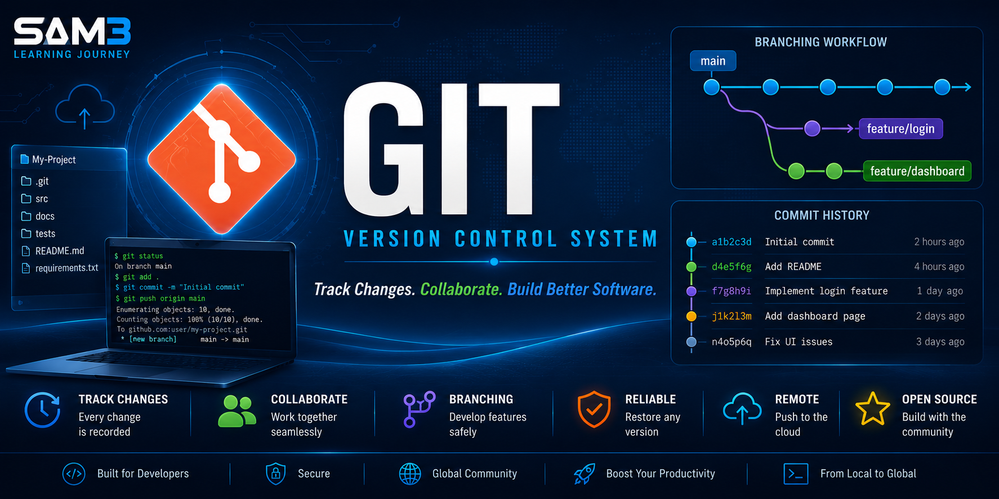

<p align="center">
  
</p>

# 📚 Table of Contents

- [📖 Overview](#-overview)
- [🔧 What is Git?](#-what-is-git)
- [🎯 Why Git Was Created](#-why-git-was-created)
- [⚙️ How Git Works](#️-how-git-works)
- [📂 Version Control](#-version-control)
- [💾 Working Directory](#-working-directory)
- [📦 Staging Area](#-staging-area)
- [🗂️ Local Repository](#️-local-repository)
- [☁️ Remote Repository](#️-remote-repository)
- [🔄 Git Workflow](#-git-workflow)
- [🌿 Branches](#-branches)
- [💾 Commits](#-commits)
- [🔀 Merge](#-merge)
- [📜 Git Commands](#-git-commands)
- [🧠 Best Practices](#-best-practices)
- [🎓 Git in the SAM3 Learning Journey](#-git-in-the-sam3-learning-journey)
- [📖 Summary](#-summary)
- [📚 References](#-references)
- [👤 Author](#-author)

---

# 🔧 Git

> **The Complete Beginner's Guide to Git**
>
> Learn what Git is, why it was created, how it works, and why it has become the world's most widely used version control system for software development, Artificial Intelligence, Machine Learning, and Computer Vision projects.

---

# 📖 Overview

Git is a **distributed version control system (DVCS)** designed to track changes in files and coordinate work among multiple developers.

Unlike traditional file management, Git records every modification made to a project, allowing developers to restore previous versions, compare changes, work safely on new features, and collaborate without overwriting each other's work.

Created to solve the challenges of modern software development, Git has become the foundation of nearly every professional development workflow.

Today, millions of developers, researchers, universities, startups, and technology companies rely on Git to manage everything from small personal projects to massive enterprise applications.

Git is not just a tool—it is an essential skill for anyone pursuing a career in software engineering, Artificial Intelligence, Machine Learning, Data Science, DevOps, or Computer Vision.

---

# 🔧 What is Git?

Git is an **open-source distributed version control system** created to manage the complete history of a project.

Every time a developer saves a meaningful change, Git records a snapshot of the project called a **commit**. Instead of simply replacing files, Git preserves the entire history of modifications, making it possible to review, compare, restore, or merge changes at any point in time.

Unlike cloud storage services such as Google Drive or OneDrive, Git is specifically designed for software development. It understands source code, tracks modifications efficiently, and enables multiple developers to work on the same project simultaneously without conflicts.

Git is completely free, cross-platform, and supported by nearly every modern programming language, framework, and development environment.

---

## 🌍 Why Git Is Important

Modern software projects are constantly evolving. New features are added, bugs are fixed, documentation is updated, and experiments are performed every day.

Without version control, developers would have to manually create copies of their projects, leading to confusion, duplicated files, and lost work.

Git solves these problems by allowing developers to:

- Track every change made to a project.
- Restore previous versions at any time.
- Experiment safely without affecting the main project.
- Work with multiple developers simultaneously.
- Merge changes efficiently.
- Detect and resolve conflicts.
- Maintain a complete development history.
- Improve collaboration across teams.
- Support continuous integration and deployment workflows.
- Build professional software using industry-standard practices.

Because of these capabilities, Git has become the foundation of modern software development.

---

## 🚀 Core Concepts

Git is built around several fundamental concepts that every developer should understand.

| Concept | Description |
|---------|-------------|
| 📂 Repository | Stores the complete history of a project. |
| 💾 Commit | Saves a snapshot of project changes. |
| 🌿 Branch | Creates an independent line of development. |
| 🔀 Merge | Combines changes from different branches. |
| 🏷️ Tag | Marks important project versions such as releases. |
| 📦 Staging Area | Prepares selected files before committing. |
| ☁️ Remote Repository | Synchronizes projects with services like GitHub. |
| 👥 Clone | Creates a local copy of an existing repository. |
| 🔄 Pull | Downloads the latest changes from a remote repository. |
| 🚀 Push | Uploads local commits to a remote repository. |

---

## 👨‍💻 Who Uses Git?

Git is used by professionals across virtually every area of technology.

Common users include:

- Software Engineers
- Artificial Intelligence Engineers
- Machine Learning Engineers
- Computer Vision Engineers
- Data Scientists
- Cybersecurity Specialists
- DevOps Engineers
- Cloud Engineers
- Researchers
- Universities
- Open-Source Communities
- Technology Companies
- Students Learning Programming

Whether you are building a personal project or contributing to software used by millions of people, Git provides the tools needed to manage projects efficiently and professionally.

---

## 🎓 Git in the SAM3 Learning Journey

Throughout this course, Git will be the primary tool used to manage every stage of development.

You will use Git to:

- Track your learning progress.
- Save changes safely.
- Maintain version history.
- Organize AI experiments.
- Manage Python projects.
- Synchronize work with GitHub.
- Collaborate with other developers.
- Build a professional portfolio.
- Apply industry-standard development workflows.

By mastering Git, you will develop one of the most valuable technical skills required in modern software engineering and Artificial Intelligence careers.

---

# 📖 History of Git

Git was created in **2005** by **Linus Torvalds**, the creator of the Linux operating system.

Before Git existed, the Linux kernel was developed using a proprietary version control system called **BitKeeper**. Although BitKeeper allowed developers to collaborate efficiently, its free license was revoked after a disagreement between its creators and members of the Linux community.

Faced with the challenge of managing one of the world's largest open-source projects, Linus Torvalds decided to create a completely new version control system.

His goal was ambitious:

- Extremely fast performance.
- Distributed architecture.
- Strong data integrity.
- Efficient branching and merging.
- Ability to support thousands of developers simultaneously.
- Complete project history.
- Open-source and free for everyone.

Remarkably, the first version of Git was developed in only a few days. It quickly became the version control system used by the Linux kernel and later spread throughout the software industry.

Today, Git is considered one of the most influential software development tools ever created.

---

# 👨‍💻 Linus Torvalds

Linus Benedict Torvalds is a Finnish-American software engineer best known as the creator of both the **Linux kernel** and **Git**.

His work has fundamentally changed modern computing. Linux powers millions of servers, cloud platforms, embedded systems, supercomputers, smartphones (through Android), and enterprise infrastructures worldwide.

When Git was released in 2005, it revolutionized software collaboration by introducing a distributed model that allowed every developer to maintain a complete copy of a project's history.

Today, nearly every major software company relies on Git, making Linus Torvalds one of the most influential figures in the history of computer science.

---

# 📜 Evolution of Version Control

Before Git, developers often managed projects manually by creating multiple copies of folders with names such as:

```text
Project
Project_Final
Project_Final_v2
Project_Final_v3
Project_Really_Final
Project_Last_Final
```

This approach quickly became confusing and unreliable.

As software projects grew, centralized version control systems such as:

- CVS (Concurrent Versions System)
- Subversion (SVN)
- Perforce

were introduced.

Although these systems improved collaboration, they depended on a central server. If the server became unavailable, development could be interrupted.

Git introduced a completely different approach.

Instead of depending on a central server, every developer receives a complete copy of the repository, including its full history.

This distributed architecture provides:

- Faster performance.
- Offline development.
- Better reliability.
- Easier collaboration.
- Safer backups.
- Powerful branching and merging.

Today, Git is the global standard for version control.

---

# ⚔️ Git vs Traditional Version Control

| Traditional Version Control | Git |
|----------------------------|-----|
| Centralized server | Distributed system |
| Single point of failure | Every developer has a complete repository |
| Slower operations | Extremely fast operations |
| Limited offline work | Full offline functionality |
| Basic branching | Powerful branching and merging |
| Difficult collaboration | Designed for collaboration |

Git's distributed design makes it more flexible, reliable, and scalable than previous version control systems.

---

# 🌍 Why Git Changed Software Development

Git transformed the way software is built around the world.

Before Git:

- Collaboration was slower.
- Branching was expensive.
- Merging changes was difficult.
- Developers depended on centralized servers.

After Git:

- Thousands of developers can work simultaneously.
- Branches can be created in seconds.
- Merging became significantly easier.
- Every developer has a complete project history.
- Development continues even without an internet connection.

These innovations enabled the rapid growth of open-source software and modern collaborative development.

---

# 🏢 Companies That Use Git

Git is the standard version control system used by organizations of every size.

Some of the world's leading companies using Git include:

- Microsoft
- Google
- Meta
- NVIDIA
- Amazon
- OpenAI
- Apple
- IBM
- Intel
- Oracle
- Cisco
- Netflix
- Spotify
- Red Hat

These organizations use Git to manage millions of lines of source code, coordinate global development teams, automate software delivery, and maintain reliable project histories.

---

# 💡 Why Learning Git Is Essential

Git is one of the first technical skills expected from software developers.

Whether you work in:

- Artificial Intelligence
- Machine Learning
- Computer Vision
- Cybersecurity
- Cloud Computing
- Web Development
- Mobile Development
- Data Science
- Robotics

you will almost certainly use Git every day.

Understanding Git not only improves your technical abilities but also prepares you to collaborate effectively in professional software engineering environments.

---

# ⚙️ How Git Works

Understanding Git becomes much easier once you realize that it follows a simple workflow. Every change you make to a project passes through several stages before it becomes a permanent part of the repository.

Instead of saving files directly, Git carefully records every meaningful modification, allowing you to restore previous versions, compare changes, collaborate with others, and maintain a complete history of your project.

The Git workflow consists of five main components:

1. Working Directory
2. Staging Area
3. Local Repository
4. Remote Repository
5. Collaboration with GitHub

Each component has a specific responsibility.

---

# 📂 Working Directory

The **Working Directory** is the folder on your computer where you actively create and modify files.

Whenever you:

- Create a new Python file
- Edit a README
- Add an image
- Delete old code
- Rename folders

you are working inside the Working Directory.

At this stage, Git knows that files have changed, but those changes are **not yet saved into Git's history**.

Think of the Working Directory as your workspace or desk where you prepare your work before officially saving it.

---

# 📦 Staging Area

The **Staging Area** (also called the **Index**) acts as a preparation area between your working files and the repository.

Instead of committing every change immediately, Git lets you choose exactly which files should become part of the next snapshot.

For example, imagine you modified:

- README.md
- main.py
- logo.png

You may decide to commit only:

- README.md
- main.py

while leaving **logo.png** for a later commit.

This flexibility is one of Git's greatest strengths because it allows developers to organize commits into logical units.

The command used to place files into the staging area is:

```bash
git add .
```

or

```bash
git add README.md
```

---

# 🗂️ Local Repository

The **Local Repository** is the Git database stored on your computer.

When you execute:

```bash
git commit -m "Add installation guide"
```

Git creates a permanent snapshot of every staged file.

A commit contains:

- The modified files
- The author
- Date and time
- Commit message
- Reference to the previous commit

Every commit becomes part of your project's complete history.

Unlike ordinary backups, Git stores changes very efficiently, allowing millions of commits without duplicating the entire project.

---

# ☁️ Remote Repository

A **Remote Repository** is a copy of your project stored on another computer or cloud service.

The most popular remote repository hosting service is:

- GitHub

Other services include:

- GitLab
- Bitbucket
- Azure DevOps

The remote repository allows:

- Team collaboration
- Cloud backup
- Continuous Integration
- Project sharing
- Open-source development

Your local repository and remote repository remain synchronized using:

```bash
git push
```

and

```bash
git pull
```

---

# 🔄 The Complete Git Workflow

Every Git project follows the same basic workflow.

```text
Create or Modify Files
          │
          ▼
Working Directory
          │
git add
          │
          ▼
Staging Area
          │
git commit
          │
          ▼
Local Repository
          │
git push
          │
          ▼
GitHub / Remote Repository
```

Whenever another developer uploads new changes, you retrieve them using:

```bash
git pull
```

This simple workflow allows developers around the world to collaborate safely without overwriting each other's work.

---

# 🏗️ Git Architecture

Git uses a distributed architecture.

Unlike centralized version control systems, every developer has a complete copy of the repository.

```text
                GitHub
                   │
        ┌──────────┴──────────┐
        │                     │
Developer A             Developer B
(Local Repository)      (Local Repository)
        │                     │
        └──────────┬──────────┘
                   │
           Complete Project History
```

Each developer can:

- Commit changes
- Create branches
- Restore previous versions
- Review history
- Work offline

Internet access is only required when synchronizing with the remote repository.

---

# 🔑 Key Concepts

The Git workflow revolves around four essential actions:

| Action | Description |
|---------|-------------|
| **git add** | Moves selected files into the Staging Area. |
| **git commit** | Saves a permanent snapshot locally. |
| **git push** | Uploads commits to GitHub. |
| **git pull** | Downloads changes from GitHub. |

Mastering these four commands allows you to perform the majority of everyday Git tasks.

---

# 💡 Why This Workflow Matters

The separation between the Working Directory, Staging Area, Local Repository, and Remote Repository provides tremendous flexibility.

It allows developers to:

- Save work safely.
- Review changes before committing.
- Organize commits logically.
- Experiment without risk.
- Collaborate efficiently.
- Recover previous versions.
- Synchronize projects across multiple computers.
- Maintain complete project history.

Understanding this workflow is the foundation for everything you will do with Git throughout the **SAM3 Learning Journey**.

---

# 📜 Git Commands

Git provides hundreds of commands, but in practice, most developers use a relatively small set every day. These commands allow you to create repositories, track changes, manage branches, collaborate with others, and synchronize projects with remote repositories such as GitHub.

This chapter introduces the most important Git commands that every beginner should master.

---

# 🚀 git init

The `git init` command creates a new Git repository in the current directory.

It generates a hidden **.git** folder where Git stores the complete history and configuration of the project.

```bash
git init
```

Example:

```bash
mkdir MyProject
cd MyProject
git init
```

Use this command when starting a brand-new project.

---

# 📥 git clone

The `git clone` command creates a complete copy of an existing repository on your computer.

```bash
git clone https://github.com/username/project.git
```

Example:

```bash
git clone https://github.com/Peyman-mxli/SAM3-Learning-Journey.git
```

After cloning, you have:

- Complete project history
- All branches
- All commits
- Remote connection already configured

---

# 🔍 git status

The `git status` command displays the current state of your repository.

```bash
git status
```

It shows:

- Modified files
- New files
- Deleted files
- Files waiting to be committed
- Current branch

This is one of the most frequently used Git commands.

---

# ➕ git add

Before Git saves changes, files must be placed into the **Staging Area**.

To stage every modified file:

```bash
git add .
```

To stage only one file:

```bash
git add README.md
```

You can stage as many files as you want before creating a commit.

---

# 💾 git commit

A commit creates a permanent snapshot of your project.

```bash
git commit -m "Add Git documentation"
```

A good commit message should clearly describe what changed.

Examples:

```text
Create project structure

Add Git chapter

Fix README formatting

Upload Git banner

Update installation guide
```

Avoid commit messages such as:

```text
update

test

fix

123
```

Meaningful commit messages make project history much easier to understand.

---

# ☁️ git push

The `git push` command uploads your local commits to the remote repository.

```bash
git push
```

If pushing a new branch for the first time:

```bash
git push -u origin main
```

or

```bash
git push -u origin feature-login
```

---

# 📥 git pull

The `git pull` command downloads the latest changes from the remote repository and merges them into your local project.

```bash
git pull
```

Developers usually run this command before beginning work to ensure they have the latest version of the project.

---

# 📡 git fetch

Unlike `git pull`, the `git fetch` command only downloads new information without modifying your current files.

```bash
git fetch
```

This allows developers to review incoming changes before merging them.

---

# 🌿 git branch

The `git branch` command manages project branches.

Display all branches:

```bash
git branch
```

Create a new branch:

```bash
git branch feature-login
```

Delete a branch:

```bash
git branch -d feature-login
```

Branches allow developers to work independently without affecting the main project.

---

# 🔄 git switch

Modern versions of Git recommend using `git switch` to change branches.

```bash
git switch main
```

Create and switch:

```bash
git switch -c feature-dashboard
```

This command is simpler than the older checkout command.

---

# 📂 git checkout

Older versions of Git use:

```bash
git checkout main
```

or

```bash
git checkout -b feature-profile
```

Although still widely supported, Git now recommends using `git switch` for changing branches.

---

# 🔀 git merge

The `git merge` command combines one branch into another.

Example:

```bash
git switch main
git merge feature-login
```

Git automatically combines changes whenever possible.

If conflicts occur, Git asks the developer to resolve them manually.

---

# 📜 git log

The `git log` command displays the complete commit history.

```bash
git log
```

Compact version:

```bash
git log --oneline
```

This command helps developers review previous work and understand project evolution.

---

# 🔍 git diff

The `git diff` command compares file changes.

```bash
git diff
```

Compare staged changes:

```bash
git diff --cached
```

This command is extremely useful before committing.

---

# ♻️ git restore

Sometimes developers modify files accidentally.

Git allows restoring files to their previous state.

```bash
git restore README.md
```

This command discards uncommitted changes.

Use it carefully.

---

# 📦 git stash

Sometimes you need to switch tasks without committing unfinished work.

Git allows temporary storage using:

```bash
git stash
```

Restore later:

```bash
git stash pop
```

This is especially useful when fixing urgent bugs while another feature is still in progress.

---

# 📊 Most Common Git Commands

| Command | Purpose |
|---------|---------|
| `git init` | Create a new repository |
| `git clone` | Download an existing repository |
| `git status` | Show repository status |
| `git add` | Stage files |
| `git commit` | Save changes permanently |
| `git push` | Upload commits to GitHub |
| `git pull` | Download latest changes |
| `git fetch` | Download updates without merging |
| `git branch` | Manage branches |
| `git switch` | Change branches |
| `git merge` | Merge branches |
| `git log` | View commit history |
| `git diff` | Compare changes |
| `git restore` | Undo local modifications |
| `git stash` | Temporarily save unfinished work |

---

# 💡 Tips for Beginners

When working with Git, follow this simple workflow:

1. Modify your files.
2. Run `git status`.
3. Stage your files using `git add`.
4. Create a commit with `git commit`.
5. Upload your changes using `git push`.

This workflow becomes second nature after a little practice and forms the foundation of professional software development.

---
---

# 🌳 Branching Strategy

One of Git's greatest strengths is its powerful branching system.

A **branch** is an independent line of development that allows developers to work on new features, fix bugs, or experiment without affecting the main project.

Instead of modifying the main branch directly, developers create feature branches where they can safely make changes.

Once the work is completed and reviewed, the branch is merged back into the main project.

This approach reduces conflicts, improves collaboration, and keeps the primary codebase stable.

---

## 🌿 Typical Branch Structure

```text
                 main
                  │
      ┌───────────┼───────────┐
      │           │           │
      ▼           ▼           ▼
 feature-login feature-api feature-ui
      │           │           │
      └───────────┼───────────┘
                  ▼
                Merge
                  │
                  ▼
                 main
```

Each feature can be developed independently without interrupting the work of other developers.

---

## 📌 Common Branch Types

Professional software projects commonly use several branch types.

| Branch | Purpose |
|---------|---------|
| **main** | Stable production-ready code |
| **develop** | Integration branch for ongoing development |
| **feature/** | Development of new functionality |
| **bugfix/** | Fix software bugs |
| **hotfix/** | Emergency fixes for production |
| **release/** | Prepare a new software release |

Large organizations may have dozens or even hundreds of active branches at the same time.

---

# ⚔️ Merge vs Rebase

When combining branches, Git provides two common strategies:

- Merge
- Rebase

Although both combine changes, they work differently.

---

## 🔀 Merge

Merge preserves the complete project history.

Example:

```bash
git switch main
git merge feature-login
```

Advantages:

- Safe
- Preserves history
- Easy to understand
- Recommended for beginners

---

## 🔄 Rebase

Rebase rewrites commit history by placing one branch on top of another.

Example:

```bash
git switch feature-login
git rebase main
```

Advantages:

- Cleaner history
- Linear commit timeline
- Preferred in many professional teams

Disadvantages:

- Can be confusing
- Should not be used on shared branches without understanding the consequences

---

## 📊 Merge vs Rebase Comparison

| Merge | Rebase |
|--------|---------|
| Preserves history | Rewrites history |
| Creates merge commits | Produces a linear history |
| Easier for beginners | Better for experienced developers |
| Safer in team environments | Requires more caution |

For beginners, **Merge** is usually the best choice.

---

# ✅ Git Best Practices

Professional developers follow a set of best practices to keep repositories clean, organized, and maintainable.

### 📝 Write Meaningful Commit Messages

Good:

```text
Add authentication module

Fix login validation

Update installation guide

Improve README formatting
```

Bad:

```text
update

test

fix

123
```

---

### 🌿 Create Small Branches

Instead of working on many features simultaneously, create one branch for one specific task.

Example:

```text
feature-login

feature-dashboard

feature-dark-mode
```

Small branches are easier to review and merge.

---

### 💾 Commit Frequently

Avoid waiting several days before committing your work.

Frequent commits:

- Reduce risk of losing work.
- Simplify debugging.
- Improve project history.
- Make collaboration easier.

---

### 📖 Keep Documentation Updated

A project is not complete without documentation.

Whenever you:

- Add a feature
- Remove functionality
- Change installation steps

Update the README or related documentation.

---

### ☁️ Push Regularly

Uploading commits to GitHub frequently provides:

- Cloud backup
- Easier collaboration
- Better synchronization
- Reduced risk of data loss

Never keep important work only on your local computer.

---

# ❌ Common Beginner Mistakes

New Git users often make similar mistakes.

Avoid these common problems:

### ❌ Working directly on `main`

Always create feature branches whenever possible.

---

### ❌ Huge commits

Instead of one massive commit containing dozens of unrelated changes, create several small commits.

---

### ❌ Poor commit messages

A commit history full of:

```text
update

fix

123

test
```

provides almost no useful information.

---

### ❌ Ignoring `.gitignore`

Never upload:

- Temporary files
- Build folders
- Cache files
- Virtual environments
- Passwords
- API keys

Use a proper `.gitignore` file.

---

### ❌ Forgetting to Pull

Before starting new work, always synchronize with the remote repository.

```bash
git pull
```

This reduces merge conflicts.

---

# 🤖 Git in Artificial Intelligence Projects

Git is used extensively in AI and Machine Learning projects.

Typical Git repositories contain:

- Python source code
- Jupyter notebooks
- Documentation
- Training scripts
- Configuration files
- Models
- Datasets (or dataset references)
- Experiment tracking
- Deployment scripts

Modern AI development is impossible without version control.

---

## Git in Computer Vision

Computer Vision projects commonly use Git to manage:

- Image preprocessing scripts
- Neural network architectures
- Dataset preparation
- Model evaluation
- Experiment history
- Inference pipelines

For projects like **Segment Anything Model 3 (SAM3)**, Git allows developers to safely experiment with different approaches while preserving previous versions.

---

# 🎓 Git in the SAM3 Learning Journey

Throughout this repository, Git will be used continuously.

You will use Git to:

- Track every chapter.
- Save notebooks.
- Store Python projects.
- Organize documentation.
- Version AI experiments.
- Publish updates to GitHub.
- Build a professional portfolio.

By the end of the course, you will not only understand Git—you will have used it extensively while documenting your complete learning journey.

This repository will become evidence of your technical growth and practical experience with modern development tools.

---

# 📌 Key Concepts Learned

After completing this chapter, you should understand:

- Why branching is important.
- The difference between Merge and Rebase.
- Professional Git workflows.
- Git best practices.
- Common beginner mistakes.
- Why Git is essential in AI and Computer Vision.
- How Git supports the SAM3 Learning Journey.

---
---

# 📖 Summary

Git is far more than a tool for saving code—it is the foundation of modern software development. Since its creation in **2005**, Git has transformed the way developers build, maintain, and collaborate on projects of every size.

Throughout this chapter, you explored Git from its origins to its practical applications in professional software engineering. You learned how Git records the complete history of a project, enables safe collaboration, simplifies version management, and supports efficient development workflows.

Today, Git is considered an essential skill for software engineers, data scientists, DevOps engineers, Artificial Intelligence researchers, Machine Learning engineers, and Computer Vision specialists.

Whether you are developing a personal application or contributing to a large enterprise system with thousands of developers, Git provides the tools necessary to organize, protect, and manage your work professionally.

---

# 🎯 Key Concepts Learned

After completing this chapter, you should understand:

- What Git is and why it was created.
- The history of Git and the contributions of Linus Torvalds.
- The difference between centralized and distributed version control systems.
- How Git records project history through commits.
- The roles of the Working Directory, Staging Area, Local Repository, and Remote Repository.
- The complete Git workflow.
- The purpose of the most important Git commands.
- How branching improves collaboration.
- The differences between Merge and Rebase.
- Professional Git best practices.
- Common mistakes made by beginners.
- Why Git is essential for Artificial Intelligence, Machine Learning, and Computer Vision projects.
- How Git supports the SAM3 Learning Journey.

By mastering these concepts, you have built a solid foundation that will support every future chapter in this repository.

---

# 🚀 What's Next?

Now that you understand Git, the next step is learning how to combine it with **GitHub** and modern development tools to build professional software projects.

In the next chapters of the **SAM3 Learning Journey**, you will learn how to:

- Configure Visual Studio Code for Python development.
- Create isolated Python environments.
- Work with Google Colab.
- Use Hugging Face models.
- Prepare datasets with Roboflow.
- Train and evaluate AI models.
- Develop Computer Vision applications using Segment Anything Model 3 (SAM3).

Each new chapter will build upon the Git skills you have developed here.

---

# 💡 Final Thoughts

Learning Git is one of the best investments you can make as a developer.

Programming languages, frameworks, and AI models will continue to evolve, but the ability to manage source code, collaborate effectively, and maintain a reliable project history will remain a fundamental skill throughout your career.

Every professional developer makes commits, creates branches, reviews changes, and collaborates through Git. Mastering these practices early will make you a more organized, productive, and confident engineer.

Remember that Git is not only about version control—it is about creating a structured, repeatable, and professional workflow that supports long-term software development.

---

# 📚 References

The following resources provide additional information for learning Git and version control.

- Git Official Documentation  
  https://git-scm.com/doc

- Pro Git (2nd Edition)  
  Scott Chacon & Ben Straub  
  https://git-scm.com/book/en/v2

- GitHub Documentation  
  https://docs.github.com/

- Atlassian Git Tutorials  
  https://www.atlassian.com/git

- GitHub Skills  
  https://skills.github.com/

- Visual Git Cheat Sheet  
  https://training.github.com/

---

# 👤 Author

## Peyman Miyandashti

**Information Technology Engineering & Digital Innovation Student**  
**Universidad Politécnica de Baja California (UPBC)**

📍 **Mexicali, Baja California, Mexico**

🌍 **Languages**

- English
- Spanish
- Farsi (Persian)
- Arabic
- Azerbaijani
- Turkish
- Dari (Afghani)

💻 **Specializations**

- Artificial Intelligence (AI)
- Computer Vision
- Machine Learning
- Deep Learning
- Python Development
- Software Engineering
- Cybersecurity
- Data Science

🎯 **Current Focus**

- Segment Anything Model 3 (SAM3)
- Computer Vision
- Artificial Intelligence
- Python
- Google Colab
- Hugging Face
- Roboflow

🔗 **Connect with Me**

- GitHub: https://github.com/Peyman-mxli
- LinkedIn: https://www.linkedin.com/in/peyman-miyandashti-1614b81ba/

---

> *"Every commit tells a story. Every branch represents an idea. Every repository is a step toward becoming a better engineer."*

---

<div align="center">

### ⭐ Thank you for reading this chapter!

If this guide helped you understand Git, consider exploring the next chapter of the **SAM3 Learning Journey** and continue building your professional AI portfolio.

**Happy Coding! 🚀**

</div>
