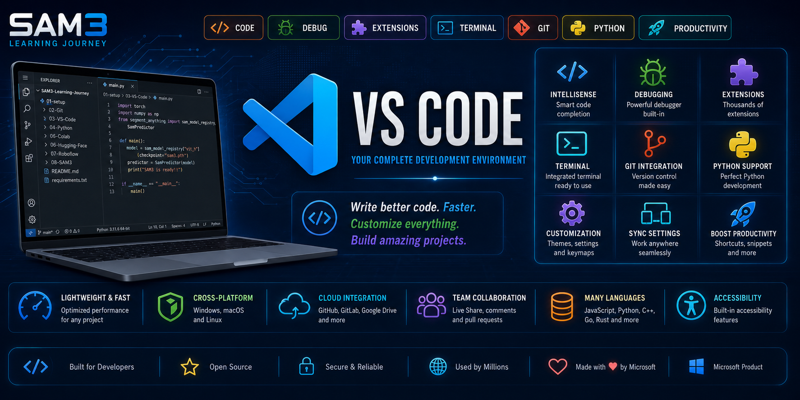

<p align="center">
  
</p>

# 📚 Table of Contents

- [📖 Overview](#-overview)
- [💙 What is Visual Studio Code?](#-what-is-visual-studio-code)
- [🎯 Why VS Code Was Created](#-why-vs-code-was-created)
- [⭐ Why VS Code Is Important](#-why-vs-code-is-important)
- [🚀 Core Features](#-core-features)
- [👨‍💻 Who Uses VS Code?](#-who-uses-vs-code)
- [🎓 VS Code in the SAM3 Learning Journey](#-vs-code-in-the-sam3-learning-journey)
- [📖 History of VS Code](#-history-of-vs-code)
- [⚖️ VS Code vs Visual Studio](#-vs-code-vs-visual-studio)
- [🖥️ Installation](#-installation)
- [🧭 User Interface](#-user-interface)
- [🧩 Extensions](#-extensions)
- [🐍 Python Development](#-python-development)
- [🐙 Git Integration](#-git-integration)
- [🤖 VS Code for Artificial Intelligence](#-vs-code-for-artificial-intelligence)
- [💡 Best Practices](#-best-practices)
- [📖 Summary](#-summary)
- [📚 References](#-references)
- [👤 Author](#-author)

---

# 💙 Visual Studio Code

> **The Complete Beginner's Guide to Visual Studio Code**
>
> Learn what Visual Studio Code is, why it has become the world's most popular source code editor, and how it will be used throughout the **SAM3 Learning Journey** to build Artificial Intelligence and Computer Vision projects.

---

# 📖 Overview

Visual Studio Code (VS Code) is a lightweight yet powerful source code editor developed by **Microsoft**. It combines speed, flexibility, and an extensive extension ecosystem, making it one of the most widely used development environments in the world.

Unlike traditional text editors, VS Code provides intelligent code completion, integrated debugging, Git support, an embedded terminal, extension management, and support for hundreds of programming languages—all within a modern and highly customizable interface.

Whether you are writing Python scripts, developing web applications, training AI models, or building Computer Vision systems, VS Code provides the tools needed to work efficiently and professionally.

Today, millions of developers, researchers, students, startups, and enterprise organizations rely on VS Code as their primary development environment.

---

# 💙 What is Visual Studio Code?

Visual Studio Code is a **free**, **open-source**, and **cross-platform** source code editor designed for modern software development.

It is available for:

- Windows
- macOS
- Linux

Unlike a traditional Integrated Development Environment (IDE), VS Code is lightweight by default. Developers can install only the extensions they need, allowing the editor to remain fast while supporting virtually any programming language or development workflow.

VS Code supports technologies including:

- Python
- JavaScript
- TypeScript
- C#
- C++
- Java
- Go
- Rust
- HTML
- CSS
- SQL
- Markdown
- Jupyter Notebooks
- Docker
- Kubernetes
- Git
- GitHub

This flexibility makes VS Code suitable for beginners as well as professional software engineers.

---

# 🎯 Why VS Code Was Created

Before VS Code, developers often had to choose between simple text editors with very few features or large Integrated Development Environments (IDEs) that consumed significant system resources.

Microsoft created Visual Studio Code to bridge this gap.

The primary goals were to:

- Provide a lightweight editor.
- Deliver professional development tools.
- Support multiple programming languages.
- Integrate Git directly into the editor.
- Allow extensive customization through extensions.
- Work consistently across Windows, macOS, and Linux.
- Offer a free and open-source development platform.

Since its release in 2015, VS Code has become one of the most successful developer tools ever created.

---

# ⭐ Why VS Code Is Important

Modern software development requires much more than writing code.

Developers also need to:

- Navigate large projects.
- Debug applications.
- Work with Git repositories.
- Execute terminal commands.
- Manage extensions.
- Connect to cloud services.
- Develop collaboratively.
- Write technical documentation.

VS Code brings all of these capabilities into a single application, reducing the need to switch between multiple tools and significantly improving productivity.

Because of its flexibility and performance, VS Code has become the preferred editor for many developers working in Artificial Intelligence, Machine Learning, Cloud Computing, Cybersecurity, Web Development, and Computer Vision.

---

# 🚀 Core Features

| Feature | Purpose |
|---------|---------|
| 💻 Intelligent Code Editor | Smart syntax highlighting and code completion. |
| 🐞 Integrated Debugger | Debug applications directly inside VS Code. |
| 🐙 Git Integration | Built-in version control with Git and GitHub. |
| 🖥️ Integrated Terminal | Run commands without leaving the editor. |
| 🧩 Extensions Marketplace | Install thousands of extensions. |
| 🐍 Python Support | First-class support for Python development. |
| 📓 Jupyter Notebooks | Open and run notebooks directly. |
| 🌐 Remote Development | Connect to SSH, WSL, and Docker environments. |
| 🎨 Themes & Icons | Customize the appearance of the editor. |
| ⚡ IntelliSense | Intelligent code completion and suggestions. |

---

## 👨‍💻 Who Uses VS Code?

Visual Studio Code is trusted by professionals across nearly every area of technology.

Common users include:

- Software Engineers
- Artificial Intelligence Engineers
- Machine Learning Engineers
- Computer Vision Engineers
- Web Developers
- Mobile Developers
- Cybersecurity Specialists
- Cloud Engineers
- DevOps Engineers
- Data Scientists
- University Students
- Researchers
- Open-Source Contributors

Its versatility allows it to adapt to projects ranging from simple scripts to enterprise-scale software systems.

---

## 🎓 VS Code in the SAM3 Learning Journey

Throughout the **SAM3 Learning Journey**, Visual Studio Code will serve as the primary development environment.

You will use VS Code to:

- Write Python code.
- Develop Computer Vision applications.
- Work with Git and GitHub.
- Create and edit Markdown documentation.
- Execute terminal commands.
- Manage project files.
- Install AI libraries.
- Develop Jupyter Notebooks.
- Debug Python applications.
- Build professional Artificial Intelligence projects.

By the end of this course, you will be comfortable using Visual Studio Code as a professional development environment for AI, Machine Learning, and Computer Vision projects.

---

# 📖 History of Visual Studio Code

Visual Studio Code was officially released by **Microsoft** on **April 29, 2015**, during the Build Developer Conference.

Unlike the traditional **Microsoft Visual Studio IDE**, Visual Studio Code was designed to be a lightweight, fast, and highly extensible source code editor that could run on multiple operating systems.

Initially, many developers were skeptical because Microsoft had historically focused on Windows-only development tools. However, Microsoft took a different approach with VS Code by making it:

- Free to download and use.
- Open-source under the MIT License.
- Cross-platform.
- Highly customizable through extensions.
- Integrated with Git and GitHub.

These decisions quickly attracted millions of developers from around the world.

Today, Visual Studio Code has become the most widely used source code editor in modern software development.

---

# 🏢 Microsoft and VS Code

Visual Studio Code is developed and maintained by **Microsoft** with contributions from thousands of developers in the open-source community.

Its source code is publicly available on GitHub, allowing developers to:

- Inspect the source code.
- Report bugs.
- Suggest improvements.
- Contribute new features.
- Develop community extensions.

Microsoft continuously releases monthly updates that improve performance, add new features, and enhance developer productivity.

Because of this active development cycle, VS Code remains one of the fastest evolving development tools available today.

---

# 🌍 Why VS Code Became the World's Most Popular Editor

Several factors contributed to the rapid success of Visual Studio Code.

## ⚡ Lightweight and Fast

Unlike many traditional Integrated Development Environments (IDEs), VS Code launches quickly and uses relatively little system memory.

This makes it suitable for both small laptops and powerful workstations.

---

## 🧩 Powerful Extension Marketplace

One of VS Code's greatest strengths is its extension ecosystem.

Developers can install extensions for virtually any technology, including:

- Python
- Jupyter
- Docker
- GitHub
- GitLens
- C++
- Java
- Rust
- Go
- Kubernetes
- Remote SSH
- AI Coding Assistants

Today, thousands of extensions are available through the Visual Studio Marketplace.

---

## 🌐 Cross-Platform Support

VS Code runs on:

- Windows
- macOS
- Linux

Developers can use the same editor across multiple operating systems without changing their workflow.

---

## 🐙 Built-in Git Integration

VS Code includes native Git support.

Developers can:

- View file changes.
- Stage files.
- Commit changes.
- Create branches.
- Resolve merge conflicts.
- Push and pull repositories.

Without leaving the editor.

---

## 🐍 Excellent Python Support

Python has become one of the world's most popular programming languages, especially in Artificial Intelligence.

VS Code provides outstanding support for Python through Microsoft's official Python extension, offering:

- IntelliSense
- Code formatting
- Debugging
- Jupyter Notebook integration
- Virtual environment management
- Linting
- Testing tools

This makes VS Code an excellent choice for AI development.

---

# ⚖️ Visual Studio Code vs Visual Studio

Although their names are similar, **Visual Studio** and **Visual Studio Code** are different products.

| Visual Studio Code | Visual Studio |
|--------------------|--------------|
| Lightweight editor | Full Integrated Development Environment (IDE) |
| Free | Community, Professional, and Enterprise editions |
| Cross-platform | Primarily Windows |
| Extension-based | Large built-in feature set |
| Excellent for Python, AI, Web Development | Excellent for C#, .NET, and Enterprise Development |
| Starts quickly | Heavier and uses more system resources |

For this course, **Visual Studio Code** is the recommended choice because it provides everything needed for Python, Git, Jupyter, and Artificial Intelligence development while remaining lightweight and easy to configure.

---

# 🏆 Advantages of Visual Studio Code

Visual Studio Code offers numerous advantages that have made it the preferred editor for millions of developers.

Key advantages include:

- Free and open-source.
- Fast startup time.
- Low memory usage.
- Cross-platform compatibility.
- Built-in Git support.
- Integrated terminal.
- Powerful debugger.
- Extensive extension marketplace.
- Excellent Python support.
- Markdown editing.
- Jupyter Notebook integration.
- Docker support.
- Remote development capabilities.
- Highly customizable interface.

These features make VS Code suitable for beginners while remaining powerful enough for enterprise software development.

---

# 📊 Popular Uses of VS Code

Visual Studio Code is commonly used for:

- Web Development
- Python Programming
- Artificial Intelligence
- Machine Learning
- Computer Vision
- Data Science
- Mobile Development
- Cloud Computing
- DevOps
- Cybersecurity
- Embedded Systems
- Technical Documentation

Whether writing a simple Python script or building enterprise-scale AI applications, VS Code provides the flexibility needed to support modern development workflows.

---

# 🖥️ Installing Visual Studio Code

Installing Visual Studio Code is straightforward and takes only a few minutes. Microsoft provides official installers for Windows, macOS, and Linux.

## 💻 System Requirements

VS Code is designed to run efficiently on most modern computers.

Minimum requirements:

| Operating System | Supported |
|------------------|-----------|
| Windows 10 / 11 | ✅ |
| macOS | ✅ |
| Linux | ✅ |

Recommended:

- 4 GB RAM or more
- Modern multi-core processor
- Stable Internet connection
- Administrator privileges for installation

---

## 📥 Downloading VS Code

Always download Visual Studio Code from Microsoft's official website:

https://code.visualstudio.com/

Choose the installer that matches your operating system.

---

## ⚙️ Installation Steps

Installation is simple:

1. Download the installer.
2. Run the installer.
3. Accept the license agreement.
4. Choose the installation folder.
5. Enable recommended options.
6. Click **Install**.
7. Launch Visual Studio Code.

The installation usually takes less than two minutes.

---

# 🧭 Exploring the User Interface

When VS Code opens for the first time, you will see a clean and modern interface.

The editor is divided into several important areas.

---

## 📂 Explorer

The **Explorer** is where your project files and folders are displayed.

From the Explorer you can:

- Create files
- Create folders
- Rename files
- Delete files
- Open projects
- Organize your repository

For most developers, the Explorer is the most frequently used panel.

---

## 🔍 Search

The **Search** panel allows you to search across your entire project.

You can quickly find:

- Variables
- Functions
- Classes
- File names
- Comments
- Text inside files

This is extremely useful in large projects containing hundreds or thousands of files.

---

## 🐙 Source Control

The **Source Control** panel provides built-in Git integration.

From this panel you can:

- View changed files.
- Stage changes.
- Create commits.
- Push to GitHub.
- Pull updates.
- Create branches.
- Resolve merge conflicts.

Most daily Git operations can be performed without opening the terminal.

---

## ▶️ Run & Debug

The **Run & Debug** panel allows you to execute and debug applications.

You can:

- Start programs.
- Pause execution.
- Inspect variables.
- Set breakpoints.
- Step through code.
- Analyze program behavior.

Debugging is one of the most powerful features available in VS Code.

---

## 🧩 Extensions

Extensions expand the functionality of Visual Studio Code.

Examples include:

- Python
- Jupyter
- GitLens
- Docker
- GitHub Pull Requests
- Pylance
- Black Formatter
- Markdown Preview
- Live Server
- Remote SSH

Thousands of extensions are available through the Visual Studio Marketplace.

---

## 🖥️ Integrated Terminal

One of VS Code's best features is its built-in terminal.

Instead of opening Command Prompt or PowerShell separately, you can execute commands directly inside the editor.

Typical commands include:

```bash
git status
git add .
git commit -m "Update project"
python app.py
pip install torch
```

The integrated terminal supports:

- PowerShell
- Command Prompt
- Git Bash
- Windows Terminal
- Linux Bash
- macOS Terminal

---

## ⚙️ Settings

VS Code is highly customizable.

Common settings include:

- Theme
- Font size
- Font family
- Auto Save
- Word Wrap
- Tab size
- File icons
- Terminal configuration
- Keyboard shortcuts

Settings can be changed through:

**File → Preferences → Settings**

or

**Ctrl + ,**

---

# 📊 Default Layout

A typical VS Code workspace looks like this:

```text
┌─────────────────────────────────────────────────────────────┐
│ Menu Bar                                                    │
├─────────────────────────────────────────────────────────────┤
│ Activity Bar │ Explorer │           Editor                  │
│              │          │                                   │
│              │          │                                   │
│              │          │                                   │
├─────────────────────────────────────────────────────────────┤
│ Integrated Terminal                                         │
└─────────────────────────────────────────────────────────────┘
```

Each section has a specific role in the development workflow.

---

# 💡 Why the Interface Matters

Professional developers spend many hours every day inside their code editor.

Learning the interface thoroughly allows you to:

- Work faster.
- Navigate projects efficiently.
- Reduce distractions.
- Debug applications more easily.
- Improve productivity.
- Develop professional workflows.

The more comfortable you become with the VS Code interface, the more efficient your development process will be.

---

# 🚀 Preparing for the Next Chapter

Now that you understand the VS Code interface, the next step is to transform it into a professional Python development environment.

In the next chapter, you will learn how to:

- Install essential extensions.
- Configure Python support.
- Enable IntelliSense.
- Set up debugging.
- Work with GitHub.
- Configure Jupyter notebooks.
- Customize VS Code for Artificial Intelligence development.

After completing that chapter, your editor will be fully prepared for the remainder of the **SAM3 Learning Journey**.

---

# 🧩 Essential Extensions

One of the biggest advantages of Visual Studio Code is its powerful extension ecosystem.

Extensions allow developers to customize VS Code for virtually any programming language, framework, or workflow. Instead of installing a large Integrated Development Environment (IDE), you can build your own development environment by adding only the tools you need.

The Visual Studio Marketplace contains thousands of extensions developed by Microsoft and the open-source community.

For the **SAM3 Learning Journey**, only a small set of carefully selected extensions will be be required.

---

# 🐍 Python Extension

The **Python** extension developed by Microsoft is the most important extension for Python development.

It provides professional features including:

- Syntax highlighting
- IntelliSense (code completion)
- Code navigation
- Debugging
- Testing
- Virtual Environment support
- Jupyter Notebook integration
- Automatic interpreter detection

Without this extension, VS Code cannot provide the full Python development experience.

---

## Features

The Python extension includes:

- Intelligent Auto Complete
- Function Documentation
- Error Detection
- Code Navigation
- Debugging Support
- Environment Selection
- Testing Framework Integration
- Notebook Support

This extension is required for every Python developer.

---

# ⚡ Pylance

Pylance is Microsoft's advanced language server for Python.

It provides:

- Fast IntelliSense
- Type Checking
- Code Suggestions
- Error Detection
- Auto Imports
- Better Performance

Pylance works together with the Python extension to provide a professional coding experience.

---

# 📓 Jupyter Extension

The **Jupyter** extension allows VS Code to open and execute Jupyter Notebook files directly inside the editor.

Supported notebook features include:

- Python Cells
- Markdown Cells
- Interactive Outputs
- Variable Explorer
- Kernel Management
- Notebook Debugging

Since many AI and Machine Learning projects are developed using notebooks, this extension is essential.

---

# 🐙 GitHub Pull Requests & Issues

This extension connects Visual Studio Code directly with GitHub.

Features include:

- View Pull Requests
- Review Code
- Create Issues
- Merge Pull Requests
- View Comments
- Manage Repositories

Developers can perform many GitHub tasks without opening a web browser.

---

# 📜 GitLens

GitLens greatly expands VS Code's built-in Git capabilities.

It allows you to:

- View file history
- Inspect previous commits
- Compare versions
- See who modified each line of code
- Navigate commit history

GitLens is one of the most popular Git extensions available.

---

# 🎨 Prettier

Prettier automatically formats source code according to consistent style rules.

Supported languages include:

- JavaScript
- TypeScript
- HTML
- CSS
- JSON
- Markdown
- YAML

Automatic formatting improves readability and maintains consistent coding standards.

---

# ⚫ Black Formatter

For Python development, **Black** is one of the most widely used code formatters.

Advantages include:

- Consistent formatting
- Improved readability
- Automatic indentation
- Standardized coding style
- Faster code reviews

Many professional Python projects require Black.

---

# 📝 Markdown All in One

This extension enhances Markdown editing inside Visual Studio Code.

Features include:

- Table of Contents generation
- Keyboard shortcuts
- Auto-completion
- List editing
- Header navigation
- Live Preview improvements

It is especially useful when writing professional README files like those in this repository.

---

# 🎨 Themes and Icons

Visual Studio Code allows complete interface customization.

Popular themes include:

- Dark+
- Light+
- One Dark Pro
- Dracula Official
- GitHub Dark
- Material Theme

Popular icon packs include:

- Material Icon Theme
- VSCode Icons
- Fluent Icons

Although themes do not affect functionality, they can improve readability and reduce eye strain.

---

# ⭐ Recommended Extensions for the SAM3 Course

The following extensions are recommended for this learning journey:

| Extension | Purpose |
|------------|---------|
| Python | Python development |
| Pylance | Intelligent code completion |
| Jupyter | Notebook support |
| GitLens | Advanced Git features |
| GitHub Pull Requests | GitHub integration |
| Black Formatter | Python code formatting |
| Markdown All in One | README writing |
| Material Icon Theme | Better file icons |
| Error Lens | Inline error visualization |
| Code Spell Checker | Documentation proofreading |

---

# 💡 Why Extensions Matter

Visual Studio Code starts as a lightweight editor, but extensions transform it into a professional development environment.

Instead of installing unnecessary features, developers can build an editor tailored to their specific needs.

For Artificial Intelligence and Computer Vision development, the extensions introduced in this chapter provide everything required to write code, manage projects, collaborate with GitHub, and document your work professionally.

By installing these extensions, your Visual Studio Code environment will be fully prepared for the remainder of the **SAM3 Learning Journey**.

---

# 🐍 Working with Python

Visual Studio Code provides one of the best development environments for Python programming.

After installing the **Python** and **Pylance** extensions, VS Code automatically detects Python interpreters, offers intelligent code completion, highlights syntax errors, and provides powerful debugging tools.

To begin developing in Python:

1. Open Visual Studio Code.
2. Open your project folder.
3. Create a new Python file (`.py`).
4. Select the correct Python interpreter.
5. Start writing code.

Example:

```python
print("Welcome to the SAM3 Learning Journey!")
```

VS Code immediately recognizes the file as Python and activates all Python-related features.

---

# ▶️ Running Python Programs

Running Python programs inside VS Code is simple.

There are several methods available.

### Method 1 — Run Button

Click the ▶ **Run Python File** button in the upper-right corner of the editor.

---

### Method 2 — Integrated Terminal

Open the terminal:

```text
Terminal → New Terminal
```

Then execute:

```bash
python app.py
```

or

```bash
python main.py
```

---

### Method 3 — Code Runner (Optional)

If the **Code Runner** extension is installed, you can execute Python scripts with a single click.

Although convenient for beginners, the official Python extension is recommended for professional development.

---

# 💻 Integrated Terminal

The integrated terminal allows developers to execute commands without leaving Visual Studio Code.

Common commands include:

```bash
python main.py
```

```bash
python --version
```

```bash
pip install numpy
```

```bash
pip install torch
```

```bash
git status
```

```bash
git add .
```

```bash
git commit -m "Update project"
```

Using the integrated terminal improves productivity by keeping development and command-line tools in one place.

---

# 🐞 Debugging Applications

Debugging is one of the most powerful features of Visual Studio Code.

Instead of inserting numerous `print()` statements, you can pause your program and inspect its execution step by step.

The debugger allows you to:

- Set breakpoints
- Pause execution
- Inspect variables
- Monitor function calls
- Evaluate expressions
- Step through code line by line

This makes it much easier to identify and resolve programming errors.

---

# 🌍 Working with Virtual Environments

Professional Python projects should always use **virtual environments**.

A virtual environment creates an isolated Python installation for each project, preventing dependency conflicts.

Create a virtual environment:

```bash
python -m venv .venv
```

Activate it (Windows):

```bash
.venv\Scripts\activate
```

Install packages:

```bash
pip install torch
```

```bash
pip install opencv-python
```

```bash
pip install matplotlib
```

VS Code automatically detects most virtual environments and prompts you to use them.

---

# 🐙 Git Integration

Visual Studio Code includes built-in Git support.

Without leaving the editor you can:

- Initialize repositories
- View modified files
- Stage changes
- Commit updates
- Create branches
- Push to GitHub
- Pull new changes
- Resolve merge conflicts

This integration eliminates the need for external Git clients in most situations.

---

# 🤖 Visual Studio Code for Artificial Intelligence

VS Code has become one of the preferred editors for Artificial Intelligence development.

It supports:

- Python
- Jupyter Notebooks
- PyTorch
- TensorFlow
- OpenCV
- Hugging Face
- ONNX
- CUDA
- Docker
- GitHub

With the appropriate extensions installed, VS Code provides everything needed to develop, train, test, and deploy AI applications.

---

# 👁️ VS Code for Computer Vision

Computer Vision projects often involve large datasets, image processing pipelines, deep learning models, and experiment tracking.

Visual Studio Code simplifies these tasks by providing:

- Intelligent Python editing
- Image processing support
- Notebook integration
- Git version control
- Debugging tools
- Terminal access
- Extension support

These capabilities make VS Code an excellent environment for Computer Vision research and development.

---

# 🎓 VS Code in the SAM3 Learning Journey

Throughout this repository, Visual Studio Code will be the primary development environment.

It will be used to:

- Write Python programs
- Build Computer Vision applications
- Execute AI experiments
- Develop Jupyter notebooks
- Organize project files
- Manage Git repositories
- Connect with GitHub
- Edit Markdown documentation
- Prepare datasets
- Test and debug applications

Every practical exercise in this course can be completed using Visual Studio Code.

By the end of the **SAM3 Learning Journey**, you will have developed professional experience using VS Code for Artificial Intelligence, Machine Learning, and Computer Vision projects.

---

# 💡 Best Practices

To get the most out of Visual Studio Code, follow these professional recommendations.

## ✅ Organize Your Workspace

- Keep one project per folder.
- Use meaningful file names.
- Separate code, documentation, and datasets.

---

## ✅ Install Only Necessary Extensions

Too many extensions can reduce performance.

Install only the tools you actively use.

---

## ✅ Use Virtual Environments

Never install project dependencies globally unless absolutely necessary.

Virtual environments make projects portable and reproducible.

---

## ✅ Commit Your Work Frequently

Take advantage of the built-in Git integration.

Commit meaningful progress instead of waiting until the end of the project.

---

## ✅ Keep VS Code Updated

Microsoft releases updates approximately every month.

Regular updates provide:

- New features
- Bug fixes
- Security improvements
- Better performance

---

## ✅ Learn Keyboard Shortcuts

Mastering shortcuts significantly improves productivity.

Examples:

| Shortcut | Action |
|----------|--------|
| **Ctrl + P** | Quick Open |
| **Ctrl + Shift + P** | Command Palette |
| **Ctrl + /** | Toggle Comment |
| **Ctrl + `** | Toggle Terminal |
| **Ctrl + Shift + E** | Explorer |
| **Ctrl + Shift + G** | Source Control |
| **Ctrl + Shift + X** | Extensions |
| **F5** | Start Debugging |

Learning these shortcuts will save countless hours over the course of your development career.

---

# 📖 Summary

Visual Studio Code has become one of the most influential development tools in modern software engineering. By combining speed, flexibility, and a powerful extension ecosystem, it provides developers with a professional environment capable of supporting projects of every size.

Throughout this chapter, you learned how Visual Studio Code simplifies software development by integrating code editing, debugging, version control, terminal access, and project management into a single application.

Unlike traditional editors, VS Code can be customized for virtually any technology through extensions, making it suitable for Web Development, Artificial Intelligence, Machine Learning, Cybersecurity, Cloud Computing, and Computer Vision.

Today, millions of developers around the world rely on Visual Studio Code as their primary development environment.

---

# 🎯 Key Concepts Learned

After completing this chapter, you should understand:

- What Visual Studio Code is.
- Why Microsoft created VS Code.
- The history of Visual Studio Code.
- The difference between Visual Studio and Visual Studio Code.
- The advantages of VS Code over traditional editors.
- How to install Visual Studio Code.
- How to navigate the user interface.
- The purpose of the Explorer, Search, Source Control, Terminal, and Extensions panels.
- How to install and manage extensions.
- How to configure Python development.
- How to use Jupyter Notebooks inside VS Code.
- How Git integrates directly into the editor.
- Why VS Code is widely used for Artificial Intelligence and Computer Vision.
- Professional development best practices.

By mastering these concepts, you have built a modern development environment that will support every practical project throughout the **SAM3 Learning Journey**.

---

# 🚀 What's Next?

With Visual Studio Code installed and configured, the next step is to prepare the programming language that will power every project in this course:

## 🐍 Python

In the next chapter, you will learn how to:

- Install Python.
- Configure Python on your operating system.
- Understand the Python interpreter.
- Manage virtual environments.
- Install packages with **pip**.
- Verify your installation.
- Write and execute your first Python program.
- Prepare Python for Artificial Intelligence and Computer Vision development.

Python is the foundation of the entire SAM3 ecosystem, making this one of the most important chapters in the repository.

---

# 💡 Final Thoughts

Choosing the right development environment is one of the first steps toward becoming a productive software engineer.

Visual Studio Code offers an ideal balance between simplicity and professional functionality. Whether you are writing your first Python script or developing advanced AI models, VS Code provides the tools necessary to work efficiently and confidently.

As you progress through this repository, Visual Studio Code will become your primary workspace for coding, debugging, documentation, Git version control, and AI experimentation.

Learning to use VS Code effectively is an investment that will continue to benefit you throughout your career.

---

# 📚 References

The following resources provide additional information about Visual Studio Code and professional software development.

- Visual Studio Code Official Website  
  https://code.visualstudio.com/

- Visual Studio Code Documentation  
  https://code.visualstudio.com/docs

- Visual Studio Marketplace  
  https://marketplace.visualstudio.com/vscode

- Microsoft Learn – Visual Studio Code  
  https://learn.microsoft.com/training/

- Python Extension for Visual Studio Code  
  https://marketplace.visualstudio.com/items?itemName=ms-python.python

- Pylance Extension  
  https://marketplace.visualstudio.com/items?itemName=ms-python.vscode-pylance

- Jupyter Extension  
  https://marketplace.visualstudio.com/items?itemName=ms-toolsai.jupyter

---

# 👤 Author

## Peyman Miyandashti

**Information Technology Engineering & Digital Innovation Student**  
**Universidad Politécnica de Baja California (UPBC)**

📍 **Mexicali, Baja California, Mexico**

🌍 **Languages**

- English
- Spanish
- Farsi (Persian)
- Arabic
- Azerbaijani
- Turkish
- Dari (Afghani)

💻 **Specializations**

- Artificial Intelligence (AI)
- Computer Vision
- Machine Learning
- Deep Learning
- Python Development
- Software Engineering
- Cybersecurity
- Data Science

🎯 **Current Focus**

- Segment Anything Model 3 (SAM3)
- Computer Vision
- Artificial Intelligence
- Python
- Google Colab
- Hugging Face
- Roboflow

🔗 **Connect with Me**

- GitHub: https://github.com/Peyman-mxli
- LinkedIn: https://www.linkedin.com/in/peyman-miyandashti-1614b81ba/

---

> **"Great software begins with a great development environment. Master your tools, and you'll build better solutions."**

---

<div align="center">

## ⭐ Chapter Complete!

You have successfully completed the **Visual Studio Code** chapter.

Your development environment is now ready for Python programming, Artificial Intelligence, and Computer Vision development.

**Next Chapter → 🐍 Python**

🚀 Happy Coding!

</div>
---

# 👤 Author

## Peyman Miyandashti

**Information Technology Engineering & Digital Innovation Student**  
**Universidad Politécnica de Baja California (UPBC)**

📍 **Location**

Mexicali, Baja California, Mexico

---

🌍 **Languages**

- English
- Spanish
- Farsi (Persian)
- Arabic
- Azerbaijani
- Turkish
- Dari (Afghani)

---

💻 **Specializations**

- Artificial Intelligence (AI)
- Computer Vision
- Machine Learning
- Deep Learning
- Python Development
- Software Engineering
- Cybersecurity
- Data Science

---

🎯 **Current Focus**

- Segment Anything Model 3 (SAM3)
- Computer Vision
- Artificial Intelligence
- Python
- Visual Studio Code
- Git & GitHub
- Google Colab
- Hugging Face
- Roboflow

---

🔗 **Connect with Me**

- **GitHub:** https://github.com/Peyman-mxli
- **LinkedIn:** https://www.linkedin.com/in/peyman-miyandashti-1614b81ba/

---

> **"Great software begins with a great development environment. Master your tools, write clean code, and never stop learning."**
