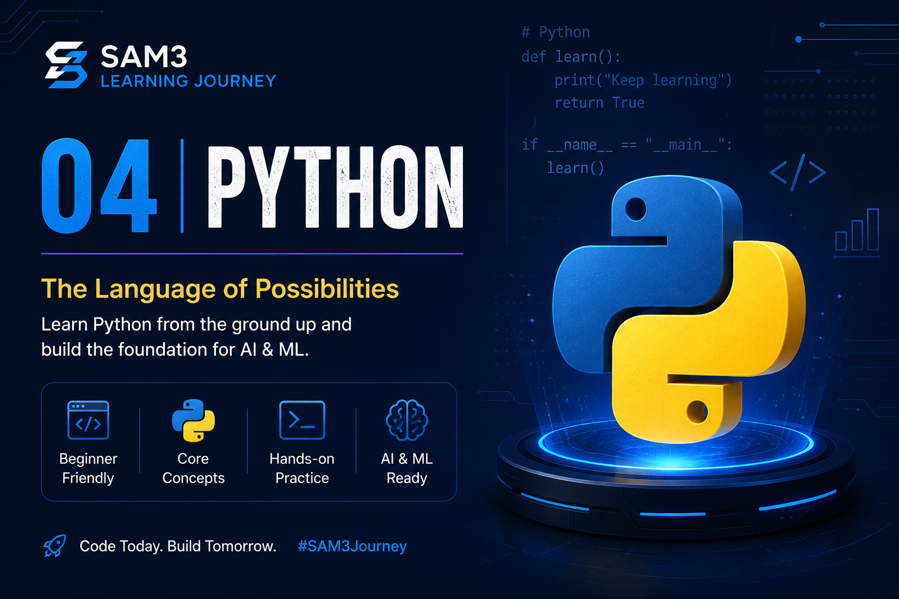

# 🐍 Python

<p align="center">
  
</p>

<div align="center">

# 🐍 Python for Artificial Intelligence

### Learn the world's most popular programming language for AI, Machine Learning, and Computer Vision.

---


</div>

---

# 📚 Table of Contents

- Why Python?
- What is Python?
- Why Python for Artificial Intelligence?
- Installing Python
- Installing VS Code
- Installing the Python Extension
- Understanding the Python Interpreter
- Your First Python Program
- Variables
- Data Types
- Operators
- Input and Output
- Comments
- Best Practices
- Useful Resources
- Summary

---

# 🎯 Learning Objectives

After completing this chapter, you will be able to:

- ✅ Understand what Python is.
- ✅ Install Python correctly.
- ✅ Configure VS Code for Python development.
- ✅ Write and execute Python programs.
- ✅ Understand variables and data types.
- ✅ Perform mathematical operations.
- ✅ Receive user input.
- ✅ Follow Python coding best practices.
- ✅ Prepare your computer for Machine Learning and SAM3.

---

# 🤔 Why Python?

Python is one of the most popular programming languages in the world.

It is known for being:

- Easy to read
- Easy to learn
- Powerful
- Fast to develop
- Cross-platform
- Open source

Unlike many programming languages, Python focuses on readability.

That means beginners can understand code much faster while professionals can build complex AI systems using the exact same language.

Today, Python is used by millions of developers across industries including:

- Artificial Intelligence
- Machine Learning
- Computer Vision
- Robotics
- Data Science
- Cybersecurity
- Web Development
- Automation
- Cloud Computing

For anyone interested in AI, Python is the first language to learn.

---

# 🧠 Why Python for SAM3?

Segment Anything Model 3 (SAM3) is developed using Python.

Almost every example provided by Meta uses Python.

The AI ecosystem also relies heavily on Python libraries such as:

| Library | Purpose |
|----------|---------|
| NumPy | Numerical computing |
| Pandas | Data analysis |
| OpenCV | Computer Vision |
| Matplotlib | Visualization |
| PyTorch | Deep Learning |
| Transformers | Large AI models |
| Hugging Face | Model Hub |
| Roboflow | Dataset management |

Without Python, using SAM3 would be nearly impossible.

That is why this chapter comes before installing AI libraries.
---

# 🐍 What is Python?

Python is a **high-level, interpreted, general-purpose programming language** created to make programming simple, readable, and enjoyable.

Instead of focusing on complicated syntax, Python allows developers to focus on solving real-world problems.

For example, printing text on the screen is as simple as:

```python
print("Hello, World!")
```

Compared to many other programming languages, Python requires significantly fewer lines of code, making programs easier to write and maintain.

---

# 📖 A Brief History of Python

Python was created by **Guido van Rossum** in the late 1980s.

The first official version, **Python 1.0**, was released in **1991**.

Interestingly, the name **Python** was **not** inspired by the snake.

It comes from the British comedy television show:

> **Monty Python's Flying Circus**

Guido wanted the language to be fun, approachable, and enjoyable to use.

Since then, Python has evolved into one of the most influential programming languages in the world.

### Major Milestones

| Year | Version | Highlights |
|------|----------|------------|
| 1991 | Python 1.0 | First public release |
| 2000 | Python 2.0 | Garbage collection, Unicode support |
| 2008 | Python 3.0 | Modern redesign of the language |
| Today | Python 3.x | Standard language for AI, ML, and Data Science |

---

# 🌍 Why is Python So Popular?

Python has become one of the world's favorite programming languages because it combines simplicity with incredible power.

Its main advantages include:

- Easy to learn
- Easy to read
- Huge community
- Massive ecosystem of libraries
- Excellent documentation
- Cross-platform compatibility
- Free and open source
- Perfect for rapid development

These advantages allow beginners to learn quickly while giving professionals the tools needed to build enterprise-scale applications.

---

# 🚀 Why Python is the Language of Artificial Intelligence

Artificial Intelligence requires handling:

- Large datasets
- Complex mathematical operations
- Neural networks
- Image processing
- Video processing
- GPU acceleration

Python provides libraries that simplify these tasks tremendously.

Instead of writing thousands of lines of mathematical code, developers can often accomplish the same task with just a few lines using powerful libraries.

This is one of the main reasons Python became the dominant language for AI.

---

# 🧠 Popular AI Libraries

Python has one of the richest ecosystems in software development.

Some of the most important libraries include:

| Library | Purpose |
|----------|---------|
| NumPy | Numerical computing |
| Pandas | Data analysis |
| Matplotlib | Data visualization |
| OpenCV | Computer Vision |
| Scikit-learn | Machine Learning |
| TensorFlow | Deep Learning |
| PyTorch | Neural Networks |
| Hugging Face Transformers | Large Language Models |
| Ultralytics | YOLO Object Detection |
| SAM3 | Image & Video Segmentation |

Many of these libraries are open source and continuously improved by researchers and developers around the world.

---

# ⚖️ Python vs Other Programming Languages

| Language | Easy to Learn | AI Support | Performance | Readability |
|-----------|---------------|------------|-------------|-------------|
| Python | ⭐⭐⭐⭐⭐ | ⭐⭐⭐⭐⭐ | ⭐⭐⭐ | ⭐⭐⭐⭐⭐ |
| C++ | ⭐⭐ | ⭐⭐⭐⭐ | ⭐⭐⭐⭐⭐ | ⭐⭐ |
| Java | ⭐⭐⭐ | ⭐⭐⭐ | ⭐⭐⭐⭐ | ⭐⭐⭐ |
| JavaScript | ⭐⭐⭐⭐ | ⭐⭐ | ⭐⭐⭐ | ⭐⭐⭐⭐ |
| C# | ⭐⭐⭐ | ⭐⭐⭐ | ⭐⭐⭐⭐ | ⭐⭐⭐ |

Although Python is generally slower than compiled languages such as C++, its simplicity and extensive ecosystem make it the preferred choice for AI development.

Performance-critical operations are often handled internally by optimized libraries written in C or C++, giving Python the best of both worlds.

---

# 🏢 Companies That Use Python

Python is trusted by some of the largest technology companies in the world.

| Company | Common Uses |
|----------|-------------|
| Google | AI, Search, Automation |
| Meta | Artificial Intelligence, Computer Vision |
| Microsoft | Azure, AI Services |
| NVIDIA | Deep Learning, CUDA Tools |
| Netflix | Recommendation Systems |
| Spotify | Music Recommendations |
| NASA | Scientific Computing |
| IBM | Artificial Intelligence |
| Dropbox | Cloud Infrastructure |
| OpenAI | AI Research and Development |

These organizations use Python because it enables rapid development while integrating seamlessly with advanced AI frameworks.

---

# 💡 Why We're Learning Python First

Every tool used throughout this learning journey depends on Python.

In the upcoming chapters, you'll work with technologies such as:

- Google Colab
- Hugging Face
- Roboflow
- PyTorch
- CUDA
- NVIDIA T4 GPUs
- Segment Anything Model 3 (SAM3)

Without a solid understanding of Python, using these tools effectively would be much more difficult.

Think of Python as the foundation upon which the rest of your AI journey is built.

---

# 🎯 Key Takeaways

After completing this section, you should understand that:

- ✅ Python is a beginner-friendly yet powerful programming language.
- ✅ It was designed with readability and productivity in mind.
- ✅ Python has become the standard language for Artificial Intelligence.
- ✅ Thousands of open-source libraries make AI development significantly easier.
- ✅ Nearly every modern AI framework—including SAM3—relies on Python.
- ✅ Learning Python now will make every future chapter easier to understand.
---

# 💻 Installing Python

Before writing your first Python program, you need to install Python on your computer.

This guide uses **Python 3.12.x**, which offers excellent compatibility with modern AI libraries such as PyTorch, Hugging Face, OpenCV, and SAM3.

> **💡 Why Python 3.12?**
>
> While newer versions of Python are available, many AI libraries take time to fully support them. Python 3.12 provides an excellent balance of stability, compatibility, and performance.

---

# 🌐 Step 1 — Download Python

Visit the official Python website:

👉 **https://www.python.org/downloads/**

You should see the latest stable version available for your operating system.

For this course, download:

- **Python 3.12.x (64-bit)**

---

# 🖥️ Step 2 — Run the Installer

After the download is complete:

1. Double-click the installer.
2. Wait for the installation window to appear.

Before clicking **Install Now**, make sure to enable:

✅ **Add Python to PATH**

This is one of the most important steps during installation.

If you skip it, Windows will not recognize Python from the Command Prompt or PowerShell.

---

# ⚙️ Step 3 — Install Python

Click:

**Install Now**

The installer will automatically install:

- Python Interpreter
- Standard Library
- pip (Python Package Manager)
- IDLE
- Documentation
- Required system files

The installation usually takes only a few minutes.

---

# ✅ Step 4 — Verify the Installation

Open:

- Command Prompt
- Windows Terminal
- PowerShell

Run:

```bash
python --version
```

Expected output:

```text
Python 3.12.x
```

You can also check:

```bash
python -V
```

---

# 🔎 Check pip

Python includes **pip**, the official package manager used to install additional libraries.

Verify it by running:

```bash
pip --version
```

Example output:

```text
pip 24.x.x from ...
```

If pip is working correctly, you're ready to install AI libraries later in this course.

---

# 🧪 Test Python

Start the Python interpreter by typing:

```bash
python
```

You should see something similar to:

```text
Python 3.12.x
>>>
```

Now type:

```python
print("Hello, SAM3!")
```

Expected output:

```text
Hello, SAM3!
```

Exit Python by typing:

```python
exit()
```

or pressing:

- **Ctrl + Z**, then **Enter** (Windows)

---

# ❗ Common Installation Problems

## Python command not found

If Windows displays:

```text
'python' is not recognized...
```

Possible solutions:

- Python was not added to PATH.
- Restart your computer.
- Reinstall Python and check **Add Python to PATH**.
- Verify the installation using the installer again.

---

## Wrong Python Version

If multiple versions are installed, run:

```bash
py --list
```

Example:

```text
 -V:3.12
 -V:3.11
```

To start Python 3.12 specifically:

```bash
py -3.12
```

---

## pip Not Working

Try:

```bash
python -m pip --version
```

or:

```bash
py -3.12 -m pip --version
```

This ensures you're using the correct version of pip associated with your Python installation.

---

# 📌 Best Practices

- Always install the **64-bit** version of Python.
- Use the official installer from **python.org**.
- Keep Python updated within the same major version (3.12.x).
- Avoid installing unnecessary versions unless required.
- Verify both `python` and `pip` after installation.

---

# ✅ Checkpoint

Before continuing, make sure:

- ✅ Python is installed.
- ✅ `python --version` works.
- ✅ `pip --version` works.
- ✅ You successfully ran `print("Hello, SAM3!")`.
- ✅ You're ready to configure Visual Studio Code in the next section.

---

# 🧑‍💻 Configuring Visual Studio Code for Python

Now that Python is installed, it's time to configure **Visual Studio Code (VS Code)**.

VS Code is one of the most popular code editors in the world because it is:

- Free
- Lightweight
- Fast
- Cross-platform
- Highly customizable
- Perfect for Python and AI development

By the end of this section, you'll have a professional Python development environment ready for the rest of this learning journey.

---

# 📥 Step 1 — Open Visual Studio Code

Launch Visual Studio Code.

If this is your first time opening it, you'll see the Welcome screen.

---

# 🧩 Step 2 — Install the Python Extension

Click the **Extensions** icon on the left sidebar.

Or press:

```text
Ctrl + Shift + X
```

Search for:

```text
Python
```

Install the extension published by:

> **Microsoft**

This extension provides:

- Python syntax highlighting
- Intelligent code completion (IntelliSense)
- Debugging
- Linting
- Code formatting
- Interactive Python support
- Jupyter Notebook integration

---

# 📁 Step 3 — Create a Project Folder

Create a folder anywhere on your computer.

Example:

```text
Python-Learning
```

Inside VS Code:

**File → Open Folder**

Select your newly created folder.

Keeping each project in its own folder makes your work organized and easier to maintain.

---

# 📄 Step 4 — Create Your First Python File

Inside the Explorer panel:

Click:

**New File**

Name it:

```text
hello.py
```

The `.py` extension tells VS Code that this is a Python source file.

---

# ✍️ Step 5 — Write Your First Program

Type the following code:

```python
print("Hello, SAM3!")
```

Save the file using:

```text
Ctrl + S
```

---

# ▶️ Step 6 — Run the Program

There are several ways to run a Python program in VS Code.

### Method 1 — Run Button

Click the **▶ Run** button in the top-right corner.

---

### Method 2 — Right Click

Right-click inside the editor.

Select:

```text
Run Python File
```

---

### Method 3 — Integrated Terminal

Open the terminal:

```text
Ctrl + `
```

Run:

```bash
python hello.py
```

Expected output:

```text
Hello, SAM3!
```

---

# 🐍 Step 7 — Select the Python Interpreter

Sometimes VS Code doesn't automatically detect the correct Python version.

Press:

```text
Ctrl + Shift + P
```

Search for:

```text
Python: Select Interpreter
```

Choose:

```text
Python 3.12 (64-bit)
```

Once selected, VS Code will use this interpreter for running and debugging your Python code.

---

# 📂 Recommended Project Structure

As your projects grow, keeping files organized becomes increasingly important.

Example:

```text
Python-Learning/
│
├── hello.py
├── variables.py
├── operators.py
├── input_output.py
├── functions.py
├── loops.py
└── README.md
```

Creating separate files for each topic makes reviewing and maintaining your code much easier.

---

# ⚠️ Common VS Code Issues

## Python Interpreter Not Found

Solution:

- Press `Ctrl + Shift + P`
- Select **Python: Select Interpreter**
- Choose Python 3.12

---

## Extension Not Installed

If VS Code displays messages such as:

```text
Python is not installed.
```

Verify that the Microsoft Python extension is installed and enabled.

---

## Terminal Cannot Find Python

Run:

```bash
python --version
```

If the command fails:

- Restart VS Code.
- Restart your computer.
- Verify that Python was added to your system PATH.

---

## File Won't Run

Check that:

- The file ends with `.py`
- Python is installed correctly
- The correct interpreter is selected
- The file has been saved before running

---

# 💡 Productivity Tips

- Save your work frequently using **Ctrl + S**.
- Use meaningful filenames.
- Keep one project per folder.
- Install extensions only from trusted publishers.
- Learn keyboard shortcuts to improve your workflow.

---

# 🎯 Checkpoint

Before continuing, make sure you can:

- ✅ Open VS Code.
- ✅ Install the Microsoft Python extension.
- ✅ Create a Python project folder.
- ✅ Create a `.py` file.
- ✅ Run a Python program successfully.
- ✅ Select the correct Python interpreter.
- ✅ See the output **"Hello, SAM3!"** in the terminal.

Congratulations! 🎉

Your Python development environment is now fully configured and ready for writing real programs.

---

# 🐍 Python Fundamentals

Now that your development environment is ready, it's time to start writing Python code.

In this section, you'll learn the building blocks of every Python program.

By the end, you'll be able to:

- Display text on the screen
- Create variables
- Work with different data types
- Receive user input
- Perform mathematical calculations
- Write clean, readable code

---

# 🖨️ Your First Python Program

Let's begin with the classic first program.

```python
print("Hello, World!")
```

Output:

```text
Hello, World!
```

Now try something more personal:

```python
print("Welcome to the SAM3 Learning Journey!")
```

Output:

```text
Welcome to the SAM3 Learning Journey!
```

The `print()` function displays information on the screen.

You'll use it constantly while learning and debugging programs.

---

# 💬 Comments

Comments are notes written for humans.

Python ignores them when running your program.

Single-line comment:

```python
# This is a comment
print("Hello")
```

Multiple comments:

```python
# Author: Your Name
# Project: SAM3 Learning Journey
# Lesson: Python Fundamentals

print("Python is fun!")
```

Comments help explain your code and make it easier to maintain.

---

# 📦 Variables

Variables store information in memory.

Think of a variable as a labeled box that holds a value.

Example:

```python
name = "Alice"
age = 25
```

Now display the variables:

```python
print(name)
print(age)
```

Output:

```text
Alice
25
```

Variables can be updated at any time.

```python
score = 80

print(score)

score = 95

print(score)
```

Output:

```text
80
95
```

---

# 🏷️ Variable Naming Rules

Good variable names make code easier to read.

✅ Valid names:

```python
student_name
firstName
age
total_score
price
```

❌ Invalid names:

```python
1name
student-name
my name
class
```

### Best Practices

Use descriptive names:

```python
temperature = 24
```

Instead of:

```python
x = 24
```

Good names make programs self-explanatory.

---

# 🔤 Data Types

Every value in Python has a data type.

### Integer (`int`)

Whole numbers.

```python
age = 28
```

---

### Float (`float`)

Numbers with decimals.

```python
height = 1.75
price = 19.99
```

---

### String (`str`)

Text enclosed in quotation marks.

```python
name = "Peyman"
country = "Mexico"
```

---

### Boolean (`bool`)

Represents either **True** or **False**.

```python
is_student = True
is_logged_in = False
```

---

# 🔍 Checking a Data Type

Use the `type()` function.

Example:

```python
age = 25

print(type(age))
```

Output:

```text
<class 'int'>
```

More examples:

```python
print(type("Python"))
print(type(3.14))
print(type(True))
```

Output:

```text
<class 'str'>
<class 'float'>
<class 'bool'>
```

---

# ⌨️ User Input

Programs become interactive by asking the user for information.

Example:

```python
name = input("What is your name? ")

print("Hello,", name)
```

Possible output:

```text
What is your name? Alice

Hello, Alice
```

---

# 🔢 Converting Input

The `input()` function always returns text.

If you need a number, convert it.

Example:

```python
age = int(input("Enter your age: "))

print(age)
```

For decimal numbers:

```python
price = float(input("Enter a price: "))
```

Common conversions:

| Function | Converts To |
|----------|-------------|
| `int()` | Integer |
| `float()` | Decimal number |
| `str()` | Text |
| `bool()` | Boolean |

---

# ➕ Basic Operators

Python supports many mathematical operations.

| Operator | Meaning | Example |
|----------|---------|---------|
| `+` | Addition | `5 + 3` |
| `-` | Subtraction | `8 - 2` |
| `*` | Multiplication | `4 * 6` |
| `/` | Division | `10 / 2` |
| `//` | Floor Division | `10 // 3` |
| `%` | Modulus (Remainder) | `10 % 3` |
| `**` | Exponent | `2 ** 3` |

Example:

```python
a = 10
b = 3

print(a + b)
print(a - b)
print(a * b)
print(a / b)
print(a // b)
print(a % b)
print(a ** b)
```

Output:

```text
13
7
30
3.3333333333
3
1
8
```

---

# 🧪 Mini Practice

### Exercise 1

Create two variables:

```python
first_name = "John"
last_name = "Smith"
```

Print:

```text
John Smith
```

---

### Exercise 2

Create:

```python
num1 = 12
num2 = 8
```

Display:

- Addition
- Subtraction
- Multiplication
- Division

---

### Exercise 3

Ask the user for their favorite programming language.

Display:

```text
Your favorite language is Python.
```

---

### Exercise 4

Ask the user for two numbers.

Display:

- Sum
- Difference
- Product
- Quotient

---

# 💡 Best Practices

- Use meaningful variable names.
- Keep code simple and readable.
- Add comments when necessary.
- Save your work frequently.
- Test your code often.
- Don't be afraid of making mistakes—they're part of learning.

---

# 🎯 Key Takeaways

After completing this section, you should be able to:

- ✅ Display output using `print()`.
- ✅ Write comments.
- ✅ Create and update variables.
- ✅ Understand Python's main data types.
- ✅ Receive input from users.
- ✅ Convert data between types.
- ✅ Perform basic mathematical operations.
- ✅ Write small interactive Python programs.

Congratulations! 🎉

You now know the core concepts that form the foundation of every Python application—from simple scripts to advanced AI systems like SAM3.

---

# 📚 Learn Python Programming

This repository focuses on **Artificial Intelligence and Segment Anything Model 3 (SAM3)**.

To keep this learning journey focused on AI, the complete Python programming course is maintained in a separate repository.

If you're new to Python, or would like to strengthen your programming skills, I highly recommend completing the Python modules before continuing.

## 🐍 Complete Python Course

🔗 https://github.com/Peyman-mxli/Learn-How-To-Code/tree/main/01-INTRODUCTIONS/02-PYTHON

The course includes:

- 📥 Installing Python
- 💻 Python Environment
- 📒 Jupyter Installation
- 🌐 Virtual Environments
- 📦 Variables & Data Types
- 📝 Python Syntax
- 🔄 Control Flow
- ⚙️ Functions
- 📚 Modules
- 📂 File Handling
- 🚨 Exception Handling
- 🧱 Object-Oriented Programming (OOP)
- 🧪 Testing & Debugging
- ✅ Exercises and Solutions

> **Recommended:** Complete these modules before continuing with the SAM3 Learning Journey if you are new to Python.

---

# 🚀 Continue Your AI Journey

Once your Python environment is ready and you're comfortable with the basics, continue with:

# 📘 05 – Google Colab
