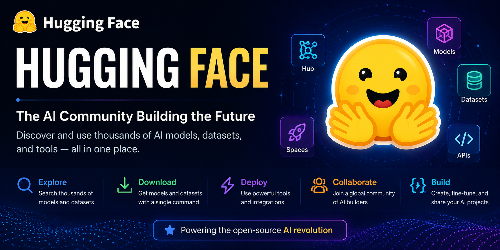

# 🤗 Hugging Face

<p align="center">
  
</p>

<div align="center">

# 🤗 Hugging Face

### The Home of Modern Artificial Intelligence

---


</div>

---

# 📚 Table of Contents

- What is Hugging Face?
- Why Hugging Face Matters
- The Hugging Face Ecosystem
- Models
- Datasets
- Spaces
- Libraries
- Community
- Why We'll Use Hugging Face
- Summary

---

# 🎯 Learning Objectives

By the end of this chapter, you will be able to:

- ✅ Understand what Hugging Face is.
- ✅ Create your own Hugging Face account.
- ✅ Explore AI models.
- ✅ Browse public datasets.
- ✅ Use Hugging Face Spaces.
- ✅ Generate Access Tokens.
- ✅ Connect Hugging Face with Google Colab.
- ✅ Prepare your account for Segment Anything Model 3 (SAM3).

---

# 🤗 What is Hugging Face?

Hugging Face is one of the world's largest platforms dedicated to Artificial Intelligence and Machine Learning.

It provides an open ecosystem where developers, researchers, students, and organizations can discover, share, and build AI applications.

Today, millions of users rely on Hugging Face to access pre-trained models, public datasets, educational resources, and open-source tools.

Whether you're working with natural language processing, computer vision, speech recognition, or generative AI, Hugging Face has become a central hub for modern AI development.

---

# 🌍 Why is Hugging Face Important?

Before platforms like Hugging Face, finding high-quality AI models and datasets often required searching through research papers, personal websites, or multiple repositories.

Hugging Face brings these resources together into a single platform, making AI development more accessible to everyone.

Instead of building every model from scratch, developers can:

- Discover existing models.
- Download pre-trained checkpoints.
- Share their own work.
- Collaborate with the AI community.
- Reproduce research more easily.

This significantly reduces development time and encourages open collaboration.

---

# 🚀 The Hugging Face Ecosystem

Hugging Face is much more than a website.

It is a complete ecosystem built around modern Artificial Intelligence.

Its main components include:

- 🤖 Models
- 📊 Datasets
- 🚀 Spaces
- 📚 Documentation
- 💻 Open-source libraries
- 🌍 Community contributions

Together, these components make Hugging Face one of the most influential platforms in AI.

---

# 🤖 Models

The Models section contains hundreds of thousands of pre-trained AI models.

These models cover many domains, including:

- Large Language Models (LLMs)
- Computer Vision
- Image Segmentation
- Object Detection
- Speech Recognition
- Text Classification
- Translation
- Image Generation
- Audio Processing

Many state-of-the-art AI models are released on Hugging Face shortly after publication.

---

# 📊 Datasets

High-quality datasets are essential for training and evaluating AI models.

The Datasets section provides access to thousands of public datasets for tasks such as:

- Image Classification
- Image Segmentation
- Object Detection
- Text Processing
- Speech Recognition
- Video Understanding

Many datasets can be downloaded directly into Python with only a few lines of code.

---

# 🚀 Spaces

Spaces allow developers to publish interactive AI applications directly in the browser.

These applications often demonstrate:

- Image generation
- Chatbots
- Object detection
- Image segmentation
- Computer vision tools
- Research prototypes

Instead of installing software locally, users can try many AI models instantly.

---

# 📚 Open-Source Libraries

Hugging Face develops several popular Python libraries used throughout the AI community.

Some of the best-known include:

| Library | Purpose |
|----------|---------|
| Transformers | Large Language Models |
| Datasets | Dataset management |
| Diffusers | Image generation |
| Accelerate | Multi-device training |
| Tokenizers | Fast text tokenization |
| PEFT | Efficient model fine-tuning |

These libraries simplify working with modern AI models.

---

# 🌎 Community

One of Hugging Face's greatest strengths is its community.

Researchers, universities, companies, and independent developers contribute:

- AI models
- Datasets
- Tutorials
- Documentation
- Research implementations

This collaborative approach helps accelerate innovation across the field of Artificial Intelligence.

---

# 🧠 Why We're Using Hugging Face

Throughout this learning journey, Hugging Face will become one of your primary AI resources.

We'll use it to:

- Explore AI models.
- Download model checkpoints.
- Access datasets.
- Connect with Google Colab.
- Install AI libraries.
- Prepare the environment required for Segment Anything Model 3 (SAM3).

Learning to navigate Hugging Face is an essential skill for anyone interested in modern AI development.

---

# 🎯 Key Takeaways

After completing this introduction, you should understand that:

- ✅ Hugging Face is one of the largest AI platforms in the world.
- ✅ It hosts models, datasets, and AI applications.
- ✅ It supports collaboration through open-source contributions.
- ✅ It provides powerful Python libraries for AI development.
- ✅ It will play a central role throughout the SAM3 Learning Journey.

Congratulations!

You are now ready to create your own Hugging Face account and begin exploring one of the most
exciting ecosystems in Artificial Intelligence.

---

# 👤 Creating Your Hugging Face Account

Before downloading models, using datasets, or accessing advanced AI features, you'll need a free Hugging Face account.

Creating an account only takes a few minutes and unlocks access to one of the largest Artificial Intelligence communities in the world.

Best of all, creating a personal account is completely free.

---

# 🌐 Step 1 — Visit Hugging Face

Open your web browser and navigate to:

👉 https://huggingface.co

You'll arrive at the Hugging Face homepage.

Here you can explore:

- 🤖 AI Models
- 📊 Datasets
- 🚀 Spaces
- 📚 Documentation
- 👥 Community Projects

Although many resources are publicly accessible, creating an account provides additional features and a personalized experience.

---

# 📝 Step 2 — Create an Account

Click the **Sign Up** button located in the upper-right corner of the website.

You'll be asked to provide:

- 📧 Email Address
- 👤 Username
- 🔒 Password

Alternatively, you can register using an existing account such as:

- Google
- GitHub

Using GitHub is often convenient if you already use it for software development.

---

# ✉️ Step 3 — Verify Your Email

After registering, Hugging Face will send a verification email to the address you provided.

Open your inbox and click the verification link.

Once your email has been confirmed, your account will be fully activated.

If you don't see the email, remember to check:

- Spam
- Promotions
- Junk Mail

---

# 👤 Step 4 — Complete Your Profile

After logging in, open your profile.

Adding profile information helps personalize your account and makes it easier for others to recognize your work.

Recommended information:

- Display Name
- Profile Picture
- Short Biography
- GitHub Profile
- Personal Website (optional)

A complete profile is especially useful if you plan to share models, datasets, or Spaces with the community.

---

# ⚙️ Step 5 — Explore Your Dashboard

Once you're signed in, you'll have access to your personal dashboard.

From here you can:

- Browse AI models
- Search datasets
- Create repositories
- Publish Spaces
- Manage Access Tokens
- View your profile and activity

Take a few minutes to familiarize yourself with the interface.

---

# 📂 Your Personal Repositories

Just like GitHub, Hugging Face allows you to create repositories.

However, these repositories are designed specifically for AI resources.

You can create repositories for:

- 🤖 Models
- 📊 Datasets
- 📒 Spaces (AI applications)

Each repository has its own version history, files, and collaboration tools.

---

# 🌍 Public vs Private Repositories

When creating a repository, you can choose between:

## 🌐 Public

Anyone can:

- View your repository
- Download models
- Clone datasets
- Learn from your work

This is ideal for open-source projects.

---

## 🔒 Private

Only you—or collaborators you invite—can access the repository.

Private repositories are useful for:

- Research projects
- Work in progress
- Private datasets
- Experimental models

You can change repository visibility later if needed.

---

# 🤝 Following the Community

Hugging Face is more than a repository hosting service—it's also a community.

You can:

- Follow researchers
- Follow organizations
- Discover trending projects
- Like repositories
- Contribute to open-source AI

Following active contributors is a great way to stay up to date with the latest developments in Artificial Intelligence.

---

# 🎯 Why Create an Account Now?

Although some Hugging Face resources can be accessed anonymously, creating an account allows you to:

- Save favorite models.
- Publish your own work.
- Generate Access Tokens.
- Use advanced APIs.
- Clone private repositories.
- Upload datasets and models.

Many of the features we'll use later in this learning journey require authentication.

---

# 💡 Best Practices

- Choose a professional username.
- Use a secure password.
- Enable two-factor authentication if available.
- Keep your profile updated.
- Connect your GitHub account.
- Verify your email immediately after registration.

A well-maintained profile helps establish your presence within the AI community.

---

# 🧪 Mini Practice

Complete the following tasks:

- Create your Hugging Face account.
- Verify your email address.
- Upload a profile picture.
- Add a short biography.
- Explore the Models section.
- Explore the Datasets section.
- Explore the Spaces section.
- Follow at least one AI organization or creator.

By completing these steps, you'll become familiar with the platform before using it in future chapters.

---

# 🎯 Checkpoint

Before continuing, make sure you have:

- ✅ Created a Hugging Face account.
- ✅ Verified your email address.
- ✅ Logged in successfully.
- ✅ Completed your profile.
- ✅ Explored the dashboard.
- ✅ Browsed Models, Datasets, and Spaces.
- ✅ Understood the difference between Public and Private repositories.

Congratulations! 🎉

Your Hugging Face account is now ready.

In the next section, we'll begin exploring one of the platform's most powerful features:

# 🤖 AI Models

You'll learn how to search, compare, evaluate, and download state-of-the-art AI models—including the models we'll use later for Segment Anything Model 3 (SAM3).

---

# 🤖 Exploring AI Models

One of the main reasons developers use Hugging Face is to access its massive collection of pre-trained AI models.

Instead of building every model from scratch, you can search, evaluate, download, and use models that have already been trained by researchers and organizations around the world.

Today, Hugging Face hosts **hundreds of thousands of models**, making it one of the largest AI model repositories available.

---

# 🤔 What is an AI Model?

An AI model is a computer program that has learned patterns from data.

Instead of following fixed rules, the model learns from examples and can make predictions or generate outputs for new data.

Examples include:

- 🖼️ Image Classification
- ✂️ Image Segmentation
- 📦 Object Detection
- 💬 Chatbots
- 🌍 Language Translation
- 📝 Text Summarization
- 🎙️ Speech Recognition
- 🎨 Image Generation

Throughout this learning journey, we'll focus primarily on **Computer Vision** models.

---

# 🌐 The Models Page

Open:

👉 https://huggingface.co/models

You'll find a searchable catalog containing models from:

- Meta
- Google
- Microsoft
- NVIDIA
- OpenAI partners
- Stability AI
- Thousands of independent researchers

This page is updated daily with new releases.

---

# 🔍 Searching for Models

At the top of the Models page, you'll find a search bar.

You can search by:

- Model name
- Organization
- Task
- Keyword

Example searches:

```text
segment anything
```

```text
object detection
```

```text
image segmentation
```

```text
llama
```

```text
stable diffusion
```

Searching by task is often the easiest way to discover relevant models.

---

# 🏷️ Filtering Models

Hugging Face provides powerful filters to narrow your search.

Examples include:

### Task

- Image Classification
- Image Segmentation
- Object Detection
- Text Generation
- Speech Recognition

---

### Library

Examples:

- Transformers
- PyTorch
- TensorFlow
- Safetensors

---

### Language

Useful for Natural Language Processing projects.

---

### License

Some models have different licenses for commercial or research use.

Always review the license before deploying a model in production.

---

# 📄 Understanding a Model Card

Every model includes a **Model Card**.

Think of it as the model's documentation.

A typical Model Card contains:

- Model description
- Intended use
- Training data
- Installation instructions
- Example code
- License
- Performance benchmarks
- Citation information

Reading the Model Card is one of the best ways to understand how a model should be used.

---

# 📦 Files and Versions

Each model repository includes downloadable files.

Common file types include:

```text
config.json
```

```text
model.safetensors
```

```text
tokenizer.json
```

```text
README.md
```

These files define the model architecture, weights, configuration, and documentation.

---

# 📊 Model Statistics

Many models display useful statistics such as:

- ⭐ Likes
- 📥 Downloads
- 👥 Contributors
- 📝 Last Updated

These metrics can help you identify active and well-supported models.

However, remember that popularity does not always mean a model is the best choice for your project.

---

# 🏢 Organizations

Many repositories belong to organizations rather than individuals.

Examples include:

- Meta
- Google
- Microsoft
- NVIDIA

Organization pages often contain multiple related models and official implementations.

---

# 🧠 Why We'll Use Hugging Face Models

Throughout this course, we'll use Hugging Face to discover and download models for:

- Image Segmentation
- Computer Vision
- Vision Transformers
- Foundation Models
- Segment Anything Model 3 (SAM3)

Instead of training these models from scratch, we'll leverage pre-trained checkpoints to accelerate development.

---

# ⭐ Evaluating a Model

Before using a model, consider the following:

- Does it solve your task?
- Is it actively maintained?
- Is the documentation complete?
- Is the license compatible with your project?
- Is it compatible with PyTorch?
- Does it provide example code?

Answering these questions can save time and prevent compatibility issues.

---

# 💡 Best Practices

- Read the Model Card before downloading a model.
- Review the license carefully.
- Check the latest updates.
- Prefer official repositories when available.
- Use filters to narrow your search.
- Explore example code before integrating a model into your project.

These habits will help you select reliable models and understand how to use them effectively.

---

# 🧪 Mini Practice

Visit the Models page and complete the following tasks:

- Search for **Segment Anything**.
- Search for **Object Detection**.
- Search for **Image Segmentation**.
- Open a Model Card.
- Identify the model's license.
- Review the example code.
- Explore the repository files.
- Note the number of downloads and likes.

By completing these exercises, you'll become familiar with navigating the Hugging Face model ecosystem.

---

# 🎯 Checkpoint

Before continuing, make sure you can:

- ✅ Search for AI models.
- ✅ Apply filters.
- ✅ Read a Model Card.
- ✅ Understand repository files.
- ✅ Review licenses.
- ✅ Evaluate model popularity.
- ✅ Identify official repositories.
- ✅ Locate example code.

Excellent! 🎉

You now know how to explore and evaluate AI models on Hugging Face.

In the next section, we'll discover another powerful feature of the platform:

# 📊 Hugging Face Datasets

You'll learn how to search, explore, and download datasets used to train and evaluate modern AI models—including datasets that can be used with Segment Anything Model 3 (SAM3).


---

# 📊 Exploring Datasets

Artificial Intelligence models learn from data.

Without high-quality datasets, even the most advanced AI models cannot perform well.

Hugging Face hosts one of the largest collections of publicly available datasets for Machine Learning, Computer Vision, Natural Language Processing, Audio, Video, and many other AI tasks.

Learning how to find and use datasets is an essential skill for every AI engineer.

---

# 🤔 What is a Dataset?

A dataset is a collection of organized information used to:

- Train AI models
- Validate performance
- Test predictions
- Compare different algorithms

Datasets can contain many different types of data, including:

- 📷 Images
- 🎥 Videos
- 📝 Text
- 🎙️ Audio
- 📊 Tables
- 📄 Documents

Throughout this learning journey, we'll primarily work with image and video datasets.

---

# 🌐 The Datasets Page

Open:

👉 https://huggingface.co/datasets

You'll find thousands of datasets contributed by:

- Meta
- Google
- Microsoft
- NVIDIA
- Universities
- Research laboratories
- Open-source contributors

New datasets are added regularly as the AI community grows.

---

# 🔍 Searching for Datasets

Use the search bar to look for datasets related to your project.

Example searches:

```text
segmentation
```

```text
object detection
```

```text
COCO
```

```text
medical images
```

```text
satellite
```

Searching by task or keyword is often the quickest way to discover useful datasets.

---

# 🏷️ Dataset Filters

You can narrow your search using filters.

Examples include:

### Task

- Image Classification
- Image Segmentation
- Object Detection
- Video Classification
- Text Classification
- Speech Recognition

---

### Modality

Examples:

- Image
- Video
- Text
- Audio
- Multimodal

---

### Language

Useful when working with Natural Language Processing datasets.

---

### License

Always verify the dataset license before using it in research or commercial projects.

---

# 📄 Dataset Card

Every dataset includes a **Dataset Card**.

This page explains:

- What the dataset contains
- How it was collected
- Intended use
- Licensing information
- Citation details
- Example usage
- Dataset splits
- Available files

Reading the Dataset Card helps you understand whether a dataset is appropriate for your project.

---

# 📂 Dataset Splits

Most machine learning datasets are divided into three parts:

| Split | Purpose |
|--------|---------|
| Training | Used to teach the model |
| Validation | Used to tune the model |
| Test | Used to evaluate final performance |

Keeping these splits separate helps measure how well a model generalizes to unseen data.

---

# 📦 Dataset Structure

An image segmentation dataset may look like:

```text
dataset/

├── train/
│   ├── images/
│   └── masks/
│
├── validation/
│   ├── images/
│   └── masks/
│
└── test/
    ├── images/
    └── masks/
```

This structure is common in many Computer Vision projects.

---

# 🖼️ Previewing a Dataset

Many Hugging Face datasets provide an interactive preview.

You can inspect:

- Images
- Labels
- Captions
- Metadata
- Annotations

Previewing a dataset helps verify that it matches your project's requirements before downloading it.

---

# 📥 Downloading Datasets

Many datasets can be loaded directly into Python using the `datasets` library.

Example:

```python
from datasets import load_dataset

dataset = load_dataset("dataset_name")
```

We'll use this approach later when working with AI models and training data.

---

# 📊 Dataset Information

Most datasets provide useful statistics such as:

- Number of samples
- Number of classes
- File size
- Available splits
- Contributors
- Downloads
- License

Reviewing these details can help you estimate storage and computational requirements.

---

# 🧠 Why We'll Use Hugging Face Datasets

Throughout this course, we'll use Hugging Face datasets to:

- Train Computer Vision models
- Evaluate segmentation performance
- Experiment with AI workflows
- Learn best practices for dataset management

Having access to high-quality datasets allows us to focus on learning rather than collecting data.

---

# 💡 Best Practices

- Read the Dataset Card before downloading.
- Review the license carefully.
- Verify the dataset structure.
- Check the number of samples.
- Explore the preview before training.
- Organize downloaded datasets into dedicated project folders.

Good dataset management leads to better experiments and more reproducible results.

---

# 🧪 Mini Practice

Visit the Datasets page and complete the following tasks:

- Search for **COCO**.
- Search for **Image Segmentation** datasets.
- Open a Dataset Card.
- Identify the dataset license.
- Review the available dataset splits.
- Explore the preview samples.
- Note the total number of examples.

These exercises will help you become comfortable navigating the Hugging Face dataset ecosystem.

---

# 🎯 Checkpoint

Before continuing, make sure you can:

- ✅ Search for datasets.
- ✅ Apply filters.
- ✅ Read a Dataset Card.
- ✅ Understand dataset splits.
- ✅ Preview dataset contents.
- ✅ Review licenses.
- ✅ Estimate dataset size and complexity.
- ✅ Identify datasets suitable for Computer Vision projects.

Congratulations! 🎉

You now know how to explore and evaluate datasets on Hugging Face.

In the next section, we'll discover **Hugging Face Spaces**, where you can interact with live AI applications directly in your browser without installing any software.

---

# 🚀 Exploring Hugging Face Spaces

Hugging Face is more than just a platform for hosting AI models and datasets.

It also provides **Spaces**, an environment where developers can build, host, and share interactive AI applications directly in the browser.

Think of Spaces as a place where AI models come to life.

Instead of reading about a model, you can actually interact with it in real time.

---

# 🤔 What Are Hugging Face Spaces?

A **Space** is a live web application powered by Artificial Intelligence.

Developers can use Spaces to demonstrate how their AI models work without requiring users to install any software.

Everything runs directly in your web browser.

Many AI companies and researchers use Spaces to showcase new models before releasing them to the public.

---

# 🌍 Visit Hugging Face Spaces

Open:

👉 https://huggingface.co/spaces

You'll discover thousands of public AI applications covering a wide variety of topics.

Some examples include:

- 💬 AI Chatbots
- 🖼️ Image Generation
- 🎨 Image Editing
- ✂️ Image Segmentation
- 📦 Object Detection
- 🎥 Video Processing
- 🎙️ Speech Recognition
- 🌍 Translation
- 📝 Text Summarization

New Spaces are published every day by the AI community.

---

# 🔍 Searching for Spaces

Use the search bar to find applications related to your interests.

Example searches:

```text
segment anything
```

```text
image segmentation
```

```text
computer vision
```

```text
stable diffusion
```

```text
llama
```

Searching by keyword helps you quickly discover demos built around specific AI models.

---

# 🖥️ Try an AI Application

One of the best ways to learn is by experimenting.

Many Spaces allow you to:

- Upload an image
- Ask questions
- Draw masks
- Generate artwork
- Detect objects
- Chat with an AI assistant

All without writing a single line of code.

---

# 🧩 How Spaces Work

Every Space is built using code stored in a Hugging Face repository.

Most Spaces are powered by one of these frameworks:

- **Gradio**
- **Streamlit**
- **Docker**

These frameworks make it easy to create interactive web interfaces for AI applications.

---

# 🎨 Gradio

Gradio is one of the most popular frameworks on Hugging Face.

It allows developers to create interactive AI demos with only a few lines of Python code.

Typical Gradio applications include:

- Image uploaders
- Chat interfaces
- Video processing
- Audio analysis
- Model comparisons

You'll encounter many Gradio-based demos throughout your AI journey.

---

# 📈 Streamlit

Another popular option is Streamlit.

Streamlit is often used to build:

- AI dashboards
- Data science applications
- Interactive visualizations
- Machine Learning tools

Both Gradio and Streamlit are excellent choices, and many Spaces clearly indicate which framework they use.

---

# 📄 Understanding a Space

Each Space includes useful information such as:

- Description
- Source code
- Repository files
- Framework
- License
- Creator
- Last update
- Community discussions

Reviewing this information helps you understand how the application was built.

---

# 💻 View the Source Code

One of the biggest advantages of Hugging Face Spaces is transparency.

Many Spaces provide full access to their source code.

You can study:

- Python scripts
- Configuration files
- Model loading
- User interface code

Learning from existing projects is one of the fastest ways to improve your AI development skills.

---

# 🤖 Why We'll Use Spaces

Throughout this learning journey, Spaces will allow us to:

- Test AI models before downloading them.
- Compare different Computer Vision models.
- Explore segmentation demos.
- Evaluate user interfaces.
- Learn deployment best practices.

They provide a quick way to understand what a model can do before integrating it into your own projects.

---

# 💡 Best Practices

- Read the Space description before using it.
- Review the source code when available.
- Check the license.
- Experiment with different inputs.
- Compare multiple Spaces solving the same task.
- Learn from high-quality community projects.

Remember: many Spaces are educational resources as much as they are demonstrations.

---

# 🧪 Mini Practice

Visit the Spaces page and complete the following tasks:

- Search for **Segment Anything**.
- Search for **Computer Vision**.
- Open a Space that performs image segmentation.
- Upload a sample image.
- Test the application.
- Explore the repository files.
- Identify whether the Space uses Gradio or Streamlit.
- Read the project description.

These exercises will help you become familiar with interactive AI applications.

---

# 🎯 Checkpoint

Before continuing, make sure you can:

- ✅ Navigate the Spaces catalog.
- ✅ Search for AI applications.
- ✅ Launch a public Space.
- ✅ Upload images or other inputs.
- ✅ Explore the source code.
- ✅ Identify the framework used.
- ✅ Understand how Spaces demonstrate AI models.

Congratulations! 🎉

You now understand one of the most exciting parts of the Hugging Face ecosystem.

In the next section, you'll learn about **Access Tokens**—how to generate them, why they're important, and how they'll allow Google Colab and your local applications to securely communicate with Hugging Face services.

---

# 🔑 Hugging Face Access Tokens

As you begin working with more advanced AI models, you'll eventually need to authenticate with Hugging Face.

This is done using an **Access Token**.

An Access Token allows your applications, scripts, and notebooks to securely communicate with your Hugging Face account without requiring you to enter your username and password every time.

Throughout the SAM3 Learning Journey, you'll use Access Tokens when downloading protected models, uploading repositories, and interacting with the Hugging Face Hub.

---

# 🤔 What is an Access Token?

An Access Token is a secure authentication key generated by your Hugging Face account.

Think of it as a digital key that proves your identity.

Instead of using your password directly, applications use the token to securely access Hugging Face services.

This approach is both safer and more convenient.

---

# 🔒 Why Use Access Tokens?

Access Tokens provide several important benefits:

- Secure authentication
- Access to private repositories
- Download restricted models
- Upload models and datasets
- Publish Spaces
- Use the Hugging Face API
- Manage repositories from Python

Many professional AI workflows rely on Access Tokens rather than passwords.

---

# 🌐 Open the Access Tokens Page

After logging in to Hugging Face:

Click your profile picture.

Navigate to:

```text
Settings
```

Then select:

```text
Access Tokens
```

This page allows you to create and manage your authentication tokens.

---

# ➕ Create a New Token

Click:

```text
New Token
```

You'll be asked to provide:

- A name
- Permission level

Choose a descriptive name.

Example:

```text
SAM3-Colab
```

This makes it easier to recognize the token later.

---

# 🛡️ Permission Levels

Hugging Face supports different permission levels.

### Read

Allows your applications to:

- Download models
- Download datasets
- Access public repositories
- Access private repositories you own

This is the safest option for most users.

---

### Write

Allows everything included in **Read**, plus:

- Upload models
- Upload datasets
- Push repository updates

Use this only when you need to publish content.

---

### Fine-Grained (if available)

Some accounts may support more granular permissions.

These allow access to specific repositories or operations.

When possible, follow the principle of least privilege by granting only the permissions your project requires.

---

# 📋 Copy Your Token

After creating the token, Hugging Face will display it once.

It will look similar to:

```text
hf_xxxxxxxxxxxxxxxxxxxxxxxxxxxxxxxxx
```

Copy it immediately.

You may not be able to view the full token again later.

---

# 🚨 Keep Your Token Secret

Treat your Access Token like a password.

Never:

- Share it publicly.
- Commit it to GitHub.
- Post it in screenshots.
- Include it in documentation.
- Send it through chat messages.

Anyone with your token may be able to access resources associated with your account.

---

# ☁️ Using a Token in Google Colab

One common approach is to authenticate using the Hugging Face Hub library.

Example:

```python
from huggingface_hub import login

login()
```

You'll be prompted to paste your Access Token.

After authentication, your notebook can securely interact with your Hugging Face account.

---

# 💻 Using Environment Variables

Another common approach is to store your token in an environment variable.

Example:

```python
import os

os.environ["HF_TOKEN"] = "your_access_token"
```

This avoids hardcoding credentials throughout your project.

> **Important:** Never replace `"your_access_token"` with your real token in code that will be shared publicly.

---

# 🔄 Revoke a Token

If you believe a token has been exposed:

1. Return to the **Access Tokens** page.
2. Locate the token.
3. Delete or revoke it.
4. Create a new one.

This immediately prevents the old token from being used.

---

# 🧠 Why We'll Need Access Tokens

Later in this learning journey, you'll use your token to:

- Download protected AI models.
- Access gated repositories.
- Authenticate with the Hugging Face Hub.
- Work with official SAM3 resources (when authentication is required).
- Publish your own AI projects.

Learning how to manage Access Tokens securely is an essential professional skill.

---

# 💡 Best Practices

- Create descriptive token names.
- Use **Read** permissions whenever possible.
- Store tokens securely.
- Rotate tokens periodically if needed.
- Revoke tokens you no longer use.
- Never include tokens in public repositories.

Following these practices helps keep your projects and account secure.

---

# 🧪 Mini Practice

Complete the following tasks:

- Log in to your Hugging Face account.
- Open the **Access Tokens** page.
- Create a new token named:

```text
SAM3-Colab
```

- Select the appropriate permission level.
- Copy the token and store it in a secure password manager or other safe location.
- Practice authenticating with:

```python
from huggingface_hub import login

login()
```

Do **not** share or publish your real token.

---

# 🎯 Checkpoint

Before continuing, make sure you can:

- ✅ Explain what an Access Token is.
- ✅ Create a new token.
- ✅ Choose the correct permission level.
- ✅ Authenticate from Google Colab.
- ✅ Keep your token secure.
- ✅ Revoke and replace a token if necessary.

Congratulations! 🎉

You now understand how to securely authenticate with Hugging Face.

In the next section, we'll explore the **Hugging Face Hub** and learn how to navigate repositories, download resources, and interact with one of the largest AI ecosystems in the world.

---

# 🌐 Hugging Face Hub

The **Hugging Face Hub** is the central platform where models, datasets, Spaces, and AI repositories are stored.

Think of it as the GitHub of Artificial Intelligence.

Instead of hosting only source code, the Hugging Face Hub hosts:

- 🤖 AI Models
- 📊 Datasets
- 🚀 Spaces
- 📄 Documentation
- 🧠 Model Checkpoints
- 📦 Machine Learning Repositories

Millions of developers use the Hub every day to discover, download, and share AI resources.

---

# 🤔 What is the Hugging Face Hub?

The Hugging Face Hub is a cloud platform designed specifically for Artificial Intelligence.

It allows developers to:

- Publish AI models
- Share datasets
- Host interactive applications
- Manage repositories
- Collaborate with other developers

Instead of storing projects on your local computer, everything can be organized and version-controlled through the Hub.

---

# 📂 Repository Types

The Hub supports three primary repository types.

## 🤖 Model Repositories

Contain:

- Model weights
- Configuration files
- Tokenizers
- Documentation
- Example code

Example uses:

- Image Classification
- Image Segmentation
- Object Detection
- Large Language Models

---

## 📊 Dataset Repositories

Contain:

- Images
- Labels
- Videos
- Text
- Metadata
- Documentation

Datasets are often used for:

- Training
- Validation
- Benchmarking

---

## 🚀 Space Repositories

Contain complete AI applications built with:

- Gradio
- Streamlit
- Docker

These repositories include both the application interface and the underlying AI model.

---

# 📄 Repository Structure

A typical Model Repository may look like:

```text
repository/

├── README.md
├── config.json
├── model.safetensors
├── tokenizer.json
├── tokenizer_config.json
├── generation_config.json
└── LICENSE
```

Every file plays an important role in configuring and running the model.

---

# 📖 README Files

Every repository includes a **README.md** file.

This is often called the **Model Card**.

It usually explains:

- What the model does
- Training information
- Intended use
- Installation instructions
- Example code
- Performance
- Citation
- License

Always read the README before using a repository.

---

# 📥 Downloading Repository Files

Files can be downloaded directly from the Hub.

Some examples include:

- Model weights
- Configuration files
- Example notebooks
- Images
- Documentation

Many libraries automatically download these files when needed.

---

# 🔄 Repository Versions

Like GitHub, Hugging Face repositories support version control.

This allows developers to:

- Track changes
- Update models
- Restore previous versions
- Collaborate safely

Version control improves reproducibility and helps users understand how a project evolves over time.

---

# ⭐ Repository Information

Every repository displays useful information such as:

- Owner
- License
- Downloads
- Likes
- Contributors
- Last Updated
- Tags
- Tasks

These details can help you evaluate the maturity and popularity of a project.

---

# 🏷️ Repository Tags

Repositories often include tags describing:

- Computer Vision
- NLP
- Audio
- Image Segmentation
- Object Detection
- PyTorch
- Transformers

Tags make it easier to discover relevant projects.

---

# 🌍 Organizations

Many official repositories belong to organizations rather than individuals.

Examples include:

- Meta
- Google
- Microsoft
- NVIDIA

Whenever possible, prefer official repositories for production or educational use.

They are generally better documented and more actively maintained.

---

# 📚 Documentation

Most repositories include detailed documentation covering:

- Installation
- Usage
- API Reference
- Training
- Fine-tuning
- Troubleshooting

Reading the documentation before running code will often save time and prevent common errors.

---

# 🧠 Why We'll Use the Hugging Face Hub

Throughout this learning journey, we'll use the Hub to:

- Download AI models
- Access Computer Vision repositories
- Retrieve datasets
- Follow installation instructions
- Obtain model checkpoints
- Prepare resources for SAM3

The Hub will become one of your primary sources for AI resources.

---

# 💡 Best Practices

- Read the README before downloading files.
- Review the repository license.
- Prefer official repositories when available.
- Check the last update date.
- Review the documentation carefully.
- Understand the repository structure before modifying files.

These habits will help you work more efficiently and avoid unnecessary issues.

---

# 🧪 Mini Practice

Visit a public Hugging Face repository and complete the following tasks:

- Open the repository homepage.
- Read the README.
- Identify the repository owner.
- Find the license.
- Locate the downloadable files.
- Review the tags.
- Check the number of downloads and likes.
- Explore the repository structure.

By completing these exercises, you'll become comfortable navigating Hugging Face repositories.

---

# 🎯 Checkpoint

Before continuing, make sure you can:

- ✅ Explain what the Hugging Face Hub is.
- ✅ Identify the three repository types.
- ✅ Read a Model Card (README).
- ✅ Understand a repository structure.
- ✅ Locate model files.
- ✅ Review repository documentation.
- ✅ Evaluate repository quality.
- ✅ Navigate official AI repositories.

Excellent! 🎉

You now understand how the Hugging Face Hub organizes and distributes AI resources.

In the next section, you'll connect **Google Colab** with **Hugging Face**, allowing your notebooks to authenticate, download models, and interact directly with the Hub from the cloud.

---

# ☁️ Using Hugging Face with Google Colab

Now that you understand the Hugging Face ecosystem, it's time to connect it with Google Colab.

This combination has become one of the most popular workflows in modern Artificial Intelligence.

Using Google Colab together with Hugging Face allows you to:

- 🤖 Download AI models
- 📊 Load datasets
- ☁️ Work entirely in the cloud
- 🚀 Use GPU acceleration
- 💾 Save results to Google Drive
- 🔑 Authenticate securely using Access Tokens

This is the exact workflow we'll use throughout the remainder of this learning journey.

---

# 🔗 Why Connect Hugging Face and Colab?

Google Colab provides:

- Free cloud computing
- GPUs
- Python notebooks

Hugging Face provides:

- AI models
- Datasets
- Libraries
- Documentation

Together they form one of the most powerful environments for AI development.

---

# 📦 Install the Hugging Face Libraries

Before using Hugging Face inside Colab, install the required libraries.

Run:

```python
!pip install -q huggingface_hub
```

For many projects, you'll also need:

```python
!pip install -q transformers datasets
```

These libraries provide access to models, datasets, and the Hugging Face Hub.

---

# 📚 Import the Libraries

After installation:

```python
from huggingface_hub import login
from datasets import load_dataset
from transformers import pipeline
```

If no errors appear, the libraries were installed successfully.

---

# 🔑 Authenticate with Hugging Face

If your project requires authentication, run:

```python
from huggingface_hub import login

login()
```

A dialog will appear asking for your Access Token.

Paste the token you created earlier.

Once authenticated, Colab can securely communicate with your Hugging Face account.

---

# ✅ Verify Authentication

You can verify that authentication completed successfully by attempting to access a repository that requires your account.

If authentication fails, double-check:

- Your Access Token
- Internet connection
- Token permissions

---

# 🤖 Load Your First Model

One of the easiest ways to use Hugging Face is with the `pipeline()` function.

Example:

```python
from transformers import pipeline

classifier = pipeline("sentiment-analysis")
```

The required model will automatically be downloaded from the Hugging Face Hub.

No manual download is necessary.

---

# 📊 Load a Dataset

Datasets can also be loaded directly.

Example:

```python
from datasets import load_dataset

dataset = load_dataset("beans")
```

The dataset will automatically download and become available inside your notebook.

We'll use similar workflows later with Computer Vision datasets.

---

# 📥 Automatic Downloads

One of the biggest advantages of Hugging Face is automatic downloads.

Instead of manually downloading files, libraries retrieve everything they need automatically.

This includes:

- Model weights
- Configuration files
- Tokenizers
- Dataset metadata

Everything is handled behind the scenes.

---

# 💾 Model Caching

Downloaded models are stored in a local cache.

The first download may take several minutes depending on the model size.

Future runs are much faster because the cached files are reused whenever possible.

---

# ☁️ Working with Google Drive

Many developers combine Hugging Face with Google Drive.

Example workflow:

```text
Hugging Face
        │
        ▼
Download Model
        │
        ▼
Google Colab
        │
        ▼
Process Images
        │
        ▼
Save Results
        │
        ▼
Google Drive
```

This workflow allows you to preserve outputs even if the Colab runtime restarts.

---

# 🚀 Preparing for SAM3

Everything you've learned so far prepares you for the next stages of this repository.

Soon you'll use Hugging Face to:

- Download Computer Vision resources
- Install AI dependencies
- Retrieve model checkpoints
- Access official repositories
- Work with Segment Anything Model 3 (SAM3)

The workflow will feel familiar because you've already practiced the individual components.

---

# ⚠️ Common Issues

## Authentication Error

Verify:

- The Access Token is valid.
- The token has the correct permissions.
- You copied the entire token.

---

## Package Not Found

Run:

```python
!pip install --upgrade transformers datasets huggingface_hub
```

Restart the runtime if necessary.

---

## Slow Downloads

Large AI models can be several gigabytes in size.

Download speed depends on:

- Internet connection
- Hugging Face servers
- Model size

Be patient during the first download.

---

# 💡 Best Practices

- Authenticate only when necessary.
- Store your Access Token securely.
- Install libraries at the beginning of the notebook.
- Restart the runtime after major package updates.
- Save outputs to Google Drive.
- Read the model documentation before using it.

These practices help create reproducible and secure AI workflows.

---

# 🧪 Mini Practice

Complete the following tasks:

1. Install:

```python
!pip install -q huggingface_hub transformers datasets
```

2. Import the required libraries.

3. Authenticate using your Access Token.

4. Load a small public dataset.

5. Create a simple `pipeline()`.

6. Verify that the model downloads successfully.

7. Save your notebook to Google Drive.

Congratulations! 🎉

You have successfully connected Google Colab with Hugging Face.

---

# 🎯 Checkpoint

Before continuing, make sure you can:

- ✅ Install Hugging Face libraries.
- ✅ Import the required modules.
- ✅ Authenticate using an Access Token.
- ✅ Download a model.
- ✅ Load a dataset.
- ✅ Understand automatic downloads.
- ✅ Save your work to Google Drive.
- ✅ Explain the Hugging Face → Colab workflow.

Excellent!

You are now fully prepared to use Hugging Face as your primary AI platform throughout the remainder of the **SAM3 Learning Journey**.

---

# ⚡ Hugging Face Best Practices & Productivity Tips

As your Artificial Intelligence projects become more advanced, adopting good habits early will make your workflow faster, cleaner, and more professional.

This section covers practical tips used by AI engineers, researchers, and open-source contributors when working with Hugging Face.

---

# 📂 Organize Your Repositories

Create separate repositories for different types of resources.

Example:

```text
My Hugging Face Account

├── Models
│
├── Datasets
│
└── Spaces
```

Keeping projects organized makes them easier to maintain and share.

---

# 📝 Read Documentation First

Before downloading or using any model:

Always read the **README** (Model Card).

The documentation usually explains:

- Model purpose
- Supported tasks
- Required libraries
- Installation instructions
- Example code
- Known limitations
- License

Spending a few minutes reading documentation can save hours of troubleshooting.

---

# ⭐ Prefer Official Repositories

Whenever possible, choose repositories published by:

- Meta
- Google
- Microsoft
- NVIDIA
- Hugging Face
- Other verified organizations

Official repositories are generally:

- Better maintained
- Better documented
- Updated more frequently
- More reliable

---

# 🔍 Compare Multiple Models

Don't assume the first model you find is the best one.

Compare models based on:

- Accuracy
- Speed
- Download size
- Hardware requirements
- Community support
- Documentation quality

Choosing the right model depends on your specific project.

---

# 🔒 Protect Your Access Token

Your Hugging Face Access Token should always remain private.

Never:

- Upload it to GitHub.
- Share screenshots containing it.
- Hardcode it into public repositories.
- Send it through chat or email.

If a token is accidentally exposed:

1. Revoke it immediately.
2. Generate a new one.
3. Update your projects with the new token.

---

# 📦 Install Only What You Need

Many beginners install dozens of libraries that never get used.

Instead:

Install only the packages required for your current project.

This keeps notebooks:

- Faster
- Cleaner
- Easier to maintain

---

# 💾 Cache Large Models

Some AI models are several gigabytes in size.

Downloading them repeatedly wastes both time and bandwidth.

When possible:

- Reuse cached models.
- Save important checkpoints.
- Store trained models in Google Drive.

---

# 📚 Follow Organizations

Many organizations publish state-of-the-art AI research.

Examples include:

- Meta
- Google
- Microsoft
- NVIDIA
- Hugging Face

Following these organizations helps you discover new models, datasets, and research as they are released.

---

# 🤝 Learn from the Community

One of Hugging Face's greatest strengths is its open-source community.

Take time to explore:

- Example notebooks
- Public repositories
- Community Spaces
- Tutorials
- Discussions

Reading other developers' work is one of the fastest ways to improve your own skills.

---

# 🚀 Keep Libraries Updated

AI evolves rapidly.

Occasionally update your libraries:

```python
!pip install --upgrade transformers
```

```python
!pip install --upgrade datasets
```

```python
!pip install --upgrade huggingface_hub
```

Always check project documentation before upgrading major versions.

---

# 🧠 Keep Learning

The AI ecosystem changes constantly.

New models appear every week.

Develop the habit of:

- Reading documentation.
- Exploring new releases.
- Experimenting with new tools.
- Building small projects.

Consistent practice is one of the best ways to grow as an AI developer.

---

# ⚠️ Common Beginner Mistakes

Avoid these common issues:

- Skipping the README.
- Ignoring the model license.
- Using outdated libraries.
- Forgetting to authenticate.
- Downloading unnecessarily large models.
- Choosing a model without checking its requirements.
- Publishing Access Tokens publicly.

Avoiding these mistakes will save you time and frustration.

---

# 💡 Pro Tips

- ⭐ Favorite useful models for quick access.
- 📂 Organize your own repositories clearly.
- 📚 Read Model Cards before writing code.
- 🤝 Explore community examples.
- 💾 Save important models to Google Drive.
- 🔐 Keep authentication credentials secure.
- 🚀 Experiment with different AI models regularly.

The more models you explore, the stronger your intuition for selecting the right tool for each project.

---

# 🧪 Mini Practice

Complete the following tasks:

- Explore three different Computer Vision models.
- Compare their documentation.
- Compare their licenses.
- Follow two AI organizations.
- Favorite five interesting models.
- Save links to models you'd like to explore later.
- Review one community Space.

These small habits will help you become comfortable navigating the Hugging Face ecosystem.

---

# 🎯 Checkpoint

Before continuing, make sure you can:

- ✅ Read Model Cards.
- ✅ Compare multiple models.
- ✅ Understand repository licenses.
- ✅ Protect your Access Token.
- ✅ Follow organizations.
- ✅ Organize AI resources effectively.
- ✅ Keep libraries updated.
- ✅ Learn from community projects.

Excellent! 🎉

You now have the knowledge and best practices needed to work confidently within the Hugging Face ecosystem.

---

# 📚 Chapter Summary

Congratulations! 🎉

You have successfully completed the **Hugging Face** chapter.

At this point, you have learned how one of the world's largest Artificial Intelligence platforms works and how it fits into the modern AI development ecosystem.

Throughout the remainder of this learning journey, Hugging Face will become one of your primary resources for downloading models, discovering datasets, and accessing state-of-the-art AI research.

---

# 📝 What You Learned

During this chapter, you learned how to:

- ✅ Understand what Hugging Face is.
- ✅ Create a Hugging Face account.
- ✅ Explore AI models.
- ✅ Browse public datasets.
- ✅ Discover interactive AI applications with Spaces.
- ✅ Generate and manage Access Tokens.
- ✅ Navigate the Hugging Face Hub.
- ✅ Connect Hugging Face with Google Colab.
- ✅ Follow professional best practices.

These skills are used every day by AI engineers, machine learning researchers, and software developers around the world.

---

# 🎯 Skills Acquired

After completing this chapter, you can confidently:

- Create and manage your Hugging Face account.
- Search for AI models.
- Evaluate Model Cards.
- Explore public datasets.
- Test AI applications through Spaces.
- Authenticate using Access Tokens.
- Connect Hugging Face with Google Colab.
- Download models and datasets.
- Navigate AI repositories efficiently.

These abilities will become increasingly important as we begin working with Segment Anything Model 3 (SAM3).

---

# 📋 Final Checklist

Before continuing, verify that you can complete each of the following tasks.

| Task | Status |
|------|:------:|
| Create a Hugging Face account | ☐ |
| Verify your email | ☐ |
| Complete your profile | ☐ |
| Search for AI models | ☐ |
| Read a Model Card | ☐ |
| Explore public datasets | ☐ |
| Launch a Hugging Face Space | ☐ |
| Create an Access Token | ☐ |
| Authenticate in Google Colab | ☐ |
| Understand the Hugging Face Hub | ☐ |

If you can complete every item in this checklist, you're ready for the next chapter.

---

# 💡 Key Takeaways

Remember these important concepts:

- Hugging Face is one of the largest AI platforms in the world.
- Models, datasets, and Spaces are organized into repositories.
- Model Cards and Dataset Cards contain essential documentation.
- Access Tokens provide secure authentication.
- Google Colab integrates seamlessly with Hugging Face.
- Reading documentation before using a model is always recommended.
- Choosing well-maintained and official repositories improves reliability.

These principles will help you work more efficiently and confidently on AI projects.

---

# 🚀 Preparing for the Next Chapter

Now that you know how to discover and access AI resources, it's time to learn how to prepare your own data for Computer Vision.

The next chapter introduces **Roboflow**, one of the most popular platforms for managing image datasets and annotations.

You'll learn how to:

- Create a Roboflow account.
- Upload images.
- Organize datasets.
- Create annotations.
- Export datasets.
- Prepare data for Segment Anything Model 3 (SAM3).

---

# 🌟 What's Coming Next?

The next chapters in the **SAM3 Learning Journey** are:

```text
07 - Roboflow
08 - NVIDIA T4
09 - Install Libraries
10 - Download SAM3
11 - Run Your First Inference
12 - Image Segmentation
13 - Video Segmentation
14 - Fine-Tuning SAM3
15 - Real-World Projects
```

Each chapter builds on the previous one, guiding you from environment setup to running and customizing advanced AI models.

---

# 🎉 Congratulations!

You have successfully completed the **Hugging Face** chapter.

You now understand how to:

- Discover AI models.
- Explore datasets.
- Use interactive AI applications.
- Authenticate securely.
- Integrate Hugging Face with Google Colab.

These are foundational skills that will support every AI project you build throughout this repository.

---

# 👨‍💻 Author

**Peyman Miyandashti**

🎓 Information Technology and Digital Innovation Engineering  
🏫 Universidad Politécnica de Baja California (UPBC)

Passionate about:

- 🤖 Artificial Intelligence
- 👁️ Computer Vision
- 🧠 Machine Learning
- 🔒 Cybersecurity
- 💻 Software Development

## 🌐 Connect with Me

- **GitHub:** https://github.com/Peyman-mxli

If this repository helped you learn something new, consider giving it a ⭐ on GitHub. Your support helps others discover the project and motivates continued development of free educational resources.

Happy coding! 🚀

---

# 🤖 Next Chapter

# **07 — Roboflow**

In the next chapter, you'll learn how to build professional Computer Vision datasets, annotate images, organize projects, and prepare data for **Segment Anything Model 3 (SAM3)**.

---

# 👨‍💻 Author

<div align="center">

## **Peyman Miyandashti**

🎓 **Information Technology and Digital Innovation Engineering**  
**Universidad Politécnica de Baja California (UPBC)**

Passionate about building innovative solutions in:

🤖 Artificial Intelligence  
👁️ Computer Vision  
🧠 Machine Learning  
🔒 Cybersecurity  
💻 Software Development

---

### 🌐 Connect with Me

[](https://github.com/Peyman-mxli)

---

⭐ **If this repository helped you learn something new, please consider giving it a star on GitHub.**

Your support helps improve the project, motivates future updates, and makes these free learning resources available to more people.

**Happy Coding! 🚀**

</div>
