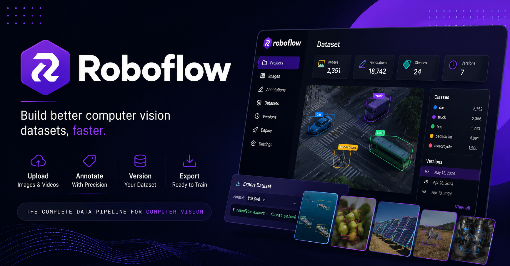

# 🤖 Roboflow

<p align="center">
  
</p>

<div align="center">

# 🤖 Roboflow

### Build, Manage, and Deploy Computer Vision Datasets

---


</div>

---

# 📚 Table of Contents

- What is Roboflow?
- Why Roboflow Matters
- The Roboflow Platform
- Projects
- Datasets
- Annotation Tools
- Export Formats
- Why We'll Use Roboflow
- Summary

---

# 🎯 Learning Objectives

By the end of this chapter, you will be able to:

- ✅ Understand what Roboflow is.
- ✅ Create your own Roboflow account.
- ✅ Create Computer Vision projects.
- ✅ Upload images.
- ✅ Annotate datasets.
- ✅ Generate dataset versions.
- ✅ Export datasets for AI training.
- ✅ Prepare datasets for Segment Anything Model 3 (SAM3).

---

# 🤔 What is Roboflow?

Roboflow is one of the world's most popular platforms for building Computer Vision datasets.

It provides everything needed to prepare images for Artificial Intelligence models.

Instead of managing thousands of image files manually, Roboflow allows you to organize, annotate, preprocess, augment, version, and export datasets through an intuitive web interface.

Whether you're training an object detector, an image segmentation model, or a classification model, Roboflow simplifies the entire workflow.

---

# 🌍 Why Roboflow Matters

Building a high-quality AI model requires more than just collecting images.

A complete Computer Vision workflow usually involves:

- Organizing images
- Creating annotations
- Cleaning datasets
- Applying preprocessing
- Performing data augmentation
- Exporting data in the correct format

Doing all of this manually is time-consuming and error-prone.

Roboflow automates many of these tasks, allowing developers to focus on building better AI models instead of managing files.

---

# 🚀 The Roboflow Platform

Roboflow provides an end-to-end workflow for Computer Vision.

Its main features include:

- 📂 Project Management
- 🖼️ Image Uploads
- ✏️ Annotation Tools
- ⚙️ Image Preprocessing
- 🔄 Data Augmentation
- 📦 Dataset Versioning
- 📤 Export in Multiple Formats
- ☁️ Cloud Dataset Management

These tools make Roboflow one of the most widely used platforms in modern Computer Vision.

---

# 📂 Projects

Every dataset begins with a project.

A project contains:

- Images
- Labels
- Classes
- Dataset Versions
- Team Members
- Export Options

Keeping everything inside a project makes datasets easier to organize and maintain.

---

# 🖼️ Datasets

A dataset is the collection of images used to train an AI model.

Examples include:

- Traffic signs
- Medical images
- Industrial defects
- Wildlife photos
- Satellite imagery
- Agricultural crops

The quality of your dataset has a direct impact on the performance of your AI model.

---

# ✏️ Annotation Tools

Roboflow includes built-in tools for labeling images.

Depending on your project, you can create:

- Bounding Boxes
- Polygons
- Segmentation Masks
- Classification Labels
- Keypoints

Accurate annotations are essential for successful AI training.

---

# 📤 Export Formats

Once your dataset is complete, Roboflow can export it in many popular formats.

Examples include:

- YOLO
- COCO
- Pascal VOC
- TensorFlow
- PyTorch
- Classification
- Segmentation

This flexibility allows the same dataset to be used with many different AI frameworks.

---

# 🧠 Why We'll Use Roboflow

Throughout this learning journey, Roboflow will help us:

- Organize datasets.
- Annotate images.
- Prepare segmentation datasets.
- Export data for AI models.
- Create professional Computer Vision workflows.
- Prepare datasets for Segment Anything Model 3 (SAM3).

Learning Roboflow is an essential step toward becoming a Computer Vision engineer.

---

# 🎯 Key Takeaways

After completing this introduction, you should understand that:

- ✅ Roboflow is a Computer Vision platform.
- ✅ It simplifies dataset management.
- ✅ It provides powerful annotation tools.
- ✅ It supports many export formats.
- ✅ It will become an important part of our SAM3 workflow.

Congratulations!

You are now ready to create your Roboflow account and begin building your first Computer Vision project.
---

# 👤 Creating Your Roboflow Account

Before building datasets, annotating images, or exporting data for AI models, you'll need a free Roboflow account.

Creating an account only takes a few minutes and gives you access to one of the most popular Computer Vision platforms used by developers, researchers, and companies around the world.

---

# 🌐 Step 1 — Visit Roboflow

Open your web browser and navigate to:

👉 https://roboflow.com

On the homepage, you'll find information about:

- 📂 Dataset Management
- ✏️ Image Annotation
- 🤖 AI Model Training
- 🚀 Deployment Tools
- 📚 Documentation

Take a few moments to explore the platform before creating your account.

---

# 📝 Step 2 — Sign Up

Click the **Sign Up** button.

You'll be asked to provide:

- 📧 Email Address
- 👤 Full Name
- 🔒 Password

You may also have the option to sign up using:

- Google
- GitHub

Choose the method that works best for you.

---

# ✉️ Step 3 — Verify Your Email

After creating your account, Roboflow may ask you to verify your email address.

Open your inbox.

Click the verification link.

If you don't receive the email, remember to check:

- Spam
- Promotions
- Junk Mail

Once verified, you'll have full access to your account.

---

# 🏢 Step 4 — Create Your Workspace

After logging in for the first time, Roboflow will ask you to create a **Workspace**.

A workspace is where all your Computer Vision projects will be stored.

Example:

```text
Peyman-AI
```

or

```text
SAM3-Learning
```

Choose a clear and professional name.

You can create additional workspaces later if needed.

---

# 📂 Understanding Workspaces

Think of a workspace as the top-level container for your projects.

Example:

```text
Workspace

├── Traffic Detection
├── Medical Imaging
├── SAM3 Experiments
├── Wildlife Dataset
└── Personal Projects
```

Keeping related projects together makes them much easier to manage.

---

# 📊 Your Dashboard

Once your workspace is ready, you'll see the Roboflow Dashboard.

From here you can:

- Create projects
- Upload images
- Manage datasets
- View dataset versions
- Export datasets
- Invite collaborators
- Access documentation

This dashboard will become your central hub for Computer Vision development.

---

# 👤 Complete Your Profile

Open your profile settings and review your information.

Recommended updates include:

- Profile picture
- Display name
- Organization (optional)
- Time zone

Keeping your profile complete helps when collaborating with teammates.

---

# 💰 Free vs Paid Plans

Roboflow offers multiple plans.

### Free Plan

Ideal for:

- Learning
- Personal projects
- University assignments
- Small Computer Vision datasets

This plan is more than enough for the exercises in this learning journey.

---

### Paid Plans

Designed for:

- Professional development
- Large datasets
- Team collaboration
- Enterprise deployments
- Advanced workflow automation

If your projects grow in the future, you can always upgrade.

---

# 🤝 Team Collaboration

One of Roboflow's strengths is collaboration.

You can invite teammates to:

- Annotate images
- Review labels
- Manage datasets
- Create new dataset versions

This is especially useful for research groups and development teams.

---

# 🔒 Privacy Options

When creating projects, you'll often be able to choose whether they are:

### Public

Anyone can view and learn from the project.

Ideal for:

- Open-source projects
- Educational content
- Community datasets

---

### Private

Only invited collaborators can access the project.

Ideal for:

- Company projects
- Research
- Proprietary datasets

Always choose the option that best fits your project requirements.

---

# 💡 Best Practices

- Use a professional workspace name.
- Verify your email immediately.
- Complete your profile.
- Organize related projects within the same workspace.
- Keep experimental work separate from production datasets.
- Use private projects when working with sensitive data.

These habits will make your projects easier to manage as they grow.

---

# 🧪 Mini Practice

Complete the following tasks:

- Create your Roboflow account.
- Verify your email.
- Create your first workspace.
- Explore the dashboard.
- Open your profile settings.
- Review the available plans.
- Locate the button for creating a new project.

Congratulations! 🎉

You now have everything needed to begin creating Computer Vision datasets.

---

# 🎯 Checkpoint

Before continuing, make sure you have:

- ✅ Created a Roboflow account.
- ✅ Verified your email.
- ✅ Created a workspace.
- ✅ Explored the dashboard.
- ✅ Reviewed your profile.
- ✅ Understood the difference between Free and Paid plans.
- ✅ Learned how Workspaces organize your projects.

Excellent!

Your Roboflow account is now ready.

In the next section, we'll create your **first Computer Vision project**, where you'll define the project type, classes, and dataset settings that will be used throughout the remainder of the SAM3 Learning Journey.

---

# 📂 Creating Your First Project

Now that your Roboflow account and workspace are ready, it's time to create your first Computer Vision project.

A project is where you'll organize your images, annotations, dataset versions, preprocessing steps, and exports.

Every AI dataset in Roboflow begins with a project.

---

# 🎯 Why Create a Project?

Projects help organize everything related to a Computer Vision dataset.

Each project contains:

- 🖼️ Images
- ✏️ Annotations
- 🏷️ Classes
- 📦 Dataset Versions
- ⚙️ Preprocessing Settings
- 🔄 Data Augmentation
- 📤 Export Formats

Keeping all of these resources together makes your workflow much easier to manage.

---

# ➕ Step 1 — Create a New Project

From your Roboflow Dashboard:

Click:

```text
Create Project
```

A new window will appear asking you to configure your project.

---

# 📝 Step 2 — Project Name

Choose a descriptive name.

Examples:

```text
SAM3-Practice
```

```text
Vehicle-Detection
```

```text
Medical-Segmentation
```

```text
Fruit-Detection
```

Choose names that clearly describe the purpose of the dataset.

---

# 📚 Step 3 — Select the Project Type

Roboflow supports several Computer Vision tasks.

Choose the option that matches your project.

Common project types include:

### 📦 Object Detection

Draw bounding boxes around objects.

Example:

- Cars
- People
- Animals
- Fruits

---

### ✂️ Instance Segmentation

Create precise masks around individual objects.

Example:

- Roads
- Buildings
- Leaves
- Medical images

This is one of the most important project types for **Segment Anything Model 3 (SAM3)**.

---

### 🖼️ Semantic Segmentation

Assign every pixel in the image to a class.

Unlike instance segmentation, individual objects of the same class are not separated.

---

### 🏷️ Classification

Assign one label to an entire image.

Example:

```text
Healthy
```

or

```text
Diseased
```

No bounding boxes or segmentation masks are required.

---

# 🎯 Which Project Type Will We Use?

Throughout most of this learning journey we'll focus on:

- ✅ Instance Segmentation

because it aligns closely with the capabilities of **Segment Anything Model 3 (SAM3)**.

Understanding segmentation workflows will make later chapters much easier.

---

# 🏷️ Step 4 — Add Classes

Classes define the objects your model should recognize.

Examples:

Traffic Project:

```text
Car
Bus
Truck
Motorcycle
Person
```

Fruit Project:

```text
Apple
Banana
Orange
Grape
```

Medical Project:

```text
Tumor
Healthy Tissue
```

Choose clear, consistent class names.

---

# 📂 Step 5 — Review Project Settings

Before creating the project, verify:

- Project Name
- Workspace
- Project Type
- Initial Classes
- Visibility (Public or Private)

If everything looks correct, click:

```text
Create Project
```

Your new Computer Vision project is now ready.

---

# 📊 Your Project Dashboard

After creating the project, you'll see a dashboard containing sections such as:

- Images
- Annotate
- Dataset
- Versions
- Deploy
- Settings

As your project grows, this dashboard becomes the central place for managing your dataset.

---

# 📁 Recommended Project Naming

As you build more datasets, use descriptive names.

Example:

```text
Workspace/

├── SAM3-Practice
├── Vehicle-Detection
├── Medical-Segmentation
├── Wildlife-Monitoring
└── Crop-Health
```

Good naming conventions make projects much easier to identify later.

---

# 🧠 Why Project Organization Matters

A well-organized workspace helps you:

- Find datasets quickly.
- Keep annotations consistent.
- Separate experiments.
- Collaborate with teammates.
- Maintain multiple AI projects efficiently.

Professional AI teams often manage dozens or even hundreds of datasets.

Organization becomes increasingly important as projects grow.

---

# 💡 Best Practices

- Use descriptive project names.
- Choose the correct project type from the beginning.
- Keep class names simple and consistent.
- Avoid duplicate or ambiguous class names.
- Separate unrelated datasets into different projects.
- Review your settings before creating the project.

These habits will save time and reduce errors later.

---

# 🧪 Mini Practice

Create your first project.

Suggested settings:

Project Name:

```text
SAM3-Practice
```

Project Type:

```text
Instance Segmentation
```

Classes:

```text
Person
Car
Dog
```

Once the project is created:

- Explore the dashboard.
- Locate the Images section.
- Locate the Annotation tools.
- Open the Dataset page.
- Review the project settings.

Congratulations! 🎉

You have created your first Roboflow Computer Vision project.

---

# 🎯 Checkpoint

Before continuing, make sure you can:

- ✅ Create a new project.
- ✅ Choose the correct project type.
- ✅ Add object classes.
- ✅ Navigate the project dashboard.
- ✅ Understand the purpose of Images, Annotations, Versions, and Settings.
- ✅ Organize projects using meaningful names.

Excellent!

Your first Computer Vision project is now ready.

In the next section, we'll upload real images and begin building the dataset that will eventually be used with **Segment Anything Model 3 (SAM3)**.


---

# 🖼️ Uploading Images

Every Computer Vision project begins with data.

Before an AI model can learn, it needs images that represent the objects or scenes you want it to recognize.

In Roboflow, uploading images is the first step toward building a high-quality dataset.

---

# 🎯 Why Image Quality Matters

An AI model can only learn from the data you provide.

High-quality images generally lead to better model performance.

When collecting images, consider:

- 📸 Good lighting
- 🔍 Clear objects
- 📏 Different object sizes
- 🌤️ Different weather conditions
- 🌙 Day and night images
- 📷 Multiple camera angles
- 🌎 Diverse backgrounds

A diverse dataset helps your model perform well in real-world situations.

---

# ➕ Step 1 — Open Your Project

From the Roboflow Dashboard:

Select the project you created earlier.

Example:

```text
SAM3-Practice
```

Once inside the project, you'll see an option similar to:

```text
Upload Images
```

Click it to begin adding data.

---

# 📤 Step 2 — Upload Your Images

Roboflow supports several upload methods.

You can:

- Drag and drop images into the browser.
- Select files from your computer.
- Upload ZIP archives.
- Import images from cloud storage (depending on available features).

Uploading multiple images at once is usually the fastest option.

---

# 📁 Supported Image Formats

Common supported formats include:

- JPG
- JPEG
- PNG
- BMP
- TIFF

Using high-resolution images often produces better annotation results.

---

# 📦 Upload Multiple Images

Instead of uploading one image at a time, select an entire folder or multiple files.

Example:

```text
traffic/

├── image001.jpg
├── image002.jpg
├── image003.jpg
├── image004.jpg
└── ...
```

Uploading batches saves time and helps maintain consistent datasets.

---

# 📊 Review Your Upload

After the upload finishes, Roboflow will display:

- Total images uploaded
- Upload progress
- Processing status
- Image thumbnails

Take a moment to verify that all images were imported successfully.

---

# 🗂️ Organizing Your Dataset

Before starting annotation, review your images.

Remove files that are:

- Blurry
- Duplicated
- Corrupted
- Extremely dark
- Extremely bright
- Irrelevant to your project

Cleaning your dataset now will improve training later.

---

# 📸 What Makes a Good Dataset?

A balanced dataset usually includes:

- Different object positions
- Different scales
- Various lighting conditions
- Different environments
- Partial object occlusions
- Multiple backgrounds

Avoid using nearly identical images whenever possible.

Diversity helps AI models generalize to new situations.

---

# ⚠️ Common Dataset Problems

Examples of issues that reduce model performance:

- Duplicate images
- Low-resolution images
- Incorrect file orientation
- Empty images
- Images without target objects
- Heavy compression artifacts

Reviewing your dataset before annotation can prevent many future problems.

---

# 📂 Recommended Folder Structure

Before uploading to Roboflow, it's helpful to organize your images locally.

Example:

```text
SAM3-Dataset/

├── images/
│
├── labels/
│
├── documentation/
│
└── exports/
```

Keeping datasets organized makes future updates much easier.

---

# 📈 Dataset Size

There is no universal "perfect" dataset size.

Small practice projects:

```text
50–200 images
```

Medium projects:

```text
500–2,000 images
```

Large production datasets:

```text
10,000+ images
```

For learning SAM3, even a relatively small, well-organized dataset is enough to understand the complete workflow.

---

# 🧠 Why We'll Upload Images

Throughout this learning journey, uploaded images will be used to:

- Create annotations
- Generate segmentation masks
- Build dataset versions
- Export training datasets
- Test AI models
- Evaluate segmentation results

Everything begins with high-quality images.

---

# 💡 Best Practices

- Upload clear, high-resolution images.
- Include diverse examples.
- Remove duplicates before annotation.
- Organize images into dedicated folders.
- Review uploaded files before continuing.
- Start with a manageable dataset while learning.

These habits lead to cleaner datasets and better AI models.

---

# 🧪 Mini Practice

Create a small practice dataset.

Suggested content:

- 20–50 images
- At least 3 object categories
- Different lighting conditions
- Different backgrounds

Upload the images to your Roboflow project.

After uploading:

- Verify the image count.
- Review the thumbnails.
- Remove any poor-quality images.
- Confirm that your dataset is ready for annotation.

Congratulations! 🎉

You have successfully uploaded your first Computer Vision dataset.

---

# 🎯 Checkpoint

Before continuing, make sure you can:

- ✅ Upload individual images.
- ✅ Upload multiple images at once.
- ✅ Recognize supported image formats.
- ✅ Organize your dataset.
- ✅ Identify poor-quality images.
- ✅ Understand why dataset diversity matters.
- ✅ Prepare images for annotation.

Excellent!

Your dataset is now ready.

In the next section, you'll begin one of the most important tasks in Computer Vision:

# ✏️ Annotating Images

You'll learn how to create bounding boxes, polygons, and segmentation masks that teach AI models exactly what they should recognize.

---

# ✏️ Annotating Images

Uploading images is only the first step.

Before an AI model can recognize objects, it must first learn **where those objects are located**.

This process is called **annotation** (or labeling).

Annotations tell the AI exactly what it should detect, classify, or segment.

Without accurate annotations, even the most advanced AI model cannot learn correctly.

---

# 🤔 What is Image Annotation?

Image annotation is the process of marking objects inside an image.

Depending on the type of Computer Vision project, annotations may include:

- 📦 Bounding Boxes
- ✂️ Segmentation Masks
- 🔷 Polygons
- 📍 Keypoints
- 🏷️ Image Labels

Each annotation teaches the model something about the image.

---

# 🎯 Why Annotation Matters

The quality of your annotations has a direct impact on model performance.

Poor annotations lead to:

- Incorrect predictions
- Low accuracy
- Confusing training data
- Weak generalization

Good annotations help AI models learn faster and make more accurate predictions.

---

# 📂 Open the Annotation Tool

Inside your Roboflow project:

Navigate to:

```text
Annotate
```

Select an image from your dataset.

The annotation editor will open.

This is where you'll begin labeling your images.

---

# 📦 Bounding Boxes

Bounding boxes are the most common annotation type.

They surround an object using a rectangle.

Example:

```text
+-------------+
|             |
|     Car     |
|             |
+-------------+
```

Bounding boxes are commonly used for:

- Cars
- People
- Animals
- Products
- Traffic signs

---

# ✂️ Segmentation Masks

Segmentation provides pixel-level annotations.

Instead of drawing a rectangle, you trace the actual shape of the object.

Example:

```text
███████
██████████
████████
██████
```

Segmentation masks are ideal for:

- Medical imaging
- Agriculture
- Satellite imagery
- Industrial inspection

Most importantly...

This is the annotation style we'll use with **Segment Anything Model 3 (SAM3).**

---

# 🔷 Polygons

Polygons allow you to manually outline objects.

Instead of using rectangles, you place points around the object.

Example:

```text
•
  •
     •
  •
•
```

Polygons produce much more accurate object boundaries than bounding boxes.

---

# 📍 Keypoints

Some AI projects require marking specific points.

Examples:

- Human pose estimation
- Facial landmarks
- Hand tracking
- Animal skeletons

Each point represents an important feature.

---

# 🏷️ Classes

Every annotation must belong to a class.

Example:

```text
Person
```

```text
Car
```

```text
Dog
```

```text
Tree
```

Choose class names carefully.

Changing class names later can create unnecessary confusion.

---

# 🎨 Consistency is Important

Imagine one annotator labels:

```text
Car
```

Another labels:

```text
Vehicle
```

And another writes:

```text
Automobile
```

Although they describe the same object, the AI sees them as three different classes.

Always use consistent class names throughout the project.

---

# 🧠 Good Annotation Practices

Try to:

- Label every visible object.
- Follow object boundaries carefully.
- Use the same annotation style for every image.
- Zoom in when needed.
- Double-check your work.

High-quality annotations lead to high-quality AI models.

---

# ⚠️ Common Annotation Mistakes

Avoid:

❌ Loose bounding boxes

❌ Missing objects

❌ Incorrect class labels

❌ Overlapping labels

❌ Poorly traced segmentation masks

❌ Inconsistent annotation style

Even small mistakes can reduce model accuracy.

---

# 🔍 Zoom for Precision

When annotating small objects:

- Zoom in.
- Adjust points carefully.
- Verify the object boundaries.

Precision becomes increasingly important for segmentation tasks.

---

# 🚀 Annotation Speed

As you gain experience, you'll annotate much faster.

Tips:

- Learn keyboard shortcuts.
- Work systematically.
- Annotate similar objects together.
- Review your work before moving to the next image.

Quality should always come before speed.

---

# 🤖 AI-Assisted Annotation

Roboflow also provides AI-assisted annotation tools.

These tools can:

- Suggest bounding boxes.
- Detect objects automatically.
- Accelerate segmentation.
- Reduce manual work.

Always review AI-generated annotations before accepting them.

Human verification remains essential.

---

# 🧪 Mini Practice

Annotate several images using your project.

Suggested classes:

```text
Person
Car
Dog
```

Practice:

- Creating bounding boxes.
- Drawing segmentation masks.
- Editing annotations.
- Correcting mistakes.

Review each image before continuing.

---

# 💡 Best Practices

- Keep class names consistent.
- Label every visible object.
- Use accurate boundaries.
- Review annotations regularly.
- Maintain the same annotation style throughout the dataset.
- Prefer quality over speed.

---

# 🎯 Checkpoint

Before continuing, make sure you can:

- ✅ Create bounding boxes.
- ✅ Draw segmentation masks.
- ✅ Use polygons.
- ✅ Assign correct classes.
- ✅ Edit annotations.
- ✅ Identify common annotation mistakes.
- ✅ Understand why annotation quality matters.

Congratulations! 🎉

You have learned one of the most important skills in Computer Vision.

Your annotated images are now ready to be transformed into professional AI datasets.

---

# 🚀 Next: Dataset Versions

In the next section, you'll learn how Roboflow creates **Dataset Versions**, allowing you to apply preprocessing, augmentation, and export your dataset for training with modern AI models such as **Segment Anything Model 3 (SAM3)**.

---

# 📦 Dataset Versions

One of Roboflow's most valuable features is **Dataset Versioning**.

Instead of modifying your original dataset, Roboflow creates new versions that preserve your original images while applying preprocessing, augmentation, and different export settings.

This allows you to safely experiment without losing your original data.

---

# 🤔 What is a Dataset Version?

A Dataset Version is a processed copy of your dataset.

It may include:

- Image preprocessing
- Data augmentation
- Different train/validation/test splits
- Image resizing
- Different export formats

Your original dataset always remains unchanged.

Think of it as creating multiple editions of the same dataset for different experiments.

---

# 🎯 Why Create Dataset Versions?

Different AI models often require different dataset configurations.

For example:

Version 1

- Resize images
- No augmentation
- COCO format

Version 2

- Resize images
- Flip images
- Rotate images
- YOLO format

Version 3

- Resize images
- Segmentation masks
- SAM-compatible format

Each version can be optimized for a different workflow.

---

# ➕ Step 1 — Open Versions

Inside your Roboflow project, navigate to:

```text
Versions
```

If this is your first project, you won't see any dataset versions yet.

Click:

```text
Generate New Version
```

This starts the dataset generation process.

---

# 🖼️ Image Preprocessing

Before exporting the dataset, Roboflow allows you to preprocess every image.

Common preprocessing options include:

- Resize
- Auto-orientation
- Grayscale
- Contrast adjustment
- Brightness normalization

These operations help create consistent training data.

---

# 📏 Resize Images

Many AI models expect images with fixed dimensions.

Example:

```text
640 × 640
```

or

```text
1024 × 1024
```

Roboflow can automatically resize every image during version generation.

---

# 🔄 Auto Orientation

Sometimes images contain incorrect orientation metadata.

Auto Orientation ensures every image appears correctly before training.

This simple step prevents many common dataset issues.

---

# 🎨 Data Augmentation

Augmentation artificially increases dataset diversity.

Instead of collecting more images, Roboflow creates realistic variations.

Examples include:

- Horizontal Flip
- Vertical Flip
- Rotation
- Brightness Adjustment
- Contrast Adjustment
- Blur
- Noise
- Crop
- Scale

These transformations help AI models generalize better.

---

# 🔁 Why Use Augmentation?

Imagine you only have:

```text
200 images
```

After augmentation, your training process may effectively see many more variations.

Benefits include:

- Better generalization
- Reduced overfitting
- Improved robustness
- More diverse training samples

Augmentation is especially helpful when working with smaller datasets.

---

# 📊 Train, Validation, and Test Split

Roboflow automatically divides your dataset into three groups.

Typical split:

```text
Train

70%
```

```text
Validation

20%
```

```text
Test

10%
```

These percentages can often be adjusted depending on your project.

---

# 📈 Why Dataset Splits Matter

Each split serves a different purpose.

| Split | Purpose |
|--------|---------|
| Train | Teach the model |
| Validation | Tune the model |
| Test | Measure final performance |

Keeping these groups separate helps evaluate how well a model performs on unseen data.

---

# 🚀 Generate the Dataset

After selecting your preprocessing and augmentation settings:

Click:

```text
Generate
```

Roboflow will begin creating a new dataset version.

Depending on dataset size, this may take a few moments.

---

# 📦 Version History

Every generated dataset version is saved.

Example:

```text
Version 1

Original Dataset
```

```text
Version 2

+ Resize
```

```text
Version 3

+ Resize
+ Augmentation
```

You can always return to previous versions without affecting your original dataset.

---

# 🧠 Why We'll Use Dataset Versions

Throughout this learning journey we'll generate different versions for:

- YOLO
- COCO
- Segmentation
- SAM3
- Research experiments

This flexibility makes Roboflow an excellent platform for Computer Vision workflows.

---

# 💡 Best Practices

- Keep your original dataset untouched.
- Create separate versions for different experiments.
- Apply augmentation only to the training set.
- Review preprocessing settings before generating a version.
- Give each version a clear description.

These habits make experiments easier to reproduce and compare.

---

# 🧪 Mini Practice

Generate your first dataset version.

Suggested configuration:

Image Size:

```text
640 × 640
```

Preprocessing:

- Auto Orientation

Augmentation:

- Horizontal Flip
- Brightness Adjustment

Dataset Split:

```text
70 / 20 / 10
```

After generation:

- Review the processed images.
- Compare them with the originals.
- Explore the Version page.
- Verify the train, validation, and test counts.

Congratulations! 🎉

You have successfully generated your first Roboflow dataset version.

---

# 🎯 Checkpoint

Before continuing, make sure you can:

- ✅ Explain what a Dataset Version is.
- ✅ Apply preprocessing.
- ✅ Apply augmentation.
- ✅ Resize images.
- ✅ Understand dataset splits.
- ✅ Generate multiple dataset versions.
- ✅ Compare different versions.

Excellent!

Your dataset is now professionally prepared for export.

---

# 🚀 Next: Export Formats

In the next section, you'll learn how to export your dataset in professional formats such as:

- YOLO
- COCO
- Pascal VOC
- TensorFlow
- PyTorch
- Segmentation Formats

We'll also discuss **which export format is best suited for Segment Anything Model 3 (SAM3)** and why choosing the correct format matters.

---

# 📤 Export Formats

After your dataset has been annotated and processed, it's time to export it.

Exporting converts your Roboflow project into a format that can be used by different Artificial Intelligence frameworks.

This is one of Roboflow's greatest strengths.

Instead of manually reorganizing thousands of files, Roboflow automatically prepares the dataset for your chosen AI framework.

---

# 🤔 Why Export a Dataset?

Different AI models expect different dataset structures.

For example:

- YOLO expects one format.
- COCO expects another.
- TensorFlow uses another.
- PyTorch often uses custom structures.

Roboflow automatically generates the correct directory structure and annotation files for each framework.

---

# 📦 Available Export Formats

Roboflow supports many export formats.

Some of the most popular include:

- YOLOv5
- YOLOv8
- COCO
- Pascal VOC
- TensorFlow TFRecord
- TensorFlow Object Detection
- PyTorch
- Image Classification
- Semantic Segmentation
- Instance Segmentation

Support for additional formats continues to grow.

---

# 🏆 YOLO Format

YOLO is one of the most popular Computer Vision frameworks.

A typical YOLO export contains:

```text
dataset/

├── train/
│   ├── images/
│   └── labels/
│
├── valid/
│   ├── images/
│   └── labels/
│
├── test/
│   ├── images/
│   └── labels/
│
└── data.yaml
```

This format is ideal for object detection tasks.

---

# 📦 COCO Format

COCO is one of the most widely used research formats.

Example:

```text
dataset/

├── train/
├── val/
├── test/
└── annotations.json
```

The `annotations.json` file stores all object annotations.

Many Computer Vision libraries support COCO directly.

---

# 📚 Pascal VOC

Pascal VOC stores annotations as XML files.

Example:

```text
image001.jpg

image001.xml
```

Although older than COCO and YOLO, it is still used in many educational and legacy projects.

---

# 🔥 PyTorch Format

Some exports are optimized for PyTorch projects.

These exports typically include:

- Images
- Labels
- Folder structure
- Helper scripts (when available)

PyTorch is one of the primary frameworks we'll use throughout this learning journey.

---

# 🧠 Segmentation Formats

For segmentation projects, Roboflow exports:

- Segmentation masks
- Polygon annotations
- Instance segmentation labels

These formats are particularly useful when working with modern Computer Vision models.

---

# 🎯 Which Format Will We Use?

Throughout most of this repository, we'll primarily work with:

- COCO
- Segmentation datasets
- PyTorch-compatible exports

These formats integrate well with modern AI workflows and provide the flexibility needed for projects involving **Segment Anything Model 3 (SAM3)**.

---

# 📤 Export Your Dataset

Inside the **Versions** page:

Select the version you want to export.

Click:

```text
Export Dataset
```

You'll see a list of supported formats.

Choose the one that matches your project requirements.

---

# ☁️ Download Options

Depending on the selected format, Roboflow may provide:

- ZIP download
- Python code snippet
- Google Colab integration
- API access

These options make it easy to begin training immediately.

---

# 🐍 Export to Google Colab

One of the most convenient features is the ability to export directly to Google Colab.

Roboflow often provides ready-to-use Python code that automatically downloads your dataset into a notebook.

Example:

```python
from roboflow import Roboflow

rf = Roboflow(api_key="YOUR_API_KEY")
project = rf.workspace("workspace-name").project("project-name")
dataset = project.version(1).download("coco")
```

> **Important:** Replace `"YOUR_API_KEY"` with your own Roboflow API key. Never publish your real API key in a public repository.

This greatly simplifies dataset management.

---

# 📊 Compare Export Formats

| Format | Best For |
|---------|----------|
| YOLO | Object Detection |
| COCO | Research & Computer Vision |
| Pascal VOC | Legacy Projects |
| TensorFlow | TensorFlow Models |
| PyTorch | PyTorch Projects |
| Segmentation | Pixel-Level Annotation |

Choosing the right format depends on the AI model you plan to use.

---

# 💡 Best Practices

- Export only finalized dataset versions.
- Keep original datasets unchanged.
- Document which export format was used.
- Save exported datasets in organized folders.
- Keep a copy of important dataset versions.

Good organization makes future experiments much easier.

---

# 🧪 Mini Practice

Export your practice dataset.

Suggested format:

```text
COCO
```

Then:

- Download the dataset.
- Review the folder structure.
- Open the annotation files.
- Compare the exported dataset with the original Roboflow project.

Next, export the same dataset using another format, such as YOLO, and compare the differences.

This exercise will help you understand how different AI frameworks expect their data.

---

# 🎯 Checkpoint

Before continuing, make sure you can:

- ✅ Explain why datasets need to be exported.
- ✅ Identify common export formats.
- ✅ Understand the difference between YOLO and COCO.
- ✅ Export a dataset.
- ✅ Download exported files.
- ✅ Read the exported folder structure.
- ✅ Choose the appropriate format for a project.

Congratulations! 🎉

You now know how to prepare your Roboflow dataset for use with modern AI frameworks.

---

# 🚀 Next: Using Roboflow with SAM3

In the next section, you'll learn how Roboflow fits into the complete **Segment Anything Model 3 (SAM3)** workflow.

You'll discover how to:

- Organize datasets for SAM3.
- Export segmentation-ready data.
- Connect Roboflow with Google Colab.
- Prepare datasets for inference and future training workflows.

This is where everything you've learned so far comes together.

---

# 🤖 Using Roboflow with SAM3

Now that you've learned how to create projects, upload images, annotate data, generate dataset versions, and export datasets, it's time to see how Roboflow fits into the **Segment Anything Model 3 (SAM3)** workflow.

Roboflow and SAM3 complement each other extremely well.

Roboflow helps you prepare high-quality datasets, while SAM3 provides state-of-the-art segmentation capabilities.

Together they create a powerful Computer Vision workflow.

---

# 🔄 The Complete Workflow

Throughout this learning journey, we'll follow a professional workflow similar to the one used by AI engineers.

```text
Collect Images
        │
        ▼
Upload to Roboflow
        │
        ▼
Annotate Images
        │
        ▼
Generate Dataset Version
        │
        ▼
Export Dataset
        │
        ▼
Google Colab
        │
        ▼
Segment Anything Model 3 (SAM3)
        │
        ▼
Inference & Results
```

Each step builds on the previous one.

---

# 🧠 Why Use Roboflow Before SAM3?

Although SAM3 is excellent at segmentation, your workflow still needs:

- Organized datasets
- Consistent class names
- High-quality annotations
- Version control
- Standard export formats

Roboflow provides all of these features before your data reaches the AI model.

---

# 📁 Organizing Your Dataset

Before exporting your dataset, make sure it is well organized.

Example:

```text
SAM3-Dataset/

├── train/
│
├── validation/
│
├── test/
│
├── images/
│
├── masks/
│
└── documentation/
```

A clean structure makes future training and experimentation much easier.

---

# ✂️ Segmentation Projects

Since SAM3 specializes in segmentation, your datasets should focus on accurate object boundaries.

Examples include:

- People
- Vehicles
- Buildings
- Medical structures
- Crops
- Animals

High-quality segmentation masks generally produce better AI results.

---

# 📦 Exporting for SAM3

For most SAM3 workflows, we'll use formats compatible with modern Computer Vision pipelines.

Recommended export formats include:

- COCO
- Instance Segmentation
- PyTorch-compatible datasets

These formats preserve the detailed annotations required for segmentation tasks.

---

# ☁️ Using Google Colab

After exporting your dataset, upload or download it into Google Colab.

Typical workflow:

```text
Roboflow

↓

Export Dataset

↓

Google Colab

↓

Run SAM3

↓

Save Results
```

This cloud-based workflow eliminates the need for expensive local hardware.

---

# 📥 Downloading the Dataset

Depending on your project, Roboflow may provide:

- ZIP download
- Python integration
- API access
- Google Colab notebook

These options allow you to quickly move your dataset into your AI environment.

---

# 🧪 Testing Your Dataset

Before using SAM3, verify:

- Images load correctly.
- Annotation files exist.
- Segmentation masks align with the images.
- Dataset folders are complete.
- No files are missing.

Detecting problems early saves a significant amount of debugging time later.

---

# 📈 Improving Your Dataset

Your first dataset is rarely your final dataset.

As your project evolves, you may:

- Add more images.
- Improve annotations.
- Correct labeling mistakes.
- Create new dataset versions.
- Compare different preprocessing settings.

Dataset improvement is an ongoing process in professional AI development.

---

# 🤝 Roboflow + Hugging Face + Colab

Throughout the remainder of this repository, these three platforms will work together.

```text
Roboflow
      │
      ▼
Prepared Dataset
      │
      ▼
Google Colab
      │
      ▼
Hugging Face Libraries
      │
      ▼
Segment Anything Model 3
      │
      ▼
Predictions & Results
```

Each platform has a specific role:

- **Roboflow** prepares the data.
- **Google Colab** provides the computing environment.
- **Hugging Face** provides AI libraries and models.
- **SAM3** performs segmentation.

---

# 🚀 Preparing for Future Chapters

In upcoming chapters, you'll learn how to:

- Install SAM3.
- Download model checkpoints.
- Load images.
- Perform image segmentation.
- Process videos.
- Visualize masks.
- Build complete Computer Vision applications.

Everything you've learned so far prepares you for these advanced topics.

---

# 💡 Best Practices

- Keep your Roboflow project organized.
- Review annotations before exporting.
- Save exported datasets.
- Use meaningful version names.
- Keep documentation with your dataset.
- Test your dataset before running AI models.

These habits improve reproducibility and reduce errors.

---

# 🧪 Mini Practice

Using your practice project:

1. Review your annotations.
2. Generate a new dataset version.
3. Export it in COCO format.
4. Download the dataset.
5. Open the folder and inspect its contents.
6. Upload the dataset to Google Colab.
7. Verify that all images and annotation files are present.

Congratulations! 🎉

You have successfully prepared your first Computer Vision dataset for use with Segment Anything Model 3.

---

# 🎯 Checkpoint

Before continuing, make sure you can:

- ✅ Explain the Roboflow → SAM3 workflow.
- ✅ Organize a Computer Vision dataset.
- ✅ Export segmentation-ready data.
- ✅ Move datasets into Google Colab.
- ✅ Verify exported files.
- ✅ Understand the role of Roboflow in the AI pipeline.
- ✅ Prepare datasets for future SAM3 chapters.

Excellent!

You now understand how Roboflow integrates with the complete AI workflow.

In the next section, we'll finish this chapter with **Best Practices & Productivity Tips**, where you'll learn professional habits for managing datasets efficiently and avoiding common mistakes.


Generated image: 04 | Python: El lenguaje de posibilidades

Edit


image(20260807-212733).png
image(20260807-212823).png
image(20260807-212832).png
image(20260807-212854).png
let me stop you there ! just use this link of my github ! i explain all there completly ! 


Pasted markdown(1).md
File
no you dont understand ! use untill here what we have  just  where you need explain how to code ! just show link of what i made ! that is it ! 

Generated image: Google Colab: Python en la Nube


Edit


Generated image: Google Colab: Aprende en la Nube


Edit


Generated image


Edit


Generated image: Roboflow: Visión por Computadora Futurista


Edit


Perfect! Now we reach the point where your dataset becomes usable by AI frameworks.

Part 7 — Export Formats
---

# 📤 Export Formats

After your dataset has been annotated and processed, it's time to export it.

Exporting converts your Roboflow project into a format that can be used by different Artificial Intelligence frameworks.

This is one of Roboflow's greatest strengths.

Instead of manually reorganizing thousands of files, Roboflow automatically prepares the dataset for your chosen AI framework.

---

# 🤔 Why Export a Dataset?

Different AI models expect different dataset structures.

For example:

- YOLO expects one format.
- COCO expects another.
- TensorFlow uses another.
- PyTorch often uses custom structures.

Roboflow automatically generates the correct directory structure and annotation files for each framework.

---

# 📦 Available Export Formats

Roboflow supports many export formats.

Some of the most popular include:

- YOLOv5
- YOLOv8
- COCO
- Pascal VOC
- TensorFlow TFRecord
- TensorFlow Object Detection
- PyTorch
- Image Classification
- Semantic Segmentation
- Instance Segmentation

Support for additional formats continues to grow.

---

# 🏆 YOLO Format

YOLO is one of the most popular Computer Vision frameworks.

A typical YOLO export contains:

```text
dataset/

├── train/
│   ├── images/
│   └── labels/
│
├── valid/
│   ├── images/
│   └── labels/
│
├── test/
│   ├── images/
│   └── labels/
│
└── data.yaml
```

This format is ideal for object detection tasks.

---

# 📦 COCO Format

COCO is one of the most widely used research formats.

Example:

```text
dataset/

├── train/
├── val/
├── test/
└── annotations.json
```

The `annotations.json` file stores all object annotations.

Many Computer Vision libraries support COCO directly.

---

# 📚 Pascal VOC

Pascal VOC stores annotations as XML files.

Example:

```text
image001.jpg

image001.xml
```

Although older than COCO and YOLO, it is still used in many educational and legacy projects.

---

# 🔥 PyTorch Format

Some exports are optimized for PyTorch projects.

These exports typically include:

- Images
- Labels
- Folder structure
- Helper scripts (when available)

PyTorch is one of the primary frameworks we'll use throughout this learning journey.

---

# 🧠 Segmentation Formats

For segmentation projects, Roboflow exports:

- Segmentation masks
- Polygon annotations
- Instance segmentation labels

These formats are particularly useful when working with modern Computer Vision models.

---

# 🎯 Which Format Will We Use?

Throughout most of this repository, we'll primarily work with:

- COCO
- Segmentation datasets
- PyTorch-compatible exports

These formats integrate well with modern AI workflows and provide the flexibility needed for projects involving **Segment Anything Model 3 (SAM3)**.

---

# 📤 Export Your Dataset

Inside the **Versions** page:

Select the version you want to export.

Click:

```text
Export Dataset
```

You'll see a list of supported formats.

Choose the one that matches your project requirements.

---

# ☁️ Download Options

Depending on the selected format, Roboflow may provide:

- ZIP download
- Python code snippet
- Google Colab integration
- API access

These options make it easy to begin training immediately.

---

# 🐍 Export to Google Colab

One of the most convenient features is the ability to export directly to Google Colab.

Roboflow often provides ready-to-use Python code that automatically downloads your dataset into a notebook.

Example:

```python
from roboflow import Roboflow

rf = Roboflow(api_key="YOUR_API_KEY")
project = rf.workspace("workspace-name").project("project-name")
dataset = project.version(1).download("coco")
```

> **Important:** Replace `"YOUR_API_KEY"` with your own Roboflow API key. Never publish your real API key in a public repository.

This greatly simplifies dataset management.

---

# 📊 Compare Export Formats

| Format | Best For |
|---------|----------|
| YOLO | Object Detection |
| COCO | Research & Computer Vision |
| Pascal VOC | Legacy Projects |
| TensorFlow | TensorFlow Models |
| PyTorch | PyTorch Projects |
| Segmentation | Pixel-Level Annotation |

Choosing the right format depends on the AI model you plan to use.

---

# 💡 Best Practices

- Export only finalized dataset versions.
- Keep original datasets unchanged.
- Document which export format was used.
- Save exported datasets in organized folders.
- Keep a copy of important dataset versions.

Good organization makes future experiments much easier.

---

# 🧪 Mini Practice

Export your practice dataset.

Suggested format:

```text
COCO
```

Then:

- Download the dataset.
- Review the folder structure.
- Open the annotation files.
- Compare the exported dataset with the original Roboflow project.

Next, export the same dataset using another format, such as YOLO, and compare the differences.

This exercise will help you understand how different AI frameworks expect their data.

---

# 🎯 Checkpoint

Before continuing, make sure you can:

- ✅ Explain why datasets need to be exported.
- ✅ Identify common export formats.
- ✅ Understand the difference between YOLO and COCO.
- ✅ Export a dataset.
- ✅ Download exported files.
- ✅ Read the exported folder structure.
- ✅ Choose the appropriate format for a project.

Congratulations! 🎉

You now know how to prepare your Roboflow dataset for use with modern AI frameworks.

---

# 🚀 Next: Using Roboflow with SAM3

In the next section, you'll learn how Roboflow fits into the complete **Segment Anything Model 3 (SAM3)** workflow.

You'll discover how to:

- Organize datasets for SAM3.
- Export segmentation-ready data.
- Connect Roboflow with Google Colab.
- Prepare datasets for inference and future training workflows.

This is where everything you've learned so far comes together.

next

Perfect! This section connects everything we've learned so far and prepares readers for the upcoming SAM3 chapters.

Part 8 — Using Roboflow with SAM3
---

# 🤖 Using Roboflow with SAM3

Now that you've learned how to create projects, upload images, annotate data, generate dataset versions, and export datasets, it's time to see how Roboflow fits into the **Segment Anything Model 3 (SAM3)** workflow.

Roboflow and SAM3 complement each other extremely well.

Roboflow helps you prepare high-quality datasets, while SAM3 provides state-of-the-art segmentation capabilities.

Together they create a powerful Computer Vision workflow.

---

# 🔄 The Complete Workflow

Throughout this learning journey, we'll follow a professional workflow similar to the one used by AI engineers.

```text
Collect Images
        │
        ▼
Upload to Roboflow
        │
        ▼
Annotate Images
        │
        ▼
Generate Dataset Version
        │
        ▼
Export Dataset
        │
        ▼
Google Colab
        │
        ▼
Segment Anything Model 3 (SAM3)
        │
        ▼
Inference & Results
```

Each step builds on the previous one.

---

# 🧠 Why Use Roboflow Before SAM3?

Although SAM3 is excellent at segmentation, your workflow still needs:

- Organized datasets
- Consistent class names
- High-quality annotations
- Version control
- Standard export formats

Roboflow provides all of these features before your data reaches the AI model.

---

# 📁 Organizing Your Dataset

Before exporting your dataset, make sure it is well organized.

Example:

```text
SAM3-Dataset/

├── train/
│
├── validation/
│
├── test/
│
├── images/
│
├── masks/
│
└── documentation/
```

A clean structure makes future training and experimentation much easier.

---

# ✂️ Segmentation Projects

Since SAM3 specializes in segmentation, your datasets should focus on accurate object boundaries.

Examples include:

- People
- Vehicles
- Buildings
- Medical structures
- Crops
- Animals

High-quality segmentation masks generally produce better AI results.

---

# 📦 Exporting for SAM3

For most SAM3 workflows, we'll use formats compatible with modern Computer Vision pipelines.

Recommended export formats include:

- COCO
- Instance Segmentation
- PyTorch-compatible datasets

These formats preserve the detailed annotations required for segmentation tasks.

---

# ☁️ Using Google Colab

After exporting your dataset, upload or download it into Google Colab.

Typical workflow:

```text
Roboflow

↓

Export Dataset

↓

Google Colab

↓

Run SAM3

↓

Save Results
```

This cloud-based workflow eliminates the need for expensive local hardware.

---

# 📥 Downloading the Dataset

Depending on your project, Roboflow may provide:

- ZIP download
- Python integration
- API access
- Google Colab notebook

These options allow you to quickly move your dataset into your AI environment.

---

# 🧪 Testing Your Dataset

Before using SAM3, verify:

- Images load correctly.
- Annotation files exist.
- Segmentation masks align with the images.
- Dataset folders are complete.
- No files are missing.

Detecting problems early saves a significant amount of debugging time later.

---

# 📈 Improving Your Dataset

Your first dataset is rarely your final dataset.

As your project evolves, you may:

- Add more images.
- Improve annotations.
- Correct labeling mistakes.
- Create new dataset versions.
- Compare different preprocessing settings.

Dataset improvement is an ongoing process in professional AI development.

---

# 🤝 Roboflow + Hugging Face + Colab

Throughout the remainder of this repository, these three platforms will work together.

```text
Roboflow
      │
      ▼
Prepared Dataset
      │
      ▼
Google Colab
      │
      ▼
Hugging Face Libraries
      │
      ▼
Segment Anything Model 3
      │
      ▼
Predictions & Results
```

Each platform has a specific role:

- **Roboflow** prepares the data.
- **Google Colab** provides the computing environment.
- **Hugging Face** provides AI libraries and models.
- **SAM3** performs segmentation.

---

# 🚀 Preparing for Future Chapters

In upcoming chapters, you'll learn how to:

- Install SAM3.
- Download model checkpoints.
- Load images.
- Perform image segmentation.
- Process videos.
- Visualize masks.
- Build complete Computer Vision applications.

Everything you've learned so far prepares you for these advanced topics.

---

# 💡 Best Practices

- Keep your Roboflow project organized.
- Review annotations before exporting.
- Save exported datasets.
- Use meaningful version names.
- Keep documentation with your dataset.
- Test your dataset before running AI models.

These habits improve reproducibility and reduce errors.

---

# 🧪 Mini Practice

Using your practice project:

1. Review your annotations.
2. Generate a new dataset version.
3. Export it in COCO format.
4. Download the dataset.
5. Open the folder and inspect its contents.
6. Upload the dataset to Google Colab.
7. Verify that all images and annotation files are present.

Congratulations! 🎉

You have successfully prepared your first Computer Vision dataset for use with Segment Anything Model 3.

---

# 🎯 Checkpoint

Before continuing, make sure you can:

- ✅ Explain the Roboflow → SAM3 workflow.
- ✅ Organize a Computer Vision dataset.
- ✅ Export segmentation-ready data.
- ✅ Move datasets into Google Colab.
- ✅ Verify exported files.
- ✅ Understand the role of Roboflow in the AI pipeline.
- ✅ Prepare datasets for future SAM3 chapters.

Excellent!

You now understand how Roboflow integrates with the complete AI workflow.

In the next section, we'll finish this chapter with **Best Practices & Productivity Tips**, where you'll learn professional habits for managing datasets efficiently and avoiding common mistakes.

next

Perfect! Let's finish the Roboflow chapter with professional workflow tips.

Part 9 — Roboflow Best Practices & Productivity Tips
---

# ⚡ Roboflow Best Practices & Productivity Tips

As your Computer Vision projects become larger, managing datasets efficiently becomes just as important as building AI models.

Professional AI engineers spend a significant amount of time organizing data, reviewing annotations, and maintaining high-quality datasets.

This section shares practical habits that will help you build cleaner datasets and more reliable AI models.

---

# 📂 Organize Your Projects

Create separate projects for different objectives.

Example:

```text
Workspace

├── SAM3-Practice
├── Traffic Detection
├── Medical Imaging
├── Wildlife Monitoring
└── Agriculture
```

Avoid combining unrelated datasets into the same project.

---

# 🏷️ Use Consistent Class Names

Choose class names before starting your annotations.

Example:

```text
Person
Car
Dog
Bicycle
```

Avoid mixing names such as:

```text
Car
Vehicle
Automobile
```

Although they refer to the same object, the AI interprets them as different classes.

Consistency is critical.

---

# 📷 Prioritize Image Quality

A model cannot learn from poor-quality images.

Whenever possible, use images that are:

- High resolution
- Sharp
- Well lit
- Properly exposed
- Relevant to the project

Remove blurry or duplicate images before annotation.

---

# 🎯 Label Every Relevant Object

When annotating, avoid skipping objects.

Example:

If an image contains:

- Three people
- Two cars

Annotate all five objects whenever they are relevant to your project.

Incomplete annotations reduce model quality.

---

# ✂️ Review Annotations Carefully

Before generating a dataset version:

Review every annotation.

Look for:

- Incorrect labels
- Missing objects
- Loose bounding boxes
- Poor segmentation masks
- Typographical errors

Small annotation mistakes can have a significant impact on model performance.

---

# 🔄 Create Multiple Dataset Versions

Don't overwrite your work.

Instead, generate new dataset versions for different experiments.

Example:

```text
Version 1

Original Dataset
```

```text
Version 2

Resize Images
```

```text
Version 3

Resize + Augmentation
```

This makes it easy to compare different preprocessing strategies.

---

# 💾 Keep Local Backups

Although Roboflow stores your projects in the cloud, it's still good practice to maintain backups.

Save:

- Original images
- Exported datasets
- Documentation
- Annotation notes

Having backups protects your work against accidental deletion or future platform changes.

---

# 📚 Document Your Dataset

Create a simple README for every dataset.

Include:

- Project description
- Number of images
- Classes
- Annotation type
- Export format
- Version number

Documentation makes future updates much easier.

---

# 🤝 Collaborate Carefully

If multiple people annotate the same dataset:

Agree on:

- Class names
- Annotation style
- Object boundaries
- Labeling rules

Consistency between annotators is extremely important.

---

# 🧠 Think Like the AI

Ask yourself:

> "If I were the model, would these annotations teach me correctly?"

Looking at your dataset from the model's perspective often reveals mistakes that are easy to overlook.

---

# ⚠️ Common Beginner Mistakes

Avoid these common issues:

- Mixing different annotation styles.
- Using inconsistent class names.
- Uploading duplicate images.
- Exporting the wrong dataset version.
- Forgetting to review annotations.
- Applying excessive augmentation.
- Deleting original images.

Learning to avoid these mistakes will save you time and improve your results.

---

# 🚀 Productivity Tips

Professional AI developers often:

- Keep datasets organized from day one.
- Name versions clearly.
- Document every major change.
- Review annotations before exporting.
- Test small datasets before scaling up.
- Maintain backup copies of important work.

These habits make projects easier to maintain and reproduce.

---

# 🧪 Mini Practice

Review your project.

Complete the following tasks:

- Rename any unclear classes.
- Remove duplicate images.
- Review five annotated images.
- Generate a second dataset version.
- Export both versions.
- Compare the results.

This exercise reinforces the importance of organization and quality control.

---

# 🎯 Checkpoint

Before continuing, make sure you can:

- ✅ Organize Roboflow projects.
- ✅ Use consistent class names.
- ✅ Review annotations.
- ✅ Generate multiple dataset versions.
- ✅ Keep backups.
- ✅ Document datasets.
- ✅ Avoid common beginner mistakes.
- ✅ Apply professional Computer Vision workflows.

Excellent! 🎉

You now understand the same workflow used by many Computer Vision engineers and AI researchers to build reliable, high-quality datasets.

---

# 📚 Chapter Summary

Congratulations! 🎉

You have successfully completed the **Roboflow** chapter.

At this point, you have learned how to build and manage professional Computer Vision datasets using one of the most widely adopted platforms in the AI industry.

Roboflow simplifies the entire dataset preparation process—from uploading images and creating annotations to exporting datasets ready for training modern AI models.

Throughout the remainder of this learning journey, Roboflow will play an essential role in preparing data for **Segment Anything Model 3 (SAM3)**.

---

# 📝 What You Learned

During this chapter, you learned how to:

- ✅ Understand what Roboflow is.
- ✅ Create a Roboflow account.
- ✅ Create Computer Vision projects.
- ✅ Organize projects inside a workspace.
- ✅ Upload images.
- ✅ Annotate datasets.
- ✅ Generate dataset versions.
- ✅ Apply preprocessing and augmentation.
- ✅ Export datasets in multiple formats.
- ✅ Integrate Roboflow into the SAM3 workflow.
- ✅ Follow professional dataset management practices.

These are the same skills used by AI engineers, researchers, and Computer Vision teams when preparing datasets for Machine Learning projects.

---

# 🎯 Skills Acquired

After completing this chapter, you can confidently:

- Create and organize Roboflow projects.
- Upload and manage image datasets.
- Annotate images using professional tools.
- Create segmentation masks.
- Generate multiple dataset versions.
- Apply preprocessing and augmentation.
- Export datasets for different AI frameworks.
- Prepare datasets for SAM3.
- Maintain clean and reproducible Computer Vision workflows.

These skills form the foundation of every successful Computer Vision project.

---

# 📋 Final Checklist

Before continuing, verify that you can complete each of the following tasks.

| Task | Status |
|------|:------:|
| Create a Roboflow account | ☐ |
| Create a Workspace | ☐ |
| Create a Project | ☐ |
| Upload images | ☐ |
| Create annotations | ☐ |
| Generate a Dataset Version | ☐ |
| Apply preprocessing | ☐ |
| Apply augmentation | ☐ |
| Export a dataset | ☐ |
| Prepare a dataset for SAM3 | ☐ |

If you can complete every item in this checklist, you're ready for the next chapter.

---

# 💡 Key Takeaways

Remember these important concepts:

- High-quality datasets produce better AI models.
- Annotation quality is just as important as model architecture.
- Dataset Versioning allows safe experimentation.
- Preprocessing and augmentation improve dataset consistency.
- Export formats should match the framework you're using.
- Organization and documentation make projects easier to maintain.
- Roboflow is one of the best tools for preparing Computer Vision datasets.

These principles will guide you throughout every future Computer Vision project.

---

# 🚀 Preparing for the Next Chapter

Now that your datasets are organized and ready, it's time to prepare the computing hardware that will run your AI models.

In the next chapter, you'll learn about the **NVIDIA T4 GPU**, one of the most widely used accelerators available in Google Colab.

You'll learn:

- What the NVIDIA T4 is.
- Why GPUs are essential for AI.
- How CUDA works.
- GPU memory and performance.
- AI inference vs training.
- Why the T4 is an excellent starting point for Computer Vision.

Understanding your hardware will help you run AI models more efficiently.

---

# 🌟 What's Coming Next?

The next chapters in the **SAM3 Learning Journey** are:

```text
08 - NVIDIA T4
09 - Install Libraries
10 - Download SAM3
11 - Run Your First Inference
12 - Image Segmentation
13 - Video Segmentation
14 - Fine-Tuning SAM3
15 - Real-World Projects
```

From this point forward, you'll begin working directly with AI models and Computer Vision pipelines.

---

# 🎉 Congratulations!

You have successfully completed the **Roboflow** chapter.

You now know how to:

- Build Computer Vision datasets.
- Annotate images.
- Generate dataset versions.
- Export data for AI frameworks.
- Integrate Roboflow into a professional AI workflow.

These skills prepare you for the practical, hands-on chapters ahead.

---

# 👨‍💻 Author

<div align="center">

## **Peyman Miyandashti**

🎓 **Information Technology and Digital Innovation Engineering**  
**Universidad Politécnica de Baja California (UPBC)**

Passionate about building innovative solutions in:

🤖 Artificial Intelligence  
👁️ Computer Vision  
🧠 Machine Learning  
🔒 Cybersecurity  
💻 Software Development

---

### 🌐 Connect with Me

[](https://github.com/Peyman-mxli)

---

⭐ **If this repository helped you learn something new, please consider giving it a star on GitHub.**

Your support helps improve the project, motivates future updates, and makes these free learning resources available to more people.

**Happy Coding! 🚀**

</div>

---

# 🎮 Next Chapter

# **08 — NVIDIA T4**

In the next chapter, you'll explore one of the most important pieces of hardware in modern Artificial Intelligence.

You'll learn why GPUs dramatically outperform CPUs for AI workloads and how the **NVIDIA T4** enables fast, efficient execution of models like **Segment Anything Model 3 (SAM3)**.

