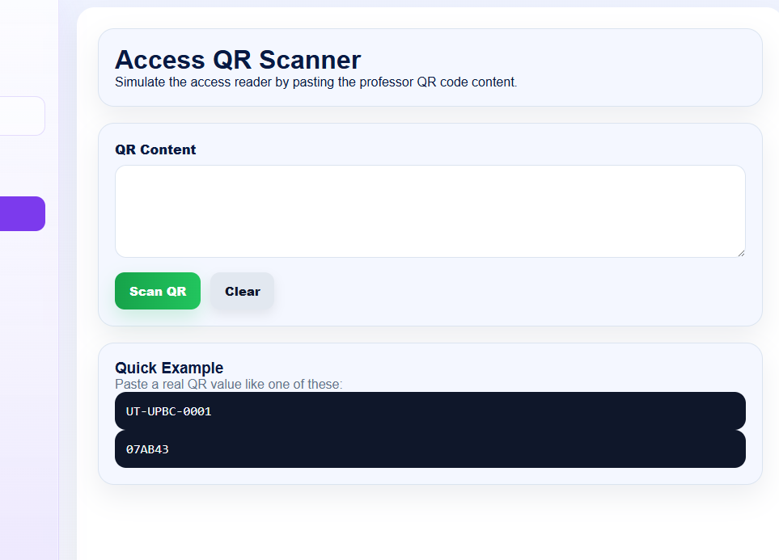
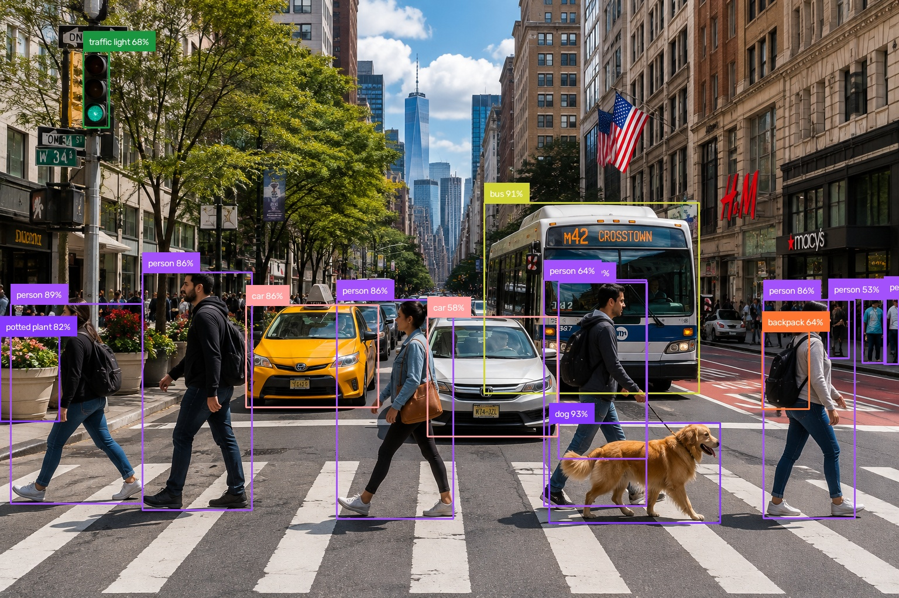

# YOLO + Supervision Object Detector

A practical computer vision project developed as part of my **SAM3 Learning Journey**.

This project combines the concepts learned during the **Introduction to Supervision** session into a complete object detection pipeline using **YOLOv8, OpenCV, and Supervision**.

---

## Project Objective

The objective of this project is to build a complete computer vision workflow capable of:

1. Loading an input image
2. Running object detection with YOLOv8
3. Converting YOLO predictions into `sv.Detections`
4. Applying a confidence threshold
5. Creating human-readable labels
6. Drawing bounding boxes
7. Displaying confidence scores
8. Saving an annotated image
9. Exporting detection results to JSON

---

## Project Pipeline

```text
Input Image
     ↓
OpenCV
     ↓
YOLOv8
     ↓
Ultralytics Results
     ↓
sv.Detections
     ↓
Confidence Filtering
     ↓
Bounding Boxes + Labels
     ↓
Supervision Annotation
     ↓
┌──────────────────────────┐
│                          │
↓                          ↓
Annotated Image      JSON Predictions
```

---

## Test Image

The project uses the following test image:



The image contains a busy street scene with multiple objects, making it useful for testing object detection.

---

## Detection Result

The project successfully processed the image and generated the following result:



YOLO detected multiple objects and Supervision was used to visualize the predictions with bounding boxes, class names, and confidence scores.

---

## Detection Summary

Using:

```text
Model: yolov8n.pt
Confidence threshold: 0.50
```

the model detected:

| Object | Quantity |
|---|---:|
| Person | 9 |
| Car | 2 |
| Bus | 1 |
| Traffic Light | 1 |
| Dog | 1 |
| Backpack | 1 |
| Potted Plant | 1 |
| **Total** | **16** |

Some of the strongest detections included:

```text
dog            93.0%
bus            91.2%
person          89.0%
person          86.2%
person          85.7%
car             85.7%
```

---

## Bounding Boxes

Each detected object is represented by a bounding box.

A bounding box uses four coordinates:

```text
(x1, y1)
   ┌──────────────────┐
   │                  │
   │      Object      │
   │                  │
   └──────────────────┘
                    (x2, y2)
```

These coordinates tell the program where an object is located inside the image.

---

## Confidence Score

YOLO also provides a confidence score for every detection.

For example:

```text
dog 93%
```

means the model is approximately **93% confident** that the object inside that bounding box is a dog.

The project currently uses:

```python
CONFIDENCE_THRESHOLD = 0.50
```

This means predictions below the configured threshold are excluded from the final detections.

---

## JSON Predictions

In addition to the annotated image, the project exports the detection information to:

```text
output/predictions.json
```

Each detected object contains information such as:

```json
{
    "class_id": 0,
    "class_name": "person",
    "confidence": 0.89,
    "bounding_box": {
        "x1": 100.0,
        "y1": 200.0,
        "x2": 300.0,
        "y2": 600.0
    }
}
```

This allows the detections to be used by other programs instead of existing only as visual annotations.

---

## Project Structure

```text
01-YOLO-Supervision-Object-Detector/
│
├── input/
│   ├── README.md
│   └── image.png
│
├── output/
│   ├── README.md
│   ├── annotated_image.jpg
│   └── predictions.json
│
├── object_detector.py
├── requirements.txt
└── README.md
```

---

## Main Technologies

### Python

Used to implement the complete detection pipeline.

### OpenCV

Used to load and save images.

```python
image = cv2.imread(INPUT_IMAGE)
```

### Ultralytics YOLO

Used as the object detection model.

```python
model = YOLO("yolov8n.pt")
```

### Supervision

Used to standardize and work with YOLO detections.

```python
detections = sv.Detections.from_ultralytics(results)
```

Supervision is also used to draw bounding boxes and labels.

---

## Installation

Install the required libraries with:

```bash
pip install -r requirements.txt
```

The project dependencies are:

```text
ultralytics
supervision
opencv-python
numpy
```

---

## Running the Project

From inside the project directory, run:

```bash
python object_detector.py
```

The program will:

```text
1. Load input/image.png
2. Load YOLOv8 Nano
3. Run object detection
4. Convert results to sv.Detections
5. Create labels
6. Draw bounding boxes
7. Save the annotated image
8. Export predictions to JSON
9. Print a detection summary
```

---

## Running in Google Colab

The project was also successfully tested in **Google Colab**.

Clone the repository:

```python
!git clone https://github.com/Peyman-mxli/SAM3-Learning-Journey.git
```

Install the dependencies:

```python
!pip install -q ultralytics supervision opencv-python
```

Enter the project directory:

```python
%cd /content/SAM3-Learning-Journey/05-projects/01-YOLO-Supervision-Object-Detector
```

Run the detector:

```python
!python object_detector.py
```

Display the generated image:

```python
from IPython.display import Image, display

display(Image(filename="output/annotated_image.jpg"))
```

---

## What I Learned

Through this project, I practiced how the individual components of a computer vision system work together.

I learned how to:

- Load images with OpenCV
- Load a pretrained YOLO model
- Run object detection
- Understand class IDs
- Interpret confidence scores
- Work with bounding-box coordinates
- Convert Ultralytics results into `sv.Detections`
- Use Supervision annotators
- Generate labels dynamically
- Save processed images
- Convert predictions into Python dictionaries
- Export structured results to JSON
- Run a complete computer vision project in Google Colab

---

## From Class Concept to Project

The individual concepts studied during the course were first documented and practiced separately.

```text
Course Notes
     ↓
Concepts
     ↓
Small Code Examples
     ↓
Complete Pipeline
     ↓
Working Project
```

Related materials in this repository:

```text
08-course-notes/01-Introduction-to-Supervision/
04-examples/01-Introduction-to-Supervision/
03-notebooks/
```

This project represents the transition from learning individual concepts to combining them into a functional computer vision application.

---

## Project Status

**Completed and successfully tested**

The complete pipeline successfully generates:

```text
Input Image
     ↓
16 Object Detections
     ↓
Annotated Image
     +
JSON Prediction Data
```

---

## Author

**Peyman Miyandashti**

SAM3 Learning Journey  
Computer Vision • Artificial Intelligence • Machine Learning
