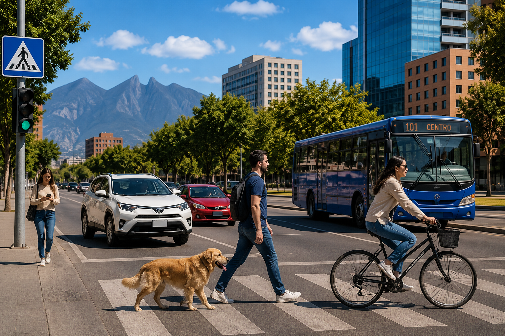

# Multi-Annotator Visualization Pipeline

## Overview

This project demonstrates how to build a reusable computer vision visualization pipeline using:

- YOLOv8
- Ultralytics
- Supervision
- OpenCV
- Python

The application detects objects in an input image and applies multiple Supervision Annotators as visual layers.

The project was developed as part of my **SAM3 Computer Vision Learning Journey**, specifically from the concepts studied in the **Annotation and Visualization** lesson.

A complete test of the pipeline was successfully executed in Google Colab.

---

## Project Goals

This project was created to practice and combine the main concepts from the **Annotation and Visualization** lesson into a reusable Python application.

It demonstrates how to:

- Load an image with OpenCV
- Run object detection with YOLOv8
- Convert Ultralytics results into `sv.Detections`
- Apply a confidence threshold
- Generate labels containing class names and confidence scores
- Use multiple Supervision Annotators
- Compose annotation layers
- Save the final visualization
- Organize input, output, and execution evidence
- Test the complete pipeline in Google Colab

---

## Project Structure

```text
02-Multi-Annotator-Visualization-Pipeline/
│
├── assets/
│   │
│   ├── input/
│   │   ├── README.md
│   │   └── image.png
│   │
│   ├── output/
│   │   ├── README.md
│   │   └── annotated_image.jpg
│   │
│   ├── screenshots/
│   │   ├── README.md
│   │   └── project screenshots
│   │
│   └── README.md
│
├── multi_annotator_pipeline.py
├── requirements.txt
└── README.md
```

The `assets/` directory contains the visual evidence and results produced while developing and testing the project.

---

## Visualization Pipeline

The application follows this general workflow:

```text
Input Image
     ↓
OpenCV
     ↓
YOLOv8
     ↓
Detection Results
     ↓
sv.Detections
     ↓
Supervision Annotators
     ↓
Multiple Visualization Layers
     ↓
Final Annotated Image
```

The Annotators are applied sequentially.

Each visualization layer receives the result produced by the previous layer.

This allows multiple visual representations of the same detection data to be combined into one final image.

---

## Main Python File

The main application is:

```text
multi_annotator_pipeline.py
```

This script contains the complete object detection and visualization workflow.

---

## Configuration

The main configuration follows this structure:

```python
MODEL_NAME = "yolov8n.pt"

INPUT_IMAGE = "input/image.jpg"
OUTPUT_IMAGE = "output/annotated_image.jpg"

CONFIDENCE_THRESHOLD = 0.50
```

### YOLO Model

```python
MODEL_NAME = "yolov8n.pt"
```

The project uses the **YOLOv8 Nano** model.

YOLOv8n is a lightweight object detection model suitable for experimentation, learning, and fast inference.

---

## Confidence Threshold

```python
CONFIDENCE_THRESHOLD = 0.50
```

The confidence threshold controls which detections are accepted by the pipeline.

Predictions below the configured threshold are excluded.

Conceptually:

```text
YOLO Prediction
      ↓
Confidence Score
      ↓
Threshold Check
      ↓
Accepted Detection
```

---

## Automatic Directory Creation

During execution, the script creates the required runtime directories when necessary:

```python
Path("input").mkdir(exist_ok=True)
Path("output").mkdir(exist_ok=True)
```

These directories are used by the application while running.

The GitHub repository separately stores permanent project evidence under:

```text
assets/
```

This keeps runtime files and repository documentation organized independently.

---

## Loading the Image

The image is loaded using OpenCV:

```python
image = cv2.imread(INPUT_IMAGE)
```

The script verifies that the image was loaded successfully:

```python
if image is None:
    raise FileNotFoundError(
        f"Could not load image: {INPUT_IMAGE}"
    )
```

This prevents the pipeline from continuing when the expected input image cannot be found.

---

## Loading YOLO

The YOLO model is initialized using:

```python
model = YOLO(MODEL_NAME)
```

YOLO is responsible for the object detection stage of the application.

---

## Running Object Detection

Inference is executed using:

```python
results = model(
    image,
    conf=CONFIDENCE_THRESHOLD
)[0]
```

The configured confidence threshold is therefore applied directly during inference.

---

## Converting YOLO Results to Supervision

The Ultralytics results are converted into a Supervision `Detections` object:

```python
detections = sv.Detections.from_ultralytics(
    results
)
```

This creates a structured representation of the detected objects.

Detection information may include:

- Bounding box coordinates
- Class IDs
- Confidence scores
- Detection positions

The conversion creates the bridge between YOLO inference and Supervision visualization.

```text
YOLO
  ↓
Ultralytics Results
  ↓
sv.Detections
  ↓
Supervision Annotators
```

---

## Creating Detection Labels

Labels are generated using the detected class and confidence score:

```python
labels = [
    f"{results.names[class_id]} {confidence:.0%}"
    for class_id, confidence in zip(
        detections.class_id,
        detections.confidence
    )
]
```

Example labels may look like:

```text
person 89%
car 84%
bus 92%
bicycle 93%
dog 94%
```

This makes the final visualization easier to interpret.

---

## Multi-Annotator Visualization

One of the main goals of this project is to demonstrate that the same detection data can be visualized in several different ways.

Supervision Annotators can be applied sequentially to the same image.

Conceptually:

```text
Original Image
      ↓
Detection Data
      ↓
Annotation Layer 1
      ↓
Annotation Layer 2
      ↓
Annotation Layer 3
      ↓
Additional Layers
      ↓
Labels
      ↓
Final Visualization
```

Each layer adds additional visual information without changing the original YOLO detections.

---

## Annotation Layer Order

The visualization pipeline applies multiple annotation layers sequentially.

The general concept is:

```text
Detection
    ↓
Bounding Box Visualization
    ↓
Additional Detection Visualization
    ↓
Position / Shape Visualization
    ↓
Labels
    ↓
Final Annotated Image
```

The order matters because every new Annotator is drawn on top of the image produced by the previous Annotator.

Labels are most useful near the end of the visualization pipeline so that class names and confidence scores remain readable.

---

## Saving the Result

The final image is saved using OpenCV:

```python
success = cv2.imwrite(
    OUTPUT_IMAGE,
    annotated_image
)
```

The script can verify that the image was written successfully:

```python
if not success:
    raise RuntimeError(
        f"Could not save image: {OUTPUT_IMAGE}"
    )
```

The generated result is then preserved in the repository under:

```text
assets/output/annotated_image.jpg
```

---

# Project Results

## Original Input

The test image used for the completed project is stored at:

```text
assets/input/image.png
```



---

## Annotated Output

The final generated visualization is stored at:

```text
assets/output/annotated_image.jpg
```


The final image demonstrates the combination of YOLO object detection and multiple Supervision visualization layers.

---

## Successful Test

The project was successfully executed in **Google Colab**.

During the completed test, the pipeline reported:

```text
Detected objects: 13
Annotated image saved to: output/annotated_image.jpg
```

YOLO detected multiple object classes in the test scene, including objects such as:

- People
- Cars
- Bus
- Bicycle
- Dog
- Traffic-related objects

The final result confirmed that the complete pipeline was functioning correctly:

```text
Input Image
    ↓
YOLOv8 Detection
    ↓
13 Detected Objects
    ↓
Supervision Conversion
    ↓
Multiple Annotation Layers
    ↓
Annotated Output
    ↓
Successful File Export
```

---

## Project Screenshots

Execution evidence and development screenshots are stored in:

```text
assets/screenshots/
```

These screenshots document important stages of the project, including:

- Google Colab execution
- Dependency installation
- Input preparation
- YOLO inference
- Detection results
- Multi-annotator visualization
- Successful output generation

---

## Requirements

Install the project dependencies with:

```bash
pip install -r requirements.txt
```

The `requirements.txt` file contains:

```text
ultralytics
supervision
opencv-python
```

---

# Running the Project

## 1. Clone the Repository

```bash
git clone https://github.com/Peyman-mxli/SAM3-Learning-Journey.git
```

---

## 2. Enter the Project Directory

```bash
cd SAM3-Learning-Journey/05-projects/02-Multi-Annotator-Visualization-Pipeline
```

---

## 3. Install Dependencies

```bash
pip install -r requirements.txt
```

---

## 4. Create the Runtime Input Directory

```bash
mkdir -p input
```

---

## 5. Add an Input Image

Place the image you want to analyze inside:

```text
input/
```

The application expects:

```text
input/image.jpg
```

---

## 6. Run the Application

```bash
python multi_annotator_pipeline.py
```

---

## 7. Check the Generated Output

After successful execution, the generated image will be available at:

```text
output/annotated_image.jpg
```

The terminal will also report the number of detected objects and confirm that the annotated image was saved.

---

# Google Colab Workflow

The completed project was also tested from a fresh Google Colab environment.

The repository was cloned using:

```bash
!git clone https://github.com/Peyman-mxli/SAM3-Learning-Journey.git
```

The project directory was opened using:

```python
%cd /content/SAM3-Learning-Journey/05-projects/02-Multi-Annotator-Visualization-Pipeline
```

The project files were verified with:

```bash
!ls -la
```

Dependencies were installed with:

```bash
!pip install -r requirements.txt
```

The runtime input directory was created with:

```bash
!mkdir -p input
```

After adding the test image, the application was executed with:

```bash
!python multi_annotator_pipeline.py
```

The final result was displayed directly inside Colab using:

```python
from IPython.display import Image, display

display(
    Image(
        filename="output/annotated_image.jpg"
    )
)
```

This provided a complete end-to-end test of the repository project in a clean environment.

---

## Technologies Used

| Technology | Purpose |
|---|---|
| Python | Main programming language |
| YOLOv8 | Object detection |
| Ultralytics | YOLO model interface |
| Supervision | Detection processing and visualization |
| OpenCV | Image loading and output |
| pathlib | Directory management |
| Google Colab | Cloud execution and testing |
| GitHub | Source code and project documentation |

---

## Concepts Practiced

This project reinforces several important computer vision concepts:

- Object detection
- YOLO inference
- Confidence thresholds
- Detection data structures
- Bounding boxes
- Detection labels
- Annotation customization
- Color palettes
- Annotation layers
- Annotator composition
- Visualization pipelines
- Image output generation
- Reusable project organization
- Google Colab testing

---

# Detection vs. Visualization

A central concept demonstrated by this project is the separation between **detection** and **visualization**.

## YOLO

YOLO determines:

```text
What object was detected?
Where is the object?
How confident is the prediction?
```

## Supervision

Supervision determines:

```text
How should the detection be represented visually?
```

The relationship can be represented as:

```text
YOLO
  ↓
Detection Data
  ↓
sv.Detections
  ↓
Supervision
  ↓
Visual Representation
```

This separation makes the visualization system flexible.

The detection model can remain unchanged while the visual representation can be customized independently.

---

# Repository Organization

This project is part of a larger learning repository.

Related material is separated by purpose:

```text
03-notebooks/
    Original course notebooks

04-examples/
    Small reusable Python examples

05-projects/
    Complete practical applications

08-course-notes/
    Detailed lesson documentation

09-assets/
    Repository-level visual resources
```

The Project 02 `assets/` directory is specifically reserved for evidence belonging to this project.

---

## Related Course Material

### Notebook

```text
03-notebooks/01_b_anotacion_visualizacion.ipynb
```

### Course Notes

```text
08-course-notes/02-Annotation-and-Visualization/
```

### Code Examples

```text
04-examples/02-Annotation-and-Visualization/
```

### Project

```text
05-projects/02-Multi-Annotator-Visualization-Pipeline/
```

Together, these directories separate the original notebook, theoretical documentation, small examples, and complete practical implementation.

---

# Key Takeaway

The central idea of this project is that object detection and visualization are separate stages of a computer vision pipeline.

YOLO produces structured detection information.

Supervision provides tools for transforming those detections into customizable visual representations.

```text
Image
  ↓
YOLOv8
  ↓
Detections
  ↓
sv.Detections
  ↓
Multiple Annotators
  ↓
Layered Visualization
  ↓
Final Image
```

By composing multiple Annotators, complex visualization pipelines can be created without modifying the underlying object detection model.

---

## Project Status

```text
Project: Multi-Annotator Visualization Pipeline
Status: Completed
Environment: Google Colab
Model: YOLOv8n
Confidence Threshold: 0.50
Test Result: Successful
Detected Objects: 13
Output Generated: Yes
Documentation: Completed
Assets: Organized
```

---

## Author

**Peyman Miyandashti**

SAM3 Learning Journey  
Computer Vision · Artificial Intelligence · Machine Learning

[LinkedIn](https://www.linkedin.com/in/peyman-mxli/) | [GitHub](https://github.com/Peyman-mxli)
