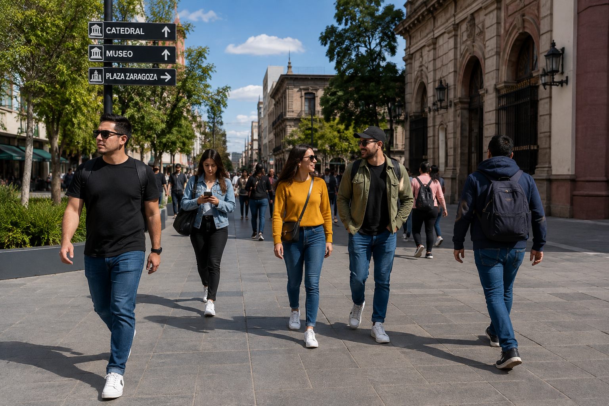

# Detection Filtering and NMS Pipeline

## Overview

This project applies the concepts learned in **Lesson 03 — Filtering and Manipulating Detections** and combines them into a complete object-detection post-processing pipeline.

The project uses:

- YOLOv8
- Supervision
- OpenCV
- NumPy

The goal is to take raw object detections and progressively filter them until only the predictions relevant to the application remain.

The pipeline includes:

- Confidence filtering
- Class filtering
- Size filtering
- Non-Maximum Suppression (NMS)
- Top-N confidence selection
- Spatial filtering
- Final annotated visualization

---

## Project Workflow

```text
Input Image
     ↓
YOLOv8
     ↓
Raw Predictions
     ↓
sv.Detections
     ↓
Confidence Filtering
     ↓
Class Filtering
     ↓
Size Filtering
     ↓
NMS
     ↓
Top-N Selection
     ↓
Spatial Filtering
     ↓
Final Detections
     ↓
Annotated Output
```

---

## Project Structure

```text
03-Detection-Filtering-and-NMS-Pipeline/
│
├── assets/
│   ├── README.md
│   │
│   ├── input/
│   │   ├── README.md
│   │   └── pedestrian-plaza-detection-test.png
│   │
│   └── output/
│       ├── README.md
│       └── filtered_detections.jpg
│
├── detection_filter_pipeline.py
├── requirements.txt
└── README.md
```

---

## Input Image

The project uses a pedestrian street scene containing multiple people at different positions and distances from the camera.

This makes the image useful for testing:

- Person detection
- Confidence thresholds
- Bounding-box size filtering
- Top-N selection
- Spatial filtering

### Original Image



The pipeline loads this image from:

```python
INPUT_IMAGE = "assets/input/pedestrian-plaza-detection-test.png"
```

---

## Main Features

### Confidence Filtering

Detections below the configured confidence threshold are removed.

The project uses:

```python
CONFIDENCE_THRESHOLD = 0.50
```

Filtering is performed with:

```python
detections = detections[
    detections.confidence > CONFIDENCE_THRESHOLD
]
```

This keeps predictions with confidence greater than 50%.

---

### Class Filtering

The project focuses specifically on detecting people.

COCO class:

```text
class_id 0 = person
```

The target class is configured with:

```python
TARGET_CLASS_ID = 0
```

Filtering is performed with:

```python
detections = detections[
    detections.class_id == TARGET_CLASS_ID
]
```

All detections belonging to other classes are removed.

---

### Size Filtering

Small bounding boxes can represent distant objects, irrelevant detections, or noise.

The project uses:

```python
MIN_AREA = 5000
```

Filtering is performed with:

```python
detections = detections[
    detections.area > MIN_AREA
]
```

Only detections with a bounding-box area greater than 5000 pixels² continue through the pipeline.

---

### Non-Maximum Suppression

Non-Maximum Suppression removes redundant bounding boxes that represent the same object.

The project uses:

```python
NMS_THRESHOLD = 0.50
```

NMS is applied with:

```python
detections = detections.with_nms(
    threshold=NMS_THRESHOLD
)
```

This helps prevent duplicate detections from appearing in the final result.

---

### Top-N Detection Selection

After filtering and NMS, detections are ranked according to confidence.

The project uses:

```python
TOP_N = 5
```

The detections are sorted from highest to lowest confidence:

```python
indices = np.argsort(
    detections.confidence
)[::-1][:TOP_N]

detections = detections[
    indices
]
```

Only the five most confident remaining detections continue to the spatial filtering stage.

---

### Spatial Filtering

The final filtering stage keeps detections whose center is located in the right half of the image.

The feature is enabled with:

```python
FILTER_RIGHT_HALF = True
```

The horizontal center of each bounding box is calculated using:

```python
centers_x = (
    detections.xyxy[:, 0]
    + detections.xyxy[:, 2]
) / 2
```

The image midpoint is calculated with:

```python
image_midpoint = image.shape[1] / 2
```

The final mask keeps only detections whose center is located to the right of that midpoint:

```python
detections = detections[
    centers_x > image_midpoint
]
```

---

## Final Output

The pipeline draws a vertical line representing the horizontal midpoint of the image.

Only detections that survive every filtering stage are displayed in the final result.

### Generated Result


The output is saved to:

```text
assets/output/filtered_detections.jpg
```

---

## Successful Test

The project was successfully executed in **Google Colab**.

YOLOv8 initially detected:

```text
13 objects
```

The detections were progressively reduced by the pipeline:

```text
Initial detections:             13
        ↓
Confidence filtering:            9
        ↓
Class filtering:                 8
        ↓
Size filtering:                  8
        ↓
Non-Maximum Suppression:         8
        ↓
Top-5 selection:                 5
        ↓
Spatial filtering:               2
        ↓
Final detections:                2
```

The execution completed successfully with:

```text
Detection Filtering Pipeline Complete

Input image:
assets/input/pedestrian-plaza-detection-test.png

Output image:
assets/output/filtered_detections.jpg

Final detections: 2
```

The final visualization contains two person detections located in the right half of the image.

---

## Processing Configuration

The current pipeline configuration is:

```python
MODEL_NAME = "yolov8n.pt"

CONFIDENCE_THRESHOLD = 0.50
MIN_AREA = 5000
NMS_THRESHOLD = 0.50
TOP_N = 5

TARGET_CLASS_ID = 0
FILTER_RIGHT_HALF = True
```

These values can be modified to experiment with different filtering strategies.

---

## Technologies Used

- [Python](https://www.python.org/)
- [Ultralytics YOLO](https://github.com/ultralytics/ultralytics)
- [Supervision](https://github.com/roboflow/supervision)
- [OpenCV](https://opencv.org/)
- [NumPy](https://numpy.org/)

---

## Installation

Install the required libraries:

```bash
pip install -r requirements.txt
```

---

## Running the Project

Clone the repository:

```bash
git clone https://github.com/Peyman-mxli/SAM3-Learning-Journey.git
```

Move into the project directory:

```bash
cd SAM3-Learning-Journey/05-projects/03-Detection-Filtering-and-NMS-Pipeline
```

Install the dependencies:

```bash
pip install -r requirements.txt
```

Run the pipeline:

```bash
python detection_filter_pipeline.py
```

The program will process:

```text
assets/input/pedestrian-plaza-detection-test.png
```

and generate:

```text
assets/output/filtered_detections.jpg
```

---

## Processing Logic

```text
pedestrian-plaza-detection-test.png
                ↓
             YOLOv8
                ↓
        13 Raw Detections
                ↓
       Confidence > 50%
                ↓
          9 Detections
                ↓
       Person Class Only
                ↓
          8 Detections
                ↓
         Area > 5000
                ↓
          8 Detections
                ↓
          NMS (0.50)
                ↓
          8 Detections
                ↓
            Top 5
                ↓
          5 Detections
                ↓
      Right-Half Filtering
                ↓
          2 Detections
                ↓
    filtered_detections.jpg
```

---

## Why This Project Matters

Object-detection models often return more information than an application actually needs.

A real computer vision system may need rules such as:

```text
Detect people
      +
Confidence > 50%
      +
Minimum bounding-box size
      +
Remove duplicate detections
      +
Keep highest-confidence detections
      +
Restrict detections to a region
      =
Application-Specific Results
```

This project demonstrates how raw YOLO predictions can be transformed into application-specific results using **Supervision and NumPy**.

Instead of simply displaying every prediction produced by the model, the pipeline decides which detections should remain.

---

## Concepts Applied

This project applies:

- `sv.Detections`
- Boolean masks
- Confidence filtering
- Class filtering
- Bounding-box area
- Non-Maximum Suppression
- Intersection over Union concepts
- NumPy sorting
- Top-N detection selection
- Bounding-box center calculations
- Spatial filtering
- Detection annotation
- OpenCV image processing
- YOLOv8 inference
- Computer vision post-processing pipelines

---

## Related Course Lesson

[Lesson 03 — Filtering and Manipulating Detections](../../08-course-notes/03-Filtering-and-Manipulating-Detections/)

---

## Related Projects

[Project 01 — YOLO Supervision Object Detector](../01-YOLO-Supervision-Object-Detector/)

[Project 02 — Multi-Annotator Visualization Pipeline](../02-Multi-Annotator-Visualization-Pipeline/)

---

## Repository

[SAM3 Learning Journey](https://github.com/Peyman-mxli/SAM3-Learning-Journey)

---

## Author

**Peyman Miyandashti**

SAM3 Computer Vision Learning Journey  
Computer Vision · Artificial Intelligence · Machine Learning

[LinkedIn](https://www.linkedin.com/in/peyman-mxli/) | [GitHub](https://github.com/Peyman-mxli)
