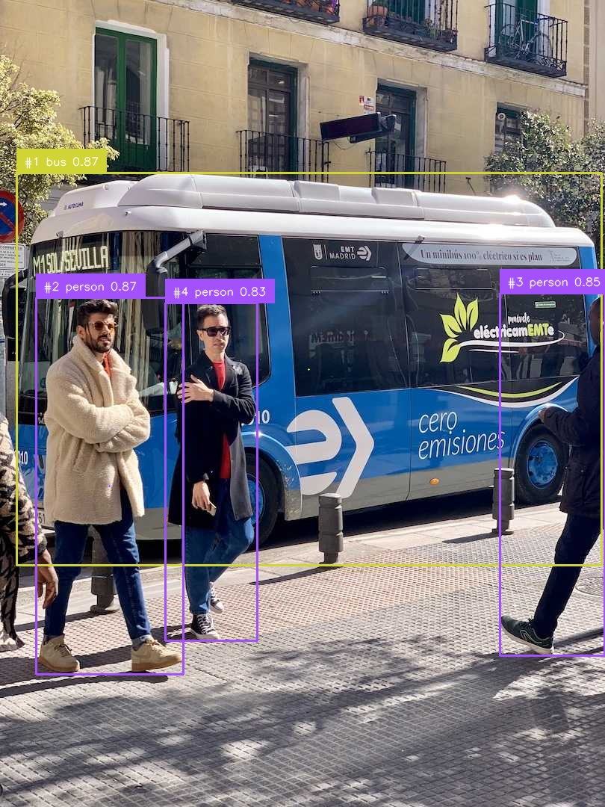

# Visual Tracking and Analysis System

An integrated computer vision project combining object detection, multi-object tracking, segmentation, visualization, evaluation, and structured data storage.

This project was developed as part of my **SAM3 Computer Vision Learning Journey** and demonstrates how multiple computer vision components can be combined into a modular analysis pipeline.

The current system integrates:

- Ultralytics YOLO object detection
- Supervision detections
- ByteTrack multi-object tracking
- Meta SAM 3 text-prompt segmentation
- SAM 3 segmentation masks
- Bounding-box visualization
- Persistent tracker IDs
- Confidence labels
- Object trajectories
- Recorded-video processing
- SQLite-based structured storage
- Evaluation metrics
- Google Colab GPU execution
- H.264 video export

The complete pipeline has been successfully tested in **Google Colab using an NVIDIA Tesla T4 GPU** on both images and recorded video.

---

## Project Status

**Status: Integrated Image and Recorded-Video MVP Completed**

The project has successfully completed three major technical milestones:

```text
Milestone 1
Image-Based Integration
YOLO + ByteTrack + SAM 3
COMPLETED

Milestone 2
Recorded-Video Tracking
YOLO + ByteTrack
COMPLETED

Milestone 3
Full Recorded-Video Integration
YOLO + ByteTrack + SAM 3
COMPLETED
```

Current verified capabilities:

| Component | Status |
|---|---|
| YOLO Object Detection | Completed |
| Supervision Integration | Completed |
| ByteTrack Object Tracking | Completed |
| Persistent Tracker IDs | Completed |
| SAM 3 Integration | Completed |
| SAM 3 Text-Prompt Segmentation | Completed |
| SAM 3 Mask Generation | Completed |
| Combined Visualization | Completed |
| SQLite Database Module | Completed |
| Evaluation Metrics Module | Completed |
| Google Colab Workflow | Completed |
| Final Integrated Image Test | Completed |
| Recorded Video Tracking | Completed |
| Full SAM 3 Video Processing | Completed |
| H.264 Video Export | Completed |
| Browser Playback Validation | Completed |
| Full Tracking Analytics | Planned |
| Database Persistence Across Video Frames | Planned |
| Advanced Evaluation | Planned |

---

## System Architecture

The project follows a modular architecture in which each major computer vision task is implemented independently.

```text
Input Image / Video
        |
        v
+-----------------------+
|   YOLO Detection      |
|   ObjectDetector      |
+-----------------------+
        |
        v
+-----------------------+
|   ByteTrack           |
|   ObjectTracker       |
+-----------------------+
        |
        v
+-----------------------+
|   Meta SAM 3          |
|   ObjectSegmenter     |
+-----------------------+
        |
        v
+-----------------------+
| Combined Visualization|
| TrackingVisualizer    |
+-----------------------+
        |
        +----------------------+
        |                      |
        v                      v
+----------------+     +----------------+
| Evaluation     |     | SQLite Storage |
| Metrics        |     | Database       |
+----------------+     +----------------+
        |
        v
Final Analysis Output
```

---

# Integrated Image Pipeline

The validated image-processing workflow is:

```text
Input Image
    |
    v
YOLO Object Detection
    |
    v
Supervision Detections
    |
    v
ByteTrack Object Tracking
    |
    v
SAM 3 Text-Prompt Segmentation
    |
    v
SAM 3 Segmentation Masks
    |
    v
Combined Visualization
    |
    v
Final Annotated Image
```

The final visualization can contain:

- YOLO bounding boxes
- detected object classes
- confidence scores
- ByteTrack tracker IDs
- SAM 3 segmentation masks
- object traces
- combined tracking and segmentation information

---

# Integrated Recorded-Video Pipeline

The project also successfully processes recorded video frame by frame.

The validated full video workflow is:

```text
Recorded Video
      |
      v
Read Frame
      |
      v
YOLO Object Detection
      |
      v
Supervision Detections
      |
      v
ByteTrack Tracking
      |
      v
SAM 3 Text-Prompt Segmentation
      |
      v
SAM 3 Segmentation Masks
      |
      v
Combined Visualization
      |
      v
Write Annotated Frame
      |
      v
FFmpeg H.264 Conversion
      |
      v
Final Annotated Video
```

The same ByteTrack instance remains active across frames, allowing the system to maintain temporal tracking state.

---

## Technologies

### Computer Vision

- Python
- OpenCV
- Ultralytics YOLO
- Supervision
- ByteTrack
- Meta SAM 3

### Machine Learning

- PyTorch
- TorchVision
- Hugging Face Hub

### Data and Analysis

- NumPy
- Pandas
- SQLite
- Matplotlib

### Video Processing

- OpenCV VideoCapture
- OpenCV VideoWriter
- FFmpeg
- H.264
- yuv420p

### Development Environment

- Google Colab
- NVIDIA Tesla T4 GPU
- Git
- GitHub

---

## Project Structure

```text
06-Visual-Tracking-and-Analysis-System/
│
├── README.md
├── requirements.txt
│
├── assets/
│   ├── README.md
│   │
│   ├── input/
│   │   ├── README.md
│   │   ├── yolo_bus_test.jpg
│   │   └── tracking_test_01.mp4
│   │
│   └── output/
│       ├── README.md
│       ├── final_integrated_pipeline.jpg
│       ├── tracking_output_01.mp4
│       └── sam3_tracking_output_01.mp4
│
├── data/
│   └── README.md
│
├── docs/
│   └── PROJECT-PROPOSAL.md
│
├── notebooks/
│   ├── README.md
│   └── COLAB-WORKFLOW.md
│
├── reports/
│   └── README.md
│
└── src/
    ├── database.py
    ├── detector.py
    ├── metrics.py
    ├── pipeline.py
    ├── segmenter.py
    ├── tracker.py
    └── visualization.py
```

---

# Core Modules

## `detector.py`

Implements object detection using Ultralytics YOLO.

Responsibilities include:

- loading the YOLO model
- processing input images or video frames
- applying confidence thresholds
- converting YOLO predictions into `supervision.Detections`
- providing class-name information

---

## `tracker.py`

Implements multi-object tracking using ByteTrack.

The tracker receives YOLO detections and assigns persistent tracker IDs.

For video processing, the same tracker instance remains active across sequential frames.

This allows the system to attempt to maintain object identity over time.

---

## `segmenter.py`

Provides the integration layer between the project and Meta SAM 3.

The module:

- loads the SAM 3 image model
- loads the SAM 3 checkpoint
- creates a `Sam3Processor`
- accepts PIL images
- performs text-prompt segmentation
- returns segmentation masks, boxes, and confidence information

Example text prompt:

```python
prompt="person"
```

---

## `visualization.py`

Handles the visual representation of detection, tracking, and segmentation results.

The visualizer supports:

- bounding boxes
- class labels
- confidence scores
- tracker IDs
- object traces
- SAM 3 segmentation-mask overlays

The segmentation masks are applied before the tracking annotations so that boxes and labels remain visible.

---

## `pipeline.py`

Acts as the central integration layer.

The `VisualAnalysisPipeline` coordinates:

1. YOLO detection
2. ByteTrack tracking
3. SAM 3 segmentation
4. combined visualization

Example:

```python
final_result = pipeline.process_image(
    image_bgr=image,
    segmentation_prompt="person"
)
```

The returned structure contains:

```python
{
    "detections": detections,
    "tracked_detections": tracked_detections,
    "segmentation": segmentation_output,
    "annotated_image": annotated_image
}
```

Before beginning a new independent video sequence, the tracker can be reset:

```python
pipeline.reset_tracker()
```

This prevents tracker state from previous experiments from affecting a new sequence.

---

## `database.py`

Provides SQLite-based structured storage.

The database module can store information such as:

- processing sessions
- frame numbers
- timestamps
- tracker IDs
- classes
- confidence scores
- bounding-box coordinates
- notes

The module has been functionally tested, while deeper frame-by-frame video persistence remains a future analytics milestone.

---

## `metrics.py`

Provides reusable evaluation functions.

Currently implemented metrics include:

- Intersection over Union
- Precision
- Recall
- Dice coefficient

These functions were tested successfully in Google Colab.

---

# Image Integration Test

The image-based pipeline was tested using:

```text
assets/input/yolo_bus_test.jpg
```

The final test produced:

```text
YOLO detections: 4
Tracked objects: 4
SAM 3 masks: 4

UPDATED PIPELINE END-TO-END: SUCCESS
```

The output is stored at:

[`assets/output/final_integrated_pipeline.jpg`](./assets/output/final_integrated_pipeline.jpg)

---

## Final Integrated Image



This image demonstrates:

- YOLO detections
- ByteTrack IDs
- object classes
- confidence scores
- SAM 3 segmentation masks
- combined visualization

---

# Recorded-Video Tracking Test

The first temporal test used:

[`assets/input/tracking_test_01.mp4`](./assets/input/tracking_test_01.mp4)

Video specifications:

```text
Resolution: 640 × 360
FPS: 15
Frames: 75
Duration: 5 seconds
Codec: H.264
```

The first tracking-only output is:

[`assets/output/tracking_output_01.mp4`](./assets/output/tracking_output_01.mp4)

---

## Verified ByteTrack Video Results

The video tracking test produced:

```text
VIDEO TRACKING TEST: SUCCESS

Frames processed: 75
Total detections: 253
Unique tracker IDs: [1, 2, 3, 4, 5, 6]
Unique tracked objects: 6
```

Example tracker states:

```text
Frame 015 | Detections: 4 | Tracker IDs: [2, 1, 4, 3]

Frame 030 | Detections: 4 | Tracker IDs: [2, 1, 5, 4]

Frame 045 | Detections: 3 | Tracker IDs: [2, 1, 3]

Frame 060 | Detections: 4 | Tracker IDs: [2, 1, 3, 6]

Frame 075 | Detections: 3 | Tracker IDs: [2, 1, 3]
```

This demonstrates actual temporal tracking rather than single-image tracker assignment.

---

# Full SAM 3 Video Integration

The final video milestone combines:

```text
YOLO
  +
ByteTrack
  +
SAM 3
  +
Supervision
```

across all 75 frames.

The final output is:

[`assets/output/sam3_tracking_output_01.mp4`](./assets/output/sam3_tracking_output_01.mp4)

---

## SAM 3 Video Frame Validation

Before processing the entire video, an individual frame was extracted and passed through the complete pipeline.

The validated result was:

```text
YOLO detections: 4
Tracked objects: 4
Tracker IDs: [1 2 3 4]
SAM 3 masks: 4

VIDEO FRAME PIPELINE RETEST: SUCCESS
```

---

## SAM 3 Video Benchmark

Five frames distributed across the sequence were processed first.

Results:

```text
Frame 00 | YOLO: 2 | Tracked: 2 | SAM masks: 5 | Time: 3.65s
Frame 15 | YOLO: 4 | Tracked: 2 | SAM masks: 3 | Time: 3.70s
Frame 30 | YOLO: 4 | Tracked: 3 | SAM masks: 4 | Time: 3.81s
Frame 45 | YOLO: 3 | Tracked: 2 | SAM masks: 4 | Time: 4.31s
Frame 60 | YOLO: 4 | Tracked: 3 | SAM masks: 5 | Time: 3.76s
```

Benchmark summary:

```text
Average processing time: 3.85 seconds/frame
Estimated 75-frame time: 4.81 minutes
Benchmark total time: 19.49 seconds

SAM 3 VIDEO BENCHMARK: SUCCESS
```

---

# Final SAM 3 Video Results

The full 75-frame test produced:

```text
FULL SAM 3 VIDEO PROCESSING: SUCCESS

Frames processed: 75
Total SAM 3 masks: 314
Processing time: 4.30 minutes
Average: 3.44 seconds/frame
```

Processing progress:

```text
Frame 10/75 | Elapsed: 35.1s
Frame 20/75 | Elapsed: 69.7s
Frame 30/75 | Elapsed: 103.5s
Frame 40/75 | Elapsed: 138.2s
Frame 50/75 | Elapsed: 172.3s
Frame 60/75 | Elapsed: 206.5s
Frame 70/75 | Elapsed: 240.7s
Frame 75/75 | Elapsed: 257.9s
```

Final output specifications:

```text
File: sam3_tracking_output_01.mp4
Frames: 75
Duration: 5 seconds
Resolution: 640 × 360
Frame rate: 15 FPS
SAM 3 masks generated: 314
Processing time: 4.30 minutes
Average processing time: 3.44 seconds/frame
Output codec: H.264
Output size: approximately 1.27 MB
Playback validation: SUCCESS
```

---

# H.264 Video Export

OpenCV generated temporary video files using `mp4v`.

Although OpenCV could read those files, browser playback inside Google Colab was unreliable.

FFmpeg was therefore used to convert the outputs to:

```text
Codec: H.264
Pixel format: yuv420p
Container: MP4
```

The validated workflow is:

```text
Computer Vision Processing
        |
        v
OpenCV VideoWriter
        |
        v
Temporary MP4
        |
        v
FFmpeg Conversion
        |
        v
H.264 / yuv420p
        |
        v
Browser-Compatible MP4
```

---

# SAM 3 Integration

Meta SAM 3 is used as the segmentation component of the system.

The tested text prompt was:

```text
person
```

SAM 3 generated segmentation masks on both:

- the standalone image
- individual video frames
- all 75 frames of the recorded-video test

---

# Hugging Face Authentication

The official SAM 3 checkpoint is distributed through a gated Hugging Face repository.

Access requires:

1. a Hugging Face account
2. approved SAM 3 model access
3. an appropriate Hugging Face token
4. authentication inside the execution environment

For Google Colab, the token is stored securely using:

```text
HF_TOKEN
```

inside **Colab Secrets**.

Tokens must never be committed to GitHub.

---

# SAM 3 Checkpoint

The SAM 3 checkpoint used during testing was approximately:

```text
3.21 GB
```

It is downloaded from Hugging Face and stored in the runtime cache.

The checkpoint is not stored in this repository.

---

# GPU Environment

The complete system was tested in Google Colab using:

```text
GPU: NVIDIA Tesla T4
CUDA: Available
```

Observed SAM 3 GPU memory use after loading was approximately:

```text
Allocated: ~3.33 GB
Reserved: ~3.43 GB
```

Flash Attention warnings appeared because the Tesla T4 does not support the newer optimized attention path.

The warning did not prevent SAM 3 from running.

---

# Dependency Compatibility

The working environment was stabilized using:

```text
NumPy 1.26.4
```

The tested environment successfully supported:

- PyTorch
- OpenCV
- Ultralytics
- Supervision
- SAM 3

A runtime restart was required after dependency changes to avoid NumPy binary compatibility problems.

---

# Google Colab Workflow

The complete development and troubleshooting process is documented in:

[`notebooks/COLAB-WORKFLOW.md`](./notebooks/COLAB-WORKFLOW.md)

The workflow covers:

- GPU verification
- repository setup
- dependency installation
- Hugging Face authentication
- gated SAM 3 access
- SAM 3 checkpoint download
- SAM 3 model loading
- dependency troubleshooting
- YOLO testing
- ByteTrack testing
- tracker resets
- SAM 3 image segmentation
- combined visualization
- synthetic video generation
- H.264 conversion
- video tracking tests
- video-frame SAM 3 validation
- SAM 3 performance benchmarking
- full 75-frame SAM 3 processing
- final video export
- browser playback validation

---

# Current Limitations

The core image and short-video integration is complete, but the system still has important limitations.

Current limitations include:

- the main video test uses controlled camera motion rather than fully natural video
- the current video duration is only 5 seconds
- SAM 3 segmentation and YOLO detections are not yet matched object-by-object
- tracking identity consistency is not yet formally scored
- database storage has not yet been connected to every processed video frame
- object-count analytics are not yet implemented in Project 06
- per-object duration statistics are not yet implemented
- advanced trajectory analysis is not yet implemented
- segmentation accuracy has not yet been evaluated against labeled ground truth
- detection precision and recall have not yet been measured on a labeled dataset
- real-time processing has not been achieved
- SAM 3 currently averages several seconds per video frame on the Tesla T4

---

# Next Development Phase

The project no longer needs to prove basic model integration.

The next phase should focus on **analysis, persistence, and evaluation**.

Planned improvements include:

- frame-by-frame SQLite persistence
- object appearance duration
- per-object statistics
- class-based counts
- trajectory analysis
- tracking consistency metrics
- tracker-ID switch analysis
- SAM 3 segmentation evaluation
- YOLO detection evaluation
- performance reports
- natural-motion video tests
- longer videos
- occlusion tests
- crowded scenes
- low-light testing
- exported CSV analytics
- dashboard integration

The next higher-level pipeline is:

```text
Recorded Video
      |
      v
YOLO + ByteTrack + SAM 3
      |
      v
Structured Observations
      |
      v
SQLite Database
      |
      v
Metrics and Analytics
      |
      v
Reports / Dashboard
```

---

# Learning Outcomes

This project demonstrates several important practical computer vision concepts.

## Modular Architecture

Detection, tracking, segmentation, visualization, metrics, and storage are separated into reusable modules.

## Detection vs. Tracking

YOLO independently detects objects in each frame.

ByteTrack attempts to associate those detections across time.

## Tracking Identity

The project demonstrates both persistent tracker IDs and situations where tracker IDs can change due to lost detections or re-association.

## Detection vs. Segmentation

YOLO provides object-level bounding boxes.

SAM 3 provides pixel-level masks.

Combining both produces richer scene understanding.

## Temporal Computer Vision

The project progressed from single-image inference to sequential 75-frame processing.

## GPU Computing

The project uses an NVIDIA Tesla T4 to run SAM 3.

## Performance Benchmarking

The SAM 3 video test was benchmarked before the full processing run.

## Video Engineering

The project demonstrates the difference between:

```text
Video Container
```

and:

```text
Video Codec
```

and uses FFmpeg to create browser-compatible H.264 outputs.

## Environment Management

Dependency conflicts, NumPy compatibility, runtime resets, model caching, and Python import paths were all part of the practical development process.

## Reproducibility

The complete Colab workflow, errors, fixes, outputs, and final results are documented in the repository.

---

# Project Goal

The long-term goal of this project is to create a reusable visual-analysis system capable of:

```text
Detecting
    +
Tracking
    +
Segmenting
    +
Visualizing
    +
Measuring
    +
Storing
    +
Analyzing
```

objects across images and recorded videos.

The current system has successfully established the core computer vision pipeline.

The next development stage will transform those visual predictions into structured historical analytics.

---

# Final Milestone Summary

```text
IMAGE PIPELINE

YOLO
  +
ByteTrack
  +
SAM 3
    |
    v
SUCCESS


VIDEO TRACKING

YOLO
  +
ByteTrack
    |
    v
SUCCESS


FULL VIDEO PIPELINE

YOLO
  +
ByteTrack
  +
SAM 3
    |
    v
75 FRAMES
314 MASKS
4.30 MINUTES
3.44 SEC/FRAME
    |
    v
SUCCESS
```

Final evidence:

- [`Final Integrated Image`](./assets/output/final_integrated_pipeline.jpg)
- [`ByteTrack Video`](./assets/output/tracking_output_01.mp4)
- [`SAM 3 Tracking Video`](./assets/output/sam3_tracking_output_01.mp4)

---

## Author

**Peyman Miyandashti**

Computer Vision, Artificial Intelligence, and Software Development

[GitHub](https://github.com/Peyman-mxli)

[LinkedIn](https://www.linkedin.com/in/peyman-mxli/)
