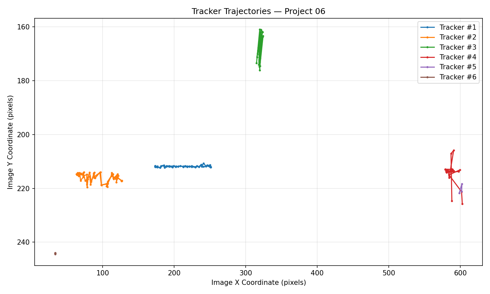
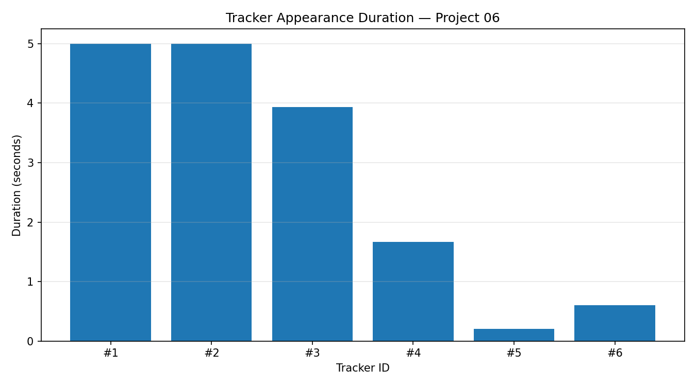
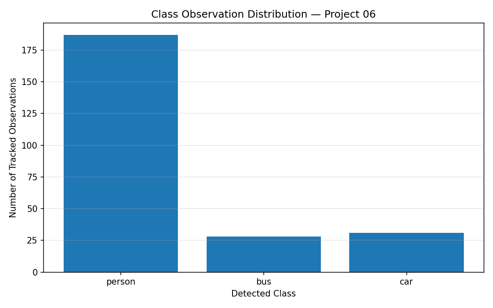
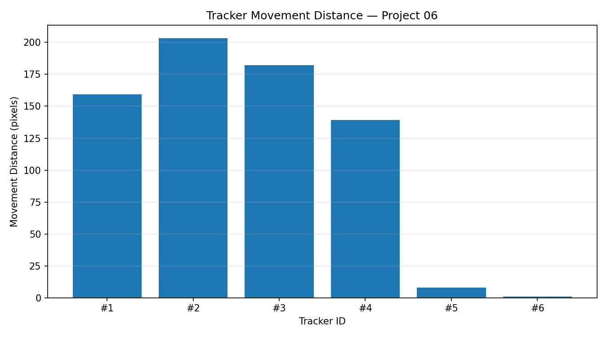
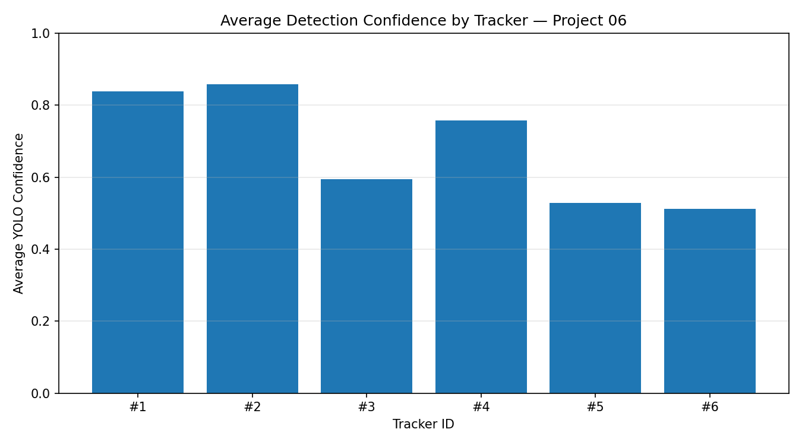
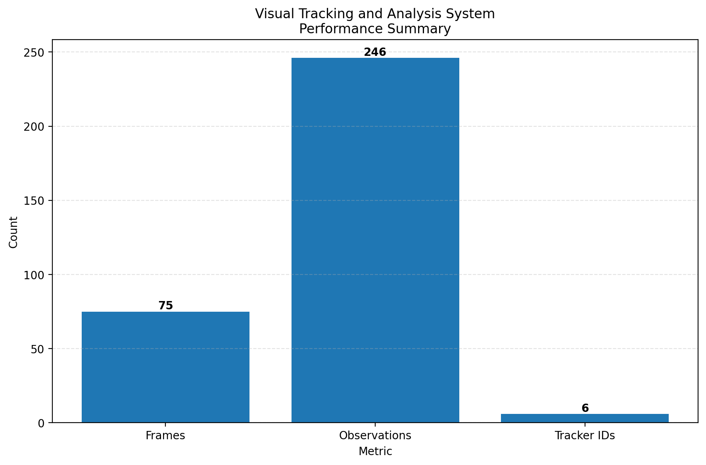

# Visual Tracking and Analysis System

An integrated computer vision project combining object detection, multi-object tracking, SAM 3 segmentation, persistent tracker identities, structured data storage, trajectory analysis, visual analytics, system-level performance evaluation, and interactive results exploration.

This project was developed as part of my **SAM3 Computer Vision Learning Journey** and demonstrates how multiple computer vision components can be combined into a modular end-to-end analysis pipeline.

The current system integrates:

- Ultralytics YOLO object detection
- Supervision detections
- ByteTrack multi-object tracking
- Persistent tracker IDs
- Meta SAM 3 segmentation
- SAM 3 segmentation masks
- Bounding-box visualization
- Confidence labels
- Object trajectories
- Recorded-video processing
- SQLite-based structured persistence
- Tracker-level analytics
- Trajectory analytics
- Movement analysis
- Confidence analysis
- Performance evaluation
- CSV report generation
- Analytical visualizations
- Interactive Streamlit dashboard
- Dashboard CSV downloads
- Google Colab GPU execution
- H.264 video export

The complete pipeline has been successfully tested in **Google Colab using an NVIDIA Tesla T4 GPU** on both images and recorded video.

The interactive dashboard has also been successfully launched in Google Colab and verified through a browser-accessible Cloudflare Tunnel.

---

## Project Status

**Status: Complete End-to-End Visual Tracking and Analysis Pipeline with Interactive Dashboard**

The project has successfully completed the major technical milestones required for an integrated visual tracking and analysis system.

```text
Milestone 1
Image-Based Integration
YOLO + ByteTrack + SAM 3
COMPLETED

Milestone 2
Recorded-Video Tracking
YOLO + ByteTrack
COMPLETED

Milestone 3
Full Recorded-Video Integration
YOLO + ByteTrack + SAM 3
COMPLETED

Milestone 4
H.264 Video Output
COMPLETED

Milestone 5
Video Analytics
COMPLETED

Milestone 6
SQLite Persistence
COMPLETED

Milestone 7
Tracker-Level Analytics
COMPLETED

Milestone 8
Trajectory Analysis
COMPLETED

Milestone 9
Visual Analytics
COMPLETED

Milestone 10
Performance Evaluation
COMPLETED

Milestone 11
Results and Limitations Documentation
COMPLETED

Milestone 12
Interactive Streamlit Dashboard
COMPLETED
```

---

## Current Verified Capabilities

| Component | Status |
|---|---|
| YOLO Object Detection | Completed |
| Supervision Integration | Completed |
| ByteTrack Object Tracking | Completed |
| Persistent Tracker IDs | Completed |
| SAM 3 Integration | Completed |
| SAM 3 Segmentation | Completed |
| Bounding-Box Visualization | Completed |
| Confidence Labels | Completed |
| Image Processing Pipeline | Completed |
| Recorded-Video Processing | Completed |
| H.264 Video Export | Completed |
| Video Analytics | Completed |
| SQLite Persistence | Completed |
| Tracker Summary Generation | Completed |
| Trajectory Analysis | Completed |
| Trajectory Visualization | Completed |
| Tracker Duration Analysis | Completed |
| Class Observation Analysis | Completed |
| Movement Distance Analysis | Completed |
| Confidence Analysis | Completed |
| Performance Analysis | Completed |
| CSV Report Generation | Completed |
| Analytical Visualizations | Completed |
| Results Documentation | Completed |
| Limitations Documentation | Completed |
| Interactive Streamlit Dashboard | Completed |
| Dashboard CSV Downloads | Completed |
| Browser-Based Results Exploration | Completed |

---

# System Architecture

The complete Project 06 architecture is:

```text
Input Image / Video
        ↓
YOLO Object Detection
        ↓
Supervision Detections
        ↓
ByteTrack Multi-Object Tracking
        ↓
Persistent Tracker IDs
        ↓
SAM 3 Segmentation
        ↓
Bounding Boxes + Masks + Labels
        ↓
Annotated H.264 Video
        ↓
Tracking Observations
        ↓
SQLite Persistence
        ↓
Tracker Analytics
        ↓
Trajectory Analytics
        ↓
Performance Analysis
        ↓
CSV Reports
        ↓
Visual Analytics
        ↓
Interactive Streamlit Dashboard
        ↓
Documented Results
```

This architecture separates computer-vision inference from analytics, reporting, and interactive exploration.

The inference pipeline produces structured observations, while the analytics layer transforms those observations into reusable evidence.

The Streamlit application then provides an interactive interface for exploring the preserved analytical evidence without requiring the computer-vision inference pipeline to run again.

---

# Core Technologies

The project combines several computer-vision, data-analysis, persistence, visualization, and application technologies.

## YOLO

YOLO is responsible for object detection.

For each detected object, the detector can provide information such as:

```text
Bounding Box
Class ID
Class Name
Confidence
```

These detections become the input to the tracking system.

---

## Supervision

Supervision provides utilities for:

- Detection representation
- Bounding-box annotation
- Label annotation
- Tracker integration
- Visualization
- Computer-vision workflow organization

It acts as an important integration layer between YOLO detections and ByteTrack tracking.

---

## ByteTrack

ByteTrack provides multi-object tracking.

It assigns persistent identities to detected objects:

```text
Tracker ID 1
Tracker ID 2
Tracker ID 3
...
```

These IDs allow the system to associate observations belonging to the same tracked object across multiple video frames.

---

## SAM 3

SAM 3 provides segmentation capabilities for detected and tracked objects.

The integration allows the system to combine:

```text
Detection
+
Tracking
+
Segmentation
```

within the same recorded-video processing workflow.

SAM 3 segmentation masks provide more detailed object localization than bounding boxes alone.

---

## SQLite

SQLite provides structured persistence for tracking observations.

Persisted information can include:

- Frame number
- Tracker ID
- Class ID
- Class name
- Confidence
- Bounding-box coordinates
- Center coordinates
- Temporal tracking information

This allows analytics to operate independently from the original inference loop.

---

## Pandas

Pandas is used for:

- Reading analytical reports
- Aggregating tracking information
- Calculating system-level metrics
- Creating structured CSV outputs
- Loading report data into the interactive dashboard

---

## Matplotlib

Matplotlib is used to generate visual analytics including:

- Tracker duration
- Class observations
- Movement distance
- Confidence
- Trajectories
- Performance summaries

---

## Streamlit

Streamlit provides the interactive application layer for exploring the preserved Project 06 results.

The dashboard is implemented in:

[`app.py`](./app.py)

It provides seven verified sections:

- Overview
- Tracker Explorer
- Trajectory Analysis
- Visual Analytics
- Performance
- Results
- Limitations

The dashboard reads the preserved CSV reports, analytical visualizations, and Markdown documentation directly from the project repository.

It also provides CSV download controls for:

- Tracker summary
- Trajectory summary
- Performance summary

The application was successfully tested in Google Colab and exposed for browser access through a temporary Cloudflare Tunnel during verification.

---

# Project Structure

```text
06-Visual-Tracking-and-Analysis-System/
│
├── analytics/
│   ├── README.md
│   └── performance_analysis.py
│
├── assets/
│
├── data/
│   └── README.md
│
├── docs/
│   ├── LIMITATIONS.md
│   ├── PROJECT-PROPOSAL.md
│   └── RESULTS.md
│
├── notebooks/
│
├── reports/
│   ├── README.md
│   ├── tracker_summary.csv
│   ├── trajectory_summary.csv
│   ├── performance_summary.csv
│   ├── trajectory_visualization.png
│   ├── tracker_duration_chart.png
│   ├── class_observation_chart.png
│   ├── movement_distance_chart.png
│   ├── confidence_chart.png
│   └── performance_chart.png
│
├── src/
│
├── app.py
├── README.md
└── requirements.txt
```

---

# Image Pipeline

The first major stage of Project 06 implemented an integrated image-processing pipeline.

The image workflow combines:

```text
Image
  ↓
YOLO Detection
  ↓
ByteTrack
  ↓
SAM 3
  ↓
Annotated Result
```

This stage verified that the individual computer-vision components could operate together before moving to recorded-video processing.

---

# Recorded-Video Tracking

The project then extended the system to recorded video.

The video-processing stage introduced temporal object tracking with ByteTrack.

Each detected object receives a persistent tracker ID that can remain associated with the object across multiple frames.

This makes it possible to analyze:

- Object persistence
- Object duration
- Movement
- Trajectories
- Confidence
- Class observations

---

# SAM 3 Video Integration

SAM 3 was integrated into the recorded-video pipeline after the YOLO + ByteTrack tracking stage was verified.

The resulting pipeline became:

```text
Video Frame
    ↓
YOLO
    ↓
ByteTrack
    ↓
Persistent Tracker ID
    ↓
SAM 3
    ↓
Segmentation Mask
    ↓
Annotated Frame
```

This combines temporal tracking with pixel-level segmentation.

---

# H.264 Video Output

The verified tracking output is:

```text
sam3_tracking_output_01.mp4
```

The video was encoded in H.264 format to improve compatibility with:

- GitHub
- Web browsers
- Standard video players
- Presentation software
- Documentation platforms

The H.264 video provides visual evidence of the integrated detection, tracking, and SAM 3 segmentation workflow.

---

# Verified Video Results

The current verified video-processing run produced:

| Metric | Result |
|---|---:|
| Processed frames | 75 |
| Recorded observations | 246 |
| Unique tracker IDs | 6 |

These values form the reference dataset used by the current analytical reports and interactive dashboard.

---

# Tracker Analytics

Tracker-level analytics are stored in:

[`reports/tracker_summary.csv`](./reports/tracker_summary.csv)

The verified tracker results are:

| Tracker ID | Class | First Frame | Last Frame | Observations | Duration | Average Confidence |
|---:|---|---:|---:|---:|---:|---:|
| 1 | person | 1 | 75 | 75 | 5.00 s | 0.8385 |
| 2 | person | 1 | 75 | 75 | 5.00 s | 0.8587 |
| 3 | bus | 3 | 75 | 59 | 3.93 s | 0.5939 |
| 4 | person | 8 | 32 | 25 | 1.67 s | 0.7579 |
| 5 | person | 29 | 31 | 3 | 0.20 s | 0.5278 |
| 6 | person | 53 | 61 | 9 | 0.60 s | 0.5124 |

The tracker summary converts frame-level observations into object-level temporal information.

These records can also be explored interactively through the dashboard's **Tracker Explorer**.

---

# Detection Confidence

The verified tracker-level confidence results are:

```text
Average confidence: 0.6815
Minimum average confidence: 0.5124
Maximum average confidence: 0.8587
```

The highest average confidence belongs to Tracker 2:

```text
Tracker 2
0.8587
```

The lowest belongs to Tracker 6:

```text
Tracker 6
0.5124
```

The confidence results are visualized in:

[`reports/confidence_chart.png`](./reports/confidence_chart.png)

The same visualization is available through the Streamlit dashboard.

---

# Tracker Duration Analysis

The verified tracker-duration statistics are:

```text
Average tracker duration: 2.7333 seconds
Minimum tracker duration: 0.2000 seconds
Maximum tracker duration: 5.0000 seconds
```

The results are visualized in:

[`reports/tracker_duration_chart.png`](./reports/tracker_duration_chart.png)

Tracker duration helps describe how long individual identities remained active during the video.

---

# Trajectory Analysis

Trajectory analytics are stored in:

[`reports/trajectory_summary.csv`](./reports/trajectory_summary.csv)

The verified trajectory results are:

| Tracker ID | Frames Observed | Duration | Movement Distance | Average Movement |
|---:|---:|---:|---:|---:|
| 1 | 75 | 5.00 s | 159.26 px | 2.15 px |
| 2 | 75 | 5.00 s | 203.37 px | 2.75 px |
| 3 | 59 | 3.93 s | 182.36 px | 3.14 px |
| 4 | 25 | 1.67 s | 139.34 px | 5.81 px |
| 5 | 3 | 0.20 s | 7.91 px | 3.96 px |
| 6 | 9 | 0.60 s | 0.94 px | 0.12 px |

The trajectory records are also available through the dashboard's **Trajectory Analysis** section.

---

# Movement Analysis

Object movement is calculated using the center coordinates of consecutive bounding boxes.

For bounding-box coordinates:

```text
(x1, y1, x2, y2)
```

the center is calculated as:

```text
center_x = (x1 + x2) / 2
center_y = (y1 + y2) / 2
```

Movement between consecutive positions is calculated using Euclidean distance:

```text
distance = sqrt(
    (center_x2 - center_x1)^2 +
    (center_y2 - center_y1)^2
)
```

The verified movement results are:

| Metric | Result |
|---|---:|
| Total movement distance | 693.18 px |
| Average movement per tracker | 115.53 px |
| Maximum movement distance | 203.37 px |
| Average step movement | 2.9883 px |

These values represent **image-space movement**.

They do not represent physical-world distance.

---

# Trajectory Visualization

The reconstructed object trajectories are available at:

[`reports/trajectory_visualization.png`](./reports/trajectory_visualization.png)



This visualization provides a spatial representation of object movement across the processed video.

It is also displayed directly inside the Streamlit **Trajectory Analysis** and **Visual Analytics** sections.

---

# Tracker Duration Visualization

[`reports/tracker_duration_chart.png`](./reports/tracker_duration_chart.png)



This chart compares how long individual tracker IDs remained active.

---

# Class Observation Visualization

[`reports/class_observation_chart.png`](./reports/class_observation_chart.png)



The tracker summary contains:

```text
5 person trackers
1 bus tracker
```

The class-observation chart represents observation activity rather than only counting unique tracker identities.

---

# Movement Distance Visualization

[`reports/movement_distance_chart.png`](./reports/movement_distance_chart.png)



This chart compares accumulated image-space movement between tracked objects.

---

# Confidence Visualization

[`reports/confidence_chart.png`](./reports/confidence_chart.png)



This chart compares average detection-confidence behavior between tracker IDs.

---

# Performance Analysis

System-level evaluation is implemented in:

[`analytics/performance_analysis.py`](./analytics/performance_analysis.py)

The module reads the preserved analytical reports:

```text
reports/tracker_summary.csv
reports/trajectory_summary.csv
```

and generates:

```text
reports/performance_summary.csv
reports/performance_chart.png
```

This architecture allows system-level analytics to be reproduced without rerunning YOLO, ByteTrack, or SAM 3.

---

# Performance Summary

The complete performance report is available at:

[`reports/performance_summary.csv`](./reports/performance_summary.csv)

The verified system-level results are:

| Metric | Result |
|---|---:|
| Total processed frames | 75 |
| Total observations | 246 |
| Unique tracker IDs | 6 |
| Average observations per frame | 3.2800 |
| Average observations per tracker | 41.0000 |
| Minimum tracker observations | 3 |
| Maximum tracker observations | 75 |
| Average confidence | 0.6815 |
| Minimum average confidence | 0.5124 |
| Maximum average confidence | 0.8587 |
| Average tracker duration | 2.7333 s |
| Minimum tracker duration | 0.2000 s |
| Maximum tracker duration | 5.0000 s |
| Total movement distance | 693.1800 px |
| Average movement distance per tracker | 115.5300 px |
| Maximum movement distance | 203.3700 px |
| Average step movement | 2.9883 px |

---

# Performance Visualization

[`reports/performance_chart.png`](./reports/performance_chart.png)



The performance chart provides a compact visual comparison of:

```text
75 processed frames
246 observations
6 tracker IDs
```

The chart and its underlying metrics are also available through the dashboard's **Performance** section.

---

# Processing-Time Metrics

The performance-analysis module supports:

- Total processing time
- Average processing time per frame
- Effective processing FPS

The current verified run reports:

```text
Total Processing Time: N/A
Average Processing Time per Frame: N/A
Effective Processing FPS: N/A
```

The original total runtime was not recorded during the verified processing run.

The project intentionally reports these values as `N/A` instead of estimating or inventing benchmark measurements.

Future runs can provide an actual measured processing duration using:

```text
--processing-seconds
```

---

# Analytics Reports

The complete reporting layer currently contains:

```text
reports/
│
├── README.md
│
├── tracker_summary.csv
├── trajectory_summary.csv
├── performance_summary.csv
│
├── trajectory_visualization.png
├── tracker_duration_chart.png
├── class_observation_chart.png
├── movement_distance_chart.png
├── confidence_chart.png
└── performance_chart.png
```

Detailed report documentation is available in:

[`reports/README.md`](./reports/README.md)

---

# Analytics Module

The analytics layer is documented in:

[`analytics/README.md`](./analytics/README.md)

The current analytics module is:

```text
analytics/performance_analysis.py
```

The analytics layer is designed to separate computationally expensive computer-vision inference from later data analysis.

---

# Interactive Streamlit Dashboard

Project 06 includes an interactive Streamlit dashboard implemented in:

[`app.py`](./app.py)

The application provides a browser-based interface for exploring the preserved tracking, trajectory, performance, visualization, results, and limitations data.

The dashboard was successfully launched from Google Colab and verified through a temporary browser-accessible Cloudflare Tunnel.

## Dashboard Architecture

```text
tracker_summary.csv
        +
trajectory_summary.csv
        +
performance_summary.csv
        +
Analytical PNG Reports
        +
RESULTS.md
        +
LIMITATIONS.md
        ↓
      app.py
        ↓
Streamlit Dashboard
        ↓
Interactive Results Exploration
```

The dashboard does not require YOLO, ByteTrack, or SAM 3 inference to run again.

Instead, it reuses the preserved evidence generated during the verified processing run.

---

## Dashboard Sections

Seven dashboard sections were implemented and individually verified.

| Dashboard Section | Purpose | Status |
|---|---|---|
| Overview | Project summary and key metrics | Verified |
| Tracker Explorer | Individual tracker history and confidence | Verified |
| Trajectory Analysis | Movement and trajectory inspection | Verified |
| Visual Analytics | Generated analytical charts | Verified |
| Performance | System-level metrics and report | Verified |
| Results | Rendered project results documentation | Verified |
| Limitations | Rendered limitations and failure cases | Verified |

---

## Dashboard Overview

The **Overview** page displays the primary verified processing metrics:

| Metric | Result |
|---|---:|
| Processed Frames | 75 |
| Observations | 246 |
| Unique Tracker IDs | 6 |
| Average Confidence | 0.6815 |
| Average Tracker Duration | 2.7333 s |
| Total Movement | 693.18 px |

It also displays the complete system pipeline and verified H.264 output information.

---

## Tracker Explorer

The **Tracker Explorer** allows a tracker ID to be selected interactively.

For each tracker, the dashboard can display:

- Class
- Observation count
- Average confidence
- First frame
- Last frame
- Duration

The page also displays:

- Complete tracker summary table
- Tracker duration chart
- Confidence chart
- Tracker summary CSV download

For example, the verified Tracker 1 contains:

```text
Class: person
Observations: 75
Average Confidence: 0.8385
First Frame: 1
Last Frame: 75
Duration: 5.00 seconds
```

---

## Trajectory Analysis Dashboard

The **Trajectory Analysis** section provides interactive movement inspection.

For a selected tracker, it displays:

- Movement distance
- Average movement
- Frames observed
- First frame
- Last frame
- Duration

For example, Tracker 1 contains:

```text
Movement Distance: 159.26 px
Average Movement: 2.15 px
Frames Observed: 75
First Frame: 1
Last Frame: 75
Duration: 5.00 seconds
```

The page also displays:

- Complete trajectory summary
- Trajectory visualization
- Movement-distance chart
- Trajectory summary CSV download

---

## Visual Analytics Dashboard

The **Visual Analytics** section displays the project's generated analytical visualizations directly inside the application.

These include:

```text
trajectory_visualization.png
tracker_duration_chart.png
class_observation_chart.png
movement_distance_chart.png
confidence_chart.png
performance_chart.png
```

This provides a centralized visual interface for inspecting the analytical outputs.

---

## Performance Dashboard

The **Performance** section displays system-level evaluation metrics.

It includes:

- Processed frames
- Total observations
- Tracker IDs
- Average observations per frame
- Average confidence
- Total movement
- Complete performance summary table
- Performance visualization
- Performance CSV download

It also explicitly displays the current processing-time values:

```text
Total Processing Time: N/A
Average Processing Time per Frame: N/A
Effective Processing FPS: N/A
```

These remain `N/A` because the original complete pipeline runtime was not recorded.

No benchmark values are invented.

---

## Results Dashboard

The **Results** section loads:

[`docs/RESULTS.md`](./docs/RESULTS.md)

and renders the verified project results directly inside the Streamlit application.

This connects the formal project documentation with the interactive results explorer.

---

## Limitations Dashboard

The **Limitations** section loads:

[`docs/LIMITATIONS.md`](./docs/LIMITATIONS.md)

and renders the documented system limitations and failure cases directly inside the application.

This allows users to inspect both successful results and known system constraints from the same interface.

---

## Dashboard CSV Downloads

The Streamlit application provides direct download controls for:

```text
tracker_summary.csv
trajectory_summary.csv
performance_summary.csv
```

This allows analytical results to be exported directly from the browser interface.

---

## Dashboard Verification

All seven dashboard sections were manually opened and verified during the Google Colab test session.

```text
Overview                VERIFIED
Tracker Explorer        VERIFIED
Trajectory Analysis     VERIFIED
Visual Analytics        VERIFIED
Performance             VERIFIED
Results                 VERIFIED
Limitations             VERIFIED
```

The verification confirmed that the dashboard can successfully load the preserved Project 06 reports and documentation.

---

## Running the Dashboard

From the Project 06 directory:

```bash
streamlit run app.py
```

The application uses port `8501` by default.

During Google Colab verification, Streamlit was launched in the background and a temporary Cloudflare Tunnel was used to provide browser access.

The temporary Cloudflare URL is not stored as a permanent project link because quick tunnel addresses are temporary and exist only while the corresponding tunnel process remains active.

---

# SQLite Persistence

The project successfully implemented SQLite persistence during the original video-analytics workflow.

The database architecture supports storing:

- Frame number
- Tracker ID
- Class ID
- Class name
- Confidence
- Bounding-box coordinates
- Object center coordinates
- Temporal tracking information

This creates the architecture:

```text
Tracking Observations
        ↓
SQLite
        ↓
Analytics
        ↓
Reports
```

The original SQLite database existed in the temporary Colab runtime.

Because Colab runtime storage is temporary, the database itself was not preserved in the current GitHub repository.

However, the important aggregated results were preserved in:

```text
tracker_summary.csv
trajectory_summary.csv
```

The performance-analysis module therefore uses these preserved reports rather than requiring the original temporary database.

This avoids unnecessary reruns of the full inference pipeline.

---

# Google Colab Workflow

The project was developed and tested using Google Colab.

The environment provided:

```text
NVIDIA Tesla T4 GPU
```

Colab was used for:

- YOLO inference
- ByteTrack tracking
- SAM 3 inference
- Recorded-video processing
- Analytics
- Report generation
- Visualization generation
- Streamlit dashboard execution
- Dashboard verification
- Temporary Cloudflare Tunnel testing

Because `/content/` storage is temporary, important outputs were downloaded and committed to GitHub.

---

# Results Documentation

Complete verified project results are documented in:

[`docs/RESULTS.md`](./docs/RESULTS.md)

This document includes:

- Tracker-level results
- Confidence results
- Duration results
- Trajectory results
- Movement results
- Performance results
- Generated reports
- Visual analytics
- Current project completion state

The document is also rendered directly through the Streamlit **Results** page.

---

# Limitations and Failure Cases

Known system limitations are documented in:

[`docs/LIMITATIONS.md`](./docs/LIMITATIONS.md)

Documented limitations include:

- Detection failures
- Low-confidence detections
- Tracker-ID switches
- Occlusion
- Tracker fragmentation
- SAM 3 segmentation limitations
- Bounding-box dependency
- Perspective distortion
- Camera movement
- Pixel-space movement limitations
- Frame sampling
- Hardware dependency
- Colab runtime persistence
- SQLite runtime persistence
- Crowded-scene tracking
- Lack of physical speed estimation
- Lack of ground-truth benchmark metrics

Documenting limitations is important because computer-vision outputs should be interpreted in the context of model and tracking uncertainty.

The complete limitations document is also accessible through the Streamlit **Limitations** page.

---

# Project Proposal

The original project concept and planned architecture are documented in:

[`docs/PROJECT-PROPOSAL.md`](./docs/PROJECT-PROPOSAL.md)

The implemented system now extends the original concept with:

- SAM 3 recorded-video integration
- Persistent analytics
- Trajectory analysis
- Movement measurements
- Multiple analytical visualizations
- System-level performance reporting
- Formal results documentation
- Formal limitations documentation
- Interactive Streamlit dashboard
- Browser-based results exploration
- Tracker exploration
- Trajectory exploration
- Performance exploration
- CSV downloads from the dashboard

---

# Error Propagation

Because the system contains multiple dependent computer-vision stages, errors can propagate.

```text
Detection Error
      ↓
Tracking Error
      ↓
Segmentation Error
      ↓
Persistence Error
      ↓
Analytics Error
```

For example, a missed YOLO detection can affect ByteTrack identity continuity, which can then affect segmentation, trajectory reconstruction, and tracker-level statistics.

This behavior is documented in greater detail in:

[`docs/LIMITATIONS.md`](./docs/LIMITATIONS.md)

---

# Key Results

Project 06 currently contains two real verified recorded-video processing sessions.

## Session 001 — Baseline Verified Run

```text
Session ID: session_001
Session Name: SAM3 Verified Video Run
Processed Frames: 75
Recorded Observations: 246
Unique Tracker IDs: 6
Observations per Frame: 3.2800
Observations per Tracker: 41.0000
Average Confidence: 0.6815
Average Tracker Duration: 2.7333 seconds
Total Movement Distance: 693.18 pixels
```

Session 001 serves as the historical comparison baseline.

---

## Session 002 — Busy Street Video Run

A second independent recorded-video experiment was processed through the same Project 06 pipeline using a busy street scene.

```text
Session ID: session_002
Session Name: Busy Street Video Run
Source Media: tracking_test_02.mp4
Processed Date: 2026-08-22
Processed Frames: 75
Recorded Observations: 720
Unique Tracker IDs: 52
Observations per Frame: 9.6000
Observations per Tracker: 13.8462
Average Confidence: 0.6392
Average Tracker Duration: 0.4617 seconds
Total Movement Distance: 6946.85 pixels
```

The verified H.264 output is preserved as:

[`assets/output/sam3_tracking_output_02.mp4`](./assets/output/sam3_tracking_output_02.mp4)

---

## Verified Session Comparison

The historical comparison pipeline now operates on two real verified processing sessions.

| Metric | Session 001 | Session 002 | Change |
|---|---:|---:|---:|
| Processed Frames | 75 | 75 | 0 |
| Total Observations | 246 | 720 | +474 |
| Unique Tracker IDs | 6 | 52 | +46 |
| Observations per Frame | 3.2800 | 9.6000 | +6.3200 |
| Observations per Tracker | 41.0000 | 13.8462 | -27.1538 |
| Average Confidence | 0.6815 | 0.6392 | -0.0423 |
| Average Tracker Duration | 2.7333 s | 0.4617 s | -2.2716 s |
| Total Movement Distance | 693.18 px | 6946.85 px | +6253.67 px |

Across the same 75-frame processing window, Session 002 produced **474 additional observations** and **46 additional tracker IDs**.

Average confidence decreased slightly by **0.0423**, while total measured image-space movement increased by **6253.67 pixels**.

The substantially larger observation count, tracker population, and movement distance in Session 002 demonstrate how the system behaves when processing a more visually active scene.

These differences also validate the historical analytics architecture: independently processed sessions can now be preserved and compared without rerunning previous inference workloads.

### Comparison Evidence

The verified comparison artifacts are preserved in:

- [`data/session_history.csv`](./data/session_history.csv)
- [`data/session_002_observations.csv`](./data/session_002_observations.csv)
- [`reports/session_comparison_summary.csv`](./reports/session_comparison_summary.csv)
- [`reports/session_comparison_chart.png`](./reports/session_comparison_chart.png)
- [`reports/tracker_summary_session_002.csv`](./reports/tracker_summary_session_002.csv)
- [`reports/trajectory_summary_session_002.csv`](./reports/trajectory_summary_session_002.csv)

Both verified sessions are also available through the Streamlit **Session History** interface, where `session_001` and `session_002` can be selected and explored interactively.

---


# What This Project Demonstrates

Project 06 demonstrates how multiple computer-vision components can be integrated into a larger analytical system.

The completed implementation demonstrates:

- Object detection
- Multi-object tracking
- Persistent identity assignment
- SAM 3 segmentation
- Recorded-video processing
- H.264 video generation
- Structured observation persistence
- Tracker-level analytics
- Confidence analysis
- Duration analysis
- Trajectory reconstruction
- Image-space movement analysis
- CSV report generation
- Analytical visualization
- Performance evaluation
- Reusable analytics
- Results documentation
- Limitations documentation
- Interactive Streamlit application development
- Browser-based tracker exploration
- Browser-based trajectory exploration
- Browser-based visual analytics
- Browser-based performance exploration
- Dashboard CSV exports
- Separation of inference and interactive analytics

The project therefore extends beyond a basic object detector or tracker and implements a complete **Visual Tracking and Analysis System** with an interactive analytical interface.

---

# Reproducible Analytics

An important design improvement introduced during the project is the separation of inference and analytics.

Instead of rerunning:

```text
YOLO
+
ByteTrack
+
SAM 3
```

every time a new report is required, preserved analytical outputs can be reused.

For example:

```text
tracker_summary.csv
        +
trajectory_summary.csv
        ↓
performance_analysis.py
        ↓
performance_summary.csv
        +
performance_chart.png
```

The dashboard extends this design:

```text
tracker_summary.csv
        +
trajectory_summary.csv
        +
performance_summary.csv
        +
Generated Charts
        +
Project Documentation
        ↓
app.py
        ↓
Interactive Dashboard
```

This reduces unnecessary computation and makes the reporting and exploration workflow more reproducible.

---

# Current Project Completion

```text
Image Pipeline                     COMPLETE
YOLO Detection                     COMPLETE
ByteTrack Video Tracking           COMPLETE
Persistent Tracker IDs             COMPLETE
SAM 3 Video Integration            COMPLETE
H.264 Video Output                 COMPLETE
Video Analytics                    COMPLETE
SQLite Persistence                 COMPLETE
Tracker Summary                    COMPLETE
Trajectory Analysis                COMPLETE
Trajectory Visualization           COMPLETE
Tracker Duration Chart             COMPLETE
Class Observation Chart            COMPLETE
Movement Distance Chart            COMPLETE
Confidence Chart                   COMPLETE
Analytics Module                   COMPLETE
Performance Analysis               COMPLETE
Performance Summary                COMPLETE
Performance Chart                  COMPLETE
Reports Documentation              COMPLETE
Results Documentation              COMPLETE
Limitations Documentation          COMPLETE
Interactive Streamlit Dashboard    COMPLETE
Overview Dashboard                 COMPLETE
Tracker Explorer                   COMPLETE
Trajectory Dashboard               COMPLETE
Visual Analytics Dashboard         COMPLETE
Performance Dashboard              COMPLETE
Results Dashboard                  COMPLETE
Limitations Dashboard              COMPLETE
Dashboard CSV Downloads            COMPLETE
Browser Verification               COMPLETE
```

---

# Final Outcome

Project 06 successfully evolved from an image-processing prototype into an integrated recorded-video computer-vision analytics system with an interactive browser-based exploration interface.

The current workflow combines:

```text
Detection
    ↓
Tracking
    ↓
Segmentation
    ↓
Persistence
    ↓
Trajectory Analysis
    ↓
Performance Analysis
    ↓
Visualization
    ↓
Interactive Dashboard
    ↓
Documentation
```

The system produces both visual and structured evidence, allowing tracking behavior to be inspected quantitatively rather than only through annotated video.

The Streamlit application adds an interactive exploration layer on top of the preserved analytical evidence, allowing tracker histories, trajectories, visualizations, performance metrics, results, and limitations to be reviewed from a single interface.

---

# Related Documentation

- [Project Proposal](./docs/PROJECT-PROPOSAL.md)
- [Project Results](./docs/RESULTS.md)
- [System Limitations](./docs/LIMITATIONS.md)
- [Analytics Documentation](./analytics/README.md)
- [Reports Documentation](./reports/README.md)
- [Tracker Summary](./reports/tracker_summary.csv)
- [Trajectory Summary](./reports/trajectory_summary.csv)
- [Performance Summary](./reports/performance_summary.csv)
- [Streamlit Dashboard](./app.py)

---

# Repository

This project is part of:

[SAM3 Learning Journey](https://github.com/Peyman-mxli/SAM3-Learning-Journey)

Project directory:

[`05-projects/06-Visual-Tracking-and-Analysis-System/`](./)

---

# Author

**Peyman Miyandashti**

GitHub: [Peyman-mxli](https://github.com/Peyman-mxli)

LinkedIn: [Peyman Miyandashti](https://www.linkedin.com/in/peyman-mxli/)
