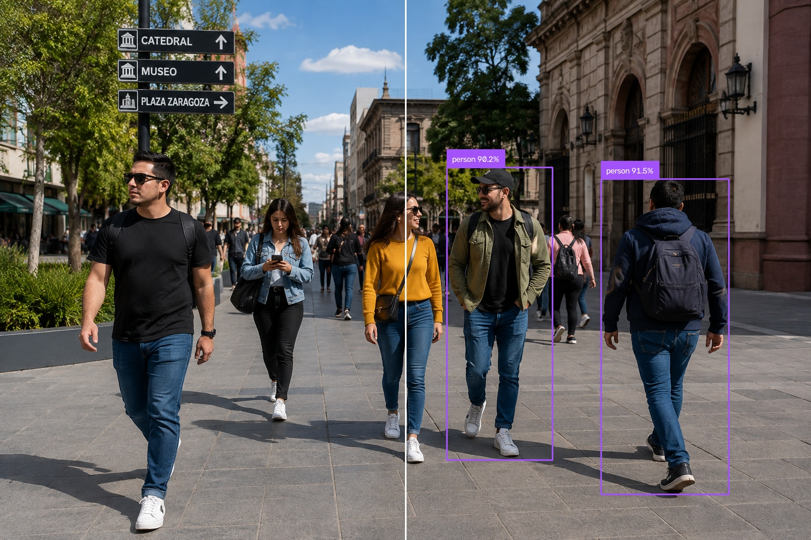

# SAM3 — Projects

This directory contains practical computer vision projects developed throughout my **SAM3 Computer Vision Learning Journey**.

The purpose of this section is to transform concepts studied during the course into complete, reusable projects that combine AI models, computer vision libraries, visualization tools, structured workflows, testing, and documentation.

Unlike the smaller examples in `04-examples/`, projects in this directory combine multiple concepts into complete applications.

---

## Available Projects

### 01 — YOLO + Supervision Object Detector

[`01-YOLO-Supervision-Object-Detector/`](./01-YOLO-Supervision-Object-Detector/)

A complete object-detection pipeline using **YOLOv8**, **OpenCV**, and **Supervision**.

The project:

- Loads an input image
- Runs YOLOv8 object detection
- Converts YOLO predictions into `sv.Detections`
- Creates class and confidence labels
- Draws bounding boxes
- Adds labels to detected objects
- Saves the annotated image
- Exports predictions to JSON

### Pipeline

```text
Input Image
    ↓
OpenCV
    ↓
YOLOv8
    ↓
Predictions
    ↓
sv.Detections
    ↓
BoxAnnotator
    ↓
LabelAnnotator
    ↓
Annotated Image
    ↓
JSON Predictions
```

**Status:** Completed and tested successfully in Google Colab.

---

### 02 — Multi-Annotator Visualization Pipeline

[`02-Multi-Annotator-Visualization-Pipeline/`](./02-Multi-Annotator-Visualization-Pipeline/)

A computer vision visualization pipeline demonstrating how multiple **Supervision Annotators** can be composed as visual layers over YOLO detections.

The project:

- Loads an input image
- Runs YOLOv8 object detection
- Applies a confidence threshold
- Converts predictions into `sv.Detections`
- Generates class and confidence labels
- Applies multiple visualization layers
- Demonstrates annotation composition
- Saves the final annotated image
- Preserves input, output, and screenshots as project evidence
- Documents the complete Google Colab testing workflow

The visualization pipeline uses:

- `BoxAnnotator`
- `EllipseAnnotator`
- `DotAnnotator`
- `LabelAnnotator`

### Pipeline

```text
Input Image
    ↓
OpenCV
    ↓
YOLOv8
    ↓
Object Detection
    ↓
sv.Detections
    ↓
BoxAnnotator
    ↓
EllipseAnnotator
    ↓
DotAnnotator
    ↓
LabelAnnotator
    ↓
Annotated Image
```

### Test Result

The project was successfully tested from a fresh **Google Colab** environment.

The completed test produced:

```text
Detected objects: 13
Annotated image saved to: output/annotated_image.jpg
```

The final visualization successfully displayed the detected objects using multiple Supervision annotation layers.

### Project Evidence

Project 02 contains an organized `assets/` directory:

```text
assets/
│
├── input/
│   ├── README.md
│   └── image.png
│
├── output/
│   ├── README.md
│   └── annotated_image.jpg
│
├── screenshots/
│   ├── README.md
│   └── project screenshots
│
└── README.md
```

This preserves the original input, generated output, and screenshots documenting the development and successful execution of the project.

**Status:** Completed, tested, documented, and supported with project evidence.

---

### 03 — Detection Filtering and NMS Pipeline

[`03-Detection-Filtering-and-NMS-Pipeline/`](./03-Detection-Filtering-and-NMS-Pipeline/)

A complete object-detection post-processing pipeline demonstrating how raw YOLO predictions can be filtered and transformed into application-specific results using **Supervision** and **NumPy**.

The project:

- Loads a pedestrian street image
- Runs YOLOv8 object detection
- Converts predictions into `sv.Detections`
- Filters detections by confidence
- Filters detections by class
- Removes small bounding boxes
- Applies Non-Maximum Suppression
- Selects the Top-N most confident detections
- Calculates bounding-box center positions
- Applies spatial filtering
- Keeps detections located in the right half of the image
- Draws the image midpoint
- Generates the final annotated output
- Preserves the original input and generated output as project evidence

### Pipeline

```text
Input Image
    ↓
YOLOv8
    ↓
Raw Predictions
    ↓
sv.Detections
    ↓
Confidence Filtering
    ↓
Class Filtering
    ↓
Size Filtering
    ↓
Non-Maximum Suppression
    ↓
Top-N Selection
    ↓
Spatial Filtering
    ↓
Final Detections
    ↓
Annotated Output
```

### Test Result

Project 03 was successfully tested in **Google Colab** using:

```text
assets/input/pedestrian-plaza-detection-test.png
```

The complete filtering process produced:

```text
Initial detections:             13
        ↓
After confidence filtering:      9
        ↓
After class filtering:           8
        ↓
After size filtering:            8
        ↓
After NMS:                       8
        ↓
After Top-5 selection:           5
        ↓
After spatial filtering:         2
```

Final result:

```text
Detection Filtering Pipeline Complete

Input image:
assets/input/pedestrian-plaza-detection-test.png

Output image:
assets/output/filtered_detections.jpg

Final detections: 2
```

### Project Evidence

Project 03 contains its own organized assets:

```text
assets/
│
├── README.md
│
├── input/
│   ├── README.md
│   └── pedestrian-plaza-detection-test.png
│
└── output/
    ├── README.md
    └── filtered_detections.jpg
```

The final generated output can be viewed here:



This project demonstrates the progression from raw object detection to a controlled post-processing pipeline where only detections satisfying specific application rules remain.

**Status:** Completed, tested successfully in Google Colab, documented, and supported with input/output evidence.

---

### 04 — Object Tracking

[`04-Object-Tracking/`](./04-Object-Tracking/)

A complete video object-tracking pipeline using **YOLOv8**, **Supervision**, and **ByteTrack**.

This project extends object detection from individual images into sequential video analysis.

Instead of treating every frame independently, ByteTrack assigns persistent `tracker_id` values that allow detected cars to be followed across consecutive frames.

The project:

- Loads a real traffic video
- Reads video metadata
- Runs YOLOv8 detection on every frame
- Converts predictions into `sv.Detections`
- Filters detections to the COCO `car` class
- Passes filtered detections to ByteTrack
- Assigns persistent tracker IDs
- Counts visible frames for each tracked car
- Calculates approximate visible time
- Maintains a set of unique tracker IDs
- Draws bounding boxes
- Adds tracking labels
- Draws object trajectories
- Displays a unique tracked-car counter
- Generates an annotated output video
- Preserves the real input and generated output as project evidence

### Pipeline

```text
Input Traffic Video
        ↓
VideoInfo
        ↓
Read Frame
        ↓
YOLOv8
        ↓
sv.Detections
        ↓
Car Class Filtering
        ↓
ByteTrack
        ↓
tracker_id
        ↓
Frame Counting
        ↓
Visible-Time Calculation
        ↓
Unique Tracker IDs
        ↓
BoxAnnotator
        ↓
LabelAnnotator
        ↓
TraceAnnotator
        ↓
Annotated Output Video
```

### Test Input

The final project uses:

```text
assets/input/vehicles.mp4
```

The repository version contains a short real-world traffic sample:

```text
Duration: 10 seconds
Frames: 250
Resolution: 1280 × 720
Target Class: Car
COCO Class ID: 2
```

Using a short real-world video keeps the repository lightweight while providing enough consecutive frames to demonstrate persistent object tracking.

### Test Result

Project 04 was successfully tested in **Google Colab**.

The final run processed:

```text
Processing video: 100% 250/250
```

Tracking analytics:

```text
Tracker ID 1: 146 frames | 5.84 seconds
Tracker ID 2: 54 frames  | 2.16 seconds
Tracker ID 3: 47 frames  | 1.88 seconds
Tracker ID 4: 173 frames | 6.92 seconds
Tracker ID 5: 176 frames | 7.04 seconds
Tracker ID 6: 27 frames  | 1.08 seconds
```

Unique tracker IDs:

```text
[1, 2, 3, 4, 5, 6]
```

Final result:

```text
Total unique tracked cars: 6

Object Tracking Project: SUCCESS
```

### Project Evidence

Project 04 contains:

```text
04-Object-Tracking/
│
├── assets/
│   ├── README.md
│   │
│   ├── input/
│   │   ├── README.md
│   │   └── vehicles.mp4
│   │
│   └── output/
│       ├── README.md
│       └── tracked_vehicles.mp4
│
├── object_tracking_pipeline.py
├── requirements.txt
└── README.md
```

The generated output contains:

```text
YOLO Car Detection
        ↓
Bounding Boxes
        ↓
Persistent Tracker IDs
        ↓
Frame Counts
        ↓
Visible-Time Estimates
        ↓
Tracking Trajectories
```

The final output video is stored at:

```text
04-Object-Tracking/assets/output/tracked_vehicles.mp4
```

### Important Tracking Note

A ByteTrack `tracker_id` represents an identity maintained during a tracking sequence.

It should not automatically be interpreted as a permanent real-world identity.

If an object disappears and later returns, the tracker may assign it a different ID.

Therefore:

```text
Unique Tracker IDs
```

represent identities maintained by the tracker during the processed sequence rather than guaranteed unique physical vehicles.

**Status:** Completed, successfully tested in Google Colab, documented, and supported with real input/output video evidence.

---

## Project Organization

Each project is designed to be self-contained.

A complete project may contain:

```text
project-name/
│
├── assets/
│   ├── input/
│   ├── output/
│   └── screenshots/
│
├── project_script.py
├── requirements.txt
└── README.md
```

The exact asset structure may vary depending on the evidence required by each project.

### `assets/input/`

Contains example input images or videos used to test the project.

### `assets/output/`

Contains results generated by the application, such as annotated images, JSON predictions, or processed videos.

### `assets/screenshots/`

When required, contains screenshots documenting development, successful executions, experiments, and results.

### `requirements.txt`

Defines the Python dependencies required to run the project.

### `README.md`

Documents the project architecture, concepts, installation, execution, results, and lessons learned.

---

## Projects vs. Examples

The repository separates small examples from larger projects:

```text
04-examples/
    Small runnable demonstrations of individual concepts

05-projects/
    Complete applications combining multiple concepts
```

Examples are designed to isolate and explain individual techniques.

Projects demonstrate how those techniques can be combined into complete computer vision workflows.

The learning progression is:

```text
Course Concept
      ↓
Notebook Experiment
      ↓
Runnable Example
      ↓
Practical Project
      ↓
Testing
      ↓
Documentation
```

---

## Technologies

Projects in this directory currently use:

- Python
- OpenCV
- NumPy
- Matplotlib
- Ultralytics YOLO
- Supervision
- ByteTrack
- JSON
- Video processing
- Google Colab
- Git
- GitHub

The projects currently cover concepts including:

- Object detection
- `sv.Detections`
- Bounding boxes
- Confidence scores
- Class filtering
- Detection visualization
- Supervision Annotators
- Annotation composition
- Boolean detection masks
- Bounding-box area filtering
- Non-Maximum Suppression
- Top-N detection selection
- Spatial filtering
- Detection post-processing
- Video processing
- Object tracking
- Persistent `tracker_id` values
- ByteTrack
- Frame visibility counting
- Visible-time calculation
- Unique tracker IDs
- Object trajectories
- Tracking analytics

Future projects will expand this stack as the course progresses toward more advanced computer vision and **SAM3** workflows.

---

## Current Progress

| # | Project | Testing | Documentation | Status |
|---|---|---|---|---|
| 01 | [YOLO + Supervision Object Detector](./01-YOLO-Supervision-Object-Detector/) | Google Colab | Complete | Completed |
| 02 | [Multi-Annotator Visualization Pipeline](./02-Multi-Annotator-Visualization-Pipeline/) | Google Colab | Complete + Assets | Completed |
| 03 | [Detection Filtering and NMS Pipeline](./03-Detection-Filtering-and-NMS-Pipeline/) | Google Colab | Complete + Assets | Completed |
| 04 | [Object Tracking](./04-Object-Tracking/) | Google Colab | Complete + Input/Output Video | Completed |

**Total completed projects: 4**

---

## Repository Structure

These projects are part of the larger **SAM3 Learning Journey**:

```text
SAM3-Learning-Journey/
│
├── 03-notebooks/
│   └── Original course notebooks
│
├── 04-examples/
│   └── Small runnable examples
│
├── 05-projects/
│   └── Complete practical projects
│
├── 08-course-notes/
│   └── Detailed concepts and class notes
│
└── 09-assets/
    └── Repository-wide banners and supporting assets
```

Project-specific images, videos, and execution evidence remain inside each project's own `assets/` directory.

Repository-wide visual resources remain inside `09-assets/`.

---

## Project Development Workflow

Projects in this repository generally follow this workflow:

```text
Study Course Concept
        ↓
Experiment in Notebook
        ↓
Create Small Examples
        ↓
Design Project
        ↓
Write Python Application
        ↓
Install Dependencies
        ↓
Prepare Test Input
        ↓
Run Complete Pipeline
        ↓
Verify Output
        ↓
Save Evidence
        ↓
Document Project
```

This provides a clear progression from learning a concept to implementing and validating it in a practical application.

---

## Goal

The goal of this directory is not only to store code, but to document the progression from individual computer vision concepts to complete AI applications.

Each project provides practical experience with:

- Designing computer vision pipelines
- Working with AI model predictions
- Processing detection data
- Visualizing model results
- Filtering model predictions
- Applying application-specific detection rules
- Tracking objects across video frames
- Maintaining persistent tracker IDs
- Creating tracking analytics
- Processing and generating video
- Organizing reusable Python applications
- Managing project dependencies
- Testing projects in Google Colab
- Verifying generated outputs
- Preserving project evidence
- Documenting experiments and results
- Maintaining projects with Git and GitHub

More projects will be added as the **SAM3 Learning Journey** progresses.

---

## Author

**Peyman Miyandashti**

SAM3 Computer Vision Learning Journey  
Computer Vision · Artificial Intelligence · Machine Learning

[LinkedIn](https://www.linkedin.com/in/peyman-mxli/) | [GitHub](https://github.com/Peyman-mxli)
