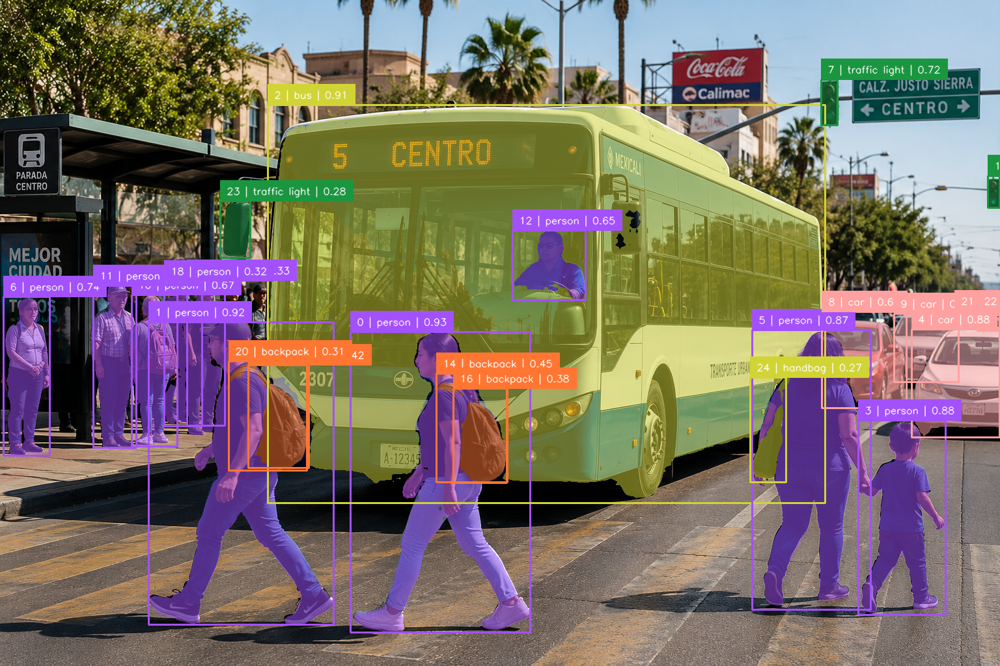

# SAM3 — Projects

This directory contains practical computer vision projects developed throughout my **SAM3 Computer Vision Learning Journey**.

The purpose of this section is to transform concepts studied during the course into complete, reusable projects that combine AI models, computer vision libraries, visualization tools, structured workflows, testing, evaluation, and documentation.

Unlike the smaller examples in `04-examples/`, projects in this directory combine multiple concepts into complete applications.

---

## Available Projects

### 01 — YOLO + Supervision Object Detector

[`01-YOLO-Supervision-Object-Detector/`](./01-YOLO-Supervision-Object-Detector/)

A complete object-detection pipeline using **YOLOv8**, **OpenCV**, and **Supervision**.

The project:

- Loads an input image
- Runs YOLOv8 object detection
- Converts YOLO predictions into `sv.Detections`
- Creates class and confidence labels
- Draws bounding boxes
- Adds labels to detected objects
- Saves the annotated image
- Exports predictions to JSON

### Pipeline

```text
Input Image
    ↓
OpenCV
    ↓
YOLOv8
    ↓
Predictions
    ↓
sv.Detections
    ↓
BoxAnnotator
    ↓
LabelAnnotator
    ↓
Annotated Image
    ↓
JSON Predictions
```

**Status:** Completed and tested successfully in Google Colab.

---

### 02 — Multi-Annotator Visualization Pipeline

[`02-Multi-Annotator-Visualization-Pipeline/`](./02-Multi-Annotator-Visualization-Pipeline/)

A computer vision visualization pipeline demonstrating how multiple **Supervision Annotators** can be composed as visual layers over YOLO detections.

The project:

- Loads an input image
- Runs YOLOv8 object detection
- Applies a confidence threshold
- Converts predictions into `sv.Detections`
- Generates class and confidence labels
- Applies multiple visualization layers
- Demonstrates annotation composition
- Saves the final annotated image
- Preserves input, output, and screenshots as project evidence
- Documents the complete Google Colab testing workflow

The visualization pipeline uses:

- `BoxAnnotator`
- `EllipseAnnotator`
- `DotAnnotator`
- `LabelAnnotator`

### Pipeline

```text
Input Image
    ↓
OpenCV
    ↓
YOLOv8
    ↓
Object Detection
    ↓
sv.Detections
    ↓
BoxAnnotator
    ↓
EllipseAnnotator
    ↓
DotAnnotator
    ↓
LabelAnnotator
    ↓
Annotated Image
```

### Test Result

The project was successfully tested from a fresh **Google Colab** environment.

The completed test produced:

```text
Detected objects: 13
Annotated image saved to: output/annotated_image.jpg
```

The final visualization successfully displayed the detected objects using multiple Supervision annotation layers.

### Project Evidence

Project 02 contains an organized `assets/` directory:

```text
assets/
│
├── input/
│   ├── README.md
│   └── image.png
│
├── output/
│   ├── README.md
│   └── annotated_image.jpg
│
├── screenshots/
│   ├── README.md
│   └── project screenshots
│
└── README.md
```

This preserves the original input, generated output, and screenshots documenting the development and successful execution of the project.

**Status:** Completed, tested, documented, and supported with project evidence.

---

### 03 — Detection Filtering and NMS Pipeline

[`03-Detection-Filtering-and-NMS-Pipeline/`](./03-Detection-Filtering-and-NMS-Pipeline/)

A complete object-detection post-processing pipeline demonstrating how raw YOLO predictions can be filtered and transformed into application-specific results using **Supervision** and **NumPy**.

The project:

- Loads a pedestrian street image
- Runs YOLOv8 object detection
- Converts predictions into `sv.Detections`
- Filters detections by confidence
- Filters detections by class
- Removes small bounding boxes
- Applies Non-Maximum Suppression
- Selects the Top-N most confident detections
- Calculates bounding-box center positions
- Applies spatial filtering
- Keeps detections located in the right half of the image
- Draws the image midpoint
- Generates the final annotated output
- Preserves the original input and generated output as project evidence

### Pipeline

```text
Input Image
    ↓
YOLOv8
    ↓
Raw Predictions
    ↓
sv.Detections
    ↓
Confidence Filtering
    ↓
Class Filtering
    ↓
Size Filtering
    ↓
Non-Maximum Suppression
    ↓
Top-N Selection
    ↓
Spatial Filtering
    ↓
Final Detections
    ↓
Annotated Output
```

### Test Result

Project 03 was successfully tested in **Google Colab** using:

```text
assets/input/pedestrian-plaza-detection-test.png
```

The complete filtering process produced:

```text
Initial detections:             13
        ↓
After confidence filtering:      9
        ↓
After class filtering:           8
        ↓
After size filtering:            8
        ↓
After NMS:                       8
        ↓
After Top-5 selection:           5
        ↓
After spatial filtering:         2
```

Final result:

```text
Detection Filtering Pipeline Complete

Input image:
assets/input/pedestrian-plaza-detection-test.png

Output image:
assets/output/filtered_detections.jpg

Final detections: 2
```

### Project Evidence

Project 03 contains its own organized assets:

```text
assets/
│
├── README.md
│
├── input/
│   ├── README.md
│   └── pedestrian-plaza-detection-test.png
│
└── output/
    ├── README.md
    └── filtered_detections.jpg
```

The final generated output can be viewed here:


This project demonstrates the progression from raw object detection to a controlled post-processing pipeline where only detections satisfying specific application rules remain.

**Status:** Completed, tested successfully in Google Colab, documented, and supported with input/output evidence.

---

### 04 — Object Tracking

[`04-Object-Tracking/`](./04-Object-Tracking/)

A complete video object-tracking pipeline using **YOLOv8**, **Supervision**, and **ByteTrack**.

This project extends object detection from individual images into sequential video analysis.

Instead of treating every frame independently, ByteTrack assigns persistent `tracker_id` values that allow detected cars to be followed across consecutive frames.

The project:

- Loads a real traffic video
- Reads video metadata
- Runs YOLOv8 detection on every frame
- Converts predictions into `sv.Detections`
- Filters detections to the COCO `car` class
- Passes filtered detections to ByteTrack
- Assigns persistent tracker IDs
- Counts visible frames for each tracked car
- Calculates approximate visible time
- Maintains a set of unique tracker IDs
- Draws bounding boxes
- Adds tracking labels
- Draws object trajectories
- Displays a unique tracked-car counter
- Generates an annotated output video
- Preserves the real input and generated output as project evidence

### Pipeline

```text
Input Traffic Video
        ↓
VideoInfo
        ↓
Read Frame
        ↓
YOLOv8
        ↓
sv.Detections
        ↓
Car Class Filtering
        ↓
ByteTrack
        ↓
tracker_id
        ↓
Frame Counting
        ↓
Visible-Time Calculation
        ↓
Unique Tracker IDs
        ↓
BoxAnnotator
        ↓
LabelAnnotator
        ↓
TraceAnnotator
        ↓
Annotated Output Video
```

### Test Input

The final project uses:

```text
assets/input/vehicles.mp4
```

The repository version contains a short real-world traffic sample:

```text
Duration: 10 seconds
Frames: 250
Resolution: 1280 × 720
Target Class: Car
COCO Class ID: 2
```

Using a short real-world video keeps the repository lightweight while providing enough consecutive frames to demonstrate persistent object tracking.

### Test Result

Project 04 was successfully tested in **Google Colab**.

The final run processed:

```text
Processing video: 100% 250/250
```

Tracking analytics:

```text
Tracker ID 1: 146 frames | 5.84 seconds
Tracker ID 2: 54 frames  | 2.16 seconds
Tracker ID 3: 47 frames  | 1.88 seconds
Tracker ID 4: 173 frames | 6.92 seconds
Tracker ID 5: 176 frames | 7.04 seconds
Tracker ID 6: 27 frames  | 1.08 seconds
```

Unique tracker IDs:

```text
[1, 2, 3, 4, 5, 6]
```

Final result:

```text
Total unique tracked cars: 6

Object Tracking Project: SUCCESS
```

### Project Evidence

Project 04 contains:

```text
04-Object-Tracking/
│
├── assets/
│   ├── README.md
│   │
│   ├── input/
│   │   ├── README.md
│   │   └── vehicles.mp4
│   │
│   └── output/
│       ├── README.md
│       └── tracked_vehicles.mp4
│
├── object_tracking_pipeline.py
├── requirements.txt
└── README.md
```

The generated output contains:

```text
YOLO Car Detection
        ↓
Bounding Boxes
        ↓
Persistent Tracker IDs
        ↓
Frame Counts
        ↓
Visible-Time Estimates
        ↓
Tracking Trajectories
```

The final output video is stored at:

```text
04-Object-Tracking/assets/output/tracked_vehicles.mp4
```

### Important Tracking Note

A ByteTrack `tracker_id` represents an identity maintained during a tracking sequence.

It should not automatically be interpreted as a permanent real-world identity.

If an object disappears and later returns, the tracker may assign it a different ID.

Therefore:

```text
Unique Tracker IDs
```

represent identities maintained by the tracker during the processed sequence rather than guaranteed unique physical vehicles.

**Status:** Completed, successfully tested in Google Colab, documented, and supported with real input/output video evidence.

---

### 05 — Zones and Counting Analytics

[`05-Zones-and-Counting-Analytics/`](./05-Zones-and-Counting-Analytics/)

A complete spatial video analytics project using **YOLOv8s**, **Supervision**, **ByteTrack**, `PolygonZone`, and `LineZone`.

This project extends object tracking by introducing spatial regions and virtual counting boundaries.

Instead of only tracking where people move, the application can determine how many tracked people are currently inside a defined region and whether a tracked person crosses a virtual line.

The project:

- Loads a real pedestrian video
- Reads video metadata
- Runs YOLOv8s person detection on every frame
- Filters inference to the COCO `person` class
- Converts YOLO predictions into `sv.Detections`
- Tracks pedestrians using ByteTrack
- Assigns persistent `tracker_id` values
- Defines a custom PolygonZone
- Calculates current PolygonZone occupancy
- Defines a custom LineZone
- Detects confirmed line-crossing events
- Maintains directional crossing counters
- Draws person bounding boxes
- Displays `Person #ID` labels
- Visualizes the PolygonZone
- Visualizes the LineZone
- Displays current people-in-zone analytics
- Displays Crossings In / Crossings Out
- Generates a complete annotated output video
- Converts the final video to an H.264-compatible MP4 for browser playback

### Pipeline

```text
Input Pedestrian Video
        ↓
VideoInfo
        ↓
Read Frame
        ↓
YOLOv8s
        ↓
Person Detection
        ↓
sv.Detections
        ↓
ByteTrack
        ↓
Persistent Person IDs
        ↓
        ├───────────────────────┐
        ↓                       ↓
   PolygonZone               LineZone
        ↓                       ↓
Current Occupancy         Crossing Events
        ↓                       ↓
        └───────────┬───────────┘
                    ↓
               BoxAnnotator
                    ↓
               LabelAnnotator
                    ↓
             Spatial Analytics
                    ↓
              Annotated Video
```

### Detection Configuration

The final tested detector configuration is:

```text
Model: YOLOv8s
Confidence Threshold: 0.15
Inference Size: 1280
Target Class: Person
COCO Class ID: 0
```

The project initially tested YOLOv8n, but YOLOv8s was selected for the final pipeline because the real pedestrian scene contains many small and partially occluded people.

### Tracking Configuration

The final ByteTrack configuration uses:

```text
Track Activation Threshold: 0.15
Lost Track Buffer: 90
Minimum Matching Threshold: 0.70
Frame Rate: Video FPS
```

The tracker configuration was adjusted to improve tracking continuity in the crowded pedestrian scene.

### PolygonZone

The final PolygonZone coordinates are:

```text
[520, 470]
[1320, 470]
[1460, 900]
[420, 900]
```

The PolygonZone represents the primary pedestrian-crossing area and allows the application to calculate:

```text
People in Zone
```

for every processed frame.

### LineZone

Multiple line orientations were tested during development:

```text
Horizontal
Vertical
Diagonal 1
Diagonal 2
```

The final implementation uses a vertical LineZone:

```text
Start: (960, 400)
End:   (960, 920)
```

The vertical orientation was the tested configuration that produced a confirmed pedestrian crossing event.

### Test Input

The final project uses:

```text
assets/input/people_walking.mp4
```

Video information:

```text
Resolution: 1920 × 1080
FPS: 50
Frames: 763
Duration: approximately 15.26 seconds
```

The video contains a real crowded pedestrian intersection and provides a challenging test for detection, tracking, occupancy analysis, and line-crossing analytics.

### Test Result

Project 05 was successfully tested in **Google Colab**.

The final run processed:

```text
Processing video: 100%
763/763
```

Final analytics:

```text
Final people in PolygonZone: 6

Crossings In: 0
Crossings Out: 1
Total Crossings: 1
```

Because the scene contains a dense crowd and significant occlusion, the LineZone result represents **confirmed crossings maintained by the tracking pipeline**, rather than the total number of physical pedestrians visible in the intersection.

### Project Evidence

Project 05 contains:

```text
05-Zones-and-Counting-Analytics/
│
├── assets/
│   ├── input/
│   │   ├── README.md
│   │   └── people_walking.mp4
│   │
│   └── output/
│       ├── README.md
│       └── people_zones_counting_final.mp4
│
├── zones_counting_analytics.py
├── requirements.txt
└── README.md
```

The final output video is stored at:

```text
05-Zones-and-Counting-Analytics/assets/output/people_zones_counting_final.mp4
```

The generated output demonstrates:

```text
YOLOv8s Person Detection
        ↓
Bounding Boxes
        ↓
Persistent Person IDs
        ↓
PolygonZone
        ↓
Current Occupancy
        ↓
LineZone
        ↓
Directional Crossing Analytics
        ↓
Final Annotated Video
```

**Status:** Completed, successfully tested in Google Colab, documented, and supported with real input/output video evidence.

---

### 06 — Visual Tracking and Analysis System

[`06-Visual-Tracking-and-Analysis-System/`](./06-Visual-Tracking-and-Analysis-System/)

A complete computer vision system that combines **object detection, segmentation, multi-object tracking, persistent storage, analytics, evaluation, and visualization**.

This project represents a major progression from the previous projects because it moves beyond a single detection or tracking task and builds a structured visual-analysis system capable of processing media, preserving results, and evaluating model performance.

The project was developed from the official **Sistema de Seguimiento y Análisis Visual** proposal.

The system:

- Processes images and video
- Detects objects using YOLO
- Segments objects using SAM 3
- Tracks objects across video frames
- Assigns persistent tracker IDs
- Records object observations
- Calculates tracking duration
- Calculates trajectory information
- Measures movement distance
- Stores structured results
- Uses SQLite for persistence
- Generates CSV analytics
- Produces charts and visualizations
- Supports historical result analysis
- Includes a minimal Streamlit interface
- Includes a manually annotated evaluation dataset
- Calculates detection and segmentation metrics
- Documents limitations and evaluation results

---

### System Architecture

```text
Input Media
    ↓
Image / Video Processing
    ↓
YOLO Detection
    ↓
SAM 3 Segmentation
    ↓
ByteTrack
    ↓
Persistent Tracker IDs
    ↓
Observation Records
    ↓
SQLite Database
    ↓
Analytics Layer
    ↓
CSV Reports
    ↓
Charts / Visualizations
    ↓
Evaluation
    ↓
Streamlit Interface
```

The architecture separates inference, tracking, storage, analytics, evaluation, and presentation into different stages.

---

### Image Processing Pipeline

The image-processing stage demonstrates:

```text
Input Image
    ↓
YOLO Detection
    ↓
Bounding Boxes
    ↓
SAM 3
    ↓
Segmentation Masks
    ↓
Structured Results
```

This allows detected objects to be represented using both rectangular detections and pixel-level segmentation information.

---

### Video Tracking Pipeline

The video-processing stage extends the system to temporal analysis.

```text
Input Video
    ↓
Frame Extraction
    ↓
YOLO Detection
    ↓
ByteTrack
    ↓
tracker_id
    ↓
SAM 3 Segmentation
    ↓
Observation Storage
    ↓
Trajectory Analysis
```

Each tracked object can accumulate multiple observations over time.

---

### Tracking Validation

The validated Project 06 tracking video contained:

```text
Frames: 75
Object observations: 246
Tracker IDs: 6
```

The six maintained tracker IDs were:

```text
1
2
3
4
5
6
```

Tracked classes included:

```text
person
bus
```

---

### Tracking Analytics

The validated tracking data produced:

```text
Average observations per frame:   3.2800
Average observations per tracker: 41.0000

Average confidence:                0.6815
Minimum confidence:                0.5124
Maximum confidence:                0.8587

Average tracker duration:          2.7333 seconds
Minimum tracker duration:          0.20 seconds
Maximum tracker duration:          5.00 seconds

Total movement distance:           693.18 px
Average movement per tracker:      115.53 px
Maximum movement distance:         203.37 px

Average movement step:             2.9883 px
```

These measurements transform raw tracking observations into quantitative trajectory information.

---

### Tracker Summary

The validated tracker-level results were:

```text
Tracker 1
Class: person
Frames: 1–75
Observations: 75
Average confidence: 0.8385
Movement distance: 159.26 px

Tracker 2
Class: person
Frames: 1–75
Observations: 75
Average confidence: 0.8587
Movement distance: 203.37 px

Tracker 3
Class: bus
Frames: 3–75
Observations: 59
Average confidence: 0.5939
Movement distance: 182.36 px

Tracker 4
Class: person
Frames: 8–32
Observations: 25
Average confidence: 0.7579
Movement distance: 139.34 px

Tracker 5
Class: person
Frames: 29–31
Observations: 3
Average confidence: 0.5278
Movement distance: 7.91 px

Tracker 6
Class: person
Frames: 53–61
Observations: 9
Average confidence: 0.5124
Movement distance: 0.94 px
```

This tracker-level analysis provides information about:

- Observation count
- Object class
- Tracking duration
- Average confidence
- Approximate movement distance

---

### Persistence Layer

Project 06 includes structured result persistence using **SQLite**.

The database stores information associated with processing sessions and computer vision results.

The persistence design includes support for:

```text
Identifier
Timestamp
Media information
Result information
Confidence
Notes
```

This makes it possible to preserve analysis results instead of treating inference as temporary console output.

Conceptually:

```text
Computer Vision Pipeline
          ↓
Structured Observation
          ↓
SQLite Database
          ↓
Historical Analysis
```

---

### Analytics Layer

The project contains a dedicated analytics workflow for transforming stored tracking information into interpretable results.

Generated analytics include:

- Tracker summaries
- Observation statistics
- Confidence statistics
- Tracking duration
- Trajectory measurements
- Movement-distance measurements
- CSV reports
- Performance summaries
- Visualization charts

The analytics workflow produces files such as:

```text
performance_summary.csv
performance_chart.png
```

This allows tracking results to be inspected outside the raw inference pipeline.

---

### Evaluation Dataset

Project 06 includes a dedicated manually annotated evaluation dataset created using **Roboflow**.

Evaluation configuration:

```text
Project: Project-06-Evaluation
Task: Instance Segmentation
Target class: person
Images: 20
```

The evaluation set contains manually reviewed ground-truth annotations.

Total ground-truth instances:

```text
424
```

This dataset was used to evaluate the computer vision system against labeled reference data rather than relying only on visual inspection.

---

### Final Evaluation Results

The completed evaluation produced:

```text
Evaluation images: 20

Ground-truth instances: 424
Predictions:             472

True Positives:          381
False Positives:          91
False Negatives:          43
```

Detection metrics:

```text
Precision: 0.8072
Recall:    0.8986
```

Segmentation metrics:

```text
Average IoU:  0.7969
Average Dice: 0.8829
```

These results show that the system achieved strong recall while maintaining useful precision and segmentation overlap.

---

### Evaluation Interpretation

Precision measures how many predicted objects correspond to valid ground-truth objects.

```text
Precision = TP / (TP + FP)
```

Validated value:

```text
0.8072
```

Recall measures how many ground-truth objects were successfully detected.

```text
Recall = TP / (TP + FN)
```

Validated value:

```text
0.8986
```

Intersection over Union evaluates segmentation overlap:

```text
           Intersection
IoU = ─────────────────────
           Union
```

Validated average:

```text
0.7969
```

Dice measures similarity between predicted and ground-truth masks:

```text
             2 × Intersection
Dice = ─────────────────────────
        Predicted Area + GT Area
```

Validated average:

```text
0.8829
```

Together, these metrics provide both detection-level and pixel-level evaluation.

---

### Evaluation Summary

The final evaluation can be summarized as:

```text
20 evaluation images
        ↓
424 ground-truth persons
        ↓
472 predictions
        ↓
381 true positives
        ↓
Precision = 0.8072
Recall    = 0.8986
        ↓
Average IoU  = 0.7969
Average Dice = 0.8829
```

This moves Project 06 beyond demonstration-only computer vision by providing quantitative ground-truth evaluation.

---

### Limitations

The project explicitly documents limitations affecting real-world computer vision performance.

These include:

- Lighting conditions
- Object scale
- Occlusion
- Out-of-sample data
- False-positive detections
- Omitted objects / false negatives

These limitations are important because model performance depends strongly on scene conditions and data distribution.

Tracking also introduces additional limitations.

A `tracker_id` represents an identity maintained by the tracking algorithm during the observed sequence.

It should not be interpreted as a permanent real-world identity.

Objects that disappear, become heavily occluded, or later re-enter the scene may receive different tracker IDs.

---

### Streamlit Interface

Project 06 also includes a minimal **Streamlit** application.

The interface provides an application layer for exploring the computer vision system rather than interacting only through Python scripts.

Conceptually:

```text
Computer Vision Pipeline
          ↓
Stored Results
          ↓
Analytics
          ↓
Streamlit
          ↓
User Exploration
```

This demonstrates how computer vision processing can be integrated into a simple interactive application.

---

### Project Documentation

The project contains dedicated documentation for:

```text
Results
Limitations
Analytics
Evaluation
```

Important documentation includes:

```text
docs/RESULTS.md
docs/LIMITATIONS.md
```

The documentation records the final validated metrics, project behavior, known limitations, and evaluation conclusions.

---

### Definition of Done

The official Project 06 MVP was completed.

The final system includes:

```text
Image processing                 ✅
YOLO object detection            ✅
SAM 3 segmentation               ✅
Video processing                 ✅
ByteTrack tracking               ✅
Persistent tracker IDs           ✅
SQLite persistence               ✅
Tracking analytics               ✅
Trajectory analysis              ✅
CSV reports                      ✅
Charts and visualizations        ✅
Streamlit interface              ✅
Ground-truth evaluation          ✅
Precision / Recall evaluation    ✅
IoU evaluation                   ✅
Dice evaluation                  ✅
Results documentation            ✅
Limitations documentation        ✅
```

---

### Final Outcome

Project 06 demonstrates the transition from isolated computer vision operations into a more complete visual-analysis system.

The complete progression is:

```text
Input Media
    ↓
Detection
    ↓
Segmentation
    ↓
Tracking
    ↓
Persistent Observations
    ↓
Database Storage
    ↓
Analytics
    ↓
Trajectory Analysis
    ↓
Visualization
    ↓
Ground-Truth Evaluation
    ↓
Application Interface
```

This project combines multiple concepts developed throughout the SAM3 Learning Journey into a single structured system.

**Status:** Completed according to the official MVP / Definition of Done, quantitatively evaluated, documented, and validated.

---

### 07 — SAM 3 Segmentation Pipeline

[`07-SAM3-Segmentation-Pipeline/`](./07-SAM3-Segmentation-Pipeline/)

A complete multi-object detection and pixel-level segmentation pipeline using **YOLOv8**, **SAM 3**, **Supervision**, **OpenCV**, and **NumPy**.

This project extends the concepts studied in **Session 06 — Segmentation with SAM** into a reusable end-to-end application.

Unlike the smaller segmentation examples, Project 07 combines object detection, confidence filtering, SAM 3 prompting, mask generation, geometric analysis, object extraction, visualization, and structured JSON export into a single validated pipeline.

The project:

- Loads a custom multi-object input image
- Runs YOLOv8 object detection
- Converts YOLO predictions into `sv.Detections`
- Applies confidence filtering
- Extracts accepted bounding boxes
- Uses YOLO bounding boxes as SAM 3 prompts
- Generates pixel-level segmentation masks
- Analyzes every generated mask
- Calculates mask area
- Calculates image coverage
- Calculates bounding-box area
- Compares mask area with bounding-box area
- Extracts individual segmented objects
- Exports individual mask images
- Generates a complete annotated segmentation visualization
- Exports structured segmentation results to JSON
- Preserves representative masks and extracted objects as project evidence
- Validates the complete detection-to-segmentation workflow

---

### Pipeline

```text
Custom Input Image
        ↓
      YOLOv8
        ↓
 Object Detection
        ↓
Confidence Filtering
        ↓
Accepted Detections
        ↓
 Bounding Boxes
        ↓
 SAM 3 Prompts
        ↓
Pixel-Level Masks
        ↓
Mask Analysis
        ↓
        ├──────────────────────────┐
        ↓                          ↓
Object Extraction            Mask Export
        │                          │
        └────────────┬─────────────┘
                     ↓
               Visualization
                     ↓
              Structured JSON
```

---

### Custom Validation Scene

Project 07 uses a custom validation image:

```text
assets/input/mexicali_bus_scene.png
```

Image resolution:

```text
1536 × 1024
```

The scene contains multiple objects at different positions and scales.

Detected object categories during the validated run included:

```text
Person
Bus
Car
Traffic light
Backpack
Handbag
```

Using a custom scene makes Project 07 independent from the original `bus.jpg` image used in the smaller Session 06 exercises.

---

### Detection Configuration

The validated detection configuration uses:

```text
Detector: YOLOv8n
Confidence Threshold: 0.25
```

YOLO provides:

```text
Object Class
Confidence Score
Bounding Box
```

The accepted bounding boxes are then passed to SAM 3 as spatial prompts.

---

### YOLO + SAM 3 Integration

The central architecture of Project 07 is:

```text
YOLOv8
   ↓
Object Detection
   ↓
Bounding Box
   ↓
SAM 3 Prompt
   ↓
Pixel-Level Segmentation Mask
```

YOLO answers approximately:

```text
What is the object?
Where is the object?
```

SAM 3 then provides a more precise pixel-level representation of the detected object.

---

### SAM 3 Model

The SAM 3 checkpoint is stored externally because the model is too large to include directly in the GitHub repository.

Validated Google Colab path:

```text
/content/drive/MyDrive/SAM3-Models/sam3.pt
```

Approximate model size:

```text
3.21 GB
```

The pipeline verifies that the checkpoint exists before starting SAM 3 inference.

---

### Final Validation Results

Project 07 was successfully executed end-to-end in **Google Colab**.

The validated run produced:

```text
Raw YOLO detections:       25
Accepted detections:       25
SAM 3 masks generated:     25
Objects analyzed:          25
```

The complete relationship was:

```text
25 YOLO detections
        ↓
25 accepted detections
        ↓
25 bounding-box prompts
        ↓
25 SAM 3 masks
        ↓
25 analyzed objects
```

This confirms that every accepted YOLO detection produced a corresponding SAM 3 segmentation result during the validated execution.

---

### Segmentation Mask Representation

SAM 3 masks are represented as boolean NumPy arrays.

```text
True  → pixel belongs to the object
False → pixel belongs to the background
```

For the validated image, the complete mask array had the shape:

```text
(25, 1024, 1536)
```

This means:

```text
25 segmented objects
1024 image rows
1536 image columns
```

The masks therefore preserve pixel-level information at the original image resolution.

---

### Mask Analysis

Each generated mask is analyzed independently.

The project calculates:

- Mask area
- Bounding-box area
- Image coverage
- Mask-to-box percentage

Mask area is calculated from the boolean array:

```python
mask_area = int(mask.sum())
```

Bounding-box area is calculated using:

```text
(x2 - x1) × (y2 - y1)
```

The mask-to-box relationship is:

```text
      Mask Area
──────────────────── × 100
Bounding Box Area
```

This demonstrates how much of the rectangular detection region is actually occupied by the segmented object.

---

### Bus Segmentation Result

The bus produced one of the strongest and most visually useful segmentation results.

Validated bus result:

```text
Class: bus
YOLO confidence: 0.9149
Mask area: 395,899 pixels
Image coverage: 25.17%
Mask / bounding-box area: 75.64%
```

Conceptually:

```text
YOLO Bus Detection
        ↓
Bus Bounding Box
        ↓
SAM 3 Prompt
        ↓
Pixel-Level Bus Mask
        ↓
Extracted Bus
```

The result demonstrates the difference between rectangular object localization and pixel-level segmentation.

---

### Object Extraction

Every SAM 3 mask can be used to isolate its corresponding object from the original image.

The central operation is:

```python
object_image[~mask] = 0
```

Conceptually:

```text
Original Image
      +
SAM 3 Mask
      ↓
Pixel Selection
      ↓
Background Removed
      ↓
Extracted Object
```

The complete validated execution generated:

```text
25 extracted objects
```

---

### Mask Export

The complete run also generated:

```text
25 individual mask images
```

The exported mask representation uses:

```text
White pixels → segmented object
Black pixels → background
```

This allows each SAM 3 result to be inspected independently.

---

### Final Visualization

The complete annotated segmentation result is stored at:

```text
assets/output/annotated_segmentation.png
```

The visualization combines:

- Segmentation masks
- Bounding boxes
- Object classes
- Confidence scores
- Object indices

The final image can be viewed here:



This provides a single visual overview of the complete Project 07 inference result.

---

### Structured Results

The complete machine-readable analysis is stored at:

```text
assets/output/segmentation_results.json
```

The JSON preserves project-level information such as:

```text
Input image
Image dimensions
Confidence threshold
YOLO detection count
Accepted detection count
SAM mask count
Analyzed object count
```

For individual objects, the structured results include information such as:

```text
Object index
Class ID
Class name
Confidence
Bounding-box coordinates
Bounding-box area
Mask area
Image coverage
Mask-to-box percentage
Mask filename
Extracted-object filename
```

This allows the segmentation results to be analyzed later without repeating model inference.

---

### Representative Project Evidence

The complete execution generated:

```text
25 segmentation masks
25 extracted objects
```

Rather than storing every generated visualization in the repository, Project 07 preserves a representative subset.

Selected objects:

```text
object_00
object_01
object_02
object_04
object_05
object_17
```

The corresponding extracted objects are stored inside:

```text
assets/output/extracted_objects/
```

The corresponding masks are stored inside:

```text
assets/output/masks/
```

---

### Representative Extracted Objects

```text
assets/output/extracted_objects/
│
├── README.md
├── object_00.png
├── object_01.png
├── object_02.png
├── object_04.png
├── object_05.png
└── object_17.png
```

These examples demonstrate segmentation across different objects, positions, and scales.

---

### Representative Masks

```text
assets/output/masks/
│
├── README.md
├── object_00_mask.png
├── object_01_mask.png
├── object_02_mask.png
├── object_04_mask.png
├── object_05_mask.png
└── object_17_mask.png
```

Each representative mask corresponds directly to an extracted object:

```text
object_00_mask.png → object_00.png
object_01_mask.png → object_01.png
object_02_mask.png → object_02.png
object_04_mask.png → object_04.png
object_05_mask.png → object_05.png
object_17_mask.png → object_17.png
```

---

### Project Evidence Structure

Project 07 contains:

```text
07-SAM3-Segmentation-Pipeline/
│
├── README.md
├── requirements.txt
├── sam3_segmentation_pipeline.py
│
└── assets/
    │
    ├── README.md
    │
    ├── input/
    │   ├── README.md
    │   └── mexicali_bus_scene.png
    │
    └── output/
        │
        ├── README.md
        ├── annotated_segmentation.png
        ├── segmentation_results.json
        │
        ├── extracted_objects/
        │   ├── README.md
        │   ├── object_00.png
        │   ├── object_01.png
        │   ├── object_02.png
        │   ├── object_04.png
        │   ├── object_05.png
        │   └── object_17.png
        │
        └── masks/
            ├── README.md
            ├── object_00_mask.png
            ├── object_01_mask.png
            ├── object_02_mask.png
            ├── object_04_mask.png
            ├── object_05_mask.png
            └── object_17_mask.png
```

---

### Validation Summary

The complete Project 07 pipeline was validated successfully.

```text
Input handling                  ✅
YOLO detection                 ✅
Confidence filtering           ✅
Bounding-box extraction        ✅
SAM 3 checkpoint loading       ✅
SAM 3 segmentation             ✅
25 masks generated             ✅
Mask analysis                  ✅
Bounding-box comparison        ✅
Object extraction              ✅
Mask export                    ✅
Annotated visualization        ✅
Structured JSON export         ✅
Representative evidence        ✅
Documentation                  ✅
```

Final relationship:

```text
Accepted YOLO detections
          =
Generated SAM 3 masks
          =
Analyzed objects

25 = 25 = 25
```

**Status:** Completed, successfully tested in Google Colab, documented, and validated with real generated segmentation evidence.

---

# Project Progression

The projects in this directory demonstrate a progressive development of computer vision skills.

```text
Project 01
YOLO Object Detection
        ↓
Project 02
Multi-Annotator Visualization
        ↓
Project 03
Detection Filtering + NMS
        ↓
Project 04
Object Tracking + ByteTrack
        ↓
Project 05
Zones + Counting Analytics
        ↓
Project 06
Visual Tracking + Analysis System
        ↓
Project 07
SAM 3 Segmentation Pipeline
```

Each project builds on concepts developed in earlier stages.

---

# Skills Developed Across the Projects

The seven completed projects demonstrate practical experience with:

- Python
- Computer Vision
- OpenCV
- NumPy
- Ultralytics
- YOLOv8
- SAM 3
- Supervision
- `sv.Detections`
- Bounding-box processing
- Confidence filtering
- Class filtering
- Size filtering
- Non-Maximum Suppression
- Top-N selection
- Spatial filtering
- Multi-annotator visualization
- Video processing
- ByteTrack
- Persistent tracker IDs
- Tracking trajectories
- PolygonZone
- LineZone
- Occupancy analytics
- Directional crossing analytics
- Pixel-level segmentation
- Boolean segmentation masks
- Mask-area analysis
- Bounding-box vs. mask comparison
- Object extraction
- Mask export
- JSON serialization
- SQLite persistence
- Tracking analytics
- CSV reporting
- Data visualization
- Ground-truth evaluation
- Precision
- Recall
- Intersection over Union
- Dice coefficient
- Streamlit
- Google Colab
- GitHub project organization
- Technical documentation
- Reproducible computer vision workflows

---

# Project Categories

The completed projects can be grouped into the following progression.

### Detection

```text
Project 01
YOLO + Supervision Object Detector
```

### Visualization

```text
Project 02
Multi-Annotator Visualization Pipeline
```

### Detection Post-Processing

```text
Project 03
Detection Filtering and NMS Pipeline
```

### Temporal Tracking

```text
Project 04
Object Tracking
```

### Spatial Video Analytics

```text
Project 05
Zones and Counting Analytics
```

### Integrated Visual Analysis

```text
Project 06
Visual Tracking and Analysis System
```

### Pixel-Level Segmentation

```text
Project 07
SAM 3 Segmentation Pipeline
```

---

# Repository Learning Flow

The projects connect with the other sections of the SAM3 Learning Journey.

```text
Course Notes
08-course-notes/
        ↓
Concept Understanding
        ↓
Small Examples
04-examples/
        ↓
Focused Implementation
        ↓
Projects
05-projects/
        ↓
Complete Applications
        ↓
Validation
        ↓
Documentation
```

For Session 06 specifically:

```text
06 — Segmentation with SAM
        ↓
Course Notes
        ↓
Practical
        ↓
Six Focused Examples
        ↓
Project 07
        ↓
Custom SAM 3 Segmentation Pipeline
```

This structure separates learning material from reusable examples and larger integrated projects.

---

# Completed Projects

Current project status:

```text
01 — YOLO + Supervision Object Detector          ✅ Completed
02 — Multi-Annotator Visualization Pipeline      ✅ Completed
03 — Detection Filtering and NMS Pipeline        ✅ Completed
04 — Object Tracking                             ✅ Completed
05 — Zones and Counting Analytics                ✅ Completed
06 — Visual Tracking and Analysis System         ✅ Completed
07 — SAM 3 Segmentation Pipeline                 ✅ Completed
```

Total:

```text
7 completed computer vision projects
```

---

# Current Technical Progression

The repository now demonstrates the following computer vision progression:

```text
Object Detection
      ↓
Visualization
      ↓
Detection Filtering
      ↓
Non-Maximum Suppression
      ↓
Object Tracking
      ↓
Persistent IDs
      ↓
Spatial Zones
      ↓
Counting Analytics
      ↓
Visual Analysis
      ↓
Persistent Storage
      ↓
Performance Analytics
      ↓
Ground-Truth Evaluation
      ↓
SAM 3 Segmentation
      ↓
Pixel-Level Masks
      ↓
Object Extraction
      ↓
Structured Segmentation Results
```

---

# Portfolio Value

Together, these projects demonstrate more than isolated model inference.

They show the ability to build structured computer vision workflows involving:

```text
Data Input
    ↓
Model Inference
    ↓
Detection Processing
    ↓
Tracking / Segmentation
    ↓
Analysis
    ↓
Visualization
    ↓
Structured Storage
    ↓
Evaluation
    ↓
Documentation
```

The progression from Project 01 through Project 07 demonstrates increasing integration and complexity.

Project 01 begins with basic object detection.

Project 02 introduces layered visualization.

Project 03 introduces detection post-processing.

Project 04 introduces temporal tracking.

Project 05 introduces spatial video analytics.

Project 06 integrates tracking, segmentation, storage, analytics, evaluation, and an application interface.

Project 07 focuses on a reusable YOLO + SAM 3 pixel-level segmentation pipeline with custom validation evidence.

---

# Final Summary

The `05-projects/` directory currently contains **seven completed computer vision projects** developed as part of the SAM3 Computer Vision Learning Journey.

```text
01 — Detection
02 — Visualization
03 — Filtering and NMS
04 — Tracking
05 — Zones and Counting
06 — Visual Tracking and Analysis
07 — SAM 3 Segmentation
```

Together, these projects demonstrate practical experience moving from:

```text
Bounding-Box Detection
        ↓
Detection Visualization
        ↓
Detection Refinement
        ↓
Temporal Tracking
        ↓
Spatial Analytics
        ↓
Integrated Visual Analysis
        ↓
Pixel-Level Segmentation
```

The projects are designed to preserve:

- Source code
- Input evidence
- Generated outputs
- Validation results
- Quantitative metrics
- Technical documentation
- Reproducible workflows

This project collection will continue expanding as new concepts are studied and implemented throughout the SAM3 Computer Vision Learning Journey.

---

## Author

**Peyman Miyandashti**

SAM3 Computer Vision Learning Journey

Python · YOLOv8 · SAM 3 · Supervision · ByteTrack · OpenCV · NumPy · Computer Vision
