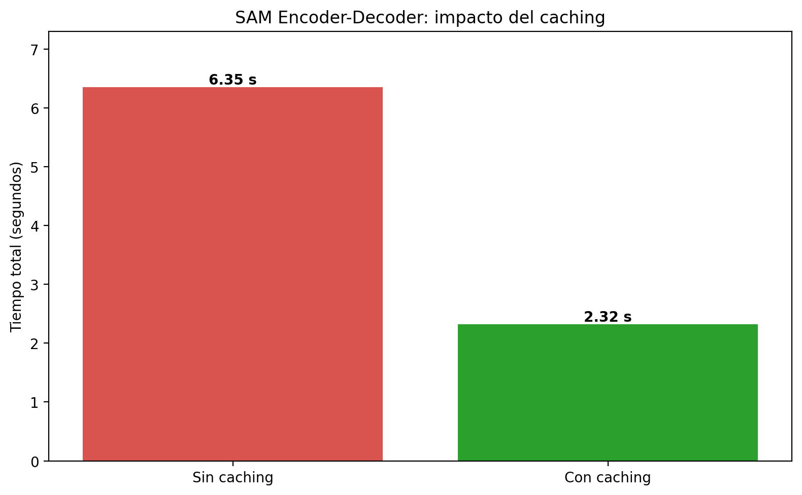

# 09 — SAM Encoder-Decoder Architecture

This session explains the **promptable encoder-decoder architecture behind Segment Anything Model (SAM)** and demonstrates why image embeddings should be cached for fast interactive segmentation.

The lesson uses a lightweight Python simulation to isolate the computational roles of the image encoder, prompt encoder, and mask decoder without requiring a SAM checkpoint.

---

# Session Objective

The objective is to understand how SAM separates expensive image processing from lightweight prompt interaction.

The session explores:

- Promptable segmentation
- Image, prompt, and mask embeddings
- Image Encoder, Prompt Encoder, and Mask Decoder
- Image-embedding caching
- Interactive segmentation latency
- Reusing one image embedding for multiple prompts
- Why video requires spatiotemporal memory

---

# Session Structure

```text
09-SAM-Encoder-Decoder/
├── README.md
├── CLASS-RECORDING.md
├── 04_b_sam_encoder_decoder.ipynb
└── practical/
    ├── README.md
    ├── requirements.txt
    ├── sam_encoder_decoder_caching.py
    └── assets/
        ├── README.md
        └── output/
            ├── README.md
            └── sam_encoder_decoder_caching_comparison.png
```

---

# Class Notebook

The completed and validated notebook is preserved as:

[04_b_sam_encoder_decoder.ipynb](./04_b_sam_encoder_decoder.ipynb)

It includes:

- Original Spanish lesson material
- Encoder-decoder simulation
- Successful interactive latency demonstration
- Caching versus no-caching experiment
- Validated Colab outputs
- Saved comparison chart

---

# Promptable Segmentation

Instead of training a separate segmentation model for every fixed category, SAM receives a prompt that identifies what should be segmented.

Prompt types can include:

```text
Point
Bounding Box
Text
Previous Mask
```

The model combines the image representation with the prompt representation to generate a segmentation mask.

---

# SAM Architecture

## Image Encoder

The Image Encoder processes the complete image and creates a high-dimensional image embedding.

```text
Image → Image Encoder → Image Embedding
```

This is the computationally expensive component. For a static image, its output can be calculated once and cached.

## Prompt Encoder

The Prompt Encoder converts a point, box, text instruction, or mask into a mathematical prompt embedding.

```text
Prompt → Prompt Encoder → Prompt Embedding
```

It is lightweight enough to support interactive use.

## Mask Decoder

The Mask Decoder combines the cached image embedding with a prompt embedding and predicts the final mask.

```text
Image Embedding + Prompt Embedding
                  ↓
             Mask Decoder
                  ↓
          Segmentation Mask
```

---

# Notebook Simulation

The notebook defines three educational components:

```python
DummyImageEncoder
DummyPromptEncoder
DummyMaskDecoder
```

| Component | Simulated latency | Output |
|---|---:|---|
| Image Encoder | 2.00 seconds | `(1, 256, 64, 64)` embedding |
| Prompt Encoder | 0.05 seconds | `(1, 256)` embedding |
| Mask Decoder | 0.05 seconds | `(500, 500)` binary mask |

These randomly generated arrays are educational stand-ins, not predictions from a trained SAM checkpoint.

---

# Interactive Latency Validation

The image embedding was calculated once and reused for three prompts:

```text
Point(100, 150)
Point(200, 200)
Point(400, 50)
```

Validated Google Colab results:

```text
Image Encoder: 2.02 seconds

Prompt 1: 0.105 seconds
Prompt 2: 0.105 seconds
Prompt 3: 0.103 seconds
```

This confirms that the expensive image representation can remain fixed while the lightweight prompt path runs repeatedly.

---

# Caching Experiment

## Without Caching

```text
Prompt 1 → Encode Image → Encode Prompt → Decode Mask
Prompt 2 → Encode Image → Encode Prompt → Decode Mask
Prompt 3 → Encode Image → Encode Prompt → Decode Mask
```

## With Caching

```text
Encode Image Once
        ↓
Cached Image Embedding
        ↓
Prompt 1 → Encode Prompt → Decode Mask
Prompt 2 → Encode Prompt → Decode Mask
Prompt 3 → Encode Prompt → Decode Mask
```

## Validated Results

| Strategy | Total time |
|---|---:|
| Without caching | 6.352 seconds |
| With caching | 2.322 seconds |

```text
Time saved: 4.031 seconds
Speedup:    2.74x
```



---

# Practical Implementation

The reusable practical is available at:

[practical/sam_encoder_decoder_caching.py](./practical/sam_encoder_decoder_caching.py)

Run from the lesson directory:

```bash
python -m pip install -r practical/requirements.txt
python practical/sam_encoder_decoder_caching.py
```

The practical:

- Simulates all three architectural components
- Processes three point prompts
- Measures both execution strategies
- Calculates time saved and speedup
- Generates the comparison chart automatically
- Uses a fixed random seed for reproducible simulated arrays
- Regenerates the chart with the same Spanish labels as the validated output

---

# Image Segmentation versus Video

Caching is straightforward for a static image because its embedding remains valid while its pixels do not change.

A basic video workflow must encode every changing frame. Modern video-aware SAM workflows use memory and spatiotemporal information to propagate object representations and maintain temporal consistency while reducing redundant work.

---

# Requirements

```text
Python
NumPy
Matplotlib
Google Colab (optional)
```

The lesson does not require:

- GPU
- SAM checkpoint
- Ultralytics installation
- Input image file

The reported timings describe this controlled simulation only. They are not benchmarks of real SAM, SAM 2, or SAM 3 inference.

---

# Learning Outcomes

After completing this lesson, the learner should be able to:

- Explain promptable segmentation
- Identify the three principal SAM components
- Distinguish image and prompt embeddings
- Explain why the Image Encoder is expensive
- Explain why prompt interaction can be fast
- Reuse a cached image embedding
- Measure the performance benefit of caching
- Interpret an encoder-decoder latency simulation
- Explain why video benefits from spatiotemporal memory

---

# Relationship to Previous Sessions

```text
Session 07
Advanced Mask Visualization
          ↓
Session 08
Natural-Language Text Prompts
          ↓
Session 09
SAM Encoder-Decoder and Embedding Caching
```

Session 09 answers:

```text
Why can SAM respond quickly to many prompts
after an image has been encoded once?
```

---

# Status

**COMPLETE — validated in Google Colab**

Completed:

- Original lesson reviewed
- Class recording documented
- Notebook repaired and executed
- Three interactive prompts validated
- Caching experiment completed
- Comparison chart generated and inspected
- Practical Python implementation added
- Input and output assets documented

Pending:

- Course index update after all classes
