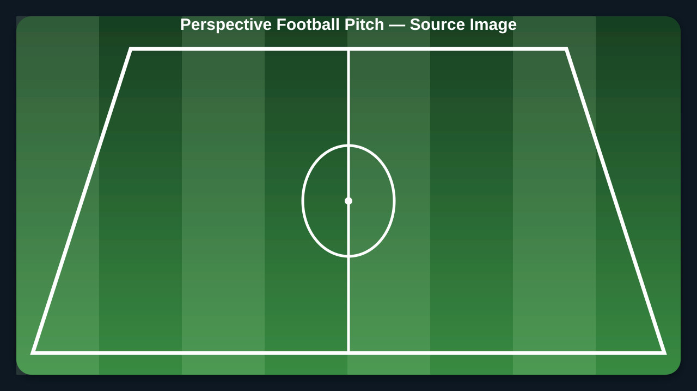
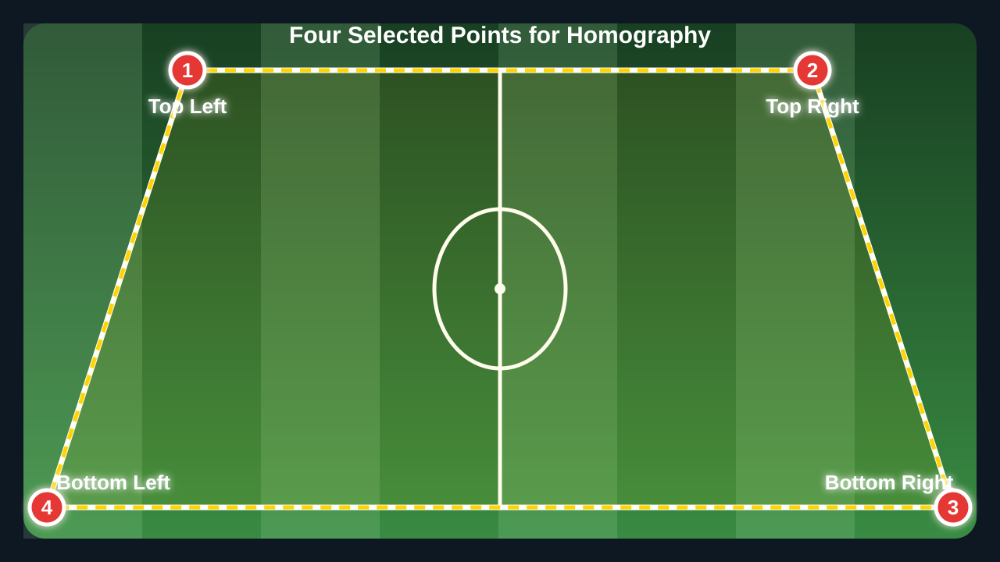
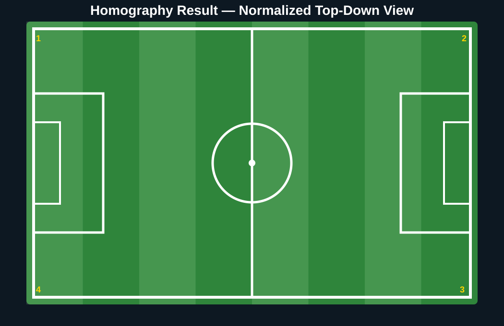

# Session 11 Practical — SAM 3 Video Segmentation

This practical converts the original Session 11 notebook into a reusable command-line implementation for professional video-segmentation experiments.

It supports two complete approaches:

```text
Pipeline A
YOLOv8 → ByteTrack → SAM 3 → Masks + Labels + Traces

Pipeline B
Text Prompts → SAM3VideoSemanticPredictor → Semantic Video Masks
```

---

## Practical Structure

```text
practical/
│
├── README.md
├── requirements.txt
├── sam3_video_segmentation.py
│
└── assets/
    ├── README.md
    ├── input/
    │   └── README.md
    └── output/
        └── README.md
```

The input video can be supplied manually or downloaded automatically by the script. Generated media remains inside `assets/output/`.

---

## Football-Pitch Homography — Four Selected Points

The class also demonstrates perspective correction by selecting four ordered points around a football pitch.

The point order is:

```text
1 — Top Left
2 — Top Right
3 — Bottom Right
4 — Bottom Left
```

Those four source coordinates are mapped to the corners of a normalized rectangle with:

```python
matrix = cv2.getPerspectiveTransform(
    source_points,
    target_points
)

top_down = cv2.warpPerspective(
    image,
    matrix,
    (output_width, output_height)
)
```

Dedicated implementation:

[View `football_pitch_homography.py`](./football_pitch_homography.py)

### Source Football Pitch



### Four Selected Points



### Top-Down Homography Result



### Run with the Included Demonstration

```bash
python football_pitch_homography.py
```

### Select Four Points Interactively

```bash
python football_pitch_homography.py \
  --input /path/to/football_pitch.jpg \
  --interactive
```

Click the four corners in the required order and press Enter after the selection. The program saves:

- `football_pitch_four_points.png`
- `football_pitch_top_down.png`
- `homography_matrix.json`

---

## Main Implementation

[View `sam3_video_segmentation.py`](./sam3_video_segmentation.py)

The script provides:

- Command-line configuration with `argparse`
- Input-video download and metadata validation
- SAM 3 checkpoint validation
- YOLOv8 detection
- ByteTrack persistent IDs
- SAM 3 bounding-box segmentation
- Safe transfer of tracker, class, and confidence attributes
- Mask, label, and trace annotation
- Polygon-zone filtering before segmentation
- Confidence-controlled mask opacity
- Temporal mask-area analysis
- JSON analytics export
- Mask-area chart generation
- Direct semantic video prompts
- Streaming semantic inference
- Independent execution modes
- Automatic output-directory creation
- NumPy 2.x geometry compatibility

---

## Installation

From this folder:

```bash
pip install -r requirements.txt
```

A CUDA-enabled runtime is recommended because SAM 3 video inference is computationally intensive.

---

## SAM 3 Checkpoint

Pass the local SAM 3 checkpoint explicitly:

```text
--sam-model /path/to/sam3.pt
```

Google Colab example:

```text
/content/drive/MyDrive/SAM3-Models/sam3.pt
```

The script stops with a clear error when the checkpoint does not exist.

---

## Execution Modes

| Mode | Purpose | Main output |
|---|---|---|
| `full` | YOLO + ByteTrack + SAM 3 with masks, labels, and traces | `vehicles_sam.mp4` |
| `zone` | Segments only tracked objects inside a polygon zone | `vehicles_sam_zone.mp4` |
| `opacity` | Uses confidence as object-specific mask opacity | `vehicles_sam_opacity.mp4` |
| `areas` | Measures mask area through time | Video + PNG + JSON |
| `semantic` | Uses text prompts with `SAM3VideoSemanticPredictor` | `vehicles_text_prompts.mp4` |
| `all` | Runs every supported experiment | All defined outputs |

---

## Quick Start

Run the complete detector-guided pipeline:

```bash
python sam3_video_segmentation.py \
  --mode full \
  --sam-model /content/drive/MyDrive/SAM3-Models/sam3.pt
```

The default sample video is downloaded automatically to:

```text
assets/input/vehicles.mp4
```

---

## Run All Experiments

```bash
python sam3_video_segmentation.py \
  --mode all \
  --sam-model /content/drive/MyDrive/SAM3-Models/sam3.pt
```

---

## Use a Custom Video

```bash
python sam3_video_segmentation.py \
  --mode full \
  --sam-model /content/drive/MyDrive/SAM3-Models/sam3.pt \
  --input /content/my_video.mp4
```

---

## Semantic Text Prompts

```bash
python sam3_video_segmentation.py \
  --mode semantic \
  --sam-model /content/drive/MyDrive/SAM3-Models/sam3.pt \
  --prompts car bus truck \
  --confidence 0.25
```

The prompts may be replaced with other visual concepts supported by SAM 3.

---

## Output Files

The complete workflow defines:

```text
assets/output/
│
├── vehicles_sam.mp4
├── vehicles_sam_zone.mp4
├── vehicles_sam_opacity.mp4
├── vehicles_sam_areas.mp4
├── vehicles_text_prompts.mp4
├── mask_area_chart.png
└── mask_areas.json
```

The JSON export stores the frame number and pixel area for each persistent tracker ID.

---

## Area Analytics

The `areas` mode links segmentation with temporal analysis:

```text
Tracker ID
    ↓
Mask Pixels per Frame
    ↓
Temporal Observations
    ↓
JSON Dataset
    +
PNG Chart
```

This makes it possible to study apparent object-size changes, approaches, departures, occlusions, and segmentation instability.

---

## Professional Design Decisions

- The SAM checkpoint path is never hard-coded.
- Input and output locations are configurable.
- The sample video is downloaded only when missing.
- Video metadata is validated before processing.
- Output directories are created automatically.
- Detection attributes are transferred only when YOLO and SAM results align.
- Video writers are checked and released safely.
- Analytics are saved in both visual and machine-readable formats.
- Each experiment can be run independently to reduce unnecessary GPU work.
- The original notebook remains unchanged as the course artifact.

---

## Related Resources

Main lesson:

[Session 11 README](../README.md)

Original notebook:

[05_b_segmentacion_sam_video.ipynb](../05_b_segmentacion_sam_video.ipynb)

Class recording:

[CLASS-RECORDING.md](../CLASS-RECORDING.md)

Asset organization:

[assets/README.md](./assets/README.md)
