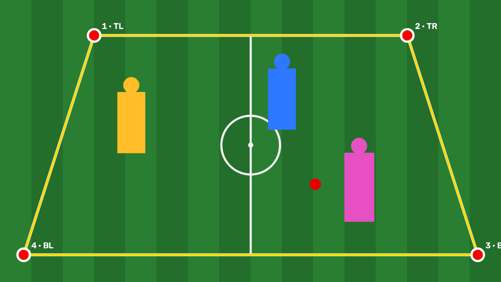
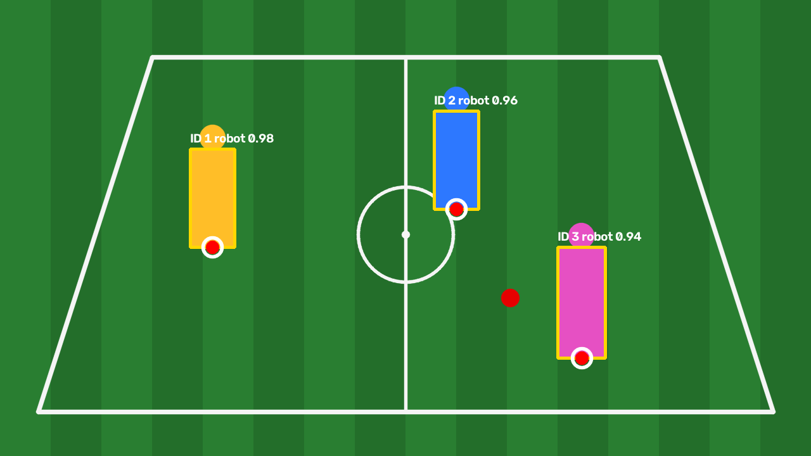
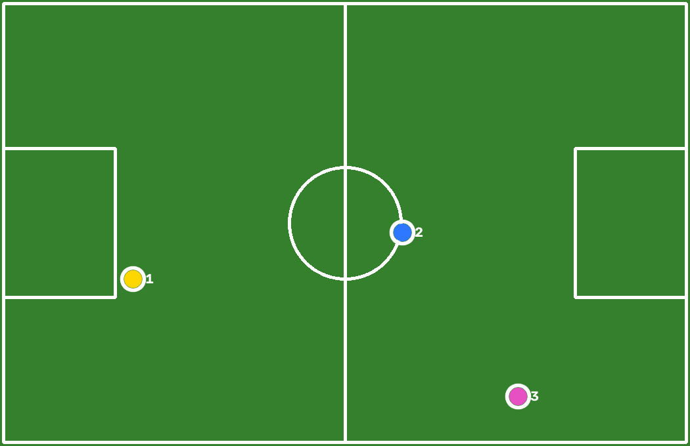

# Generated Outputs

The practical script writes generated artifacts to this directory.

| File | Description |
|---|---|
| `vehicles_sam.mp4` | Full YOLO + ByteTrack + SAM 3 visualization |
| `vehicles_sam_zone.mp4` | Segmentation restricted to the polygon zone |
| `vehicles_sam_opacity.mp4` | Confidence-controlled mask opacity |
| `vehicles_sam_areas.mp4` | Mask visualization used during area analysis |
| `vehicles_text_prompts.mp4` | Direct semantic video segmentation |
| `mask_area_chart.png` | Temporal mask-area chart |
| `mask_areas.json` | Frame-level mask-area observations by tracker ID |

Generated files are documented here after execution and visual verification.

---

## Football-Pitch Homography — Verified Runtime Outputs

The included football demonstration was executed successfully. These PNG files are the direct program outputs.

| File | Description |
|---|---|
| [`01_original_field.png`](./01_original_field.png) | Original perspective football field |
| [`02_four_selected_points.png`](./02_four_selected_points.png) | Four ordered source points: TL, TR, BR, BL |
| [`03_top_down_field.png`](./03_top_down_field.png) | Perspective-corrected top-down field |
| [`04_detected_players.png`](./04_detected_players.png) | Three demonstration player/robot detections |
| [`05_player_anchor_points.png`](./05_player_anchor_points.png) | Bottom-center ground-contact anchors |
| [`06_football_minimap.png`](./06_football_minimap.png) | Transformed player positions on the minimap |
| [`homography_matrix.json`](./homography_matrix.json) | Calculated matrix H, source points, anchors, and field points |
| [`transformed_coordinates.csv`](./transformed_coordinates.csv) | Image coordinates and calculated field coordinates |

### Result Preview

The SVG files remain as lightweight explanatory diagrams. The PNG files above are the verified outputs produced by `football_pitch_homography.py`.
