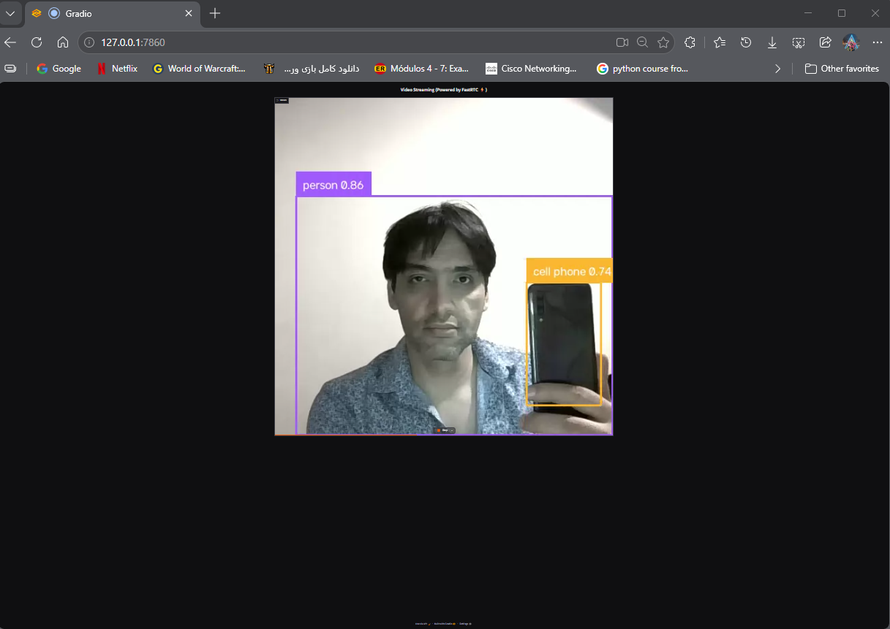

# 14 — Supervision + FastRTC

This session documents a **local real-time computer vision workflow** built with **FastRTC, YOLOv8, and Supervision**.

The supplied notebook is designed to run locally from **Google Antigravity IDE on Windows**, using the computer's webcam through a local WebRTC connection.

The final practical execution was completed successfully and verified with a real webcam stream.

---

## Pipeline

```text
Webcam
   ↓
Local WebRTC / FastRTC
   ↓
YOLOv8
   ↓
sv.Detections
   ↓
Supervision annotations
   ↓
Processed live video in the browser
```

The application runs locally on `127.0.0.1` and does not require Colab, a public share link, TURN/Twilio, or a Hugging Face token.

---

## What I Learned

- Build a local webcam computer vision pipeline
- Use FastRTC for real-time WebRTC video streaming
- Run YOLOv8 inference frame by frame
- Convert Ultralytics results to `sv.Detections`
- Annotate live detections with Supervision
- Display class names and confidence scores
- Select CPU or CUDA automatically
- Use `skip_frames=True` to reduce accumulated latency
- Launch a local browser interface through Gradio/FastRTC
- Work with browser webcam permissions
- Debug a live processing pipeline using terminal output
- Validate real-time detections with saved evidence

---

## Why It Matters

Earlier course work focused on images, prerecorded video, segmentation, and cloud notebooks. Class 14 moves the workflow into **live local inference**.

```text
Static image / saved video
          ↓
Live webcam frames
          ↓
Continuous inference
          ↓
Real-time annotations
          ↓
Interactive local application
```

This demonstrates how a computer vision model can become part of an actual live application instead of remaining only an offline notebook experiment.

---

## Class Recording

**YouTube:** https://youtu.be/H_DDf3NCV5M

See [`CLASS-RECORDING.md`](./CLASS-RECORDING.md).

---

## Real Execution Environment

The practical was executed locally with the following verified environment:

```text
Operating system: Windows
IDE: Google Antigravity
Python: 3.11.9
FastRTC: 0.0.34
Gradio: 5.50.0
Ultralytics: 8.4.138
Supervision: 0.30.1
aiortc: 1.15.0
CUDA available: False
Device: CPU
Local endpoint: http://127.0.0.1:7860
```

CPU execution was sufficient for the practical demonstration.

---

## Virtual Environment

The local workflow uses a dedicated virtual environment:

```powershell
py -3.11 -m venv .venv
.venv\Scripts\Activate.ps1
pip install -r 08-course-notes\14-Supervision-FastRTC\practical\requirements.txt
```

The repository-level `.venv/` folder should remain excluded from Git tracking.

---

## Dependencies

The practical requirements are:

```text
fastrtc==0.0.34
ultralytics
supervision
```

FastRTC brings the supporting WebRTC/UI stack used by the application, including Gradio and aiortc.

---

## Model Configuration

The practical uses:

```python
MODEL_NAME = "yolov8n.pt"
CONFIDENCE = 0.30
IMAGE_SIZE = 640
DEVICE = 0 if torch.cuda.is_available() else "cpu"
```

`yolov8n.pt` is the Nano variant of YOLOv8, making it suitable for a lightweight local webcam demonstration.

On first execution, Ultralytics automatically downloaded the model weights.

---

## Supervision Annotators

The live visualization uses:

```python
box_annotator = sv.BoxAnnotator(thickness=2)

label_annotator = sv.LabelAnnotator(
    text_scale=0.6,
    text_thickness=1,
)
```

The annotated browser output therefore includes:

- bounding boxes
- detected class names
- confidence values

---

## Frame Processing

Every incoming webcam frame is processed through:

```text
NumPy frame
    ↓
YOLOv8 predict()
    ↓
Ultralytics Results
    ↓
sv.Detections.from_ultralytics()
    ↓
BoxAnnotator
    ↓
LabelAnnotator
    ↓
Annotated NumPy frame
```

The practical runner also prints the number of detections for processed frames:

```text
Frame processed | detections: N
```

This was useful for verifying that the FastRTC handler was actually receiving frames and sending them through YOLOv8.

---

## FastRTC Stream

The live stream uses:

```python
stream = Stream(
    handler=VideoStreamHandler(
        process_frame,
        skip_frames=True,
    ),
    modality="video",
    mode="send-receive",
    rtc_configuration=None,
    concurrency_limit=1,
    time_limit=300,
)
```

### Why `skip_frames=True` Matters

A webcam can produce frames faster than inference can process them.

Without frame skipping:

```text
Camera frames
     ↓
Inference slower than camera
     ↓
Old frames accumulate
     ↓
Increasing delay
```

With frame skipping:

```text
Recent frames prioritized
     ↓
Obsolete frames skipped when necessary
     ↓
Lower accumulated latency
```

---

## Local Browser Launch

The verified runner launches with:

```python
stream.ui.launch(
    server_name="127.0.0.1",
    server_port=7860,
    share=False,
    inbrowser=True,
    debug=True,
)
```

The application successfully opened at:

```text
http://127.0.0.1:7860
```

The browser webcam permission was granted successfully.

An important practical detail discovered during execution is that the **Record** control in the FastRTC/Gradio interface must be activated to begin the live processing session. After activation, frames were processed continuously and annotated detections appeared in the browser.

---

## Verified Live Result

The final live test successfully displayed real-time YOLOv8 detections with Supervision annotations.

The saved evidence frame shows:

```text
person      0.86
cell phone  0.74
```

Both objects were surrounded by bounding boxes with class names and confidence scores.

### Evidence Screenshot



The screenshot is a real capture from the local execution.

---

## Execution Summary

The structured execution result is stored in:

[`practical/outputs/execution_summary.json`](./practical/outputs/execution_summary.json)

It records:

- real package versions
- CPU execution
- model configuration
- webcam/WebRTC verification
- YOLOv8 inference verification
- Supervision annotation verification
- evidence-frame detections

---

## Practical Runner

The verified local script is:

[`practical/run_live_detection.py`](./practical/run_live_detection.py)

Run it from the repository root with the virtual environment active:

```powershell
.\.venv\Scripts\python.exe 08-course-notes\14-Supervision-FastRTC\practical\run_live_detection.py
```

---

## Troubleshooting Observed During the Real Run

### Windows `python` command did not behave correctly

The Windows environment had an application-association issue with the plain `python` command.

The working approach was:

```powershell
py -3.11 -m venv .venv
```

and later using the virtual-environment executable directly:

```powershell
.\.venv\Scripts\python.exe
```

### Webcam visible but no annotations

Initially the raw webcam preview was visible but YOLO annotations were not.

The processing pipeline started correctly after activating the FastRTC interface's **Record** control.

### CUDA unavailable

The terminal reported:

```text
CUDA available: False
Model: yolov8n.pt | device: cpu
```

This did not prevent successful live inference.

---

## Notebook

The supplied Class 14 notebook is preserved at:

[`notebook/class_14_supervision_fastrtc_antigravity.ipynb`](./notebook/class_14_supervision_fastrtc_antigravity.ipynb)

Notebook-specific documentation:

[`notebook/README.md`](./notebook/README.md)

---

## Repository Structure

```text
14-Supervision-FastRTC/
├── README.md
├── CLASS-RECORDING.md
├── notebook/
│   ├── README.md
│   └── class_14_supervision_fastrtc_antigravity.ipynb
├── practical/
│   ├── README.md
│   ├── requirements.txt
│   ├── run_live_detection.py
│   └── outputs/
│       ├── README.md
│       ├── execution_summary.json
│       └── live_detection_screenshot.png
└── references/
    └── README.md
```

---

## Key Takeaways

- FastRTC successfully connected the local webcam to a Python computer vision processing function through WebRTC.
- YOLOv8 performed real-time object detection on incoming webcam frames.
- `sv.Detections` provided the bridge between Ultralytics results and Supervision.
- `BoxAnnotator` and `LabelAnnotator` rendered the live visual output.
- The practical worked on CPU without CUDA.
- `skip_frames=True` helps keep a real-time workflow responsive when inference is slower than camera frame production.
- The FastRTC UI session must be activated before frame processing begins.
- The complete local webcam → FastRTC → YOLOv8 → Supervision → browser workflow was verified successfully.

---

## Status

**Documentation:** Completed  
**Class recording:** Added  
**Notebook:** Added  
**Practical runner:** Completed  
**Live local execution:** Completed and verified  
**Evidence screenshot:** Added  
**Execution summary:** Added  
**Class 14:** **Completed**

---

## Author

**Peyman Miyandashti**

- [GitHub — Peyman-mxli](https://github.com/Peyman-mxli)
- [LinkedIn — peyman-mxli](https://www.linkedin.com/in/peyman-mxli/)
