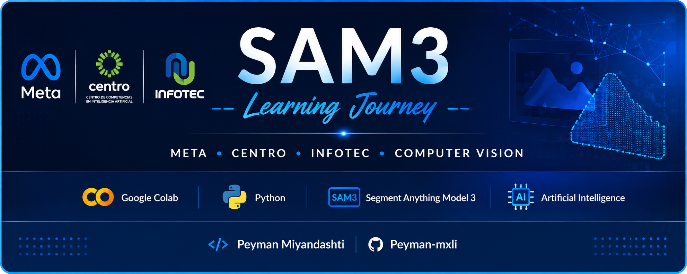

  

  

  

  

  

  

  

  

<h1 align="center" style="color:#0A84FF;">
SAM3-Learning-Journey
</h1>

<b>A comprehensive learning repository documenting my journey through the SAM3 Computer Vision course by Meta, including setup guides, notebooks, notes, experiments, practical projects, and resources.</b>

# ✨ Overview

This repository documents my learning journey through the **SAM3: Computer Vision with Segment Anything Model 3** course developed by **Meta**, **CENTRO**, and **INFOTEC**.

Its purpose is to provide a complete, step-by-step guide for setting up the development environment required throughout the course, including Google Colab, NVIDIA T4 GPU, Hugging Face, Roboflow, and other essential tools.

In addition to documenting my own progress, this repository is intended to help other students successfully configure their environment and better understand the technologies used during the program.
# 🎯 Objectives

- Learn the fundamentals of Computer Vision.
- Understand how Segment Anything Model 3 (SAM3) works.
- Build practical AI projects using real-world datasets.
- Learn to use Google Colab efficiently.
- Configure and use NVIDIA T4 GPU for deep learning.
- Work with Hugging Face and Roboflow.
- Document my learning process professionally.
- Share knowledge with other students.

- # 💡 Why It Matters

Modern Artificial Intelligence models require specialized hardware and development environments that can be difficult for beginners to configure.

This repository simplifies that process by documenting every step, allowing students to spend more time learning Computer Vision instead of solving installation problems.

It also serves as a personal knowledge base that will continue growing throughout the course.

# 📦 Core Topics

This repository covers:

- Google Colab
- Python
- Jupyter Notebooks
- NVIDIA T4 GPU
- Hugging Face
- Roboflow
- Segment Anything Model 3 (SAM3)
- Computer Vision
- Image Segmentation
- AI Workflows
- Practical Exercises

  # 📂 Repository Structure

The repository will be organized as follows:

setup/
docs/
notebooks/
examples/
resources/
screenshots/
course-notes/

# 🧠 What You Will Learn

By following this repository, you will learn how to prepare a complete AI development environment, understand the workflow used during the SAM3 course, execute notebooks in Google Colab, configure GPU acceleration, and apply modern Computer Vision techniques using real-world examples.

Each section is designed to be beginner-friendly while maintaining professional documentation standards.

# ⚠️ Professional Impact

This repository is more than a collection of notes.

It represents a documented learning process that demonstrates continuous improvement, technical curiosity, and the ability to organize complex information into clear and practical documentation.

Maintaining repositories like this also helps build a stronger GitHub portfolio for future academic and professional opportunities.
___________________________________________________________________________________________________________________________________________
# 👤 Author

# Peyman Miyandashti

🎓 Information Technology & Digital Innovation Engineering

🏛️ Universidad Politécnica de Baja California (UPBC)

📍 Mexicali, Baja California, Mexico

🌍 Originally from Iran

💻 Artificial Intelligence • Computer Vision • Machine Learning • Cybersecurity • Software Development

🌐 Languages:
English • Spanish • Persian (Farsi) • Arabic • Azerbaijani • Turkish • Dari

🔗 GitHub:
https://github.com/Peyman-mxli

📅 2026
