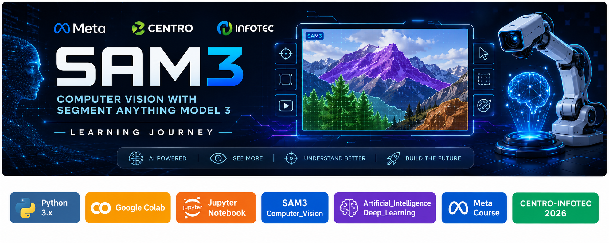

<p align="center">
  
</p>

<p align="center">
  
  
  
  
  
  
  
  
  
</p>

<h1 align="center">
SAM3-Learning-Journey
</h1>

<p align="center">
<b>
A structured Computer Vision learning repository documenting my progression through SAM 3, YOLOv8, Supervision, object tracking, spatial analytics, and pixel-level segmentation.
</b>
</p>

<p align="center">
From environment setup and small reusable examples to complete Computer Vision pipelines and practical projects.
</p>

---

# 📚 Table of Contents

| Section | Description |
|---|---|
| ✨ [Overview](#-overview) | Introduction to the repository and its purpose |
| 🎯 [Objectives](#-objectives) | Main technical and learning objectives |
| 💡 [Why It Matters](#-why-it-matters) | Purpose and value of the learning journey |
| 📦 [Core Topics](#-core-topics) | Computer Vision concepts and technologies |
| 📂 [Repository Structure](#-repository-structure) | Current repository organization |
| 🛠️ [Technologies Used](#️-technologies-used) | Main tools, libraries, and platforms |
| 🗺️ [Learning Roadmap](#️-learning-roadmap) | Technical progression of the journey |
| 📅 [Course Progress](#-course-progress) | Completed course sessions |
| 💻 [Code Examples](#-code-examples) | Reusable examples developed from the lessons |
| 🚀 [Practical Development](#-practical-development) | Larger Computer Vision projects and pipelines |
| 🧠 [SAM 3 Segmentation](#-sam-3-segmentation) | Current SAM 3 segmentation work |
| 🖼️ [Visual Assets](#️-visual-assets) | Repository banners and screenshots |
| 📚 [Resources](#-resources) | External references and documentation |
| ⚠️ [Professional Impact](#️-professional-impact) | Portfolio and professional value |
| 👤 [Author](#-author) | Repository author information |

---

# ✨ Overview

This repository documents my learning journey through the **SAM3: Computer Vision with Segment Anything Model 3** program developed by **Meta, CENTRO, and INFOTEC**.

The repository began as a structured guide for configuring the development environment required for the course, including:

- Google Colab
- NVIDIA T4 GPU
- Python
- Hugging Face
- Roboflow
- Jupyter Notebook

As the learning journey progressed, the repository evolved into a complete practical Computer Vision workspace containing:

- Course notes
- Jupyter and Google Colab notebooks
- Reusable Python examples
- Computer Vision experiments
- Practical projects
- Class recordings
- Detection pipelines
- Annotation workflows
- Detection filtering
- Object tracking
- Spatial zones and counting
- SAM 3 segmentation
- Analytics
- Data persistence
- Technical documentation

The goal is not only to record what was studied, but also to transform each important concept into **reproducible code and documented practical implementations**.

The repository therefore follows a progression from:

```text
Course Concept
      ↓
Notebook Experiment
      ↓
Reusable Python Example
      ↓
Practical Implementation
      ↓
Complete Computer Vision Pipeline
      ↓
Documented Project
```

---

# 🎯 Objectives

The main objectives of this learning journey are:

- Learn the fundamentals of Computer Vision.
- Understand how **Segment Anything Model 3 (SAM 3)** works.
- Build practical AI applications using real images and video.
- Develop strong Python-based Computer Vision workflows.
- Use Google Colab efficiently for AI experimentation.
- Configure and use NVIDIA T4 GPU acceleration.
- Work with Hugging Face models and gated repositories.
- Work with Roboflow for dataset management and annotation.
- Use OpenCV for image and video processing.
- Use Ultralytics YOLOv8 for object detection.
- Use Supervision for detection manipulation and visualization.
- Implement detection filtering using NumPy.
- Apply confidence and class filtering.
- Implement Non-Maximum Suppression.
- Track objects across video frames.
- Use ByteTrack for persistent object identities.
- Measure object visibility and movement.
- Implement PolygonZone occupancy analysis.
- Implement LineZone directional counting.
- Combine tracking with spatial analytics.
- Use YOLO bounding boxes as SAM 3 prompts.
- Generate pixel-level segmentation masks.
- Inspect and analyze boolean masks.
- Extract segmented objects from images.
- Compare segmentation area with bounding-box area.
- Serialize segmentation masks for structured storage.
- Generate Computer Vision analytics.
- Store structured results using SQLite.
- Create professional technical documentation.
- Maintain a structured AI and Computer Vision portfolio.
- Transform individual lessons into reusable code and complete projects.

---

# 💡 Why It Matters

Modern Artificial Intelligence and Computer Vision systems involve much more than running a model.

A complete workflow may require:

```text
Environment Configuration
        ↓
Data Preparation
        ↓
Model Inference
        ↓
Detection Processing
        ↓
Filtering
        ↓
Tracking
        ↓
Spatial Reasoning
        ↓
Segmentation
        ↓
Analytics
        ↓
Persistence
        ↓
Visualization
        ↓
Documentation
```

Learning each component independently is useful, but connecting them into complete systems is where the concepts become practically valuable.

This repository documents that progression.

Instead of keeping experiments as isolated notebooks, important concepts are converted into reusable Python examples and practical projects that can be studied, reproduced, and extended.

The repository also acts as a technical knowledge base for troubleshooting development environments, understanding Computer Vision libraries, reproducing experiments, documenting results, and building increasingly sophisticated AI pipelines.

---

# 📦 Core Topics

This repository currently covers:

### Development Environment

- Python
- Google Colab
- Jupyter Notebook
- NVIDIA T4 GPU
- CUDA
- Git
- GitHub

### AI Platforms and Tools

- Hugging Face
- Roboflow
- Ultralytics
- Supervision

### Computer Vision

- Image Processing
- Video Processing
- Object Detection
- Bounding Boxes
- Confidence Scores
- Image Annotation
- Detection Visualization

### Detection Processing

- Confidence Filtering
- Boolean Masks
- Class Filtering
- Size Filtering
- Bounding-Box Area
- Detection Merging
- Non-Maximum Suppression
- Top-N Selection
- Spatial Filtering

### Object Tracking

- ByteTrack
- Persistent Tracker IDs
- Multi-Object Tracking
- Tracker Visualization
- Frame-Based Analysis
- Unique Object Counting
- Visibility Duration
- Trajectory Analysis

### Zones and Counting

- PolygonZone
- Polygon Occupancy
- Spatial Detection Filtering
- LineZone
- Directional Crossing Detection
- Occupancy Analysis
- Flow Analysis
- Tracking + Spatial Analytics

### SAM 3 Segmentation

- Segment Anything Model 3
- YOLO + SAM 3
- Bounding-Box Prompts
- Image Segmentation
- Pixel-Level Masks
- Boolean Mask Inspection
- Mask Area Analysis
- Object Extraction
- Mask Serialization
- Base64 Encoding
- Mask Reconstruction
- Video Segmentation
- Promptable Segmentation

### Analytics and Persistence

- Computer Vision Analytics
- NumPy
- Matplotlib
- JSON
- SQLite
- Structured Result Storage
- Data Visualization

### Engineering and Documentation

- Reusable Python Examples
- Practical Pipelines
- Technical Documentation
- Reproducibility
- GitHub Project Organization
- Portfolio Development

---

# 📂 Repository Structure

The repository is organized into **eight main sections**, each with a specific purpose.

```text
SAM3-Learning-Journey/
│
├── 01-setup/
│   └── Environment setup and installation guides
│
├── 02-docs/
│   └── Technical documentation and tutorials
│
├── 03-notebooks/
│   └── Google Colab and Jupyter notebooks
│
├── 04-examples/
│   └── Small reusable Python examples
│
├── 05-projects/
│   └── Practical AI and Computer Vision projects
│
├── 06-resources/
│   └── Useful references, links, datasets, and documentation
│
├── 07-assets/
│   ├── Banners/
│   ├── screenshots/
│   └── README.md
│
└── 08-course-notes/
    └── Course notes, recordings, notebooks, and practical exercises
```

## Folder Overview

| Folder | Purpose |
|---|---|
| **01-setup** | Development environment installation and configuration |
| **02-docs** | Technical guides, explanations, and tutorials |
| **03-notebooks** | Original Google Colab and Jupyter notebooks |
| **04-examples** | Small reusable Python examples extracted from lessons |
| **05-projects** | Larger Computer Vision projects and complete pipelines |
| **06-resources** | External references, datasets, papers, and documentation |
| **07-assets** | Central location for repository visual resources |
| **07-assets/Banners** | Main repository and technology banners |
| **07-assets/screenshots** | Screenshots and visual development evidence |
| **08-course-notes** | Detailed lesson notes, recordings, notebooks, and practical work |

The structure intentionally separates **learning material**, **small examples**, and **larger projects**.

```text
03-notebooks
     ↓
Original experiments

04-examples
     ↓
Small reusable concepts

05-projects
     ↓
Complete implementations

08-course-notes
     ↓
Detailed lesson documentation
```

This organization makes it easier to follow the learning journey while keeping reusable code separate from larger project implementations.

# 🛠️ Technologies Used

The repository combines multiple tools and technologies across the Computer Vision workflow.

| Technology | Purpose |
|---|---|
| 🐍 **Python** | Main programming language used throughout the learning journey |
| 📓 **Google Colab** | Cloud development environment used for GPU-based experiments |
| 📒 **Jupyter Notebook** | Interactive environment for experimentation and documentation |
| 🖥️ **NVIDIA T4 GPU** | Hardware acceleration for model inference and Computer Vision workloads |
| 🤗 **Hugging Face** | Access and authentication for pretrained and gated AI models |
| 🎯 **Roboflow** | Dataset management, annotation, preprocessing, and evaluation |
| 👁️ **OpenCV** | Image and video loading, processing, transformation, and export |
| 🔥 **PyTorch** | Deep Learning framework supporting Computer Vision models |
| 🎯 **Ultralytics YOLOv8** | Object detection and generation of bounding-box prompts |
| 📦 **Supervision** | Detection manipulation, filtering, annotation, tracking, zones, and visualization |
| 🔄 **ByteTrack** | Persistent multi-object tracking across video frames |
| 🧠 **SAM 3** | Promptable pixel-level image and video segmentation |
| 🔢 **NumPy** | Numerical processing, Boolean masks, filtering, and mask manipulation |
| 📊 **Matplotlib** | Visualization of masks, analytics, and experimental results |
| 🗄️ **SQLite** | Structured persistence of tracking and analytics information |
| 📋 **JSON** | Structured storage of detections, metadata, and segmentation results |
| 🔐 **Base64** | JSON-compatible serialization of segmentation masks |
| 🌐 **GitHub** | Version control, repository organization, documentation, and portfolio development |
| 📝 **Markdown** | Technical documentation throughout the repository |

---

# 🗺️ Learning Roadmap

The learning journey progresses from basic AI-assisted programming toward increasingly complete Computer Vision systems.

```text
Environment Setup
       ↓
Agentic AI Programming
       ↓
Supervision Fundamentals
       ↓
Annotation & Visualization
       ↓
Detection Filtering
       ↓
Object Tracking
       ↓
Zones & Counting
       ↓
SAM 3 Segmentation
       ↓
Tracking + Segmentation
       ↓
Analytics + Persistence
       ↓
Complete Computer Vision Systems
```

Rather than treating each topic as an isolated lesson, the repository progressively connects the concepts into larger workflows.

## Technical Progression

| Stage | Main Topic | Status |
|---|---|---|
| 00 | Environment & Course Preparation | ✅ Completed |
| 01 | Agentic AI Programming | ✅ Completed |
| 02 | Introduction to Supervision | ✅ Completed |
| 03 | Annotation and Visualization | ✅ Completed |
| 04 | Filtering and Manipulating Detections | ✅ Completed |
| 05 | Object Tracking | ✅ Completed |
| 06 | Zones and Counting | ✅ Completed |
| 07 | Segmentation with SAM 3 | ✅ Completed |
| Next | Advanced SAM 3 Workflows | 🔄 Continuing |

The roadmap represents the **technical progression of the repository** rather than replacing the official numbering used by the course.

---

# 📅 Course Progress

Course material is documented inside:

```text
08-course-notes/
```

The completed learning material currently includes:

| Repository Session | Topic | Status |
|---|---|---|
| 00 | Agentic AI Programming | ✅ Completed |
| 01 | Introduction to Supervision | ✅ Completed |
| 02 | Annotation and Visualization | ✅ Completed |
| 03 | Filtering and Manipulating Detections | ✅ Completed |
| 04 | Object Tracking | ✅ Completed |
| 05 | Zones and Counting | ✅ Completed |
| 06 | Segmentation with SAM | ✅ Completed |

The progression currently reaches **Session 06 — Segmentation with SAM**, where YOLOv8 detections are used as bounding-box prompts for SAM 3 to generate pixel-level object masks.

---

## Session 00 — Agentic AI Programming

The first session introduces AI-assisted programming methodologies and establishes a workflow for using AI tools during software development.

Topics include:

- AI-assisted code generation
- Prompt engineering for programming
- OpenCV image processing
- Debugging with AI assistance
- Error analysis
- Iterative refinement

This establishes the programming methodology used throughout the rest of the repository.

---

## Session 01 — Introduction to Supervision

This session introduces the **Supervision** Computer Vision library and connects YOLO predictions with reusable detection structures.

Topics include:

- Image loading
- YOLOv8 inference
- `sv.Detections`
- Bounding boxes
- Confidence scores
- Class IDs
- Detection visualization
- Confidence thresholds

Conceptually:

```text
Image
  ↓
YOLOv8
  ↓
Predictions
  ↓
sv.Detections
  ↓
Processing / Visualization
```

---

## Session 02 — Annotation and Visualization

This session focuses on presenting detection results using Supervision Annotators.

Topics include:

- `BoxAnnotator`
- `RoundBoxAnnotator`
- `HaloAnnotator`
- `BlurAnnotator`
- `BoxCornerAnnotator`
- `LabelAnnotator`
- `DotAnnotator`
- `EllipseAnnotator`
- Color palettes
- Bounding-box thickness
- Label scale
- Annotation layer order
- Multi-annotator compositions

The lesson demonstrates that model predictions and their visual representation are separate stages of a Computer Vision pipeline.

---

## Session 03 — Filtering and Manipulating Detections

This session focuses on transforming raw detections into application-specific results.

Topics include:

- Confidence filtering
- Boolean masks
- Class filtering
- Multiple filtering conditions
- Class exclusion
- Bounding-box area
- Size filtering
- Detection merging
- Non-Maximum Suppression
- Confidence sorting
- Top-N selection
- Bounding-box centers
- Spatial filtering

Workflow:

```text
Raw Detections
      ↓
Confidence Filter
      ↓
Class Filter
      ↓
Size Filter
      ↓
NMS
      ↓
Top-N
      ↓
Spatial Filter
      ↓
Application-Specific Detections
```

---

## Session 04 — Object Tracking

This session extends detection from independent images into temporal video analysis.

The main tracking component is **ByteTrack**.

Topics include:

- Persistent tracker IDs
- Multi-frame object identity
- Tracking annotations
- Class names with tracker IDs
- Filtering before tracking
- Frame-count analysis
- Unique object counting
- Visibility duration
- Complete tracking pipelines

Conceptually:

```text
Video Frame
     ↓
YOLOv8
     ↓
Detections
     ↓
ByteTrack
     ↓
Persistent IDs
     ↓
Tracked Objects
```

Persistent IDs make it possible to recognize the same object across multiple frames:

```text
Frame 100 → ID 4
Frame 101 → ID 4
Frame 102 → ID 4
Frame 103 → ID 4
```

---

## Session 05 — Zones and Counting

This session adds **spatial reasoning** to tracked objects.

Two important Supervision components are introduced:

```text
PolygonZone
LineZone
```

### PolygonZone

A polygon represents an area of interest.

It answers:

```text
How many objects are inside this area right now?
```

The primary value is:

```python
zone.current_count
```

This represents **occupancy**.

### LineZone

A line represents a virtual counting boundary.

It answers:

```text
How many tracked objects crossed this boundary?
```

The primary values are:

```python
line_zone.in_count
line_zone.out_count
```

This represents **flow**.

The complete pipeline becomes:

```text
Video
  ↓
YOLOv8
  ↓
Detections
  ↓
ByteTrack
  ↓
Tracked Objects
  ↓
┌─────────────────────────┐
│                         │
↓                         ↓
PolygonZone            LineZone
↓                         ↓
Occupancy                Flow
│                         │
└────────────┬────────────┘
             ↓
        Visualization
```

The validated practical produced:

```text
Final polygon occupancy: 1
Crossings Down: 3
Crossings Up: 3
Total Crossings: 6
```

---

## Session 06 — Segmentation with SAM

This session moves beyond rectangular bounding boxes into **pixel-level object segmentation** using SAM 3.

The main workflow combines YOLOv8 and SAM 3:

```text
Input Image
     ↓
YOLOv8
     ↓
Object Detections
     ↓
Bounding Boxes
     ↓
SAM 3 Prompts
     ↓
Pixel-Level Masks
```

Topics include:

- YOLOv8 object detection
- Bounding-box extraction
- Bounding boxes as SAM 3 prompts
- SAM 3 model loading
- Pixel-level segmentation
- Boolean NumPy masks
- Mask inspection
- Object pixel counting
- Image coverage calculations
- Object extraction
- Mask-area analysis
- Bounding-box vs mask-area comparison
- Base64 serialization
- JSON mask storage
- Mask reconstruction
- Reconstruction validation

The validated Session 06 example used:

```text
bus.jpg
```

with image shape:

```text
(1080, 810, 3)
```

YOLOv8 detected:

```text
6 objects

1 bus
4 persons
1 stop sign
```

SAM 3 generated:

```text
6 segmentation masks
```

with complete mask-array shape:

```text
(6, 1080, 810)
```

The first segmentation mask contained:

```text
Object pixels: 265686
Background pixels: 609114
Total pixels: 874800
Image coverage: 30.37%
```

The serialization example also successfully reconstructed the original mask:

```text
Decoded mask matches original: True
```

This validates the complete process:

```text
SAM Mask
   ↓
NumPy
   ↓
Packbits
   ↓
Base64
   ↓
JSON
   ↓
Base64 Decode
   ↓
Unpackbits
   ↓
Reconstructed Mask
   ↓
Validation
```

---

# 💻 Code Examples

Reusable examples are maintained inside:

```text
04-examples/
```

The purpose of this directory is to convert lesson concepts into small, focused Python programs that can be executed and studied independently.

Current example categories:

| # | Topic | Runnable Examples |
|---|---|---:|
| 00 | Agentic AI Programming | 2 |
| 01 | Introduction to Supervision | 8 |
| 02 | Annotation and Visualization | 5 |
| 03 | Filtering and Manipulating Detections | 5 |
| 04 | Object Tracking | 9 |
| 05 | Zones and Counting | 9 |
| 06 | Segmentation with SAM | 6 |

### Total

```text
44 runnable examples
```

The examples progress from basic programming concepts toward complete Computer Vision workflows:

```text
Agentic AI Programming
        ↓
Object Detection
        ↓
Annotation
        ↓
Detection Filtering
        ↓
Object Tracking
        ↓
Zones & Counting
        ↓
SAM 3 Segmentation
```

---

## 00 — Agentic AI Programming

Examples demonstrate:

- AI-assisted programming
- Prompt-driven code generation
- OpenCV experimentation
- Debugging and refinement

---

## 01 — Introduction to Supervision

Examples demonstrate:

- Image loading
- YOLOv8 detection
- `sv.Detections`
- Bounding boxes
- Confidence filtering
- Annotation
- Model comparison
- JSON prediction export

---

## 02 — Annotation and Visualization

Contains **5 runnable examples** covering:

```text
Box + Label
Annotator Comparison
Visualization Customization
Layer Order
Custom Composition
```

These examples demonstrate how multiple Supervision Annotators can be combined to create customized detection visualizations.

---

## 03 — Filtering and Manipulating Detections

Contains **5 runnable examples** covering:

```text
Confidence Filtering
Class + Boolean Filtering
Size Filtering
NMS + Top-N
Spatial Filtering
```

These examples demonstrate how raw model predictions can be transformed into application-specific detections.

---

## 04 — Object Tracking

Contains **9 runnable examples** progressing through:

```text
Basic ByteTrack
      ↓
Persistent IDs
      ↓
Video Annotation
      ↓
Class + Tracker ID
      ↓
Filtering Before Tracking
      ↓
Frame Count
      ↓
Unique Object Count
      ↓
Visibility Duration
      ↓
Complete Tracking Pipeline
```

---

## 05 — Zones and Counting

Contains **9 runnable examples** progressing through:

```text
Basic PolygonZone
      ↓
Polygon Occupancy
      ↓
Zone Filtering
      ↓
Tracking + PolygonZone
      ↓
Basic LineZone
      ↓
Crossing Count
      ↓
Tracking + LineZone
      ↓
PolygonZone + LineZone
      ↓
Complete Zones & Counting Pipeline
```

The examples distinguish two fundamental analytics concepts:

```text
PolygonZone → Occupancy
LineZone    → Flow
```

---

## 06 — Segmentation with SAM

Contains **6 runnable examples**:

```text
01_yolo_detection.py
02_sam_bbox_segmentation.py
03_mask_inspection.py
04_object_extraction.py
05_mask_area_comparison.py
06_mask_serialization.py
```

These examples were validated in **Google Colab with an NVIDIA T4 GPU**.

The progression is:

```text
YOLO Detection
      ↓
Bounding-Box Prompts
      ↓
SAM 3 Segmentation
      ↓
Mask Inspection
      ↓
Object Extraction
      ↓
Geometric Analysis
      ↓
Mask Serialization
```

Key validated results:

```text
YOLO detections: 6
SAM masks generated: 6

Mask array:
(6, 1080, 810)

First mask coverage:
30.37%

Decoded mask matches original:
True
```

The SAM 3 checkpoint used during validation was stored externally in Google Drive:

```text
/content/drive/MyDrive/SAM3-Models/sam3.pt
```

with an approximate size of:

```text
3.21 GB
```

The checkpoint itself is intentionally **not stored in the GitHub repository** because of its size.

---

# 🚀 Practical Development

The repository does not stop at individual lessons and isolated examples.

Concepts learned during the course are progressively combined into larger practical implementations inside:

```text
05-projects/
```

These projects demonstrate how individual Computer Vision components can be connected into complete workflows.

The progression follows:

```text
Individual Concepts
        ↓
Reusable Examples
        ↓
Combined Pipelines
        ↓
Analytics
        ↓
Persistence
        ↓
Evaluation
        ↓
Documented Projects
```

This approach transforms course exercises into portfolio-ready Computer Vision systems.

---

## Project Development Areas

The practical projects developed throughout the learning journey include work with:

- YOLOv8 object detection
- Supervision detections
- Multi-annotator visualization
- Detection filtering
- Non-Maximum Suppression
- ByteTrack
- Persistent tracker IDs
- Video processing
- PolygonZone
- LineZone
- Occupancy analysis
- Directional counting
- SAM 3 segmentation
- Image segmentation
- Video segmentation
- Object trajectories
- Analytics
- SQLite persistence
- CSV reporting
- Performance analysis
- Data visualization
- Model evaluation
- Technical documentation

---

## Detection and Visualization

The first practical workflows focus on converting raw model predictions into understandable visual results.

```text
Input Image
     ↓
YOLOv8
     ↓
Detections
     ↓
Supervision
     ↓
Annotation
     ↓
Visual Output
```

These projects establish the basic architecture used throughout later Computer Vision systems.

---

## Detection Filtering

Raw object detections often contain predictions that are not useful for a specific application.

Filtering pipelines therefore introduce:

```text
Confidence
     ↓
Class
     ↓
Size
     ↓
NMS
     ↓
Top-N
     ↓
Spatial Rules
```

This transforms generic model predictions into detections that satisfy application-specific requirements.

---

## Tracking and Temporal Analysis

Object tracking introduces time into the Computer Vision pipeline.

Instead of processing each video frame independently:

```text
Frame 1 → Detection
Frame 2 → Detection
Frame 3 → Detection
```

ByteTrack provides persistent identities:

```text
Frame 1 → Person → ID 2
Frame 2 → Person → ID 2
Frame 3 → Person → ID 2
```

This enables analysis such as:

- Object lifetime
- Visibility duration
- Unique object counting
- Movement
- Trajectories
- Spatial interactions
- Crossing events

---

## Spatial Video Analytics

Tracking can be combined with zones to answer higher-level questions.

```text
Tracked Objects
       ↓
┌──────────────┬──────────────┐
↓                             ↓
PolygonZone                 LineZone
↓                             ↓
Occupancy                     Flow
└──────────────┬──────────────┘
               ↓
            Analytics
```

This transforms detection and tracking into a spatial analytics system.

---

# 🧠 SAM 3 Segmentation

Session 06 introduces **Segment Anything Model 3** into the practical Computer Vision workflow.

Instead of representing an object only with:

```text
[x1, y1, x2, y2]
```

SAM 3 generates a pixel-level representation of the object.

The practical pipeline combines:

```text
Input Image
     ↓
YOLOv8
     ↓
Bounding Boxes
     ↓
SAM 3
     ↓
Segmentation Masks
     ↓
Supervision
     ↓
Mask Analysis
```

---

## YOLO + SAM 3

YOLOv8 is used to locate objects.

SAM 3 then receives the YOLO bounding boxes as prompts.

```text
YOLO
  ↓
Approximate Object Location
  ↓
Bounding Box
  ↓
SAM 3
  ↓
Precise Pixel Mask
```

This combines the detection capability of YOLO with the pixel-level segmentation capability of SAM 3.

---

## Validated Segmentation Results

The Session 06 practical was successfully executed using:

```text
Input image:
bus.jpg

Image shape:
(1080, 810, 3)
```

The validated practical detected:

```text
YOLO detections: 5
```

and SAM 3 generated:

```text
SAM masks generated: 5
Mask array shape: (5, 1080, 810)
```

The first segmentation mask contained:

```text
Object pixels: 263695
Total pixels: 874800
Image occupied: 30.14%
```

The mask was also successfully serialized, decoded, and compared with the original:

```text
Decoded mask matches original: True
```

---

## Mask Geometry

The practical compares each segmentation mask with its corresponding YOLO bounding box.

Validated results:

| Object | Mask Area | Bounding-Box Area | Mask / Box |
|---|---:|---:|---:|
| 0 | 263,695 px | 408,166.97 px | 64.60% |
| 1 | 46,598 px | 98,146.27 px | 47.48% |
| 2 | 20,928 px | 68,870.01 px | 30.39% |
| 3 | 32,967 px | 59,097.94 px | 55.78% |
| 4 | 10,071 px | 20,156.73 px | 49.96% |

This demonstrates an important difference between detection and segmentation:

```text
Bounding Box
     ↓
Approximate rectangular object region

Segmentation Mask
     ↓
Actual pixel-level object region
```

---

## Segmentation Outputs

The validated Session 06 practical generates:

```text
raw_mask.png
segmented_object.png
segmentation_results.json
```

These outputs demonstrate three different uses of segmentation data.

### Raw Mask

```text
raw_mask.png
```

Provides a direct visualization of the boolean segmentation mask.

### Segmented Object

```text
segmented_object.png
```

Uses the mask to isolate the detected object from the image background.

### Structured Segmentation Data

```text
segmentation_results.json
```

Stores:

- Bounding boxes
- Confidence scores
- Class IDs
- Class names
- Mask dimensions
- Encoded masks
- Mask-area measurements
- Bounding-box-area measurements
- Mask-to-box percentages

---

## Mask Serialization

Boolean NumPy masks cannot be written directly to JSON.

The practical therefore uses:

```text
Boolean Mask
     ↓
Flatten
     ↓
np.packbits
     ↓
Bytes
     ↓
Base64
     ↓
JSON
```

The data can later be reconstructed:

```text
Base64
   ↓
Decode
   ↓
np.frombuffer
   ↓
np.unpackbits
   ↓
Reshape
   ↓
Boolean Mask
```

The successful validation:

```text
Decoded mask matches original: True
```

confirms that the stored mask can be reconstructed correctly.

---

# 📊 Project 06 — Visual Tracking and Analysis System

One of the largest implementations developed in this learning journey is:

```text
05-projects/
└── 06-Visual-Tracking-and-Analysis-System/
```

The project was developed from the official proposal:

**Sistema de Seguimiento y Análisis Visual**

Its objective is to create a Computer Vision system capable of detecting, segmenting, tracking, storing, and analyzing objects or people in images and video.

---

## Project 06 Architecture

The project connects several areas studied throughout the learning journey.

```text
Input Media
     ↓
Detection / Segmentation
     ↓
Tracking
     ↓
Persistent IDs
     ↓
Trajectory Data
     ↓
Analytics
     ↓
Database Persistence
     ↓
Reports
     ↓
Evaluation
```

The system includes work with:

- Images
- Video
- YOLO
- SAM 3
- ByteTrack
- Supervision
- OpenCV
- NumPy
- SQLite
- CSV
- Matplotlib
- Structured analytics

---

## Tracking Validation

A validated Project 06 video run processed:

```text
75 frames
246 observations
6 tracker IDs
```

The system successfully maintained multiple persistent object identities.

Tracked classes included:

```text
person
bus
```

---

## Tracking Analytics

Validated aggregate results:

```text
Observations per frame:
3.2800

Observations per tracker:
41.0000

Average confidence:
0.6815

Minimum confidence:
0.5124

Maximum confidence:
0.8587

Average tracker duration:
2.7333 seconds

Minimum duration:
0.20 seconds

Maximum duration:
5.00 seconds
```

Movement analysis produced:

```text
Total distance:
693.18 px

Average distance per tracker:
115.53 px

Maximum tracker distance:
203.37 px

Average movement step:
2.9883 px
```

---

## Tracker Summary

| Tracker | Class | Frame Range | Observations | Avg. Confidence | Movement |
|---|---|---|---:|---:|---:|
| 1 | person | 1–75 | 75 | 0.8385 | 159.26 px |
| 2 | person | 1–75 | 75 | 0.8587 | 203.37 px |
| 3 | bus | 3–75 | 59 | 0.5939 | 182.36 px |
| 4 | person | 8–32 | 25 | 0.7579 | 139.34 px |
| 5 | person | 29–31 | 3 | 0.5278 | 7.91 px |
| 6 | person | 53–61 | 9 | 0.5124 | 0.94 px |

These results demonstrate that tracking data can be transformed into structured information describing object persistence, confidence, duration, and movement.

---

## Data Persistence

Project 06 includes structured storage using **SQLite**.

The persistence layer supports information related to:

- Identifiers
- Timestamps
- Media
- Detection or tracking results
- Confidence
- Notes

This allows Computer Vision outputs to become historical data rather than temporary visual results.

Conceptually:

```text
Computer Vision Result
        ↓
Structured Record
        ↓
SQLite Database
        ↓
Historical Query
        ↓
Analytics / Reporting
```

---

## Analytics and Reporting

The project generates structured reports and visualizations from tracking data.

Outputs include work with:

```text
Tracker summaries
Trajectory analysis
Performance summaries
CSV reports
Charts
Visualizations
```

This extends the project beyond inference.

The pipeline becomes:

```text
Model Output
     ↓
Tracking Data
     ↓
Structured Storage
     ↓
Analytics
     ↓
Reports
     ↓
Visual Evidence
```

---

## Ground-Truth Evaluation

Project 06 also includes a manually annotated evaluation dataset.

The final evaluation used:

```text
20 images
424 manually annotated person instances
472 predictions
```

Evaluation results:

| Metric | Result |
|---|---:|
| Ground-Truth Instances | 424 |
| Predictions | 472 |
| True Positives | 381 |
| False Positives | 91 |
| False Negatives / Omissions | 43 |
| Precision | 0.8072 |
| Recall | 0.8986 |
| Average IoU | 0.7969 |
| Average Dice | 0.8829 |

The project also includes a completed **pixel confusion matrix**.

---

## Evaluation Interpretation

The validated precision:

```text
0.8072
```

shows that a substantial majority of predicted person instances corresponded to valid ground-truth objects.

The validated recall:

```text
0.8986
```

shows that the system successfully detected most of the manually annotated person instances.

The evaluation also documents:

```text
91 false positives
43 false negatives / omissions
```

This provides a more realistic assessment than presenting only successful visual examples.

---

## Documented Limitations

Project 06 explicitly documents limitations related to:

- Lighting conditions
- Object scale
- Occlusion
- Out-of-sample data
- False positives
- Omissions

Documenting these limitations is an important part of evaluating a Computer Vision system because model performance depends on both the model and the characteristics of the input data.

---

## Project 06 Completion

The project satisfies its defined MVP and Definition of Done.

Completed components include:

```text
Image Processing
       ✅
YOLO Detection
       ✅
ByteTrack Tracking
       ✅
SAM 3 Video Work
       ✅
Video Analytics
       ✅
SQLite Persistence
       ✅
Trajectory Analysis
       ✅
CSV Reports
       ✅
Performance Analysis
       ✅
Visualizations
       ✅
Ground-Truth Evaluation
       ✅
Limitations Documentation
       ✅
```

Project 06 therefore represents an important transition in the repository:

```text
Learning Individual CV Concepts
              ↓
Combining Components
              ↓
Building a Complete System
              ↓
Measuring Performance
              ↓
Documenting Results
```

---

# 🖼️ Visual Assets

Repository visual resources are organized inside:

```text
07-assets/
```

The assets directory keeps visual material separate from source code, notebooks, projects, and course documentation.

Current organization:

```text
07-assets/
├── Banners/
├── screenshots/
└── README.md
```

---

## Banners

Repository banners are stored inside:

```text
07-assets/Banners/
```

The main repository banner is:

```text
07-assets/Banners/Main-Banner.png
```

It is displayed at the top of this README using:

```html
<p align="center">
  
</p>
```

Banners provide a consistent visual identity for the repository and its documentation.

---

## Screenshots

Development screenshots and visual evidence are stored inside:

```text
07-assets/screenshots/
```

Screenshots can document:

- Environment configuration
- Google Colab execution
- GPU availability
- Model inference
- Detection results
- Annotation results
- Tracking results
- Zone and counting experiments
- SAM 3 segmentation
- Roboflow datasets
- Evaluation workflows
- Application interfaces
- Analytics
- Project outputs

These assets provide visual evidence of the development and experimentation process.

---

# 📚 Resources

Supporting references and external learning material are organized inside:

```text
06-resources/
```

Resources used throughout the learning journey include documentation and platforms related to:

- Python
- Google Colab
- Jupyter Notebook
- OpenCV
- NumPy
- PyTorch
- Ultralytics
- YOLOv8
- Supervision
- ByteTrack
- SAM 3
- Hugging Face
- Roboflow
- Git
- GitHub
- SQLite
- Computer Vision
- Artificial Intelligence
- Machine Learning

The purpose of this directory is to keep useful references separate from course notes and implementation code.

---

# 🔗 Repository Navigation

The main repository sections can be explored directly below.

| Section | Location |
|---|---|
| Environment Setup | [`01-setup/`](./01-setup/) |
| Documentation | [`02-docs/`](./02-docs/) |
| Notebooks | [`03-notebooks/`](./03-notebooks/) |
| Code Examples | [`04-examples/`](./04-examples/) |
| Projects | [`05-projects/`](./05-projects/) |
| Resources | [`06-resources/`](./06-resources/) |
| Visual Assets | [`07-assets/`](./07-assets/) |
| Course Notes | [`08-course-notes/`](./08-course-notes/) |

---

# 🎓 Course Documentation

Detailed lesson material is maintained inside:

```text
08-course-notes/
```

The documented progression currently includes:

```text
00 — Agentic AI Programming
        ↓
01 — Introduction to Supervision
        ↓
02 — Annotation and Visualization
        ↓
03 — Filtering and Manipulating Detections
        ↓
04 — Object Tracking
        ↓
05 — Zones and Counting
        ↓
06 — Segmentation with SAM
```

Each course section may contain:

- Lesson notes
- Concepts
- Class recordings
- Original notebooks
- Practical implementations
- Input assets
- Generated outputs
- Supporting documentation

This keeps the educational material connected directly to the code produced during each stage of the course.

---

# 🎥 Class Recordings

Class recordings are documented alongside their corresponding course sessions.

Recent sessions include:

### Session 04 — Object Tracking

[Watch — Object Tracking](https://youtu.be/UXN0l33NqF4)

### Session 05 — Zones and Counting

[Watch — Zonas y Conteo | PolygonZone, LineZone y ByteTrack](https://youtu.be/43i0z9b81Z4)

### Session 06 — Segmentation with SAM

[Watch — Segmentation with SAM 3](https://youtu.be/1EYfpSsmHO0)

The recordings complement the written notes, notebooks, examples, and practical implementations stored in the repository.

---

# 🔬 From Detection to Segmentation

One of the main technical developments documented in this repository is the progression from basic object detection toward richer visual understanding.

The progression begins with bounding boxes:

```text
Image
  ↓
YOLOv8
  ↓
Bounding Boxes
```

Detection answers:

```text
What object is present?

Where is it approximately located?
```

Filtering then improves the relevance of those detections:

```text
Detections
    ↓
Confidence
    ↓
Class
    ↓
Size
    ↓
NMS
    ↓
Spatial Rules
```

Tracking adds temporal identity:

```text
Detection
    ↓
ByteTrack
    ↓
Persistent ID
    ↓
Movement Through Time
```

Zones add spatial reasoning:

```text
Tracked Objects
      ↓
PolygonZone + LineZone
      ↓
Occupancy + Flow
```

SAM 3 adds pixel-level understanding:

```text
YOLO Detection
      ↓
Bounding-Box Prompt
      ↓
SAM 3
      ↓
Segmentation Mask
```

The combined learning progression therefore becomes:

```text
Detection
    ↓
Filtering
    ↓
Tracking
    ↓
Spatial Analytics
    ↓
Segmentation
    ↓
Structured Analysis
```

---

# 🧩 Computer Vision System Evolution

The repository demonstrates how increasingly sophisticated Computer Vision systems can be built by composing smaller components.

### Stage 1 — Detection

```text
Image
  ↓
YOLOv8
  ↓
Objects
```

### Stage 2 — Visualization

```text
Objects
  ↓
Supervision
  ↓
Annotated Image
```

### Stage 3 — Filtering

```text
Detections
  ↓
Application Rules
  ↓
Relevant Detections
```

### Stage 4 — Tracking

```text
Video
  ↓
Detections
  ↓
ByteTrack
  ↓
Persistent IDs
```

### Stage 5 — Spatial Analytics

```text
Tracked Objects
      ↓
Zones
      ↓
Occupancy + Flow
```

### Stage 6 — Segmentation

```text
Detected Object
      ↓
SAM 3
      ↓
Pixel-Level Mask
```

### Stage 7 — Analytics

```text
Tracking / Segmentation Data
            ↓
Measurements
            ↓
Structured Results
```

### Stage 8 — Persistence

```text
Structured Results
       ↓
SQLite / JSON / CSV
       ↓
Historical Data
```

### Stage 9 — Evaluation

```text
Predictions
     +
Ground Truth
     ↓
Metrics
     ↓
Performance Analysis
```

Together, these stages represent the transition from simple inference to complete Computer Vision systems.

---

# 📈 Current Repository Progress

The repository currently documents completed work through:

```text
Session 06 — Segmentation with SAM
```

The reusable examples currently contain:

```text
44 runnable Python examples
```

The examples are distributed as:

| Topic | Examples |
|---|---:|
| Agentic AI Programming | 2 |
| Introduction to Supervision | 8 |
| Annotation and Visualization | 5 |
| Filtering and Manipulating Detections | 5 |
| Object Tracking | 9 |
| Zones and Counting | 9 |
| Segmentation with SAM | 6 |
| **Total** | **44** |

The learning journey now includes practical experience with:

```text
Python
OpenCV
YOLOv8
Supervision
NumPy
ByteTrack
PolygonZone
LineZone
SAM 3
Matplotlib
JSON
Base64
SQLite
Roboflow
Hugging Face
Google Colab
NVIDIA T4 GPU
```

---

# 🏗️ Repository Philosophy

The repository is designed around three principles.

## 1. Learn the Concept

Understand the purpose and behavior of each Computer Vision component.

```text
Concept
   ↓
Experiment
```

## 2. Build the Example

Convert the concept into a small reproducible Python implementation.

```text
Experiment
   ↓
Reusable Example
```

## 3. Integrate the System

Combine individual components into larger projects.

```text
Reusable Examples
       ↓
Integrated Pipeline
       ↓
Evaluation
       ↓
Documented Project
```

This prevents the learning process from becoming a collection of disconnected notebooks.

Instead, each lesson contributes to an increasingly complete technical system.

---

# ⚠️ Professional Impact

This repository serves both as a learning record and as a technical portfolio.

It demonstrates practical experience with:

- Python development
- Artificial Intelligence
- Computer Vision
- Object detection
- Detection filtering
- Data manipulation
- Image annotation
- Video processing
- Object tracking
- Persistent object identities
- Spatial reasoning
- Occupancy analysis
- Directional counting
- Prompt-based segmentation
- Pixel-level segmentation
- Mask analysis
- Data serialization
- Analytics
- Database persistence
- Ground-truth evaluation
- Performance metrics
- Technical documentation
- Git and GitHub workflows
- Reproducible experimentation

The repository also demonstrates the ability to move from individual concepts to complete systems:

```text
Learn
  ↓
Experiment
  ↓
Implement
  ↓
Validate
  ↓
Measure
  ↓
Document
  ↓
Improve
```

This progression is particularly important in Computer Vision because a useful application normally requires much more than model inference alone.

---

# 🚀 Future Development

The repository will continue evolving as new course material and experiments are completed.

Future work may extend the current foundation into areas such as:

- Advanced SAM 3 prompting
- Multi-object segmentation
- Video segmentation
- Segmentation with tracking
- Mask propagation
- Segmentation analytics
- More advanced evaluation
- Dataset experimentation
- Model comparison
- Real-world Computer Vision applications
- Interactive visualization
- Computer Vision dashboards

New material will continue following the same repository philosophy:

```text
Course Material
      ↓
Experiment
      ↓
Reusable Example
      ↓
Practical Implementation
      ↓
Validation
      ↓
Documentation
```

---

# 🌟 Learning Journey

The repository began with environment configuration and basic Computer Vision experimentation.

It has progressively expanded through:

```text
Environment Setup
        ↓
Agentic AI Programming
        ↓
YOLOv8 Detection
        ↓
Supervision
        ↓
Annotation
        ↓
Detection Filtering
        ↓
ByteTrack
        ↓
Object Tracking
        ↓
PolygonZone
        ↓
LineZone
        ↓
Spatial Video Analytics
        ↓
SAM 3
        ↓
Pixel-Level Segmentation
        ↓
Mask Analysis
        ↓
Serialization
        ↓
Analytics
        ↓
Persistence
        ↓
Ground-Truth Evaluation
        ↓
Complete Computer Vision Systems
```

Each stage builds on the previous one and provides a stronger foundation for more advanced Artificial Intelligence and Computer Vision development.

---

# 👤 Author

## Peyman Miyandashti

Information Technology and Digital Innovation Engineering student with interests in:

- Artificial Intelligence
- Computer Vision
- Machine Learning
- Software Development
- Cybersecurity

This repository documents my practical progression through the **SAM3 Computer Vision Learning Journey** and the development of increasingly complete Computer Vision systems.

### Connect

[GitHub — Peyman-mxli](https://github.com/Peyman-mxli)

[LinkedIn — Peyman Miyandashti](https://www.linkedin.com/in/peyman-mxli/)

---

<p align="center">
  <b>SAM3 Learning Journey</b>
</p>

<p align="center">
  From detection to tracking, spatial analytics, and pixel-level segmentation.
</p>

<p align="center">
  Python · YOLOv8 · Supervision · ByteTrack · OpenCV · SAM 3 · Computer Vision
</p>
